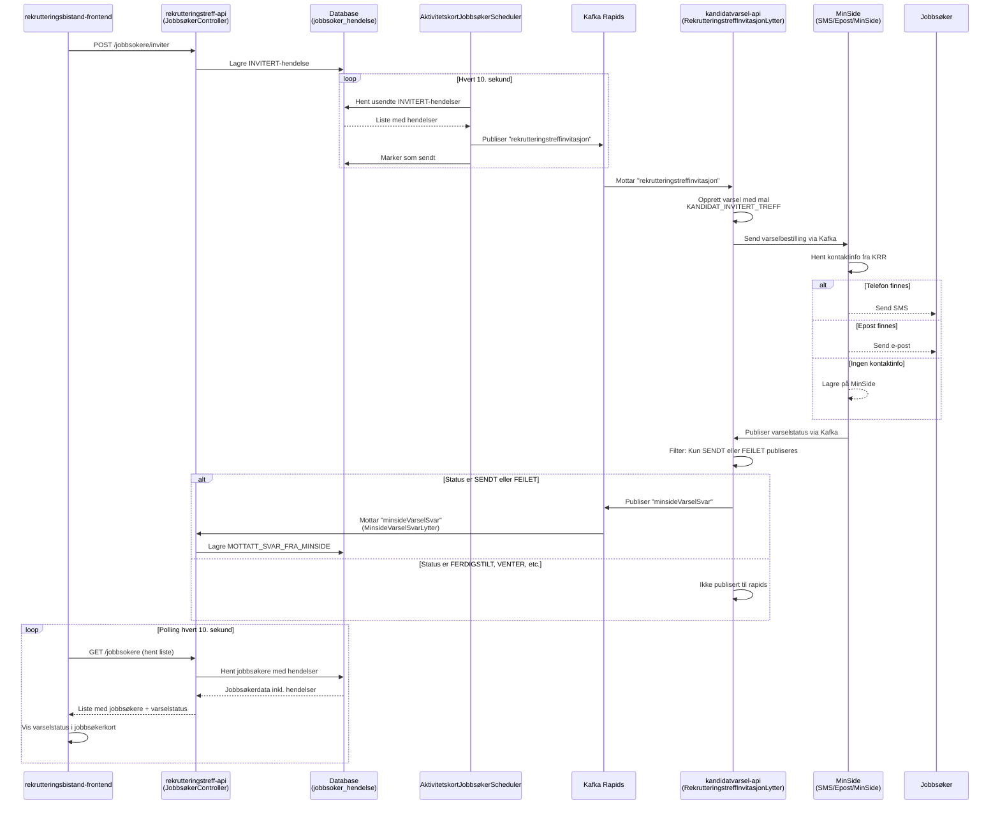
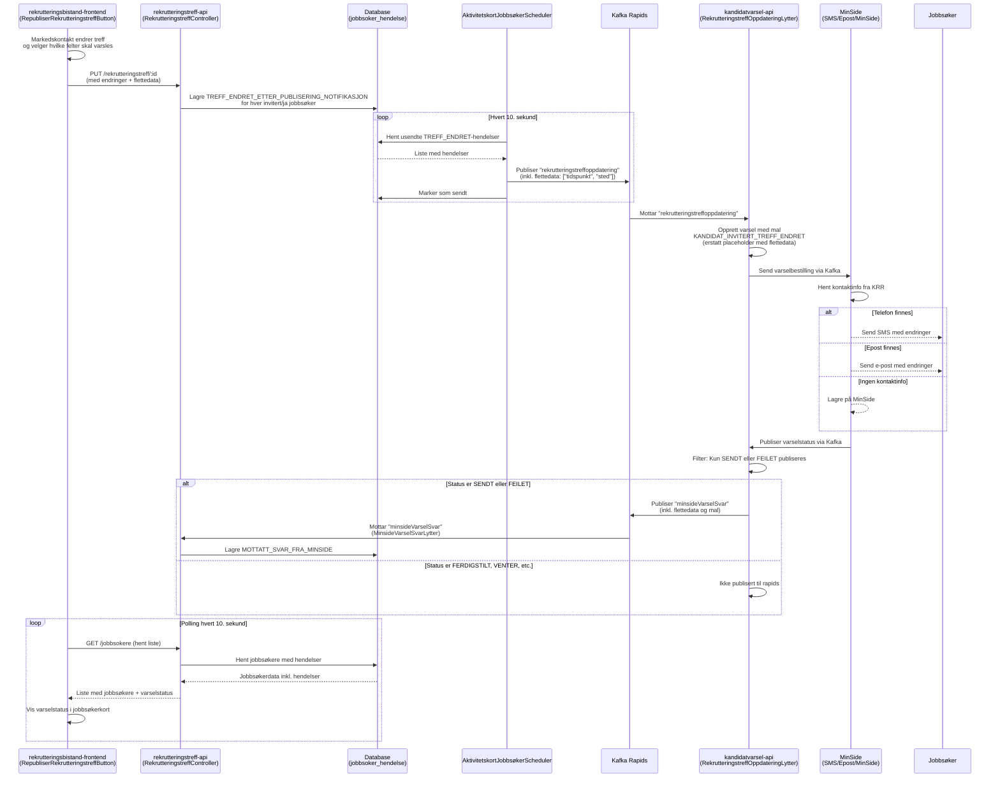

# Varsling for Rekrutteringstreff

## Overordnet

Løsningen sender automatiske varsler til jobbsøkere i to situasjoner:

1. **Invitasjon** - Når en jobbsøker inviteres til et rekrutteringstreff
2. **Endring** - Når et publisert treff med inviterte jobbsøkere endres

Varsling skjer via **SMS** eller **e-post**, avhengig av hvilken kontaktinformasjon som finnes i Kontakt- og reservasjonsregisteret (KRR). Dersom jobbsøker ikke har registrert kontaktinformasjon, lagres varselet på **MinSide** der jobbsøkeren kan se det ved pålogging.

---

## Løp 1: Invitasjon til treff

Når veileder inviterer en jobbsøker til et treff, sendes det automatisk et varsel.

### Innhold i meldingen

Varselet inneholder:

- Treffets navn og introduksjon
- Tidspunkt (dato, fra-til)
- Sted (adresse)
- Svarfrist
- Lenke til svarside hvor jobbsøker kan svare ja eller nei

### Mal som brukes

**KANDIDAT_INVITERT_TREFF**

**SMS-tekst:**

```
Hei! Du er invitert til et treff der du kan møte arbeidsgivere som har ledige jobber.
Logg inn på Nav for å se detaljer og svare på invitasjonen. Vennlig hilsen Nav
```

### Flyt: Invitasjon



---

## Løp 2: Melding om endring

Når et publisert treff med inviterte jobbsøkere endres, kan markedskontakt velge om det skal sendes melding om endringen.

### Valgmuligheter for markedskontakt

Markedskontakt velger:

1. **Om** melding skal sendes (ja/nei per endret felt)
2. **Hvilke felter** som skal nevnes i meldingen:
   - Navn
   - Tidspunkt
   - Svarfrist
   - Sted
   - Introduksjon

### Innhold i meldingen

Varselet inneholder:

- Informasjon om hvilke felter som er endret
- Lenke til oppdatert informasjon

### Mal som brukes

**KANDIDAT_INVITERT_TREFF_ENDRET**

**SMS-tekst:**

```
Det er endringer i et treff du er invitert til: [endringer]. Logg inn på Nav for å se detaljer.
```

`[endringer]` erstattes med valgte felter, f.eks. "tidspunkt og sted" eller "navn, tidspunkt og sted".

### Hvem får meldingen?

Kun jobbsøkere som:

- Er invitert, eller
- Har svart ja til invitasjonen

Jobbsøkere som har svart nei får **ikke** melding om endringer.

### Flyt: Endring



````

---

## Felles komponenter

### Scheduler (AktivitetskortJobbsøkerScheduler)

Kjører hvert 10. sekund og:
1. Henter usendte hendelser fra database (`INVITERT` og `TREFF_ENDRET_ETTER_PUBLISERING_NOTIFIKASJON`)
2. Publiserer hendelser til Rapids & Rivers
3. Markerer hendelser som sendt

Kun synlige jobbsøkere (`er_synlig = TRUE`) får varsler.

### Varselkanaler (fra MinSide)

MinSide velger kanal basert på kontaktinfo fra KRR:

| Kontaktinfo i KRR | Varselkanal | Ekstern kanal-verdi |
| ----------------- | ----------- | ------------------- |
| Telefonnummer     | SMS         | `SMS`               |
| E-postadresse     | E-post      | `EPOST`             |
| Ingen info        | MinSide     | `null`              |

**Prioritering:** SMS prioriteres hvis både telefon og e-post finnes.

### Varselstatus (i MOTTATT_SVAR_FRA_MINSIDE-hendelse)

**Statusfilter:**
Kun statuser `SENDT` og `FEILET` publiseres fra kandidatvarsel-api til rapids.

**Hvorfor ikke FERDIGSTILT?**
`FERDIGSTILT`-status kan ta lang tid å motta fra MinSide, selv om meldingen allerede ligger i MinSide og er sendt til jobbsøker. Ved å bruke `SENDT`-status får vi raskere tilbakemelding til markedskontakt om at varselet er levert, uten å vente på den endelige ferdigstillingen.

**MinsideStatus:**
- `UNDER_UTSENDING` - Varselet sendes
- `OPPRETTET` - MinSide har bekreftet opprettelse
- `SLETTET` - Varselet er slettet

**EksternStatus (kun SENDT og FEILET publiseres til rapids):**
- `SENDT` - ✅ Publiseres - Varsel sendt vellykket (SMS eller e-post)
- `FEILET` - ✅ Publiseres - Feil ved sending
- `FERDIGSTILT` - ❌ Publiseres ikke - Ferdig behandlet (tar ofte lang tid)
- `VENTER` - ❌ Publiseres ikke - Venter på utsending
- `KANSELLERT` - ❌ Publiseres ikke - Kansellert
- `UNDER_UTSENDING` - ❌ Publiseres ikke - Vi kan vurdere å legge det til senere dersom vi erfarer at meldinger tar lang tid.

**EksternFeilmelding:**
- `person_ikke_funnet` - Personen mangler kontaktinfo i KRR

---

## Teknisk oversikt

### Rapids-meldinger

**rekrutteringstreffinvitasjon:**
```json
{
  "@event_name": "rekrutteringstreffinvitasjon",
  "fnr": "12345678910",
  "rekrutteringstreffId": "uuid",
  "hendelseId": "uuid",
  "tittel": "Jobbtreff hos bedrift AS",
  "fraTid": "2025-02-01T10:00:00Z",
  "tilTid": "2025-02-01T14:00:00Z",
  "svarfrist": "2025-01-25T23:59:59Z",
  "gateadresse": "Eksempelgate 1",
  "postnummer": "0123",
  "poststed": "Oslo"
}
````

**rekrutteringstreffoppdatering:**

```json
{
  "@event_name": "rekrutteringstreffoppdatering",
  "fnr": "12345678910",
  "rekrutteringstreffId": "uuid",
  "hendelseId": "uuid",
  "flettedata": ["tidspunkt", "sted"]
}
```

**minsideVarselSvar:**

```json
{
  "@event_name": "minsideVarselSvar",
  "varselId": "uuid",
  "avsenderReferanseId": "rekrutteringstreffId",
  "fnr": "12345678910",
  "eksternStatus": "FERDIGSTILT",
  "minsideStatus": "OPPRETTET",
  "eksternKanal": "SMS",
  "mal": "KANDIDAT_INVITERT_TREFF",
  "flettedata": ["tidspunkt", "sted"]
}
```

### Nøkkelklasser

**rekrutteringstreff-api:**

- `JobbsøkerController` - API-endepunkt for invitasjon
- `RekrutteringstreffController` - API-endepunkt for oppdatering av treff
- `JobbsøkerService` - Forretningslogikk
- `AktivitetskortJobbsøkerScheduler` - Poller og publiserer hendelser
- `MinsideVarselSvarLytter` - Lytter på varselstatus

**kandidatvarsel-api:**

- `RekrutteringstreffInvitasjonLytter` - Lytter på invitasjoner
- `RekrutteringstreffOppdateringLytter` - Lytter på endringer
- `MinsideClient` - Sender varsel til MinSide via Kafka

**rekrutteringsbistand-frontend:**

- `JobbsøkerKort.tsx` - Viser varselstatus i UI
- `RepubliserRekrutteringstreffButton.tsx` - UI for valg av varsling ved endringer
- Polling-logikk: Henter jobbsøkerliste hvert 10. sekund

---

## Relatert dokumentasjon

- [Aktivitetskort for Rekrutteringstreff](rekrutteringstreff-aktivitetskort.md)
- [MinSide dokumentasjon](https://navikt.github.io/tms-dokumentasjon/varsler/produsere)
