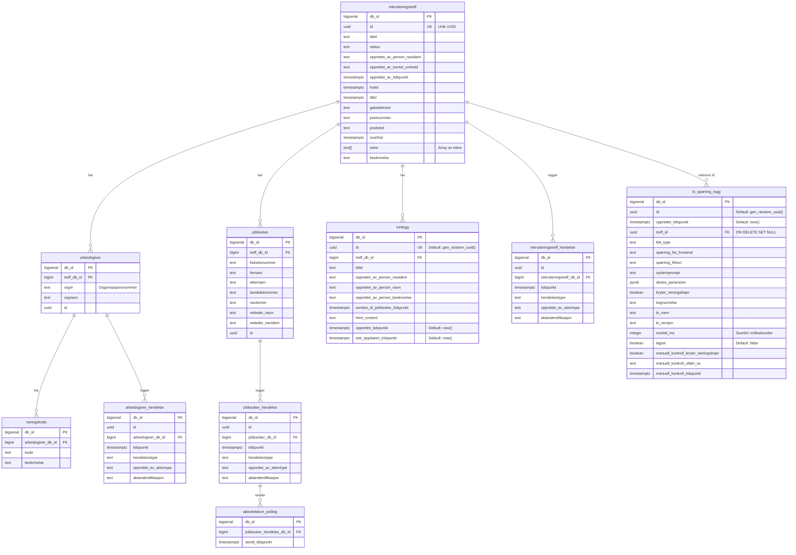

# Database Schema - Rekrutteringstreff

Dette er en grafisk oversikt over databaseskjemaet for rekrutteringstreff-systemet.

Husk å endre denne filen ved endringer i flywayscriptene. Bruk gjerne copilot til å oppdatere denne filen.

## Entity Relationship Diagram

## Forklaring av tabellene

### Hovedtabeller

- **rekrutteringstreff**: Hovedtabellen som representerer et rekrutteringstreff/arrangement
- **arbeidsgiver**: Arbeidsgivere som deltar i et treff
- **jobbsoker**: Jobbsøkere som deltar i et treff
- **innlegg**: Innlegg/meldinger knyttet til et treff

### Hendelselogging

- **rekrutteringstreff_hendelse**: Logger hendelser på treffnivå
- **arbeidsgiver_hendelse**: Logger hendelser for arbeidsgivere
- **jobbsoker_hendelse**: Logger hendelser for jobbsøkere
- **aktivitetskort_polling**: Logger når aktivitetskort sendes til jobbsøkere

### Støttetabeller

- **naringskode**: Næringskoder for arbeidsgivere (kan ha flere per arbeidsgiver)
- **ki_spørring_logg**: Logger AI/KI-spørringer med metadata og modereringsinfo

## Indexes

Viktige indexes for performance:
- `rekrutteringstreff_id_uq` - Unik index på rekrutteringstreff.id
- `idx_innlegg_treff_db_id` - Index på innlegg.treff_db_id
- `idx_arbeidsgiver_hendelse_arbeidsgiver_db_id` - Index på arbeidsgiver_hendelse
- `idx_rekrutteringstreff_hendelse_rekrutteringstreff_db_id` - Index på rekrutteringstreff_hendelse
- `ki_spørring_logg_treff_uuid_idx` - Index på ki_spørring_logg.treff_id
- `naringskode_arbeidsgiver_db_id_idx` - Index på naringskode.arbeidsgiver_db_id

## Constraints

- Alle foreign keys er definert med navngitte constraints
- `naringskode_unik_per_arbeidsgiver` - Sikrer at samme næringskode ikke legges til flere ganger for samme arbeidsgiver
- `ki_spørring_logg.treff_id` har `ON DELETE SET NULL` - bevarer logger selv om treff slettes

## Visning av diagrammet

Dette diagrammet kan vises i:
- GitHub (støtter Mermaid direkte)
- IntelliJ IDEA (installer Mermaid plugin)
- VS Code (installer Mermaid preview extension)
- Online på [mermaid.live](https://mermaid.live)

