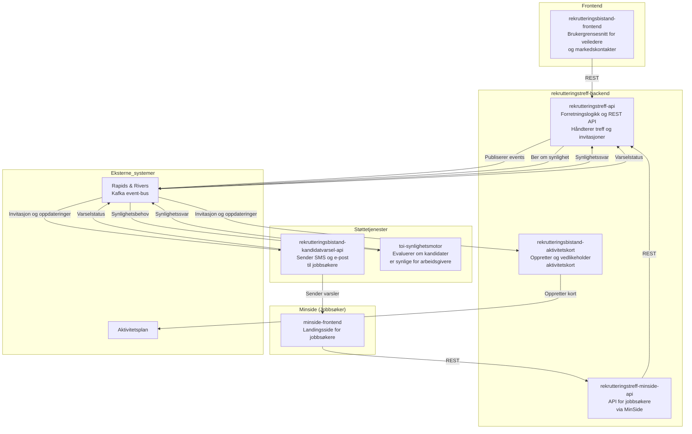
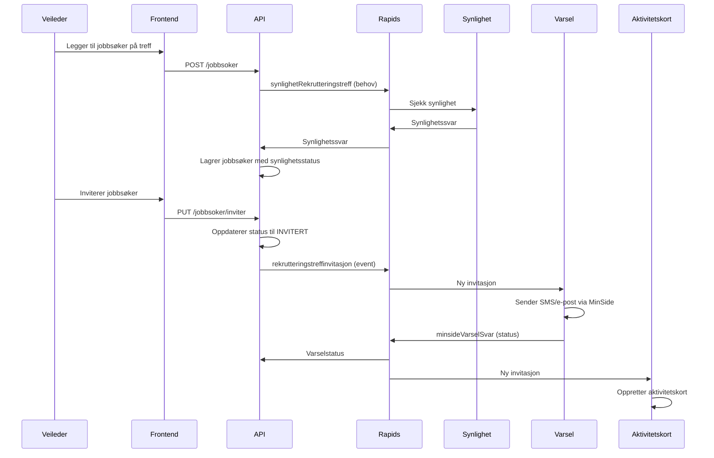
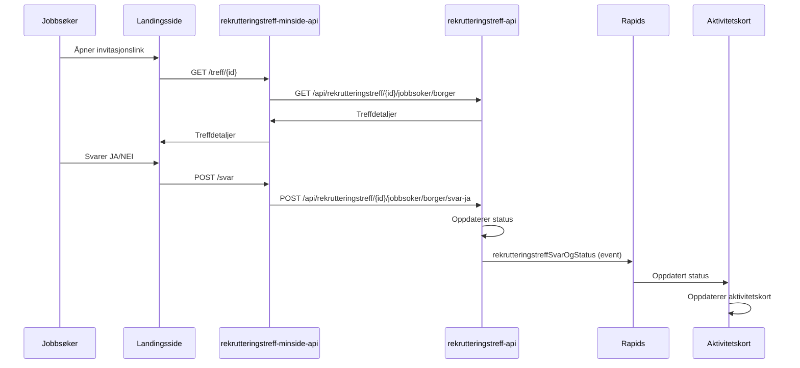

# Rekrutteringstreff - Oversikt

## Formål

Rekrutteringstreff er en tjeneste for å opprette møter mellom arbeidsgivere og jobbsøkere, der de kan snakke sammen med formål om at jobbsøkerne skal få muligheter til jobb.

Tjenesten er primært designet for markedskontakter i NAV, men veiledere skal også kunne legge til sine jobbsøkere i et treff.

### Tjenester for jobbsøkere

- **Varsling**: SMS, e-post og varsel på MinSide når de inviteres til treff
- **Landingsside**: Jobbsøkere kan se og svare på invitasjoner via rekrutteringstreff-minside-api
- **Aktivitetskort**: Oppdatering av aktivitetskort i aktivitetsplanen for brukere under oppfølging

### Fremtidige planer

- Tilby tjenesten også for jobbsøkere som ikke er under oppfølging i NAV
- Legge til inngangsporter fra andre NAV-tjenester, som for eksempel stillingssøket

## Systemarkitektur

### Applikasjonsbeskrivelser

#### rekrutteringsbistand-frontend

Brukergrensesnitt der veiledere og markedskontakter:

- Oppretter og administrerer rekrutteringstreff
- Legger til jobbsøkere og arbeidsgivere
- Inviterer jobbsøkere til treff
- Følger opp svar og deltakerstatus

#### rekrutteringstreff-api

Hovedapplikasjon som:

- Tilbyr REST API for frontend
- Lagrer og administrerer rekrutteringstreff, jobbsøkere og arbeidsgivere
- Publiserer events når jobbsøkere inviteres eller treff oppdateres
- Mottar synlighetsevalueringer fra toi-synlighetsmotor
- Mottar varselstatus fra kandidatvarsel-api
- Validerer innhold med KI-moderering

#### rekrutteringstreff-minside-api

API for jobbsøkere som:

- Tilbyr REST API for MinSide-landingssiden
- Kommuniserer med rekrutteringstreff-api via REST for å hente treff-informasjon
- Håndterer jobbsøkernes svar på invitasjoner
- Bruker TokenX for sikker autentisering på vegne av jobbsøker

#### rekrutteringsbistand-aktivitetskort

Mellomtjeneste som:

- Lytter på events om invitasjoner og oppdateringer via Rapids & Rivers
- Oppretter og oppdaterer aktivitetskort i brukerens aktivitetsplan
- Mapper rekrutteringstreff-statuser til aktivitetskort-statuser

#### rekrutteringsbistand-kandidatvarsel-api

Varseltjeneste som:

- Lytter på events om nye invitasjoner
- Sender SMS og e-post til jobbsøkere via MinSide
- Publiserer tilbake status på om varsel ble sendt

#### toi-synlighetsmotor

Evalueringstjeneste som:

- Besvarer behov om synlighetsstatus for jobbsøkere
- Kontrollerer om kandidaten har CV, samtykke og annen nødvendig informasjon
- Sikrer at kun synlige kandidater vises for arbeidsgivere

## Integrasjonsmønstre

### REST-kommunikasjon

| Fra                            | Til                    | Beskrivelse                                      |
| ------------------------------ | ---------------------- | ------------------------------------------------ |
| rekrutteringsbistand-frontend  | rekrutteringstreff-api | Veiledere og markedskontakter administrerer treff |
| rekrutteringstreff-minside-api | rekrutteringstreff-api | Jobbsøkere ser og svarer på invitasjoner         |

### Rapids & Rivers (Kafka)

Se [Tekniske prinsipper](02-tekniske-prinsipper.md) for detaljer om meldingsflyten.

## Eksempel på hendelsesflyt

### Invitasjon av jobbsøker

### Jobbsøker svarer på invitasjon

