# Database

## Arkitekturtilnærming

### Hybrid hendelseshåndtering

Vi har valgt en **hybrid tilnærming** med current state-tabeller kombinert med hendelsestabeller.

#### Alternativer som ble vurdert

1. **Current state database** - Kun nåværende tilstand, ingen historikk
2. **Append-only database** - All data lagres som hendelser (event sourcing)
3. **Current state + hendelsestabeller** ✅ - Valgt løsning

#### Vårt valg

Vi bruker current state-tabeller for:

- `rekrutteringstreff`
- `jobbsoker`
- `arbeidsgiver`

Kombinert med separate hendelsestabeller:

- `rekrutteringstreff_hendelse`
- `jobbsoker_hendelse`
- `arbeidsgiver_hendelse`

#### Fordeler med denne tilnærmingen

- **Enkel og rask SQL**: Spørringer mot current state er enkle og performante
- **Komplett historikk**: Alle endringer er sporbare via hendelsestabeller
- **Synlig i frontend**: Vi kan vise brukere hele endringshistorikken
- **Asynkron reaksjon**: Vi kan reagere på lagrede hendelser via schedulers
- **Fleksibilitet**: Best of both worlds - enkel lesing og komplett audit trail

Denne tilnærmingen sikrer at vi aldri mister hendelser, og at all prosessering kan skje asynkront uten å blokkere brukerforespørsler.

### Teknologivalg

- **PostgreSQL** som database
- **Ren SQL uten ORM** - Full kontroll over SQL-spørringer, enkel debugging
- **Flyway** for migrasjoner
- **HikariCP** for connection pooling

### SQL-mønstre i repository-laget

#### Inline-aggregering med `json_agg` / `json_build_object`

For å hente entiteter med tilhørende subtabelldata (f.eks. jobbsøker med hendelser) bruker vi PostgreSQLs `json_agg(json_build_object(...))` direkte i SELECT-spørringen. Dette gir én enkelt spørring som returnerer hovedraden med en JSON-array av relaterte rader:

#### Alternativer vi vurderte

| Tilnærming                                 | Ytelse                             | Lesbarhet                                                  | Gjenbrukbarhet                                 |
| ------------------------------------------ | ---------------------------------- | ---------------------------------------------------------- | ---------------------------------------------- |
| **`json_agg` i én spørring** ✅            | Best – én roundtrip til databasen  | Middels – SQL blir kompleks, men godt isolert i repository | Lav – spørringen er skreddersydd per use case  |
| **Separate spørringer, kobling i service** | Dårligere – N+1 eller 2 roundtrips | Høy – enkle, lesbare SQL-spørringer                        | Høy – repository-metodene kan gjenbrukes fritt |
| **Subselect med `array_agg`**              | Tilsvarende `json_agg`             | Noe lavere – krever custom array-parsing                   | Lav                                            |

Vi valgte `json_agg`-tilnærmingen fordi den gir best ytelse for våre leseoperasjoner, og kompleksiteten er isolert til repository-laget. Dersom vi får behov for mer fleksibel sammensetning av data (f.eks. at ulike endepunkter trenger ulike kombinasjoner av subtabeller), kan det være verdt å vurdere separate spørringer koblet i service-laget.

---

## Entity Relationship Diagram

Vis denne filen i Github for å se en grafisk fremstilling av databaseskjemaet ved hjelp av Mermaid.

Husk å endre denne filen ved endringer i flywayscriptene. Bruk gjerne copilot til å oppdatere denne filen.

```mermaid
erDiagram
    rekrutteringstreff ||--o{ arbeidsgiver : "har"
    rekrutteringstreff ||--o{ jobbsoker : "har"
    rekrutteringstreff ||--o{ innlegg : "har"
    rekrutteringstreff ||--o{ rekrutteringstreff_hendelse : "logger"
    rekrutteringstreff ||--o{ ki_spørring_logg : "refererer til"

    arbeidsgiver ||--o{ naringskode : "har"
    arbeidsgiver ||--o{ arbeidsgiver_hendelse : "logger"

    jobbsoker ||--o{ jobbsoker_hendelse : "logger"

    jobbsoker_hendelse ||--o{ aktivitetskort_polling : "sender"

    rekrutteringstreff {
        bigserial rekrutteringstreff_id PK "Intern primærnøkkel"
        uuid id UK "Unik UUID for treffet"
        text tittel "Tittel på rekrutteringstreffet"
        text status "Status: OPPRETTET, PUBLISERT, AVLYST osv."
        text opprettet_av_person_navident "Nav-ident for oppretteren"
        text opprettet_av_kontor_enhetid "Nav-kontor enhetid"
        timestamptz opprettet_av_tidspunkt "Når treffet ble opprettet"
        timestamptz fratid "Start tidspunkt for treffet"
        timestamptz tiltid "Slutt tidspunkt for treffet"
        text gateadresse "Gateadresse for treffstedet"
        text postnummer "Postnummer for treffstedet"
        text poststed "Poststed for treffstedet"
        text fylke "Fylke for treffstedet (V5)"
        text kommune "Kommune for treffstedet (V5)"
        timestamptz svarfrist "Frist for påmelding/svar"
        text[] eiere "Array av Nav-identer som eier treffet"
        text beskrivelse "Beskrivelse av treffet"
        text sist_endret_av_person_navident "Nav-ident for sist endring (V6)"
        timestamptz sist_endret_av_tidspunkt "Tidspunkt for sist endring (V6)"
    }

    arbeidsgiver {
        bigserial arbeidsgiver_id PK "Intern primærnøkkel"
        bigint rekrutteringstreff_id FK "Referanse til rekrutteringstreff"
        text orgnr "Organisasjonsnummer"
        text orgnavn "Organisasjonsnavn"
        uuid id "Unik UUID for arbeidsgiver i treffet"
        text status "Status for arbeidsgiver (V3)"
        text gateadresse "Gateadresse for arbeidsgiver (V7)"
        text postnummer "Postnummer for arbeidsgiver (V7)"
        text poststed "Poststed for arbeidsgiver (V7)"
    }

    jobbsoker {
        bigserial jobbsoker_id PK "Intern primærnøkkel"
        bigint rekrutteringstreff_id FK "Referanse til rekrutteringstreff"
        text fodselsnummer "Fødselsnummer for jobbsøker"
        text fornavn "Fornavn på jobbsøker"
        text etternavn "Etternavn på jobbsøker"
        text navkontor "Nav-kontor som følger opp jobbsøker"
        text veileder_navn "Veilederens navn"
        text veileder_navident "Veilederens Nav-ident"
        uuid id "Unik UUID for jobbsøker i treffet"
        text status "Status for jobbsøker (V4)"
        boolean er_synlig "Synlighet fra synlighetsmotor (V9)"
        timestamptz synlighet_sist_oppdatert "Når synlighet sist ble oppdatert (V9)"
        text synlighet_kilde "Kilde: EVENT (event-strøm) eller NEED (scheduler) (V10)"
    }

    innlegg {
        bigserial innlegg_id PK "Intern primærnøkkel"
        uuid id UK "Unik UUID (auto-generert)"
        bigint rekrutteringstreff_id FK "Referanse til rekrutteringstreff"
        text tittel "Tittel på innlegget"
        text opprettet_av_person_navident "Nav-ident til oppretteren"
        text opprettet_av_person_navn "Navn på oppretteren"
        text opprettet_av_person_beskrivelse "Beskrivelse av oppretterens rolle"
        timestamptz sendes_til_jobbsoker_tidspunkt "Når innlegget sendes til jobbsøker"
        text html_content "Innhold i HTML-format"
        timestamptz opprettet_tidspunkt "Når innlegget ble opprettet"
        timestamptz sist_oppdatert_tidspunkt "Sist oppdatert tidspunkt"
    }

    jobbsoker_hendelse {
        bigserial jobbsoker_hendelse_id PK "Intern primærnøkkel"
        uuid id "Unik UUID for hendelsen"
        bigint jobbsoker_id FK "Referanse til jobbsøker"
        timestamptz tidspunkt "Når hendelsen skjedde"
        text hendelsestype "Type hendelse (f.eks. PÅMELDT, AVMELDT)"
        text opprettet_av_aktortype "Type aktør (NAV_ANSATT, ARBEIDSGIVER, osv.)"
        text aktøridentifikasjon "Identifikasjon av aktøren"
        jsonb hendelse_data "Ekstra data knyttet til hendelsen (V2)"
    }

    arbeidsgiver_hendelse {
        bigserial arbeidsgiver_hendelse_id PK "Intern primærnøkkel"
        uuid id "Unik UUID for hendelsen"
        bigint arbeidsgiver_id FK "Referanse til arbeidsgiver"
        timestamptz tidspunkt "Når hendelsen skjedde"
        text hendelsestype "Type hendelse (f.eks. INVITERT, TAKKET_JA)"
        text opprettet_av_aktortype "Type aktør (NAV_ANSATT, ARBEIDSGIVER, osv.)"
        text aktøridentifikasjon "Identifikasjon av aktøren"
        jsonb hendelse_data "Ekstra data knyttet til hendelsen (V2)"
    }

    rekrutteringstreff_hendelse {
        bigserial rekrutteringstreff_hendelse_id PK "Intern primærnøkkel"
        uuid id "Unik UUID for hendelsen"
        bigint rekrutteringstreff_id FK "Referanse til rekrutteringstreff"
        timestamptz tidspunkt "Når hendelsen skjedde"
        text hendelsestype "Type hendelse (f.eks. OPPRETTET, PUBLISERT, AVLYST)"
        text opprettet_av_aktortype "Type aktør (NAV_ANSATT, SYSTEM, osv.)"
        text aktøridentifikasjon "Identifikasjon av aktøren"
        jsonb hendelse_data "Ekstra data knyttet til hendelsen (V2)"
    }

    aktivitetskort_polling {
        bigserial aktivitetskort_polling_id PK "Intern primærnøkkel"
        bigint jobbsoker_hendelse_id FK "Referanse til jobbsøker_hendelse"
        timestamptz sendt_tidspunkt "Når aktivitetskortet ble sendt"
    }

    ki_spørring_logg {
        bigserial ki_spørring_logg_id PK "Intern primærnøkkel"
        uuid id "Unik UUID (auto-generert)"
        timestamptz opprettet_tidspunkt "Når spørringen ble logget"
        uuid treff_id FK "Referanse til rekrutteringstreff (ON DELETE SET NULL)"
        text felt_type "Hvilken felt-type spørringen gjelder (f.eks. TITTEL, BESKRIVELSE)"
        text spørring_fra_frontend "Originalspørring fra bruker"
        text spørring_filtrert "Filtrert/sanert versjon av spørringen"
        text systemprompt "Systemprompt brukt i KI-kallet"
        jsonb ekstra_parametre "Ekstra parametere sendt til KI"
        boolean bryter_retningslinjer "Om KI-svaret bryter retningslinjer"
        text begrunnelse "Begrunnelse for modereringsbeslutningen"
        text ki_navn "Navn på KI-modellen (f.eks. GPT-4)"
        text ki_versjon "Versjon av KI-modellen"
        integer svartid_ms "Svartid i millisekunder"
        boolean lagret "Om svaret ble lagret/brukt"
        boolean manuell_kontroll_bryter_retningslinjer "Manuell overprøving av moderering"
        text manuell_kontroll_utført_av "Nav-ident for manuell kontrollør"
        timestamptz manuell_kontroll_tidspunkt "Når manuell kontroll ble utført"
    }

    naringskode {
        bigserial naringskode_id PK "Intern primærnøkkel"
        bigint arbeidsgiver_id FK "Referanse til arbeidsgiver"
        text kode "Næringskode (f.eks. 47.711)"
        text beskrivelse "Beskrivelse av næringskoden"
    }
```

## Forklaring av tabellene

### Hovedtabeller

- **rekrutteringstreff**: Hovedtabellen som representerer et rekrutteringstreff/arrangement
- **arbeidsgiver**: Arbeidsgivere som deltar i et treff
- **jobbsoker**: Jobbsøkere som deltar i et treff
- **innlegg**: Innlegg/meldinger knyttet til et treff

### Hendelselogging

- **rekrutteringstreff_hendelse**: Logger hendelser på treffnivå
- **arbeidsgiver_hendelse**: Logger hendelser for arbeidsgivere
- **jobbsoker_hendelse**: Logger hendelser for jobbsøkere
- **aktivitetskort_polling**: Logger når aktivitetskort sendes til jobbsøkere

#### hendelse_data kolonne

Alle hendelse-tabeller har en `hendelse_data jsonb`-kolonne som inneholder ekstra strukturert data knyttet til hendelsen. **De fleste hendelsestyper har null** – kun to scenarioer bruker den:

| Hendelsestype                                 | Tabell                        | JSON-struktur                                                          | Kotlin-klasse                    |
| --------------------------------------------- | ----------------------------- | ---------------------------------------------------------------------- | -------------------------------- |
| `TREFF_ENDRET_ETTER_PUBLISERING`              | `rekrutteringstreff_hendelse` | Endringsfelt per felt (navn, sted, tidspunkt, svarfrist, introduksjon) | `Rekrutteringstreffendringer.kt` |
| `TREFF_ENDRET_ETTER_PUBLISERING_NOTIFIKASJON` | `jobbsoker_hendelse`          | Samme som over                                                         | `Rekrutteringstreffendringer.kt` |
| `MOTTATT_SVAR_FRA_MINSIDE`                    | `jobbsoker_hendelse`          | Varselstatus, kanal, mal, flettedata                                   | `MinsideVarselSvarData.kt`       |
| Alle andre                                    | Alle                          | `null`                                                                 | –                                |

Se [Arkitekturbeslutninger – hendelse_data](arkitekturbeslutninger.md#hendelse_data-polymorfe-json-objekter-i-hendelsestabellene) for detaljert dokumentasjon av JSON-strukturene, serialisering, og bruk i frontend.

Data kan queries med PostgreSQLs JSON-operatører (`->`, `->>`, `#>` osv.).

### Støttetabeller

- **naringskode**: Næringskoder for arbeidsgivere (kan ha flere per arbeidsgiver)
- **ki_spørring_logg**: Logger AI/KI-spørringer med metadata og modereringsinfo - se [KI-tekstvalidering](../5-ki/ki-tekstvalidering.md)

## Flyway-migrasjoner

Migrasjonsfilene ligger i `apps/rekrutteringstreff-api/src/main/resources/db/migration/`.

| Versjon | Fil            | Beskrivelse                           |
| ------- | -------------- | ------------------------------------- |
| V1      | `V1__init.sql` | Initiell opprettelse av alle tabeller |

## Indekser

Viktige indekser for ytelse:

| Indeks                                                  | Tabell                      | Beskrivelse                                     |
| ------------------------------------------------------- | --------------------------- | ----------------------------------------------- |
| `rekrutteringstreff_id_uq`                              | rekrutteringstreff          | Unik indeks på id                               |
| `idx_innlegg_rekrutteringstreff_id`                     | innlegg                     | FK-indeks                                       |
| `idx_arbeidsgiver_hendelse_arbeidsgiver_id`             | arbeidsgiver_hendelse       | FK-indeks                                       |
| `idx_rekrutteringstreff_hendelse_rekrutteringstreff_id` | rekrutteringstreff_hendelse | FK-indeks                                       |
| `ki_spørring_logg_treff_uuid_idx`                       | ki_spørring_logg            | Indeks på treff_id                              |
| `naringskode_arbeidsgiver_id_idx`                       | naringskode                 | FK-indeks                                       |
| `idx_jobbsoker_synlig`                                  | jobbsoker                   | Delvis indeks der `er_synlig = TRUE` (V9)       |
| `idx_jobbsoker_fodselsnummer`                           | jobbsoker                   | Indeks for oppslag ved synlighetsmeldinger (V9) |

## Constraints

- Alle foreign keys er definert med navngitte constraints
- `naringskode_unik_per_arbeidsgiver` - Sikrer at samme næringskode ikke legges til flere ganger for samme arbeidsgiver
- `ki_spørring_logg.treff_id` har `ON DELETE SET NULL` - bevarer logger selv om treff slettes

## Visning av diagrammet

Dette diagrammet kan vises i:

- GitHub (støtter Mermaid direkte)
- IntelliJ IDEA (installer Mermaid plugin)
- VS Code (installer Mermaid preview extension)
- Online på [mermaid.live](https://mermaid.live)

## Relaterte dokumenter

- [Synlighet](../3-sikkerhet/synlighet.md) - Detaljert beskrivelse av synlighetsintegrasjonen
- [KI-tekstvalidering](../5-ki/ki-tekstvalidering.md) - Beskrivelse av KI-loggingen
