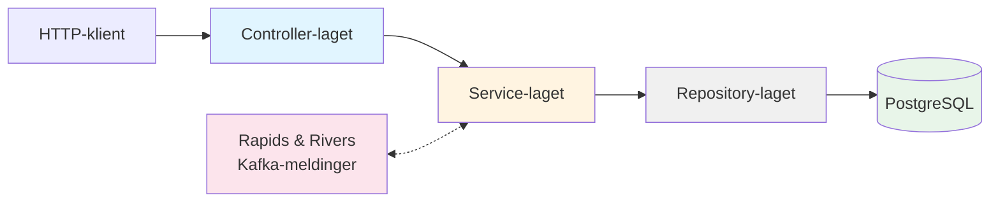

# Arkitekturprinsipper

Dette dokumentet beskriver de overordnede arkitekturprinsippene for rekrutteringstreff-backend.

---

## Rammeverkstrategi

Vi har valgt å bruke **utvalgte mindre rammeverk** fremfor enten omfattende rammeverk (som Spring) eller mest mulig ren Kotlin uten rammeverk.

### Fordeler

- **Færre unødvendige avhengigheter**: Vi unngår tunge, omfattende rammeverk med funksjonalitet vi ikke trenger
- **Mindre overhead ved oppdateringer**: Mindre kompleksitet og færre breaking changes sammenlignet med store rammeverk
- **Skreddersydd teknologistakk**: Vi kan velge de beste bibliotekene for hvert lag i applikasjonen
- **Redusert boilerplate**: Vi slipper repeterende kode som ville vært nødvendig med ren Kotlin

### Ulemper

- **Flere avhengigheter enn ren Kotlin**: Økt kompleksitet sammenlignet med en tilnærming uten rammeverk
- **Mindre etablerte konvensjoner**: Færre standardiserte mønstre enn store rammeverk gir
- **Manuelt oppsett**: Vi må selv huske å ta med funksjonalitet og sensible defaults som store rammeverk gir automatisk

### Konstruktørbasert dependency injection

Vi bruker **konstruktørbasert dependency injection** uten DI-rammeverk. Avhengigheter injiseres eksplisitt ved opprettelse av objekter. Dette gir enkel sporbarhet og gjør det lett å forstå avhengighetsgrafen.

---

## Lagdeling

Applikasjonen følger en tydelig lagdeling hvor hvert lag har klart definerte ansvarsområder:



### Controller-laget

Vi bruker **Javalin**, et lett HTTP-rammeverk bygget på Jetty.

**Ansvar:**

- Definere HTTP-endepunkter
- Autentisering og autorisasjon
- Input-validering og deserialisering
- HTTP-statuskoder og feilhåndtering
- Output-serialisering

**HTTP-statuskoder:**

- **200 OK**: Vellykket GET-forespørsel
- **201 Created**: Vellykket POST som oppretter en ressurs
- **204 No Content**: Vellykket DELETE eller PUT uten respons-body
- **400 Bad Request**: Ugyldig input fra klient
- **403 Forbidden**: Bruker mangler tilgang
- **404 Not Found**: Ressurs finnes ikke
- **409 Conflict**: Konflikt med eksisterende ressurs eller ugyldig tilstandsendring
- **422 Unprocessable Entity**: Semantisk ugyldig input (f.eks. sletting ikke tillatt)
- **500 Internal Server Error**: Uventede feil

### Service-laget

Service-laget er kjernen i forretningslogikken.

**Ansvar:**

- **Entry point for repository-kall**: All database-aksess går gjennom service-laget
- **Transaksjonshåndtering**: Database-transaksjoner opprettes og håndteres her
- **Orkestrering**: Koordinering av kall på tvers av repositories og meldinger
- **Forretningslogikk**: Logikk som ikke hører hjemme i database/SQL eller meldingslyttere

### Repository-laget

**Ansvar:**

- Database-aksess med ren SQL
- Mapping mellom database-rader og domene-objekter

Se [database.md](database.md) for detaljer om databasearkitektur.

---

## Integrasjonsmønstre

Vi bruker to hovedmønstre for integrasjon mellom systemer:

1. **REST** - For synkron kommunikasjon
2. **Rapids and Rivers (Kafka)** - For asynkron, event-drevet kommunikasjon

Se [rapids-and-rivers.md](../4-integrasjoner/rapids-and-rivers.md) for detaljer.

### Asynkron fan-out: én hendelse, flere lyttere

Et sentralt prinsipp i løsningen er at API-et publiserer **én hendelse til Kafka**, og **flere uavhengige lyttere** reagerer på den parallelt. Dette gjelder f.eks. invitasjonsflyten, der én `rekrutteringstreffinvitasjon`-event konsumeres av både aktivitetskort-appen og kandidatvarsel-api.

```
API → DB (lagre hendelse) → 200 OK
         ↓
    Scheduler → Kafka (én melding)
                  ↙        ↘
     Aktivitetskort    Kandidatvarsel
```

**Fordeler sammenlignet med synkrone kall med retries:**

- **Ingen distribuert transaksjon**: Hvert nedstrømssystem håndterer sin egen persistering. Hvis aktivitetskort feiler hindrer det ikke varselet, og omvendt.
- **Ingen retry-logikk i API-et**: Hver lytter håndterer egne retries og idempotens (via `hendelseId` som dedup-nøkkel).
- **Utvidbarhet uten kodeendring**: Nye konsumenter kan legges til som nye lyttere uten å endre API-koden.
- **Umiddelbar brukerrespons**: Brukeren får 200 OK så snart hendelsen er lagret i databasen. Nedstrømsprosessering skjer asynkront.

**Prisen** er **eventual consistency** – varselet og aktivitetskortet dukker opp noen sekunder etter at invitasjonen er lagret. I praksis er dette akseptabelt for alle dagens bruksscenarier.

**Når bruker vi synkrone kall i stedet?** Når klienten trenger umiddelbar respons fra nedstrømssystemet (f.eks. MinSide-API → rekrutteringstreff-api for å vise treffdetaljer til jobbsøker).

Se [Arkitekturbeslutninger – Hvorfor asynkron meldingsflyt?](arkitekturbeslutninger.md#hvorfor-asynkron-meldingsflyt-fremfor-synkrone-kall-med-retries) for detaljert sammenligning med synkron tilnærming.
