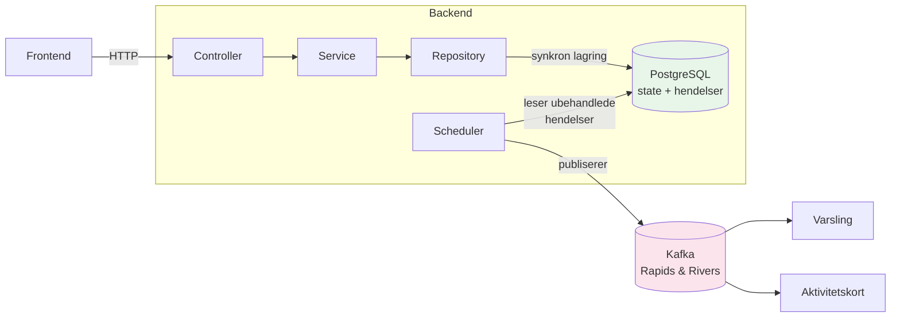

# Teknologi og overordnet arkitektur

Oversikt over de viktigste teknologiene som brukes i rekrutteringstreff (frontend + backend),
samt en konseptuell visning av hvordan delene henger sammen.
For begrunnelse av rammeverksvalg, lagdeling og integrasjonsmønstre, se [prinsipper.md](prinsipper.md).

## Frontend

Gjelder `rekrutteringsbistand-frontend` (veileder/markedskontakt) og `rekrutteringstreff-bruker` (jobbsøker).

| Teknologi                   | Bruk                                                 |
| --------------------------- | ---------------------------------------------------- |
| **Next.js / React**         | Applikasjonsrammeverk med App Router                 |
| **TypeScript**              | Typesikkerhet i hele kodebasen                       |
| **Zod**                     | Runtime-validering og typing av API-responser        |
| **Aksel (`@navikt/ds-*`)**  | Nav designsystem                                     |
| **SWR**                     | Datahenting og caching mot backend                   |
| **react-hook-form**         | Skjemahåndtering (`rekrutteringsbistand-frontend`)   |
| **Tailwind CSS**            | Styling                                              |
| **Playwright**              | Ende-til-ende-tester                                 |
| **MSW**                     | Mock av API-kall i tester og lokal utvikling         |

## Backend

Gjelder `rekrutteringstreff-api`, `rekrutteringstreff-minside-api` og `rekrutteringsbistand-aktivitetskort`.

| Teknologi                          | Bruk                                                            |
| ---------------------------------- | --------------------------------------------------------------- |
| **Kotlin**                         | Hovedspråk                                                      |
| **Javalin**                        | Lett HTTP-rammeverk på Jetty for REST-endepunkter               |
| **PostgreSQL**                     | Database                                                        |
| **Ren SQL via JDBC**               | Databasetilgang uten ORM                                        |
| **Flyway**                         | Databasemigrasjoner                                             |
| **Rapids & Rivers (Kafka)**        | Asynkron meldingsutveksling mellom apper                        |
| **Jackson**                        | JSON-serialisering                                              |
| **Testcontainers**                 | Komponenttester med ekte Postgres                               |

Backend kombinerer synkron lagring i PostgreSQL med asynkron publisering via schedulere og Kafka.
Detaljene er beskrevet i [prinsipper.md](prinsipper.md), [database.md](database.md)
og [rapids-and-rivers.md](../4-integrasjoner/rapids-and-rivers.md).

## Overordnet arkitektur

Konseptuell visning av lagdelingen og hvordan hendelser når ut til varsling og aktivitetskort.
Verdikjeder og fullstendig systembilde finnes i [oversikt.md](../1-oversikt/oversikt.md).

Figuren viser hovedideen: backend skriver state og hendelser synkront til databasen,
og lar scheduler og Kafka håndtere videre distribusjon til uavhengige konsumenter.

