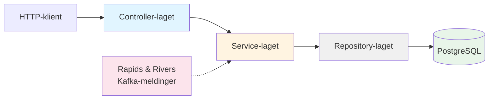
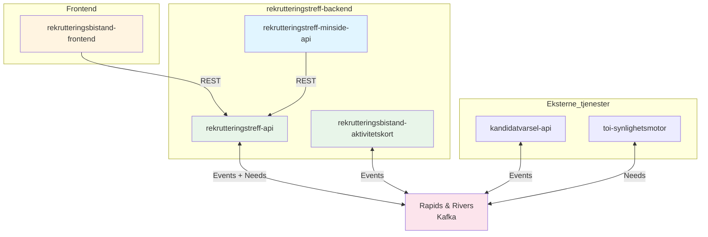

# Tekniske prinsipper

Dette dokumentet beskriver de tekniske prinsippene og arkitekturbeslutningene for rekrutteringstreff-backend. Disse prinsippene gjelder primært for rekrutteringstreff-api, men de overordnede prinsippene er relevante for hele monorepoet.

---

## Overordnet rammeverkstrategi

Vi har valgt å bruke **utvalgte mindre rammeverk** fremfor enten omfattende rammeverk (som Spring) eller mest mulig ren Kotlin uten rammeverk.

### Fordeler med denne tilnærmingen

- **Færre unødvendige avhengigheter**: Vi unngår tunge, omfattende rammeverk med funksjonalitet vi ikke trenger
- **Mindre overhead ved oppdateringer**: Mindre kompleksitet og færre breaking changes sammenlignet med store rammeverk
- **Skreddersydd teknologistakk**: Vi kan velge de beste bibliotekene for hvert lag i applikasjonen
- **Redusert boilerplate**: Vi slipper repeterende kode som ville vært nødvendig med ren Kotlin

### Ulemper og utfordringer

- **Flere avhengigheter enn ren Kotlin**: Økt kompleksitet sammenlignet med en tilnærming uten rammeverk
- **Mindre etablerte konvensjoner**: Færre standardiserte mønstre enn store rammeverk gir
- **Manuelt oppsett**: Vi må selv huske å ta med funksjonalitet og sensible defaults som store rammeverk gir automatisk
- **Risiko for suboptimale valg**: Kan potensielt gjøre feil teknologivalg eller bruke lang tid på teknologidiskusjoner

### Konstruktørbasert dependency injection

Vi bruker **konstruktørbasert dependency injection** uten dependency injection-rammeverk. Avhengigheter injiseres eksplisitt ved opprettelse av objekter. Dette gir enkel sporbarhet og gjør det lett å forstå avhengighetsgrafen.

---

## Lagdeling

Applikasjonen følger en tydelig lagdeling hvor hvert lag har klart definerte ansvarsområder:

---

## 1. Controller-laget

### Javalin som HTTP-rammeverk

Vi bruker **Javalin**, et lett HTTP-rammeverk bygget på Jetty. Javalin gir oss akkurat det vi trenger for å håndtere HTTP-forespørsler uten unødvendig kompleksitet.

### Ansvar i controller-laget

- Definere HTTP-endepunkter
- Autentisering og autorisasjon
- Input-validering og deserialisering
- HTTP-statuskoder og feilhåndtering
- Output-serialisering

### HTTP-statuskoder

Vi følger disse prinsippene for HTTP-statuskoder:

- **200 OK**: Vellykket GET-forespørsel
- **201 Created**: Vellykket POST som oppretter en ressurs
- **204 No Content**: Vellykket DELETE eller PUT uten respons-body
- **400 Bad Request**: Ugyldig input fra klient (validering feiler)
- **403 Forbidden**: Bruker mangler tilgang til ressurs
- **404 Not Found**:

  - Brukes når en spesifikk ressurs ikke finnes (f.eks. `GET /api/rekrutteringstreff/{id}` der id ikke eksisterer)

  - **Ukjente URL-er** returnerer også 404, men uten spesifikk feilmelding (håndteres av Javalin som standard)
    (Her bør vi ta en diskusjon på at det er to typer 404)

- **500 Internal Server Error**:
  - Uventede feil i applikasjonen
  - Bør skje sjelden - indikerer vanligvis en bug
  - Logges alltid for videre analyse

---

## 2. Service-laget

Service-laget er kjernen i forretningslogikken og har flere viktige ansvarsområder:

### Ansvar

- **Entry point for alle repository-kall**: All database-aksess går gjennom service-laget
- **Transaksjonshåndtering**: Det er her database-transaksjoner opprettes og håndteres
- **Orkestrering**: Koordinering av kall på tvers av repository-kall og meldinger
- **Forretningslogikk**: Logikk som ikke hører hjemme i database/SQL eller meldingslyttere

---

## 3. Repository og database

### Intern hendelseshåndtering

Vi har valgt en **hybrid tilnærming** med current state-tabeller kombinert med hendelsestabeller.

#### Alternativer som ble vurdert:

1. **Current state database** - Kun nåværende tilstand, ingen historikk
2. **Append-only database** - All data lagres som hendelser (event sourcing)
3. **Current state + hendelsestabeller** ✅ - Valgt løsning

#### Vårt valg

Vi bruker current state-tabeller for:

- `rekrutteringstreff`
- `jobbsoker`
- `arbeidsgiver`

Kombinert med separate hendelsestabeller:

- `rekrutteringstreff_hendelse`
- `jobbsoker_hendelse`
- `arbeidsgiver_hendelse`

#### Fordeler med denne tilnærmingen

- **Enkel og rask SQL**: Spørringer mot current state er enkle og performante
- **Komplett historikk**: Alle endringer er sporbare via hendelsestabeller
- **Synlig i frontend**: Vi kan vise brukere hele endringshistorikken
- **Asynkron reaksjon**: Vi kan reagere på lagrede hendelser via schedulers
- **Fleksibilitet**: Best of both worlds - enkel lesing og komplett audit trail
Denne tilnærmingen sikrer at vi aldri mister hendelser, og at all prosessering kan skje asynkront uten å blokkere brukerforespørsler.

### PostgreSQL

Vi bruker **PostgreSQL** som database.

### Ren SQL uten ORM

Vi bruker **ren SQL** uten ORM-rammeverk eller abstrahering av SQL. Dette gir oss:

- Full kontroll over SQL-spørringer
- Enkel debugging og optimalisering
- Ingen "magic" eller skjult oppførsel
- Direkte forståelse av hva som skjer i databasen

### Flyway for migrasjoner

Database-migrasjoner håndteres med **Flyway**. Migrasjonsfilene ligger i `apps/rekrutteringstreff-api/src/main/resources/db/migration/`.

### HikariCP for connection pooling

Vi bruker **HikariCP** som connection pool for effektiv håndtering av database-tilkoblinger.

---

## 4. Integrasjoner

Vi bruker to hovedmønstre for integrasjon mellom systemer:

1. **REST** - For synkron kommunikasjon
2. **Rapids and Rivers (Kafka)** - For asynkron, event-drevet kommunikasjon

### REST-integrasjoner

Vi bruker REST for synkron kommunikasjon der vi trenger umiddelbar respons:

| Fra                              | Til                    | Beskrivelse                                               |
| -------------------------------- | ---------------------- | --------------------------------------------------------- |
| `rekrutteringsbistand-frontend`  | `rekrutteringstreff-api` | Veiledere og markedskontakter administrerer treff       |
| `rekrutteringstreff-minside-api` | `rekrutteringstreff-api` | Jobbsøkere ser og svarer på invitasjoner via MinSide    |

REST brukes når:
- Klienten trenger umiddelbar respons
- Operasjonen er bruker-initiert og synkron
- Vi ønsker enkel request/response-semantikk

### Rapids and Rivers (Kafka)

Vi bruker **Rapids and Rivers**-biblioteket for asynkron meldingsutveksling via Kafka. Dette gir oss:

- Event-drevet arkitektur
- Løs kobling mellom systemer
- Skalerbar meldingshåndtering
- Mulighet for retry og feilhåndtering

**Merk:** `rekrutteringstreff-minside-api` bruker **REST** mot `rekrutteringstreff-api` og bruker ikke Rapids & Rivers direkte.

### Need-pattern for datahenting

Vi bruker **need-pattern** når vi må hente data fra andre databaser eller systemer:

1. **Publiser behov**: Sender en need-melding med informasjon om hva vi trenger
2. **Lytt på respons**: Andre systemer svarer på behovet
3. **Oppdater vår database**: Når vi mottar svar, oppdaterer vi vår lokale tilstand

### Publisering og respons for operasjoner i andre systemer

Når vi skal gjøre operasjoner i andre systemer:

1. Publiser Rapids and Rivers-melding med operasjonsdata
2. Lytt på respons for å bekrefte at operasjonen lyktes
3. Håndter både suksess og feil

---

## 5. Tester

### Komponenttester via REST-klient

Komponenttester tester hele applikasjonen via HTTP-endepunkter. Vi bruker **Fuel** som REST-klient, men vi ønsker å fase ut Fuel siden biblioteket ikke har vært oppdatert de siste årene.

### Service-tester

Service-tester tester forretningslogikk og transaksjoner uten HTTP-laget. Disse testene bruker ekte database (TestDatabase).

### Repository-tester

Repository-tester tester database-aksess og SQL-spørringer direkte mot database.

### Enhetstester

Enhetstester bør brukes for:

- Kompleks forretningslogikk isolert fra database og eksterne systemer
- Hjelpefunksjoner og utility-klasser
- Parsere og transformasjonsfunksjoner
- Validering av forretningsregler
- Dato- og tidsberegninger
- Komplekse datastrukturtransformasjoner
