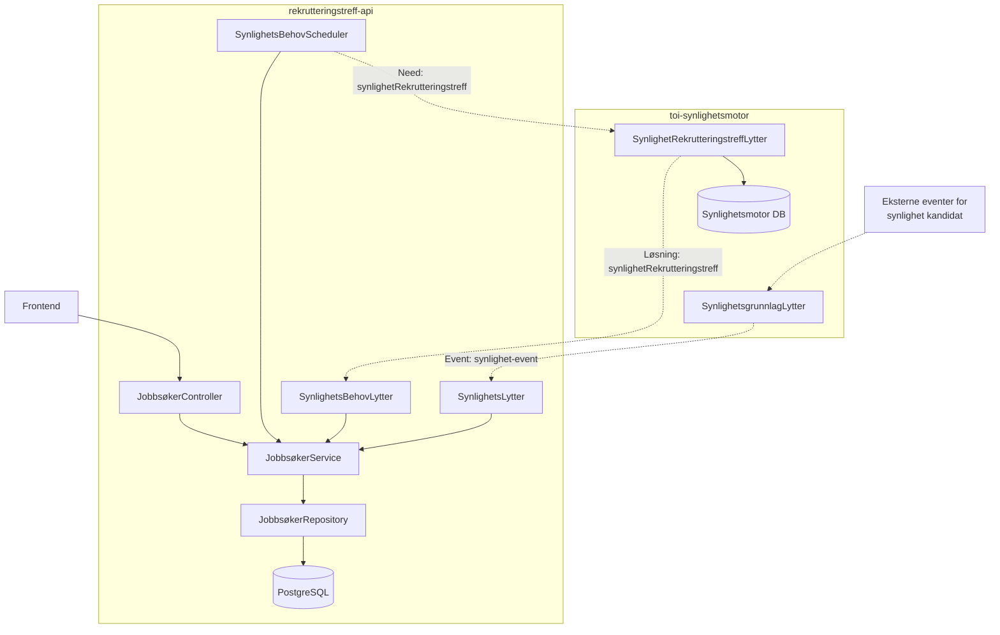
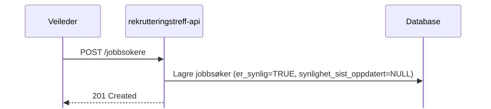
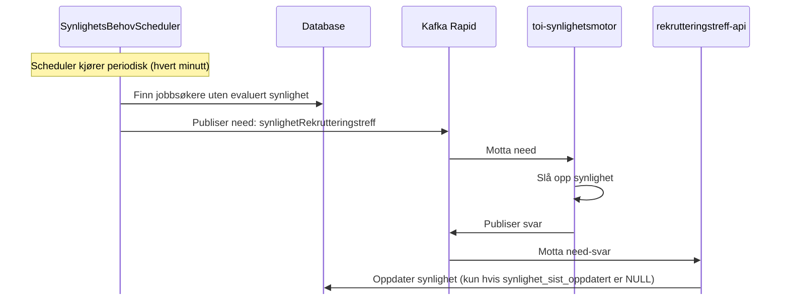
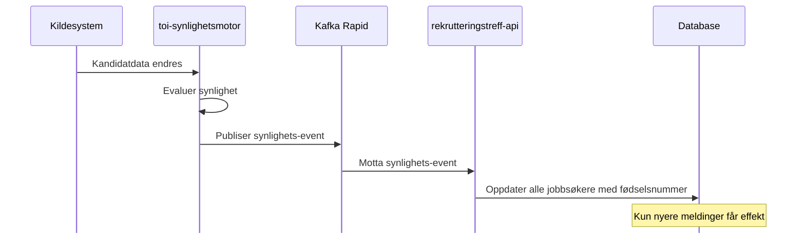
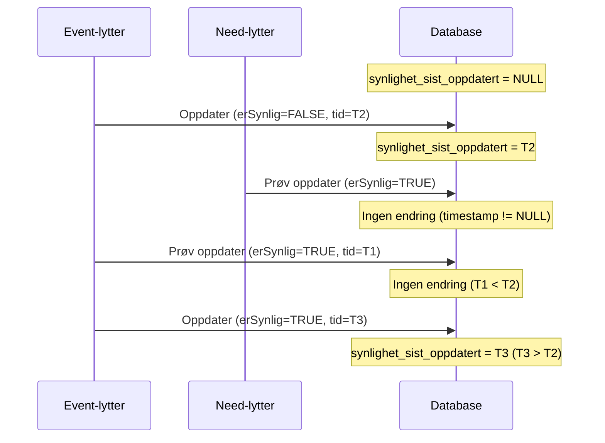

# Synlighet - Integrasjon med toi-synlighetsmotor

## Hva er synlighet?

Synlighet avgjør om en jobbsøker skal vises i rekrutteringstreff-frontenden. Jobbsøkere som ikke er synlige (f.eks. pga. adressebeskyttelse, KVP, død, etc.) filtreres automatisk bort fra alle API-responser.

Synlighetsinformasjonen kommer fra **toi-synlighetsmotor**, som evaluerer kandidater basert på data fra flere kildesystemer.

## Arkitekturoversikt

> **Tegnforklaring:**
>
> - Hel linje (`-->`): Synkron/direkte kommunikasjon (metodekall/SQL)
> - Stiplet linje (`-.->`): Asynkron kommunikasjon via Kafka (Rapids & Rivers)

## Hvordan det fungerer

### Ved opprettelse av jobbsøker

#### Asynkron synlighetssjekk

**Nøkkelpunkter:**

- Jobbsøkeren er **synlig fra start** (optimistisk tilnærming)
- Scheduler finner jobbsøkere uten evaluert synlighet og trigger need-meldinger
- Need-svar oppdaterer kun hvis synlighet ikke allerede er satt av event-strømmen

### Ved synlighetsendring (event-strøm)

**Nøkkelpunkter:**

- Event-strømmen har **alltid lov til å oppdatere** (så lenge meldingen er nyere)
- Oppdaterer **alle rekrutteringstreff** der personen er jobbsøker

## Databasemodell

### Synlighetsfelt i jobbsøker-tabellen

| Felt                       | Type                          | Beskrivelse                                          |
| -------------------------- | ----------------------------- | ---------------------------------------------------- |
| `er_synlig`                | BOOLEAN NOT NULL DEFAULT TRUE | Om jobbsøkeren skal vises i frontend                 |
| `synlighet_sist_oppdatert` | TIMESTAMP WITH TIME ZONE      | Når synlighet sist ble oppdatert fra synlighetsmotor |

### Tolkning av feltkombinasjon

| er_synlig | synlighet_sist_oppdatert | Betydning                                             |
| --------- | ------------------------ | ----------------------------------------------------- |
| TRUE      | NULL                     | Synlig (default), synlighetsmotor har ikke svart ennå |
| TRUE      | timestamp                | Synlighetsmotor har bekreftet at personen er synlig   |
| FALSE     | timestamp                | Synlighetsmotor har markert personen som ikke-synlig  |

### Indekser

- `idx_jobbsoker_synlig`: Partielt indeks på `er_synlig` der verdien er FALSE
- `idx_jobbsoker_fodselsnummer`: Indeks for rask oppslag ved synlighetsmeldinger

## Komponenter

### rekrutteringstreff-api

| Komponent                    | Plassering             | Ansvar                                                        |
| ---------------------------- | ---------------------- | ------------------------------------------------------------- |
| **SynlighetsLytter**         | `jobbsoker/synlighet/` | Lytter på synlighets-events fra event-strømmen                |
| **SynlighetsBehovLytter**    | `jobbsoker/synlighet/` | Lytter på svar fra need-meldinger                             |
| **SynlighetsBehovScheduler** | `jobbsoker/synlighet/` | Finner jobbsøkere uten synlighet og publiserer need-meldinger |
| **JobbsøkerRepository**      | `jobbsoker/`           | Synlighetsfiltrering i alle spørringer + oppdateringsmetoder  |
| **JobbsøkerService**         | `jobbsoker/`           | Delegerer til repository                                      |

### toi-synlighetsmotor

| Komponent                             | Ansvar                                             |
| ------------------------------------- | -------------------------------------------------- |
| **SynlighetRekrutteringstreffLytter** | Besvarer need-meldinger fra rekrutteringstreff-api |
| **SynlighetsgrunnlagLytter**          | Evaluerer og publiserer synlighet til event-strøm  |

## Race condition-håndtering

Systemet håndterer to potensielle race conditions:

### 1. Need-svar vs. Event-strøm

**Problem:** Need-svar kan komme etter at event-strømmen allerede har oppdatert synlighet.

**Løsning:** Need-lytteren skriver **kun hvis `synlighet_sist_oppdatert IS NULL`**. Event-strømmen har prioritet.

### 2. Gamle meldinger

**Problem:** Meldinger kan komme i feil rekkefølge ved reindeksering eller forsinkelser.

**Løsning:** Event-strømmen sammenligner `@opprettet`-tidsstempel. Kun nyere meldinger får effekt.

## Synlighetskriterier

Synlighetsmotor evaluerer følgende kriterier (uten å eksponere hvilke):

- Har aktiv CV
- Har jobbprofil
- Er under oppfølging
- Er ikke kode 6/7 (adressebeskyttelse)
- Er ikke sperret ansatt
- Er ikke død
- Er ikke i KVP (Kvalifiseringsprogram)
- Har ikke adressebeskyttelse
- Er arbeidssøker

**Alle kriterier må være oppfylt** for at personen skal være synlig.

## Default-oppførsel

| Scenario                                 | Default                                  |
| ---------------------------------------- | ---------------------------------------- |
| Ved opprettelse i rekrutteringstreff-api | `erSynlig = TRUE` (synlig frem til svar) |
| Person ikke funnet i synlighetsmotor     | `erSynlig = FALSE` (ikke synlig)         |
| `ferdigBeregnet = FALSE`                 | Behandles som ikke-synlig                |

## Tester

Se testklasser for eksempler på bruk og forventet oppførsel:

- `SynlighetsLytterTest` - Event-strøm-håndtering
- `SynlighetsBehovLytterTest` - Need-svar-håndtering
- `SynlighetsKomponentTest` - End-to-end API-filtrering
- `JobbsøkerServiceTest` - Service-lags-tester for synlighet

## Relaterte dokumenter

- [Database](../2-arkitektur/database.md) - Komplett databaseoversikt
