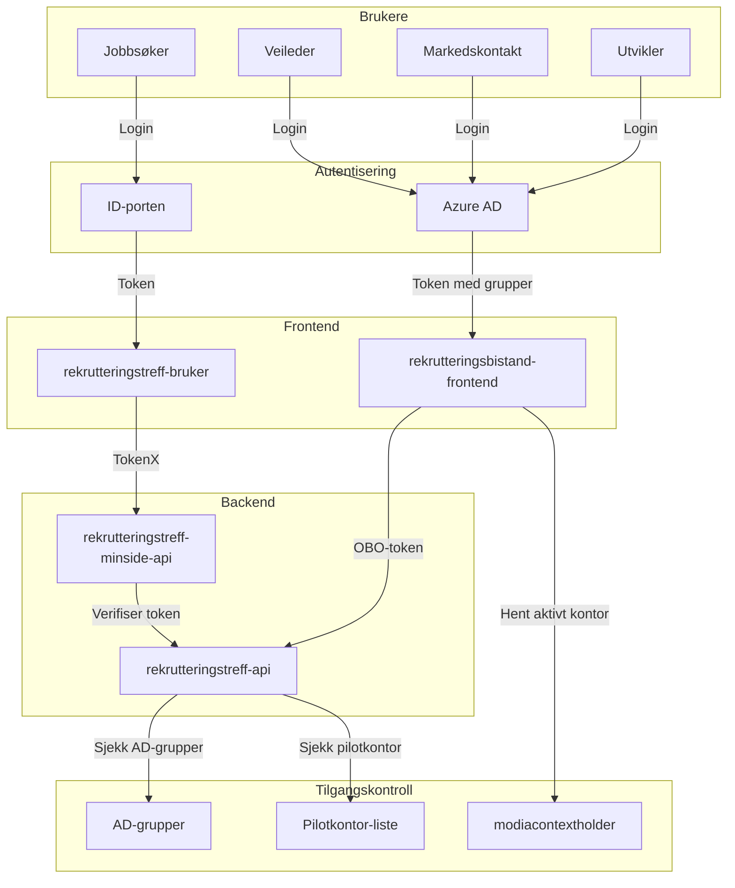
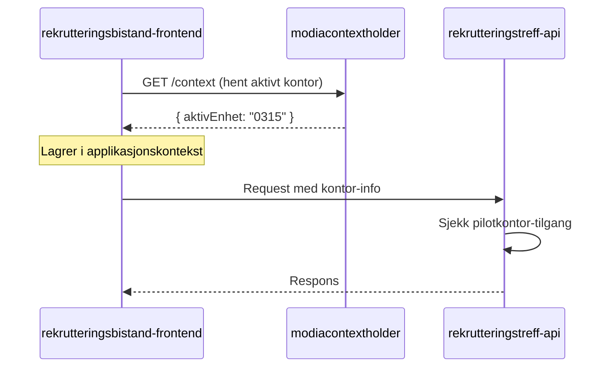
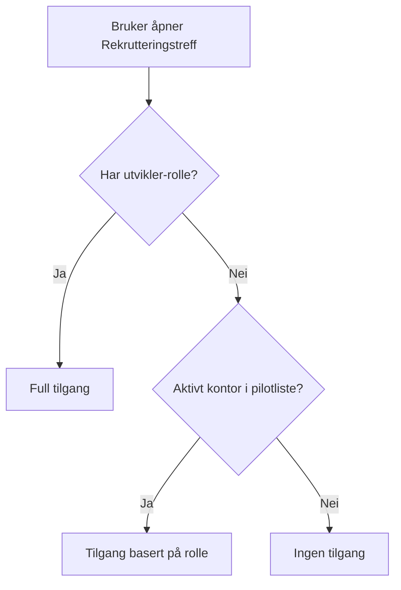

# Tilgangsstyring

Løsningen har tre brukergrupper med ulike tilganger, og bruker flere integrasjoner for å verifisere tilganger.

## Arkitekturoversikt

## 1. Personbruker

Personbrukere autentiseres via ID-porten. Tilgangen gir mulighet til å:

- Se rekrutteringstreff de er invitert til
- Svare på invitasjoner
- Se relevant informasjon om treffet

**Teknisk flyt:**

1. Jobbsøker logger inn via ID-porten
2. Frontend (rekrutteringstreff-bruker) mottar token
3. Frontend bruker TokenX for å veksle til token som minside-api aksepterer
4. minside-api verifiserer at bruker kun ser treff de er invitert til

## 2. NAV-ansatt

NAV-ansatte autentiseres via Azure AD og får roller basert på AD-gruppemedlemskap. Det er tre roller:

### Jobbsøkerrettet

Grunnleggende lesetilgang og mulighet til å jobbe med jobbsøkere:

- Se rekrutteringstreff
- Legge til jobbsøkere på treff

### Arbeidsgiverrettet

Utvidet tilgang for å opprette og administrere rekrutteringstreff:

- Opprette og administrere egne rekrutteringstreff
- Administrere deltakere på egne treff
- Bidra med jobbsøkere på andres treff
- Se hendelseslogg for egne treff

### Utvikler/Admin

Full tilgang til alle funksjoner, inkludert:

- Administrere alle treff uavhengig av eierskap
- Tilgang til utviklerverktøy og diagnostikk
- Tilgang uavhengig av pilotkontor

## 3. System

Systemtilgang brukes for maskin-til-maskin-kommunikasjon mellom tjenester.

## Integrasjoner

### modiacontextholder

Frontend kommuniserer med modiacontextholder for å hente og sette brukerens aktive kontor:

**Funksjonalitet:**

- Henter brukerens aktive NAV-kontor (enhet)
- Synkroniserer kontor på tvers av NAV-applikasjoner via WebSocket
- Gjør det mulig å bytte kontor underveis

### Azure AD-grupper

Roller tildeles via medlemskap i AD-grupper:

| Rolle              | AD-gruppe                                 | Tilgang                        |
| ------------------ | ----------------------------------------- | ------------------------------ |
| Jobbsøkerrettet    | `rekrutteringsbistand-jobbsokerrettet`    | Lese og legge til jobbsøkere   |
| Arbeidsgiverrettet | `rekrutteringsbistand-arbeidsgiverrettet` | Opprette og administrere treff |
| Utvikler           | `rekrutteringsbistand-utvikler`           | Full tilgang                   |

## Pilotkontorer

I pilotperioden må NAV-ansatte (unntatt utviklere) være innlogget på et pilotkontor for å få tilgang.

**Pilotkontor-sjekk:**

1. Frontend henter aktivt kontor fra modiacontextholder
2. API verifiserer at kontoret er i listen over pilotkontorer
3. Utviklere har tilgang uavhengig av kontor

## Se også

- [Audit og Secure Log](audit-og-secure-log.md) - Logging av tilgangssjekker
- [Synlighet](synlighet.md) - Synlighetskontroll for jobbsøkere
