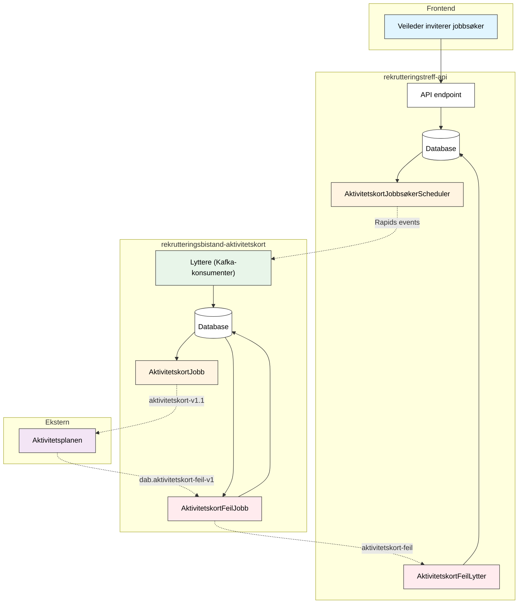

# Aktivitetskort for Rekrutteringstreff

## Formål

Når en jobbsøker inviteres til et rekrutteringstreff, opprettes automatisk et **aktivitetskort** i jobbsøkerens aktivitetsplan. Dette sikrer at:

- Jobbsøker ser invitasjonen i sin aktivitetsplan
- Veileder kan følge opp deltakelse via aktivitetsplanen
- Status holdes synkronisert mellom rekrutteringstreff og aktivitetsplan

---

## Teknisk flyt

**Tegnforklaring:** Hel linje = synkron, stiplet = Kafka

---

## Komponenter

| Komponent                          | App                                 | Beskrivelse                                                                       |
| ---------------------------------- | ----------------------------------- | --------------------------------------------------------------------------------- |
| `AktivitetskortJobbsøkerScheduler` | rekrutteringstreff-api              | Poller DB hvert 10s, publiserer til Rapids                                        |
| `AktivitetskortFeilLytter`         | rekrutteringstreff-api              | Lytter på `aktivitetskort-feil`, lagrer feil i DB                                 |
| `Lyttere`                          | rekrutteringsbistand-aktivitetskort | Konsumerer Rapids-events, lagrer i DB                                             |
| `AktivitetskortJobb`               | rekrutteringsbistand-aktivitetskort | Poller DB hvert minutt, sender til `aktivitetskort-v1.1`                          |
| `AktivitetskortFeilJobb`           | rekrutteringsbistand-aktivitetskort | Konsumerer `dab.aktivitetskort-feil-v1`, lagrer i DB, poller og sender til Rapids |

---

## Hendelser og aktivitetskort-status

| Hendelse                           | Rapids event                     | Aktivitetskort-status |
| ---------------------------------- | -------------------------------- | --------------------- |
| Inviter jobbsøker                  | `rekrutteringstreffinvitasjon`   | PLANLAGT              |
| Jobbsøker svarer ja                | `rekrutteringstreffSvarOgStatus` | GJENNOMFORES          |
| Jobbsøker svarer nei               | `rekrutteringstreffSvarOgStatus` | AVBRUTT               |
| Svart ja → treff fullført          | `rekrutteringstreffSvarOgStatus` | FULLFORT              |
| Svart ja → treff avlyst            | `rekrutteringstreffSvarOgStatus` | AVBRUTT               |
| Svart nei → treff fullført/avlyst  | `rekrutteringstreffSvarOgStatus` | AVBRUTT               |
| Ikke svart → treff fullført/avlyst | `rekrutteringstreffSvarOgStatus` | AVBRUTT               |
| Treff endret                       | `rekrutteringstreffoppdatering`  | (oppdaterer detaljer) |

---

## Relatert dokumentasjon

- [Varsling](varsling.md) - SMS/e-post-varsling til jobbsøkere
- [Database-schema](../2-arkitektur/database.md) - Databaseoversikt
