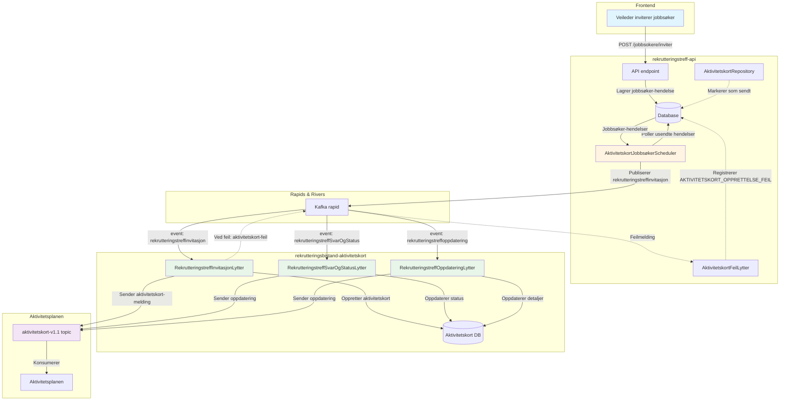

# Aktivitetskort for Rekrutteringstreff

## Overordnet

Løsningen synker automatisk status for rekrutteringstreff og jobbsøker med aktivitetskort i oppfølgingsplanen. Når en jobbsøker inviteres til et treff, opprettes et aktivitetskort som viser invitasjonen i aktivitetsplanen. Aktivitetskortet oppdateres automatisk basert på jobbsøkerens svar og treffets status (avlyst/fullført).

---

## Teknisk flyt



### Flytbeskrivelse

1. **Veileder inviterer jobbsøker** → API lagrer hendelse i database
2. **Scheduler** (kjører periodisk) henter usendte hendelser fra database
3. **Scheduler publiserer** hendelse på rapids (events: `rekrutteringstreffinvitasjon`, `rekrutteringstreffSvarOgStatus`, `rekrutteringstreffoppdatering`)
4. **Lyttere** i `rekrutteringsbistand-aktivitetskort` plukker opp hendelser fra rapid
5. **Lyttere lagrer** i egen database og sender melding til `aktivitetskort-v1.1` topic
6. **Aktivitetsplanen** konsumerer fra topic og viser aktivitetskort
7. **Ved feil** publiseres `aktivitetskort-feil` på rapid, som `AktivitetskortFeilLytter` plukker opp og registrerer i database

---

## Nøkkelklasser

### rekrutteringstreff-api

- **AktivitetskortJobbsøkerScheduler** - Scheduler som poller database og publiserer hendelser
- **AktivitetskortRepository** - Håndterer database-operasjoner for aktivitetskort-hendelser
- **AktivitetskortFeilLytter** - Lytter på feil fra aktivitetskort-appen

### rekrutteringsbistand-aktivitetskort

- **RekrutteringstreffInvitasjonLytter** - Lytter på `rekrutteringstreffinvitasjon`
- **RekrutteringstreffSvarOgStatusLytter** - Lytter på `rekrutteringstreffSvarOgStatus`
- **RekrutteringstreffOppdateringLytter** - Lytter på `rekrutteringstreffoppdatering`

1. Henter eksisterende aktivitetskort-ID for jobbsøker/treff
2. Beregner ny `AktivitetsStatus` basert på svar og treffstatus
3. Oppdaterer aktivitetskortet

---

## Status-mapping

### AktivitetsStatus (aktivitetsplanen)

```kotlin
enum class AktivitetsStatus {
    PLANLAGT,      // Invitert, ikke svart ennå
    GJENNOMFORES,  // Svart ja, treff pågår
    FULLFORT,      // Svart ja, treff fullført
    AVBRUTT        // Svart nei, avlyst, eller ikke svart ved fullført
}
```

### Mapping-logikk

Se kildekode: `apps/rekrutteringsbistand-aktivitetskort/src/main/kotlin/no/nav/toi/rekrutteringstreff/RekrutteringstreffSvarOgStatusLytter.kt`

### Oppsummert mapping-tabell

| Svar         | Treffstatus | AktivitetsStatus |
| ------------ | ----------- | ---------------- |
| JA           | (uendret)   | GJENNOMFORES     |
| JA           | fullført    | FULLFORT         |
| JA           | avlyst      | AVBRUTT          |
| NEI          | \*          | AVBRUTT          |
| (ikke svart) | fullført    | AVBRUTT          |
| (ikke svart) | avlyst      | AVBRUTT          |

---

## Frontend-hendelser til backend-status

### Frontend-actions

```typescript
export const JobbsøkerHendelsestype = {
  OPPRETTET: "OPPRETTET",
  OPPDATERT: "OPPDATERT",
  SLETTET: "SLETTET",
  INVITERT: "INVITERT",
  SVART_JA_TIL_INVITASJON: "SVART_JA_TIL_INVITASJON",
  SVART_NEI_TIL_INVITASJON: "SVART_NEI_TIL_INVITASJON",
  SVART_JA_TREFF_AVLYST: "SVART_JA_TREFF_AVLYST",
  SVART_JA_TREFF_FULLFØRT: "SVART_JA_TREFF_FULLFØRT",
  IKKE_SVART_TREFF_AVLYST: "IKKE_SVART_TREFF_AVLYST",
  IKKE_SVART_TREFF_FULLFØRT: "IKKE_SVART_TREFF_FULLFØRT",
  AKTIVITETSKORT_OPPRETTELSE_FEIL: "AKTIVITETSKORT_OPPRETTELSE_FEIL",
  MOTTATT_SVAR_FRA_MINSIDE: "MOTTATT_SVAR_FRA_MINSIDE",
  TREFF_ENDRET_ETTER_PUBLISERING_NOTIFIKASJON:
    "TREFF_ENDRET_ETTER_PUBLISERING_NOTIFIKASJON",
} as const;
```

### Mapping fra frontend-action til Rapids-event

| Frontend action   | Backend hendelse           | Rapids event                     | Aktivitetskort status |
| ----------------- | -------------------------- | -------------------------------- | --------------------- |
| Inviter           | `INVITERT`                 | `rekrutteringstreffinvitasjon`   | PLANLAGT (opprett)    |
| Svar ja (borger)  | `SVART_JA_TIL_INVITASJON`  | `rekrutteringstreffSvarOgStatus` | GJENNOMFORES          |
| Svar nei (borger) | `SVART_NEI_TIL_INVITASJON` | `rekrutteringstreffSvarOgStatus` | AVBRUTT               |
| Fullført treff    | `SVART_JA_TREFF_FULLFØRT`  | `rekrutteringstreffSvarOgStatus` | FULLFORT              |
| Avlyst treff      | `SVART_JA_TREFF_AVLYST`    | `rekrutteringstreffSvarOgStatus` | AVBRUTT               |
| Treff endret      | `TREFF_ENDRET_...`         | `rekrutteringstreffoppdatering`  | (oppdater detaljer)   |

---

## Feilhåndtering

### AktivitetskortFeil

Når aktivitetskort-tjenesten returnerer feil, publiseres dette tilbake på Rapids.

Se kildekode: `apps/rekrutteringstreff-api/src/main/kotlin/no/nav/toi/jobbsoker/aktivitetskort/AktivitetskortFeilLytter.kt`

Lytter på `aktivitetskort-feil` og registrerer `AKTIVITETSKORT_OPPRETTELSE_FEIL` hendelse på jobbsøker.

---

## Polling-mekanisme

### aktivitetskort_polling-tabell

Sporer hvilke hendelser som er sendt for å unngå duplikater.

### Synlighetsfilter

Kun synlige jobbsøkere får aktivitetskort.

---

## Relatert dokumentasjon

- [Varsling](varsling.md) - Varsling til jobbsøkere
- [Database-schema](09-database-schema.md) - Komplett databaseoversikt
