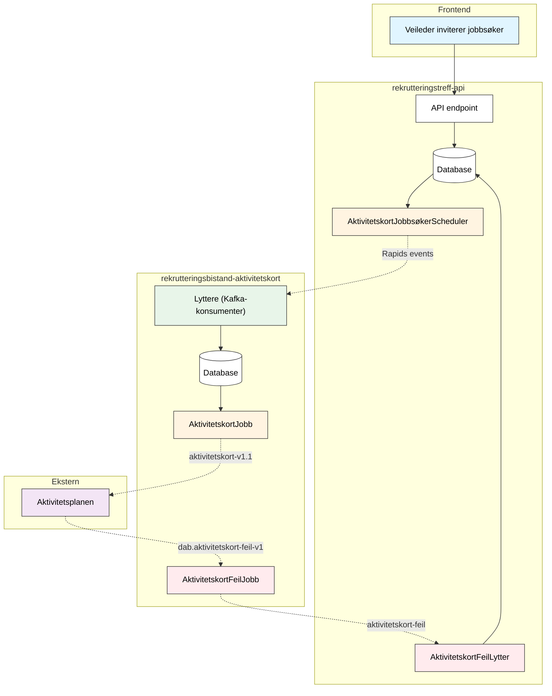

# Aktivitetskort for Rekrutteringstreff

Løsningen synker automatisk status for rekrutteringstreff med aktivitetskort i aktivitetsplanen. Når en jobbsøker inviteres til et treff, opprettes et aktivitetskort. Kortet oppdateres basert på jobbsøkerens svar og treffets status.

---

## Teknisk flyt

**Tegnforklaring:** Hel linje = synkron, stiplet = Kafka

---

## Komponenter

| Komponent                          | App                                 | Beskrivelse                                                    |
| ---------------------------------- | ----------------------------------- | -------------------------------------------------------------- |
| `AktivitetskortJobbsøkerScheduler` | rekrutteringstreff-api              | Poller DB hvert 10s, publiserer til Rapids                     |
| `AktivitetskortFeilLytter`         | rekrutteringstreff-api              | Lytter på `aktivitetskort-feil`, lagrer feil i DB              |
| `Lyttere`                          | rekrutteringsbistand-aktivitetskort | Konsumerer Rapids-events, lagrer i DB                          |
| `AktivitetskortJobb`               | rekrutteringsbistand-aktivitetskort | Poller DB hvert minutt, sender til `aktivitetskort-v1.1`       |
| `AktivitetskortFeilJobb`           | rekrutteringsbistand-aktivitetskort | Konsumerer `dab.aktivitetskort-feil-v1`, publiserer til Rapids |

---

## Status-mapping

| Svar         | Treffstatus | AktivitetsStatus |
| ------------ | ----------- | ---------------- |
| JA           | (uendret)   | GJENNOMFORES     |
| JA           | fullført    | FULLFORT         |
| JA           | avlyst      | AVBRUTT          |
| NEI          | \*          | AVBRUTT          |
| (ikke svart) | fullført    | AVBRUTT          |
| (ikke svart) | avlyst      | AVBRUTT          |

---

## Hendelse → Rapids-event → Aktivitetskort

| Hendelse       | Rapids event                     | Aktivitetskort     |
| -------------- | -------------------------------- | ------------------ |
| Inviter        | `rekrutteringstreffinvitasjon`   | Opprett (PLANLAGT) |
| Svar ja        | `rekrutteringstreffSvarOgStatus` | GJENNOMFORES       |
| Svar nei       | `rekrutteringstreffSvarOgStatus` | AVBRUTT            |
| Treff fullført | `rekrutteringstreffSvarOgStatus` | FULLFORT/AVBRUTT   |
| Treff avlyst   | `rekrutteringstreffSvarOgStatus` | AVBRUTT            |
| Treff endret   | `rekrutteringstreffoppdatering`  | Oppdater detaljer  |

---

## Relatert dokumentasjon

- [Varsling](varsling.md)
- [Database-schema](../2-arkitektur/09-database-schema.md)
