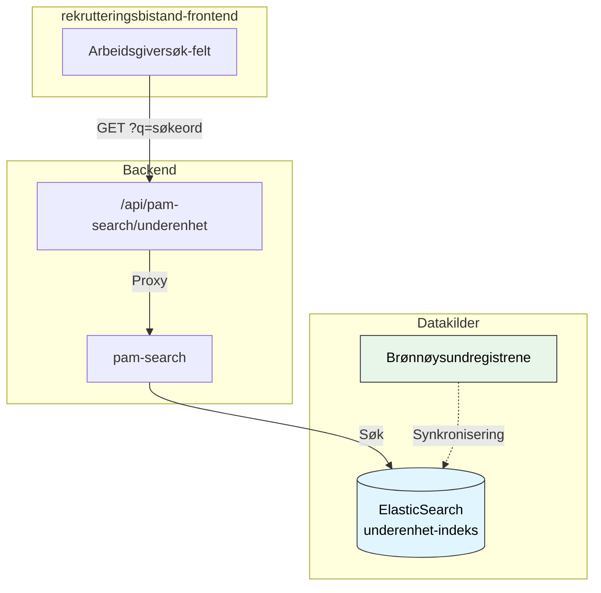
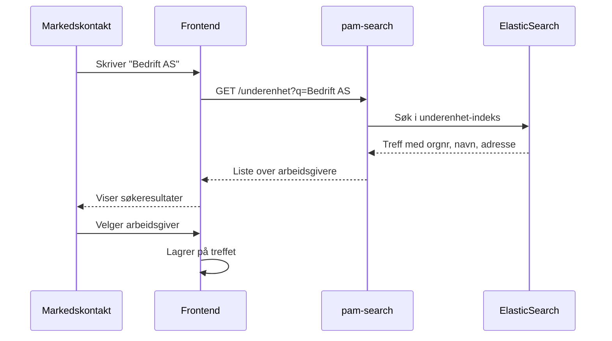
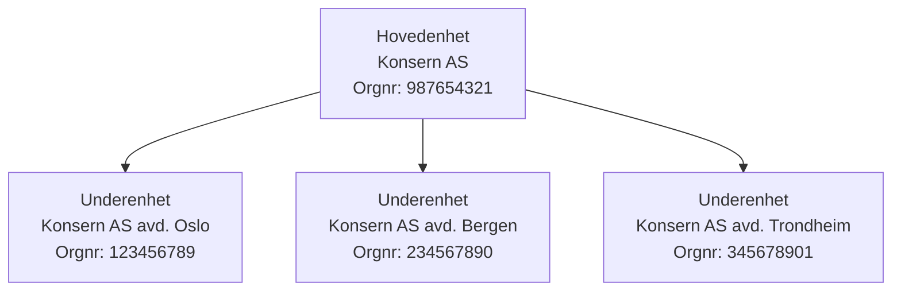

# Enhetsregisteret (Arbeidsgiversøk)

Når markedskontakt legger til arbeidsgivere på et rekrutteringstreff, søkes det i Enhetsregisteret via pam-search API.

> **Merk:** Arbeidsgiversøket er en **ekstern tjeneste** som rekrutteringsbistand-frontend kaller direkte. Søket går **ikke** via rekrutteringstreff-api.

## Arkitekturoversikt



## Hvordan det fungerer

### Søkeflyt

1. Markedskontakt skriver inn firmanavn i søkefeltet
2. Frontend sender søkeord til `/api/pam-search/underenhet`
3. pam-search søker i ElasticSearch-indeks med underenheter
4. Resultater returneres med organisasjonsinfo



### Data fra Enhetsregisteret

Følgende informasjon hentes fra Enhetsregisteret:

| Felt                  | Beskrivelse                   | Eksempel     |
| --------------------- | ----------------------------- | ------------ |
| `organisasjonsnummer` | 9-sifret orgnummer            | "123456789"  |
| `navn`                | Virksomhetsnavn               | "Bedrift AS" |
| `organisasjonsform`   | Type enhet                    | "BEDR", "AS" |
| `antallAnsatte`       | Antall ansatte                | 25           |
| `overordnetEnhet`     | Hovedenhet (for underenheter) | "987654321"  |
| `adresse`             | Forretningsadresse            | Se under     |
| `næringskoder`        | NACE-koder                    | Se under     |

#### Adresseinformasjon

```json
{
  "land": "Norge",
  "landkode": "NO",
  "kommune": "Oslo",
  "kommunenummer": "0301",
  "poststed": "Oslo",
  "postnummer": "0154",
  "adresse": "Storgata 1"
}
```

#### Næringskoder

```json
{
  "kode": "62.010",
  "beskrivelse": "Programmeringstjenester"
}
```

## Underenheter vs. hovedenheter

Vi søker i **underenhet-indeksen**, ikke hovedenheter. Dette er fordi:

- Underenheter representerer fysiske arbeidsplasser
- Hovedenheter er juridiske enheter som kan ha flere underenheter
- Jobbsøkere møter opp på underenhetens adresse



## Dataoppdatering

Enhetsregisteret oppdateres daglig fra Brønnøysundregistrene. pam-search indekserer endringer løpende.

## Se også

- [Kandidatsøk](kandidatsok.md) - Søk etter jobbsøkere
- [Tilgangsstyring](../3-sikkerhet/tilgangsstyring.md) - Hvem har tilgang til arbeidsgiversøk
