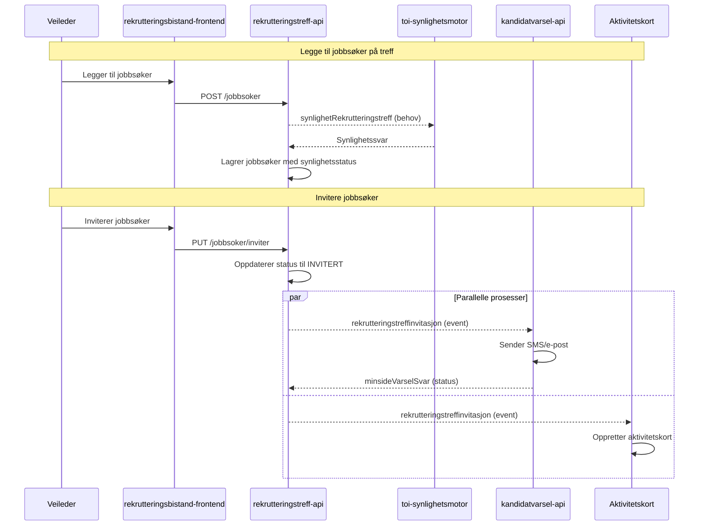

# Invitasjon av jobbsøkere

Denne flyten beskriver hvordan veiledere og markedskontakter inviterer jobbsøkere til rekrutteringstreff.

## Flyt

> **Tegnforklaring:**
>
> - Hel linje (`->>`): Synkron/direkte kommunikasjon
> - Stiplet linje (`-->>`): Asynkron kommunikasjon via Kafka (Rapids & Rivers)

## Steg-for-steg

### 1. Legge til jobbsøker

Veileder eller markedskontakt legger til en jobbsøker på et rekrutteringstreff. Systemet sjekker automatisk synlighetsstatus via toi-synlighetsmotor for å verifisere at jobbsøkeren har gyldig CV og samtykke.

### 2. Invitere jobbsøker

Når jobbsøkeren inviteres, skjer følgende parallelt:

- **Varsling**: SMS og e-post sendes til jobbsøker med lenke til MinSide
- **Aktivitetskort**: Et aktivitetskort opprettes i jobbsøkerens aktivitetsplan

### 3. Jobbsøker mottar invitasjon

Jobbsøker kan åpne rekrutteringstreffet på MinSide via to innganger:

- **Via varsel**: SMS/e-post inneholder lenke direkte til MinSide-landingssiden
- **Via aktivitetskortet**: Aktivitetskortet i aktivitetsplanen har samme lenke til MinSide

Begge veier leder til samme landingsside der jobbsøker kan se treffdetaljer og svare på invitasjonen. Se [minside-flyt.md](minside-flyt.md) for detaljer om jobbsøkerens flyt.

## Relaterte dokumenter

- [Varsling](varsling.md) - Detaljer om varslingsmekanismen
- [Aktivitetskort](aktivitetskort.md) - Detaljer om aktivitetskort-integrasjonen
- [MinSide-flyt](minside-flyt.md) - Jobbsøkerens flyt for å se og svare
