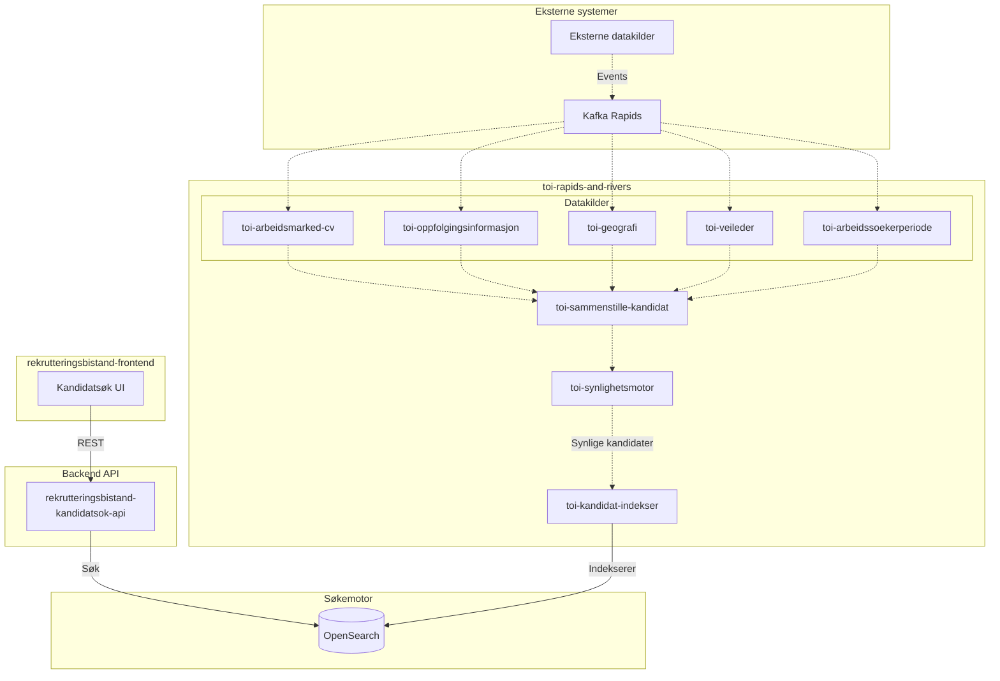
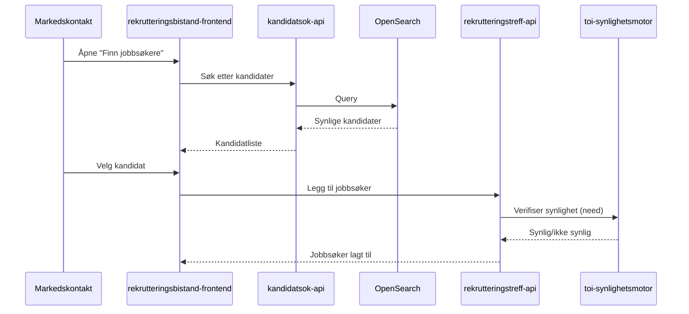

# Kandidatsøk

Kandidatsøket er en sentral funksjon som lar NAV-ansatte finne jobbsøkere å invitere til rekrutteringstreff.

> **Merk:** Kandidatsøket er en **ekstern tjeneste** som rekrutteringsbistand-frontend kaller direkte. Søket går **ikke** via rekrutteringstreff-api.

## Arkitekturoversikt

> **Tegnforklaring:**
>
> - Hel linje (`-->`): Synkron kommunikasjon (REST/direkte)
> - Stiplet linje (`-.->`): Asynkron kommunikasjon via Kafka

## Komponenter

### rekrutteringsbistand-kandidatsok-api

REST API som tilbyr søkefunksjonalitet for NAV-ansatte:

- Mottar søkekriterier fra frontend (yrke, geografi, kompetanse, etc.)
- Oversetter til OpenSearch-spørringer
- Returnerer filtrerte kandidatresultater
- Kun synlige kandidater returneres

### OpenSearch

Søkemotor som lagrer indekserte kandidater:

- Rask fulltekstsøk og filtrering
- Indekserer kun kandidater som passerer synlighetsreglene
- Oppdateres kontinuerlig via Kafka-strømmen

### toi-rapids-and-rivers apper

Kafka-baserte applikasjoner som prosesserer kandidatdata:

| App                            | Ansvar                                                      |
| ------------------------------ | ----------------------------------------------------------- |
| **toi-sammenstille-kandidat**  | Samler data fra ulike kilder til en komplett kandidatprofil |
| **toi-synlighetsmotor**        | Evaluerer synlighetsregler (CV, samtykke, oppfølging, etc.) |
| **toi-kandidat-indekser**      | Indekserer synlige kandidater i OpenSearch                  |
| **toi-arbeidsmarked-cv**       | Prosesserer CV-data                                         |
| **toi-oppfolgingsinformasjon** | Prosesserer oppfølgingsstatus                               |
| **toi-geografi**               | Prosesserer geografisk informasjon                          |
| **toi-veileder**               | Prosesserer veilederinformasjon                             |
| **toi-arbeidssoekerperiode**   | Prosesserer arbeidssøkerperioder                            |

## Dataflyt

### 1. Data inn i systemet

Eksterne systemer publiserer hendelser til Kafka:

- CV-endringer
- Oppfølgingsstatusendringer
- Samtykkeendringer
- Adresseendringer

### 2. Sammenstilling og filtrering

`toi-sammenstille-kandidat` samler data fra alle kilder og publiserer en komplett kandidatmelding.

`toi-synlighetsmotor` evaluerer om kandidaten skal være synlig basert på:

- Har aktiv CV
- Har jobbprofil
- Er under oppfølging
- Ikke kode 6/7 (adressebeskyttelse)
- Ikke sperret ansatt
- Ikke død
- Ikke i KVP
- Er arbeidssøker

### 3. Indeksering

`toi-kandidat-indekser` mottar synlige kandidater og indekserer dem i OpenSearch.

### 4. Søk

NAV-ansatte søker via rekrutteringsbistand-frontend → rekrutteringsbistand-kandidatsok-api → OpenSearch.

## Relasjon til Rekrutteringstreff

Rekrutteringstreff bruker kandidatsøket til å finne jobbsøkere å invitere:

1. Markedskontakt åpner "Finn jobbsøkere" i rekrutteringsbistand-frontend
2. Kandidatsøket viser kun synlige kandidater
3. Valgte kandidater legges til på treffet
4. Ved invitasjon verifiserer rekrutteringstreff-api synlighet på nytt via toi-synlighetsmotor

## Se også

- [Synlighet](../3-sikkerhet/synlighet.md) - Hvordan synlighetsregler evalueres
- [Rapids & Rivers](rapids-and-rivers.md) - Meldingsarkitektur
