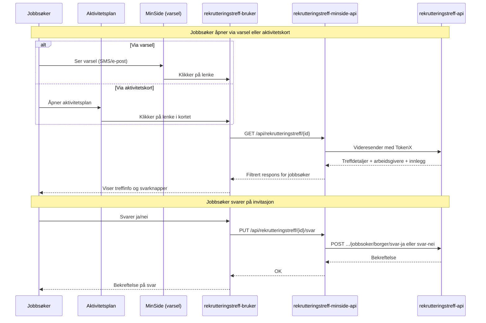

# MinSide-flyt for jobbsøkere

Jobbsøkere kan se rekrutteringstreff de er invitert til og svare på invitasjoner. Visningen skjer i **rekrutteringstreff-bruker**, en dedikert frontend for jobbsøkere.

## Innganger for jobbsøker

Jobbsøker kan nå rekrutteringstreff-bruker via to innganger:

| Inngang               | Beskrivelse                                                                            |
| --------------------- | -------------------------------------------------------------------------------------- |
| **Varsel på MinSide** | SMS/e-post inneholder lenke. Jobbsøker klikker og kommer til rekrutteringstreff-bruker |
| **Aktivitetskort**    | Aktivitetskortet i aktivitetsplanen har lenke til rekrutteringstreff-bruker            |

Begge veier leder til samme visning der jobbsøker kan se treffdetaljer og svare på invitasjonen.

## Arkitektur

## rekrutteringstreff-bruker

Frontend-applikasjon spesielt laget for jobbsøkere. Viser treffdetaljer og lar jobbsøker svare på invitasjon.

### Tilstander i visningen

| Tilstand      | Visning for jobbsøker                                               |
| ------------- | ------------------------------------------------------------------- |
| Invitert      | Svarknapper (ja/nei), svarfrist, treffdetaljer                      |
| Svart ja      | Bekreftelse på påmelding, treffdetaljer                             |
| Svart nei     | Bekreftelse på avmelding                                            |
| Ikke invitert | Info om at treffet har begrenset plass, tips om å kontakte veileder |
| Treff pågår   | Info om at treffet er i gang                                        |
| Treff passert | Info om at treffet er over                                          |
| Treff avlyst  | Tydelig avlysningsmelding                                           |

### Teknisk

- **Repo:** [navikt/rekrutteringstreff-bruker](https://github.com/navikt/rekrutteringstreff-bruker)
- **Teknologi:** Next.js med Aksel designsystem
- **Autentisering:** ID-porten via TokenX

## Flytbeskrivelse

### Se rekrutteringstreff

1. Jobbsøker mottar varsel (SMS/e-post) eller ser aktivitetskort
2. Jobbsøker klikker på lenke og logger inn via ID-porten
3. rekrutteringstreff-bruker henter treffdetaljer fra `rekrutteringstreff-minside-api`
4. Jobbsøker ser informasjon om treffet: tittel, tid, sted, arbeidsgivere og innlegg

### Svare på invitasjon

1. Jobbsøker velger å svare "Ja" eller "Nei" på invitasjonen
2. Svaret sendes via `rekrutteringstreff-minside-api` til `rekrutteringstreff-api`
3. Hendelsen registreres og publiseres til Rapids & Rivers
4. Veileder kan se jobbsøkerens svar i rekrutteringsbistand-frontend

### Aktivitetskort-oppdatering

Når jobbsøker svarer på invitasjonen, oppdateres aktivitetskortet i aktivitetsplanen automatisk:

- **Svarer ja** → Aktivitetskortet flyttes til status "Gjennomføres"
- **Svarer nei** → Aktivitetskortet flyttes til status "Avbrutt"

Se [aktivitetskort.md](aktivitetskort.md) for detaljer om aktivitetskort-integrasjonen.

## Autentisering

- Jobbsøker autentiseres via ID-porten
- `rekrutteringstreff-bruker` kommuniserer med `rekrutteringstreff-minside-api`
- `rekrutteringstreff-minside-api` bruker TokenX for å veksle token mot `rekrutteringstreff-api`
- Jobbsøker identifiseres med personnummer (`pid`-claim)
