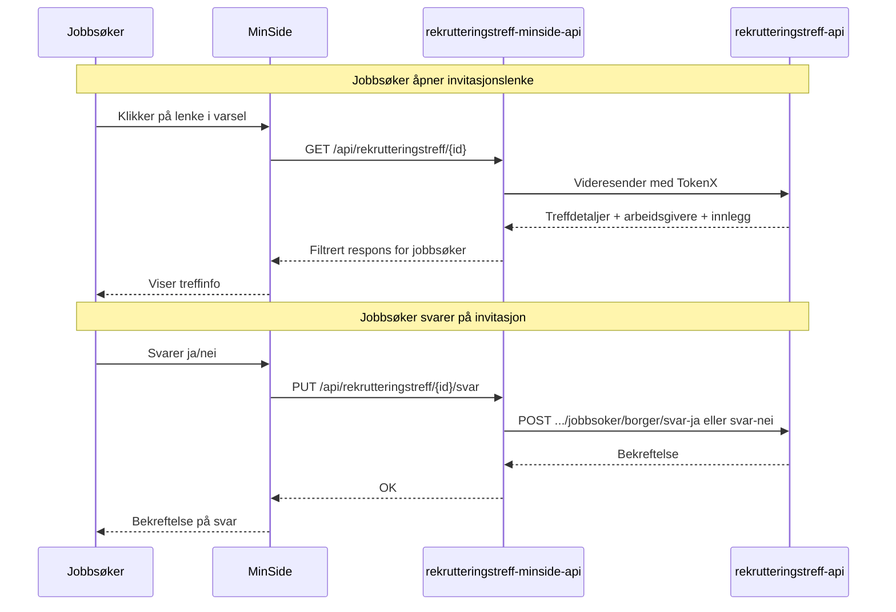

# MinSide-flyt for jobbsøkere

Jobbsøkere kan se rekrutteringstreff de er invitert til og svare på invitasjoner via MinSide.

## Arkitektur

## Flytbeskrivelse

### Se rekrutteringstreff

1. Jobbsøker mottar varsel (SMS/e-post) med lenke til MinSide
2. Jobbsøker logger inn via ID-porten
3. MinSide henter treffdetaljer fra `rekrutteringstreff-minside-api`
4. Jobbsøker ser informasjon om treffet: tittel, beskrivelse, tid, sted, arbeidsgivere og innlegg

### Svare på invitasjon

1. Jobbsøker velger å svare "Ja" eller "Nei" på invitasjonen
2. Svaret sendes til `rekrutteringstreff-minside-api`
3. API-et videresender svaret til `rekrutteringstreff-api` som registrerer hendelsen
4. Veileder kan se jobbsøkerens svar i rekrutteringsbistand

### Aktivitetskort-oppdatering

Når jobbsøker svarer på invitasjonen, oppdateres aktivitetskortet i aktivitetsplanen automatisk:

- **Svarer ja** → Aktivitetskortet flyttes til status "Planlagt"
- **Svarer nei** → Aktivitetskortet flyttes til status "Avbrutt"

Se [aktivitetskort.md](aktivitetskort.md) for detaljer om aktivitetskort-integrasjonen.

## Autentisering

- Jobbsøker autentiseres via ID-porten
- `rekrutteringstreff-minside-api` bruker TokenX for å veksle token mot `rekrutteringstreff-api`
- Jobbsøker identifiseres med personnummer (`pid`-claim)
