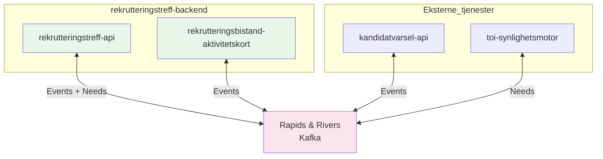

# Rapids and Rivers

Vi bruker **Rapids and Rivers**-biblioteket for asynkron meldingsutveksling via Kafka.

## Oversikt

**Merk:** `rekrutteringstreff-minside-api` bruker **REST** mot `rekrutteringstreff-api` og bruker ikke Rapids & Rivers direkte.

## Fordeler

- Event-drevet arkitektur
- Løs kobling mellom systemer
- Skalerbar meldingshåndtering
- Mulighet for retry og feilhåndtering

## Meldingsmønstre

### Event-pattern

Brukes for å publisere hendelser som andre systemer kan reagere på:

1. Publiser event med hendelsesdata
2. Andre systemer lytter og reagerer asynkront
3. Eventuelt publiser respons tilbake

**Eksempel:** Når en jobbsøker inviteres, publiseres en `rekrutteringstreffinvitasjon`-event som aktivitetskort-tjenesten og varsel-tjenesten lytter på.

### Need-pattern

Brukes når vi må hente data fra andre databaser eller systemer:

1. **Publiser behov**: Sender en need-melding med informasjon om hva vi trenger
2. **Lytt på respons**: Andre systemer svarer på behovet
3. **Oppdater vår database**: Når vi mottar svar, oppdaterer vi vår lokale tilstand

**Eksempel:** For synlighetssjekk publiserer vi et `synlighetRekrutteringstreff`-behov, og toi-synlighetsmotor svarer med synlighetsstatus.

## REST vs Rapids & Rivers

| Bruksområde | REST | Rapids & Rivers |
|-------------|------|-----------------|
| Klienten trenger umiddelbar respons | ✓ | |
| Operasjonen er bruker-initiert | ✓ | |
| Eventual consistency er ok | | ✓ |
| Flere systemer skal reagere | | ✓ |
| Retry og feilhåndtering viktig | | ✓ |

## Relaterte dokumenter

- [Varsling](varsling.md) - Bruker Rapids & Rivers for varsling
- [Aktivitetskort](aktivitetskort.md) - Lytter på events via Rapids & Rivers
- [Synlighet](../3-sikkerhet/synlighet.md) - Bruker need-pattern for synlighetssjekk
