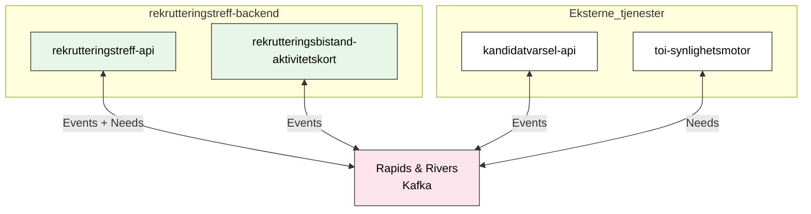

# Rapids and Rivers

Vi bruker **Rapids and Rivers**-biblioteket for asynkron meldingsutveksling via Kafka.

## Oversikt

**Merk:** `rekrutteringstreff-minside-api` bruker **REST** mot `rekrutteringstreff-api` og bruker ikke Rapids & Rivers direkte.

## Fordeler

- Event-drevet arkitektur
- Løs kobling mellom systemer
- Skalerbar meldingshåndtering
- Mulighet for retry og feilhåndtering

## Meldingsmønstre

### Event-pattern

Brukes for å publisere hendelser som andre systemer kan reagere på:

1. Publiser event med hendelsesdata
2. Andre systemer lytter og reagerer asynkront
3. Eventuelt publiser respons tilbake

**Eksempel:** Når en jobbsøker inviteres, publiseres en `rekrutteringstreffinvitasjon`-event som aktivitetskort-tjenesten og varsel-tjenesten lytter på.

### Need-pattern

Brukes når vi må hente data fra andre databaser eller systemer:

1. **Publiser behov**: Sender en need-melding med informasjon om hva vi trenger
2. **Lytt på respons**: Andre systemer svarer på behovet
3. **Oppdater vår database**: Når vi mottar svar, oppdaterer vi vår lokale tilstand

**Eksempel:** For synlighetssjekk publiserer vi et `synlighetRekrutteringstreff`-behov, og toi-synlighetsmotor svarer med synlighetsstatus.

## REST vs Rapids & Rivers

| Bruksområde                         | REST | Rapids & Rivers |
| ----------------------------------- | ---- | --------------- |
| Klienten trenger umiddelbar respons | ✓    |                 |
| Operasjonen er bruker-initiert      | ✓    |                 |
| Eventual consistency er ok          |      | ✓               |
| Flere systemer skal reagere         |      | ✓               |
| Retry og feilhåndtering viktig      |      | ✓               |

## Oppsett av Rapids and Rivers (RapidApplication vs Bibliotek)

Vi har to måter å inkludere Rapids and Rivers på i applikasjonene våre, avhengig av om applikasjonen også kjører en egen webserver (f.eks. for REST-endepunkter).

### 1. Som bibliotek ("libs") uten Ktor-server
Brukes når applikasjonen **allerede har en egen server** (som Javalin).

*   **Eksempler:** `rekrutteringstreff-api`, `kandidatvarsel-api`.
*   **Årsak:** Disse applikasjonene bruker `Javalin` for å tilby REST-endepunkter.
*   **Problem ved bruk av RapidApplication:** Hvis vi hadde brukt `RapidApplication` her, ville den forsøkt å starte sin egen interne Ktor-server. Dette ville ført til konflikter fordi:
    *   To servere prøver å binde seg til porter.
    *   Vi ville fått to sett med helsesjekker (`isAlive`, `isReady`).
    *   Det ville blitt komplisert å håndtere livssyklus og restart hvis den ene serveren går ned men den andre lever.
*   **Løsning:** Vi inkluderer kun Rapids and Rivers-bibliotekene som avhengigheter og instansierer `RapidsConnection` manuelt, slik at den kjører side-om-side med Javalin-serveren.

### 2. RapidApplication (med innebygd server)
Brukes når applikasjonen er en **ren konsument/produsent av events** uten behov for egne REST-endepunkter utover helsesjekker.

*   **Eksempel:** `rekrutteringsbistand-aktivitetskort`.
*   **Årsak:** Denne applikasjonen mottar events via Kafka og har ingen brukerflate eller REST-API som krever en separat server.
*   **Fordel:** `RapidApplication` setter automatisk opp en Ktor-server som eksponerer `isAlive` og `isReady`-endepunkter, samt Prometheus-metrikker. Dette forenkler oppsettet betraktelig siden vi får "alt i ett".

## Relaterte dokumenter

- [Varsling](varsling.md) - Bruker Rapids & Rivers for varsling
- [Aktivitetskort](aktivitetskort.md) - Lytter på events via Rapids & Rivers
- [Synlighet](../3-sikkerhet/synlighet.md) - Bruker need-pattern for synlighetssjekk
