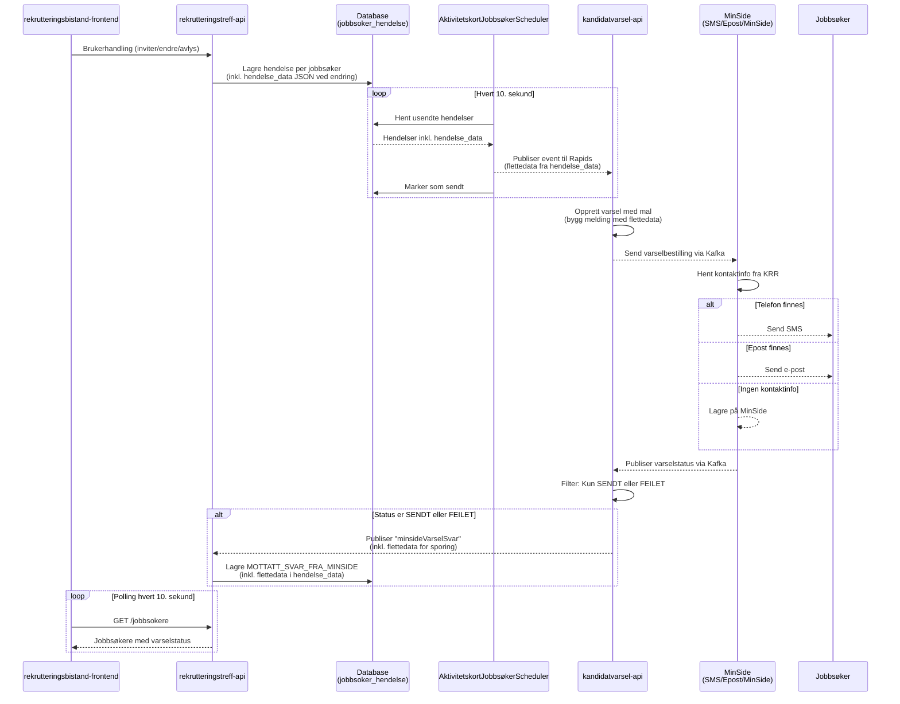

# Varsling for Rekrutteringstreff

## Overordnet

Løsningen sender automatiske varsler til jobbsøkere i følgende situasjoner:

1. **Invitasjon** - Når en jobbsøker inviteres til et rekrutteringstreff
2. **Endring** - Når et publisert treff med inviterte jobbsøkere endres
3. **Avlysning** - Når et treff avlyses

Varsling skjer via **SMS** eller **e-post**, avhengig av hvilken kontaktinformasjon som finnes i Kontakt- og reservasjonsregisteret (KRR). Dersom jobbsøker ikke har registrert kontaktinformasjon, lagres varselet på **MinSide** der jobbsøkeren kan se det ved pålogging.

---

## Felles flyt for alle varsler

Alle tre løpene følger samme arkitektur. Det som varierer er trigger, hendelsestype, mottakere og meldingsinnhold.



> **Tegnforklaring:**
>
> - Hel linje (`->>`): Synkron/direkte kommunikasjon
> - Stiplet linje (`-->>`): Asynkron kommunikasjon via Kafka (Rapids & Rivers)
> - `hendelse_data`: JSON-kolonne i database for tilleggsdata (brukes kun ved endring)
> - `flettedata`: Feltnavn som sendes via Rapids og brukes til å bygge meldingstekst

### Forskjeller mellom løpene

| Aspekt            | Invitasjon                           | Endring                                       | Avlysning                           |
| ----------------- | ------------------------------------ | --------------------------------------------- | ----------------------------------- |
| **Trigger**       | Veileder inviterer jobbsøker         | Markedskontakt endrer publisert treff         | Markedskontakt avlyser treff        |
| **API-endepunkt** | `POST /jobbsokere/inviter`           | `PUT /rekrutteringstreff/:id`                 | `PUT /rekrutteringstreff/:id/avlys` |
| **Hendelsestype** | `INVITERT`                           | `TREFF_ENDRET_ETTER_PUBLISERING_NOTIFIKASJON` | `SVART_JA_TREFF_AVLYST`             |
| **Rapids-event**  | `rekrutteringstreffinvitasjon`       | `rekrutteringstreffoppdatering`               | `rekrutteringstreffavlysning`       |
| **Lytter**        | `RekrutteringstreffInvitasjonLytter` | `RekrutteringstreffOppdateringLytter`         | `RekrutteringstreffAvlysningLytter` |
| **Mal**           | `KANDIDAT_INVITERT_TREFF`            | `KANDIDAT_INVITERT_TREFF_ENDRET`              | `KANDIDAT_INVITERT_TREFF_AVLYST`    |
| **Mottakere**     | Den inviterte jobbsøkeren            | Inviterte + svart ja                          | Kun svart ja                        |
| **Flettedata**    | Nei                                  | Ja (valgte endrede felter)                    | Nei                                 |

---

## Løp 1: Invitasjon til treff

Når veileder inviterer en jobbsøker til et treff, sendes det automatisk et varsel.

### Mal og meldingsinnhold

**KANDIDAT_INVITERT_TREFF**

```
Hei! Du er invitert til et treff der du kan møte arbeidsgivere som har ledige jobber.
Logg inn på Nav for å se detaljer og svare på invitasjonen. Vennlig hilsen Nav
```

---

## Løp 2: Melding om endring

Når et publisert treff med inviterte jobbsøkere endres, kan markedskontakt velge om det skal sendes melding om endringen.

### Valgmuligheter for markedskontakt

Markedskontakt velger:

1. **Om** melding skal sendes (ja/nei per endret felt)
2. **Hvilke felter** som skal nevnes i meldingen:
   - Navn
   - Tidspunkt
   - Svarfrist
   - Sted
   - Introduksjon

### Hvem får meldingen?

Kun jobbsøkere som:

- Er invitert, eller
- Har svart ja til invitasjonen

Jobbsøkere som har svart nei får **ikke** melding om endringer.

### Mal og meldingsinnhold

**KANDIDAT_INVITERT_TREFF_ENDRET**

```
Det er endringer i et treff du er invitert til: [endringer]. Logg inn på Nav for å se detaljer.
```

`[endringer]` erstattes med valgte felter, f.eks. "tidspunkt og sted".

---

## Løp 3: Avlysning av treff

Når et publisert treff avlyses, sendes det automatisk varsel til jobbsøkere som har svart ja.

### Hvem får varsel?

Kun jobbsøkere som har **svart ja** til invitasjonen.

Jobbsøkere som kun er invitert (ikke svart) eller har svart nei, får **ikke** varsel.

### Mal og meldingsinnhold

**KANDIDAT_INVITERT_TREFF_AVLYST**

```
Hei! Treffet du hadde takket ja til er dessverre avlyst. Logg inn på Nav for mer informasjon. Vennlig hilsen Nav
```

---

## Felles komponenter

### Scheduler (AktivitetskortJobbsøkerScheduler)

Kjører hvert 10. sekund og:

1. Henter usendte hendelser fra database (`INVITERT`, `TREFF_ENDRET_ETTER_PUBLISERING_NOTIFIKASJON` og `SVART_JA_TREFF_AVLYST`)
2. Publiserer hendelser til Rapids & Rivers
3. Markerer hendelser som sendt

Kun synlige jobbsøkere (`er_synlig = TRUE`) får varsler.

### Flettedata og hendelse_data

Løsningen bruker to måter å overføre tilleggsinformasjon på, avhengig av behov:

| Løp        | Trenger dynamisk innhold? | Lagring                | Beskrivelse                                             |
| ---------- | ------------------------- | ---------------------- | ------------------------------------------------------- |
| Invitasjon | Nei                       | Ingen ekstra data      | Fast SMS-tekst, ingen variabler                         |
| Endring    | Ja                        | `hendelse_data` (JSON) | Bruker velger hvilke felter som skal nevnes i meldingen |
| Avlysning  | Nei                       | Ingen ekstra data      | Fast SMS-tekst, ingen variabler                         |

**Hvorfor flettedata kun for endring?**

Ved invitasjon og avlysning brukes en fast meldingstekst uten variabler. Ved endring må meldingen inneholde _hvilke_ felter som er endret (f.eks. "tidspunkt og sted"), og dette velges av markedskontakt i frontend.

**Flyt for hendelse_data:**

```
Frontend → API → Database (hendelse_data JSON) → Scheduler → Rapids (flettedata) → kandidatvarsel-api → SMS
```

**Eksempel på hendelse_data i database:**

```json
{
  "flettedata": ["tidspunkt", "sted"]
}
```

Scheduleren leser denne JSON-en og inkluderer `flettedata` i Rapids-meldingen. kandidatvarsel-api bruker dette til å bygge SMS-teksten: _"Det er endringer i et treff du er invitert til: tidspunkt og sted."_

### Varselkanaler (fra MinSide)

MinSide velger kanal basert på kontaktinfo fra KRR:

| Kontaktinfo i KRR | Varselkanal | Ekstern kanal-verdi |
| ----------------- | ----------- | ------------------- |
| Telefonnummer     | SMS         | `SMS`               |
| E-postadresse     | E-post      | `EPOST`             |
| Ingen info        | MinSide     | `null`              |

**Prioritering:** SMS prioriteres hvis både telefon og e-post finnes.

### Varselstatus (i MOTTATT_SVAR_FRA_MINSIDE-hendelse)

**Statusfilter:**
Kun statuser `SENDT` og `FEILET` publiseres fra kandidatvarsel-api til rapids.

**Hvorfor ikke FERDIGSTILT?**
`FERDIGSTILT`-status kan ta lang tid å motta fra MinSide, selv om meldingen allerede ligger i MinSide og er sendt til jobbsøker. Ved å bruke `SENDT`-status får vi raskere tilbakemelding til markedskontakt om at varselet er levert, uten å vente på den endelige ferdigstillingen.

**MinsideStatus:**

- `UNDER_UTSENDING` - Varselet sendes
- `OPPRETTET` - MinSide har bekreftet opprettelse
- `SLETTET` - Varselet er slettet

**EksternStatus (kun SENDT og FEILET publiseres til rapids):**

- `SENDT` - ✅ Publiseres - Varsel sendt vellykket (SMS eller e-post)
- `FEILET` - ✅ Publiseres - Feil ved sending
- `FERDIGSTILT` - ❌ Publiseres ikke - Ferdig behandlet (tar ofte lang tid)
- `VENTER` - ❌ Publiseres ikke - Venter på utsending
- `KANSELLERT` - ❌ Publiseres ikke - Kansellert
- `UNDER_UTSENDING` - ❌ Publiseres ikke - Vi kan vurdere å legge det til senere dersom vi erfarer at meldinger tar lang tid.

**EksternFeilmelding:**

- `person_ikke_funnet` - Personen mangler kontaktinfo i KRR

---

## Teknisk oversikt

### Rapids-meldinger

De tre løpene bruker ulike Rapids-meldinger med ulikt innhold:

#### rekrutteringstreffinvitasjon (Løp 1)

Inneholder treffdetaljer for aktivitetskort. Ingen flettedata – fast SMS-tekst.

```json
{
  "@event_name": "rekrutteringstreffinvitasjon",
  "fnr": "12345678910",
  "rekrutteringstreffId": "uuid",
  "hendelseId": "uuid",
  "tittel": "Jobbtreff hos bedrift AS",
  "fraTid": "2025-02-01T10:00:00Z",
  "tilTid": "2025-02-01T14:00:00Z",
  "svarfrist": "2025-01-25T23:59:59Z",
  "gateadresse": "Eksempelgate 1",
  "postnummer": "0123",
  "poststed": "Oslo"
}
```

#### rekrutteringstreffoppdatering (Løp 2)

Inneholder `flettedata` – hvilke felter som er endret og skal nevnes i SMS.

```json
{
  "@event_name": "rekrutteringstreffoppdatering",
  "fnr": "12345678910",
  "rekrutteringstreffId": "uuid",
  "hendelseId": "uuid",
  "flettedata": ["tidspunkt", "sted"]
}
```

#### rekrutteringstreffavlysning (Løp 3)

Enkel melding uten flettedata – fast SMS-tekst.

```json
{
  "@event_name": "rekrutteringstreffavlysning",
  "fnr": "12345678910",
  "rekrutteringstreffId": "uuid",
  "hendelseId": "uuid",
  "tittel": "Jobbtreff hos bedrift AS"
}
```

#### minsideVarselSvar (tilbakemelding fra alle løp)

Returneres fra kandidatvarsel-api etter at MinSide har behandlet varselet. Inneholder `flettedata` og `mal` slik at vi kan spore hvilken type varsel det gjelder.

```json
{
  "@event_name": "minsideVarselSvar",
  "varselId": "uuid",
  "avsenderReferanseId": "rekrutteringstreffId",
  "fnr": "12345678910",
  "eksternStatus": "SENDT",
  "minsideStatus": "OPPRETTET",
  "eksternKanal": "SMS",
  "mal": "KANDIDAT_INVITERT_TREFF",
  "flettedata": ["tidspunkt", "sted"]
}
```

> **Merk:** `flettedata` i `minsideVarselSvar` er kun relevant for Løp 2 (endring). For andre løp er feltet tomt eller fraværende.

```

### Nøkkelklasser

**rekrutteringstreff-api:**

- `JobbsøkerController` - API-endepunkt for invitasjon
- `RekrutteringstreffController` - API-endepunkt for oppdatering av treff
- `JobbsøkerService` - Forretningslogikk
- `AktivitetskortJobbsøkerScheduler` - Poller og publiserer hendelser
- `MinsideVarselSvarLytter` - Lytter på varselstatus

**kandidatvarsel-api:**

- `RekrutteringstreffInvitasjonLytter` - Lytter på invitasjoner
- `RekrutteringstreffOppdateringLytter` - Lytter på endringer
- `MinsideClient` - Sender varsel til MinSide via Kafka

**rekrutteringsbistand-frontend:**

- `JobbsøkerKort.tsx` - Viser varselstatus i UI
- `RepubliserRekrutteringstreffButton.tsx` - UI for valg av varsling ved endringer
- Polling-logikk: Henter jobbsøkerliste hvert 10. sekund

---

## Relatert dokumentasjon

- [Aktivitetskort for Rekrutteringstreff](aktivitetskort.md)
- [MinSide dokumentasjon](https://navikt.github.io/tms-dokumentasjon/varsler/produsere)
```
