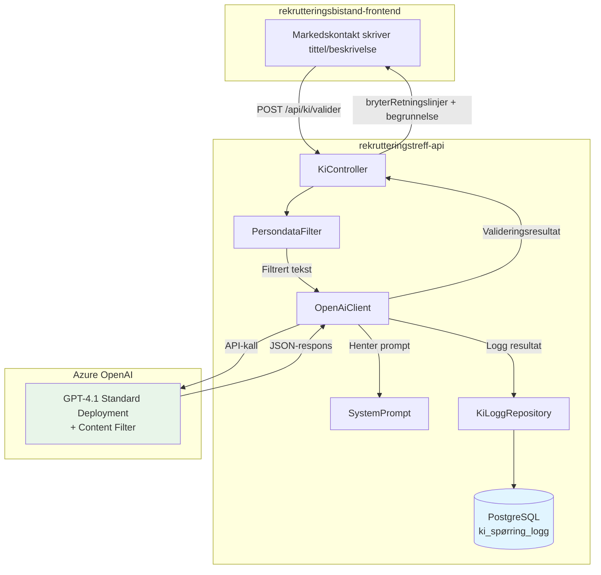
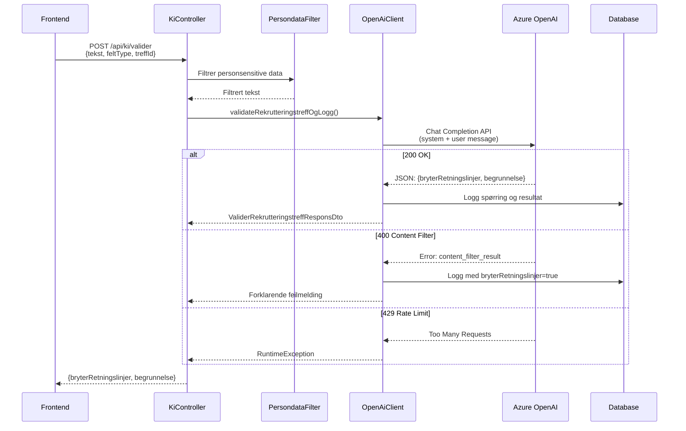
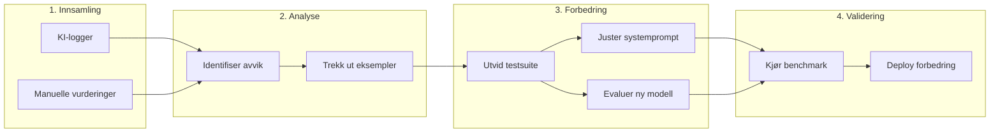
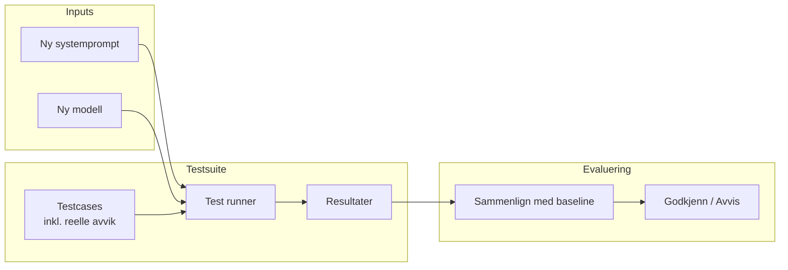

# KI-moderering av rekrutteringstreff-innhold

## Formål

Vi bruker kunstig intelligens (KI) for å validere at tittel og beskrivelse av rekrutteringstreff ikke er diskriminerende eller bryter med NAVs retningslinjer.

Valideringen sikrer at:

- Tekst ikke er direkte eller indirekte diskriminerende
- Personvernregler følges
- Likestillings- og diskrimineringsloven overholdes
- Taushetsbelagte opplysninger ikke eksponeres

---

## Arkitektur



---

## Azure OpenAI-oppsett

Vi har satt opp en deployment i Azure OpenAI med følgende konfigurasjon:

| Egenskap            | Verdi                     |
| ------------------- | ------------------------- |
| **Modell**          | GPT-4.1                   |
| **Deployment-type** | Standard                  |
| **Azure-region**    | Norway East               |
| **Content Filter**  | Standard (hateful speech) |

### Valg av modell

Vi velger modell basert på:

1. **Standard deployment-støtte** - Kreves for vårt bruksområde
2. **Instruction following** - Modellen må følge systemprompt nøyaktig
3. **JSON-output** - Modellen må kunne returnere strukturert JSON

### Innebygd content filter

Azure OpenAI har et innebygd content filter som fanger opp:

- Hatefulle ytringer
- Voldelig innhold
- Seksuelt innhold
- Selvskading

Dersom teksten trigger dette filteret, returnerer API-et en 400-feil med detaljer om hvilken kategori som ble trigget. Vi håndterer dette og returnerer en forklarende melding til bruker.

---

## Systemprompt

Systemprompten definerer reglene KI-modellen skal følge ved validering av tekst.

**Kildekode:** [`apps/rekrutteringstreff-api/src/main/kotlin/no/nav/toi/rekrutteringstreff/ki/SystemPrompt.kt`](../apps/rekrutteringstreff-api/src/main/kotlin/no/nav/toi/rekrutteringstreff/ki/SystemPrompt.kt)

### Versjonering

Systemprompten versjoneres med:

- **Versjonsnummer** - Inkrementeres ved hver endring
- **Tidsstempel** - Når endringen ble gjort
- **Hash** - SHA-256 hash av prompten (6 tegn)

Dette sikrer sporbarhet og gjør det mulig å analysere hvordan endringer påvirker modereringskvaliteten.

### Hovedprinsipper i prompten

1. **Formål**: Vurdere om teksten følger NAVs retningslinjer
2. **Diskrimineringskontroll**: Identifisere ekskluderende tekst basert på kjønn, alder, etnisitet, religion, funksjonsevne, tiltak/ytelser eller bosted
3. **Taushetsplikt**: Ikke avsløre at deltakere er knyttet til spesifikke NAV-tiltak (KVP, AAP, IPS, etc.)
4. **Satsningsområder**: Godta arrangementer for flyktninger og ungdom (18-30) med eksplisitt aldersspenn
5. **Språkkrav**: Kun tillate språkkrav der språket er oppgitt som arbeidsspråk
6. **Personvern**: Godta firmanavn, men avvise enkeltpersoner som med-arrangører

---

## Teknisk flyt

### Valideringsflyt



### Persondata-filtrering

Før teksten sendes til KI, filtreres personsensitive data ut:

- Fødselsnummer
- Telefonnummer
- E-postadresser
- Kontonummer

Dette sikrer at personopplysninger aldri sendes til ekstern KI-tjeneste.

---

## API-respons

### Vellykket validering

```json
{
  "bryterRetningslinjer": false,
  "begrunnelse": "Teksten beskriver et åpent rekrutteringstreff uten diskriminerende elementer."
}
```

### Brudd på retningslinjer

```json
{
  "bryterRetningslinjer": true,
  "begrunnelse": "Teksten ekskluderer basert på alder ved å kreve 'kun for personer over 50 år' uten saklig begrunnelse."
}
```

### Content filter trigget

```json
{
  "bryterRetningslinjer": true,
  "begrunnelse": "Teksten bryter med retningslinjene til KI-leverandøren og trigger: hate. Den kan derfor ikke vurderes av KI."
}
```

---

## Logging og sporbarhet

### Hva vi logger

Alle KI-spørringer logges i `ki_spørring_logg`-tabellen for å sikre full sporbarhet og mulighet for kvalitetskontroll:

| Felt                    | Beskrivelse                               |
| ----------------------- | ----------------------------------------- |
| `treff_id`              | Referanse til rekrutteringstreffet        |
| `felt_type`             | TITTEL eller BESKRIVELSE                  |
| `spørring_fra_frontend` | Original tekst fra bruker                 |
| `spørring_filtrert`     | Tekst etter persondata-filtrering         |
| `systemprompt`          | Systemprompt brukt i kallet               |
| `ekstra_parametre`      | JSON med promptversjon, hash, tidsstempel |
| `bryter_retningslinjer` | Boolean resultat fra KI                   |
| `begrunnelse`           | KIs begrunnelse                           |
| `ki_navn`               | azure-openai                              |
| `ki_versjon`            | Deployment-navn (f.eks. toi-gpt-4.1)      |
| `svartid_ms`            | Responstid i millisekunder                |
| `lagret`                | Om teksten ble brukt/lagret               |

### Hvorfor vi logger

1. **Sporbarhet** - Dokumentere alle modereringsbeslutninger
2. **Kvalitetskontroll** - Sammenligne KI-vurderinger med menneskelige vurderinger
3. **Forbedring** - Identifisere svakheter i systemprompt og modell
4. **Compliance** - Kunne dokumentere at moderering er utført

### Logggrensesnitt for administratorer

Vi tilbyr et logggrensesnitt i brukerflaten for brukere med admin-tilgang:

```mermaid
flowchart TB
    subgraph "rekrutteringsbistand-frontend (Admin)"
        ADMIN[Administrator / Domeneekspert]
        LOGUI[Loggvisning]
        VURD[Manuell vurdering]
    end

    subgraph "rekrutteringstreff-api"
        KC[KiController]
        KLR[KiLoggRepository]
        DB[(ki_spørring_logg)]
    end

    ADMIN --> LOGUI
    LOGUI -->|GET /api/ki/logg| KC
    KC --> KLR
    KLR --> DB

    ADMIN --> VURD
    VURD -->|PUT /api/ki/logg/{id}/manuell-kontroll| KC
    KC --> KLR
    KLR -->|Oppdater manuell_kontroll_*| DB

    style ADMIN fill:#fff4e1
    style DB fill:#e1f5ff
```

#### Funksjonalitet

- **Se alle KI-vurderinger** - Administratorer kan bla gjennom alle valideringer
- **Filtrere på avvik** - Finne tilfeller der KI har vurdert feil
- **Legge inn manuell vurdering** - Domeneeksperter kan registrere sin vurdering
- **Sammenligne** - Se forskjell mellom KI-vurdering og menneskelig vurdering

### Manuell kontroll

Tabellen støtter manuell overprøving for kvalitetssikring:

| Felt                                     | Beskrivelse                |
| ---------------------------------------- | -------------------------- |
| `manuell_kontroll_bryter_retningslinjer` | Domeneekspertens vurdering |
| `manuell_kontroll_utført_av`             | NAV-ident for kontrollør   |
| `manuell_kontroll_tidspunkt`             | Når kontrollen ble utført  |

### Bruk av loggdata til forbedring

Loggdataene brukes aktivt til å forbedre KI-valideringen:



#### Prosess for kontinuerlig forbedring

1. **Identifisere avvik** - Finn tilfeller der KI og domeneekspert er uenige
2. **Analysere mønster** - Forstå hvorfor KI vurderer feil
3. **Utvide testsuite** - Legge til reelle eksempler med avvik som testcases
4. **Justere systemprompt** - Forbedre instruksjonene til KI
5. **Evaluere nye modeller** - Sammenligne kvalitet mellom modellversjoner
6. **Benchmarke** - Kjøre hele testsuiten mot ny konfigurasjon
7. **Deploye** - Rulle ut forbedringer når kvaliteten er bedre

---

## Testing og benchmarking

Vi har en testsuite for å benchmarke systemprompter og modeller. Testsuiten er essensiell for å sikre at endringer faktisk forbedrer kvaliteten.

### Testklasser

| Testklasse             | Beskrivelse                                 |
| ---------------------- | ------------------------------------------- |
| `KiAutorisasjonsTest`  | Tester tilgangskontroll til KI-endepunktene |
| `KiLoggRepositoryTest` | Tester logging av KI-spørringer             |
| `OpenAiTestClient`     | Hjelpeklasse for testing mot Azure OpenAI   |

### Formål med testsuiten

1. **Regresjonstesting** - Sikre at endringer i systemprompt ikke gir uventede resultater
2. **Modellsammenligning** - Sammenligne kvalitet mellom ulike modellversjoner
3. **Edge cases** - Teste grensetilfeller og vanskelige formuleringer
4. **Dokumenterte avvik** - Inkludere reelle eksempler fra produksjon der KI har vurdert feil

### Bruk av testsuiten



### Prosess for evaluering av ny systemprompt eller modell

1. **Samle testcases** - Inkluder både konstruerte og reelle eksempler
2. **Kjør baseline** - Mål nåværende ytelse
3. **Kjør kandidat** - Test ny prompt eller modell
4. **Sammenlign** - Analyser forskjeller i vurderinger
5. **Beslutning** - Godkjenn kun hvis kvaliteten er bedre eller lik

### Kilder til testcases

- **Konstruerte eksempler** - Edge cases vi designer for å teste spesifikke regler
- **Produksjonslogger** - Reelle tekster fra bruk i produksjon
- **Avviks-eksempler** - Tilfeller der domeneeksperter har overprøvd KI
- **Grensetilfeller** - Formuleringer som er vanskelige å vurdere

---

## Konfigurasjon

### Miljøvariabler

| Variabel            | Beskrivelse                                |
| ------------------- | ------------------------------------------ |
| `OPENAI_API_URL`    | URL til Azure OpenAI deployment            |
| `OPENAI_API_KEY`    | API-nøkkel for autentisering               |
| `OPENAI_DEPLOYMENT` | Navn på deployment (brukes som ki_versjon) |

### Modellparametere

| Parameter         | Verdi       | Beskrivelse                |
| ----------------- | ----------- | -------------------------- |
| `temperature`     | 0.0         | Deterministisk output      |
| `max_tokens`      | 400         | Maks lengde på respons     |
| `top_p`           | 1.0         | Ingen sampling-begrensning |
| `response_format` | json_object | Krever JSON-output         |

---

## Relaterte dokumenter

- [Database](../2-arkitektur/database.md) - Beskrivelse av `ki_spørring_logg`-tabellen
- [Arkitekturprinsipper](../2-arkitektur/prinsipper.md) - Overordnet arkitektur
