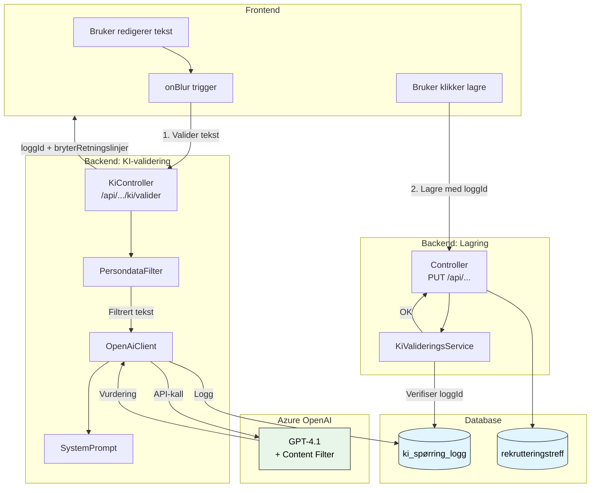
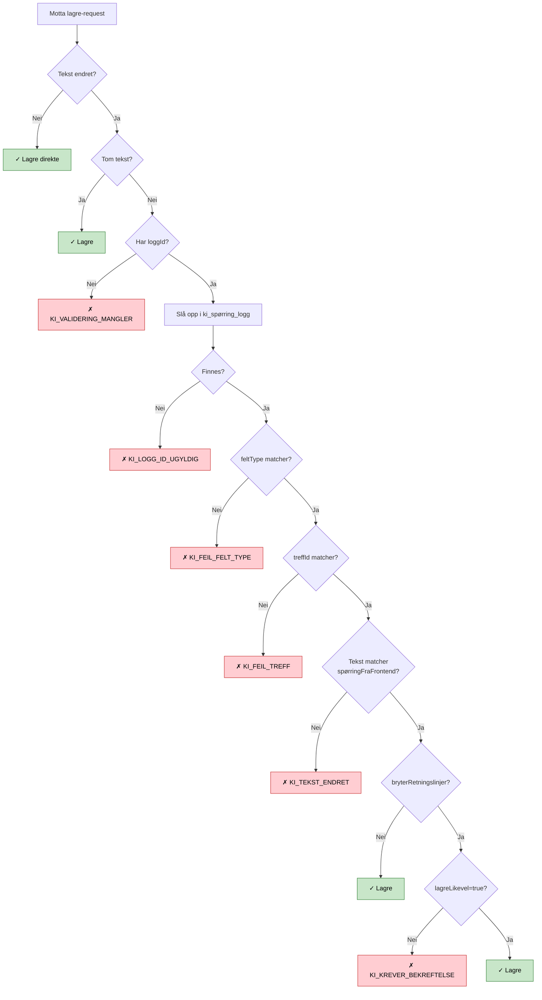
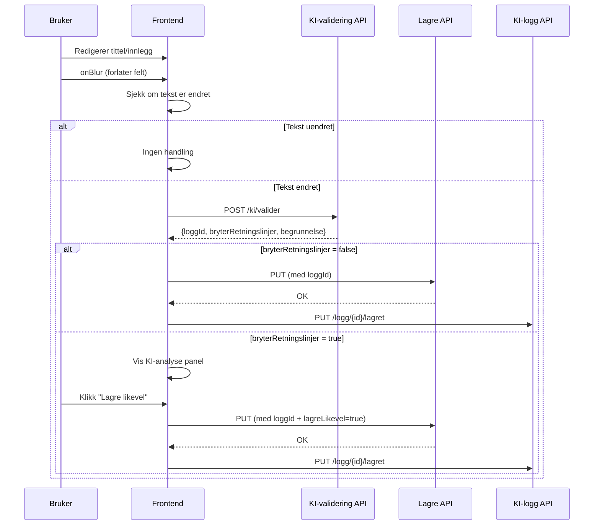
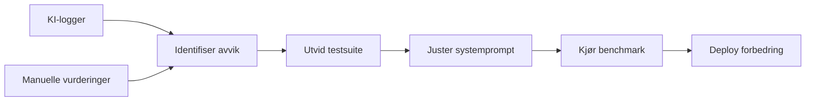

# KI-tekstvalidering

## Formål

Vi bruker kunstig intelligens (KI) for å validere at tekst i rekrutteringstreff ikke er diskriminerende eller bryter med NAVs retningslinjer. Valideringen sikrer at:

- Tekst ikke er direkte eller indirekte diskriminerende
- Likestillings- og diskrimineringsloven overholdes
- Taushetsbelagte opplysninger ikke eksponeres
- Personopplysninger ikke sendes til ekstern KI-tjeneste

Backend garanterer at tekst ikke kan lagres uten gyldig KI-validering.

---

## Overordnet flyt



---

## Del 1: KI-validering

### Azure OpenAI-oppsett

| Egenskap            | Verdi                     |
| ------------------- | ------------------------- |
| **Modell**          | GPT-4.1                   |
| **Deployment-type** | Standard                  |
| **Azure-region**    | Norway East               |
| **Content Filter**  | Standard (hateful speech) |

### Modellparametere

| Parameter         | Verdi       | Beskrivelse                |
| ----------------- | ----------- | -------------------------- |
| `temperature`     | 0.0         | Deterministisk output      |
| `max_tokens`      | 400         | Maks lengde på respons     |
| `top_p`           | 1.0         | Ingen sampling-begrensning |
| `response_format` | json_object | Krever JSON-output         |

### Innebygd content filter

Azure OpenAI fanger opp hatefulle ytringer, voldelig/seksuelt innhold og selvskading. Ved trigger returneres 400-feil som vi oversetter til en forklarende melding.

### Persondata-filtrering

Før tekst sendes til KI, filtreres personsensitive data ut:

- Fødselsnummer
- Telefonnummer
- E-postadresser
- Kontonummer

### Systemprompt

Systemprompten definerer valideringsreglene. Se [`SystemPrompt.kt`](../../apps/rekrutteringstreff-api/src/main/kotlin/no/nav/toi/rekrutteringstreff/ki/SystemPrompt.kt).

**Hovedprinsipper:**

1. Identifisere diskriminering basert på kjønn, alder, etnisitet, religion, funksjonsevne, tiltak/ytelser eller bosted
2. Sikre taushetsplikt (ikke avsløre NAV-tiltak som KVP, AAP, IPS)
3. Godta satsningsområder: flyktninger og ungdom (18-30) med eksplisitt aldersspenn
4. Kun tillate språkkrav der språket er oppgitt som arbeidsspråk

**Versjonering:** Prompten har versjonsnummer, tidsstempel og SHA-256 hash for sporbarhet.

### API-respons

```json
{
  "loggId": "7f1f5a2c-6d2a-4a7b-9c2b-1f0d2a3b4c5d",
  "bryterRetningslinjer": false,
  "begrunnelse": "Teksten beskriver et åpent rekrutteringstreff uten diskriminerende elementer.",
  "validertTekst": "Vi søker etter en blid og motivert medarbeider."
}
```

| Felt                   | Beskrivelse                                                   |
| ---------------------- | ------------------------------------------------------------- |
| `loggId`               | Referanse til KI-logg, sendes tilbake ved lagring             |
| `bryterRetningslinjer` | Om KI mener teksten bryter retningslinjene                    |
| `begrunnelse`          | KIs forklaring på vurderingen                                 |
| `validertTekst`        | Den validerte teksten (etter eventuell persondata-filtrering) |

---

## Del 2: Backend-sikring ved lagring

### Verifiseringsflyt

Ved lagring sjekker `KiValideringsService`:



### Tekstsammenligning

Backend sammenligner mot `spørringFraFrontend` (originalteksten), **ikke** `spørringFiltrert` (persondatafiltrert). Frontend kjenner ikke til filtreringen.

**Normalisering:** HTML-tagger fjernes, whitespace kollapses, trim utføres.

### Feilkoder (HTTP 422)

| Feilkode                | Årsak                                       | Frontend-håndtering        |
| ----------------------- | ------------------------------------------- | -------------------------- |
| `KI_VALIDERING_MANGLER` | Ingen loggId oppgitt                        | Vent på validering         |
| `KI_LOGG_ID_UGYLDIG`    | LoggId finnes ikke                          | Trigger ny validering      |
| `KI_FEIL_FELT_TYPE`     | LoggId tilhører feil felttype               | Trigger ny validering      |
| `KI_FEIL_TREFF`         | LoggId tilhører et annet rekrutteringstreff | Trigger ny validering      |
| `KI_TEKST_ENDRET`       | Tekst endret etter validering               | Vent på ny validering      |
| `KI_KREVER_BEKREFTELSE` | Bruker må bekrefte advarsel                 | Vis "Lagre likevel"-dialog |

### Request-format

```json
{
  "tittel": "Jobbtreff for IT-bransjen",
  "tittelKiLoggId": "7f1f5a2c-6d2a-4a7b-9c2b-1f0d2a3b4c5d",
  "lagreLikevel": false
}
```

### Felter som valideres

| Felt    | Controller                   | Operasjon   | DTO-felt          |
| ------- | ---------------------------- | ----------- | ----------------- |
| Tittel  | RekrutteringstreffController | PUT         | `tittelKiLoggId`  |
| Innlegg | InnleggController            | POST og PUT | `innleggKiLoggId` |

---

## Frontend: Autolagring med KI-validering

Frontend integrerer KI-validering med autolagring via `useFormFeltMedKiValidering`-hooken.

### Flyt for kladdemodus (utkast)



### Flyt for redigering av publisert treff

Ved redigering av publisert treff er autolagring deaktivert. KI-validering skjer fortsatt på onBlur, men lagring skjer først ved eksplisitt "Lagre"-klikk.

### Blokkering av autolagring

Autolagring blokkeres når:

- KI-validering pågår (`validating = true`)
- KI har rapportert brudd som ikke er godkjent (`harKiFeil = true && !harGodkjentKiFeil`)
- Felt ikke er KI-sjekket etter endring (`kiSjekket = false`)

### Form-state for KI

For hvert felt som valideres lagres ekstra state i skjemaet:

| Felt              | Beskrivelse                                    |
| ----------------- | ---------------------------------------------- |
| `{felt}KiLoggId`  | Siste gyldige loggId fra KI-validering         |
| `{felt}KiSjekket` | Om feltet er KI-sjekket etter siste endring    |
| `{felt}KiFeil`    | Om KI rapporterte brudd (før evt. godkjenning) |

Eksempel: For tittel-feltet brukes `tittelKiLoggId`, `tittelKiSjekket`, `tittelKiFeil`.

---

## Logging og sporbarhet

### Hva vi logger

Alle KI-spørringer logges i `ki_spørring_logg`:

| Felt                    | Beskrivelse                               |
| ----------------------- | ----------------------------------------- |
| `treff_id`              | Referanse til rekrutteringstreffet        |
| `felt_type`             | `tittel` eller `innlegg`                  |
| `spørring_fra_frontend` | Original tekst fra bruker                 |
| `spørring_filtrert`     | Tekst etter persondata-filtrering         |
| `systemprompt`          | Systemprompt brukt i kallet               |
| `ekstra_parametre`      | JSON med promptversjon, hash, tidsstempel |
| `bryter_retningslinjer` | Boolean resultat fra KI                   |
| `begrunnelse`           | KIs begrunnelse                           |
| `ki_navn`               | azure-openai                              |
| `ki_versjon`            | Deployment-navn (f.eks. toi-gpt-4.1)      |
| `svartid_ms`            | Responstid i millisekunder                |
| `lagret`                | Om teksten ble brukt/lagret               |

### Manuell kontroll

Domeneeksperter kan overprøve KI-vurderinger via admin-grensesnitt:

| Felt                                     | Beskrivelse                |
| ---------------------------------------- | -------------------------- |
| `manuell_kontroll_bryter_retningslinjer` | Domeneekspertens vurdering |
| `manuell_kontroll_utført_av`             | NAV-ident for kontrollør   |
| `manuell_kontroll_tidspunkt`             | Når kontrollen ble utført  |

### Admin-grensesnitt

```mermaid
flowchart LR
    ADMIN[Administrator] --> LOGUI[Loggvisning]
    LOGUI -->|GET /api/ki/logg| KC[KiController]
    KC --> DB[(ki_spørring_logg)]

    ADMIN --> VURD[Manuell vurdering]
    VURD -->|PUT /api/ki/logg/{id}/manuell| KC
```

---

## Testing og forbedring

### Forbedringsprosess



### Testklasser

| Testklasse                 | Beskrivelse                                              |
| -------------------------- | -------------------------------------------------------- |
| `KiAutorisasjonsTest`      | Tester tilgangskontroll til KI-endepunktene              |
| `KiLoggRepositoryTest`     | Tester logging av KI-spørringer                          |
| `KiValideringsServiceTest` | Tester verifiseringslogikken (feilkoder, normalisering)  |
| `KiTest`                   | Integrasjonstest for KI-validering med Azure OpenAI mock |
| `OpenAiTestClient`         | Hjelpeklasse for testing mot Azure OpenAI                |

---

## Konfigurasjon

### Miljøvariabler

| Variabel            | Beskrivelse                                |
| ------------------- | ------------------------------------------ |
| `OPENAI_API_URL`    | URL til Azure OpenAI deployment            |
| `OPENAI_API_KEY`    | API-nøkkel for autentisering               |
| `OPENAI_DEPLOYMENT` | Navn på deployment (brukes som ki_versjon) |

---

## Relaterte dokumenter

- [Database](../2-arkitektur/database.md) - `ki_spørring_logg`-tabellen
- [Plan for automatiske tester](../7-akseptansetest-og-ros/automatiske-tester.md) - Sikkerhetstester for KI
