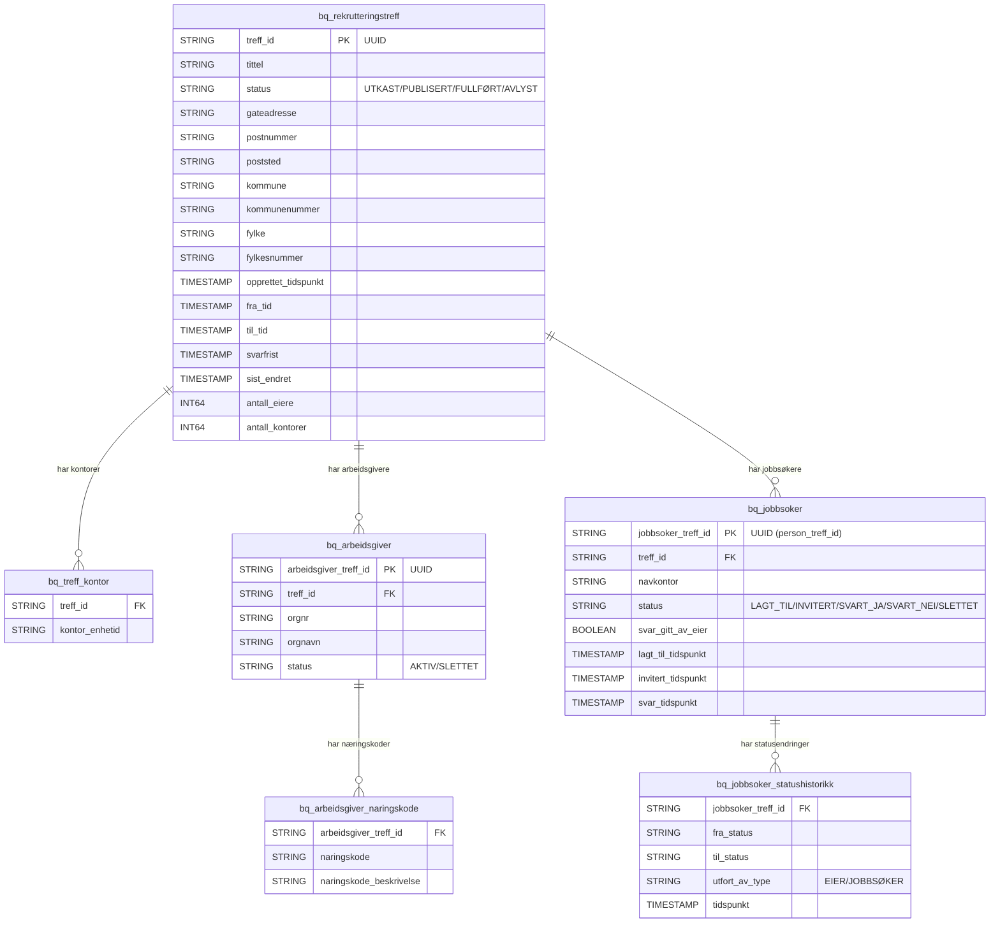

# BigQuery-tabeller for statistikk på rekrutteringstreff

Tabellene er designet for å føre statistikk uten persondata. Jobbsøkere identifiseres kun via `jobbsoker_treff_id` (person_treff_id), og fødselsnummer, navn og veileder-ident er utelatt.

## Tabelloversikt

| Tabell | Formål |
|---|---|
| `bq_rekrutteringstreff` | Hovedtabell med treffinfo, sted, status og tidspunkter |
| `bq_treff_kontor` | Hvilke Nav-kontorer som eier treffet |
| `bq_arbeidsgiver` | Deltagende arbeidsgivere (orgnr, orgnavn) |
| `bq_arbeidsgiver_naringskode` | Næringskoder per arbeidsgiver |
| `bq_jobbsoker` | Jobbsøkere uten persondata — kun person_treff_id, navkontor og status |
| `bq_jobbsoker_statushistorikk` | Statusendringer over tid for ombestemmelser og andeler |

## Diagram

## Dekker følgende målinger

- ✅ Sted, adresse, fylke, kommune
- ✅ Nav-kontor til eiere
- ✅ Fullført / avlyst
- ✅ Antall arbeidsgivere + næringskoder
- ✅ Antall foreslåtte, inviterte, svart ja/nei, ikke svart (via status)
- ✅ Ombestemmelser (via statushistorikk)
- ✅ Eier svart på vegne (via `svar_gitt_av_eier` og `utfort_av_type`)
- ✅ Jobbsøkere fra andre kontorer (navkontor vs treff-kontor)
- ✅ Ingen persondata (fødselsnummer, navn, veileder-ident er utelatt)
