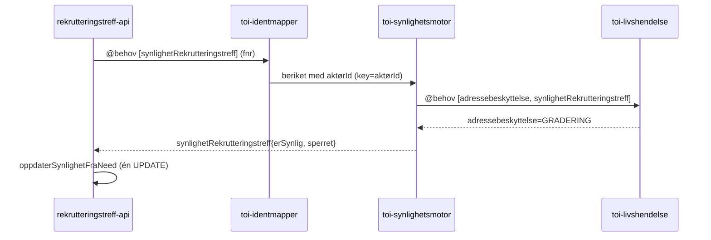
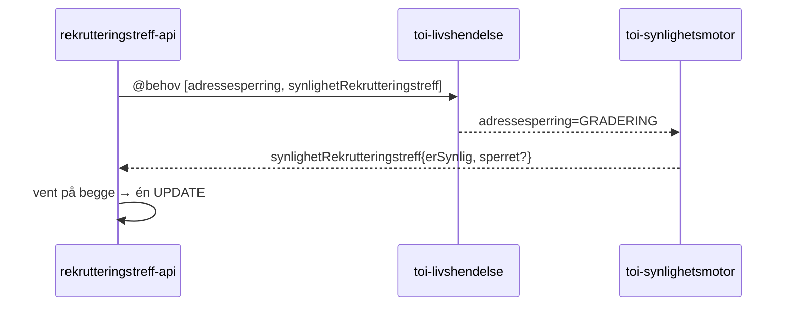

# Plan: Sperring av jobbsøkere med adressebeskyttelse

**Status:** Implementert og reviewet på branch `adressesperring-formidling` (rekrutteringstreff-api,
toi-synlighetsmotor, rekrutteringsbistand-frontend). Løsningen følger «ett need»-varianten
(Alternativ A nedenfor) — synlighetsmotor besvarer `synlighetRekrutteringstreff` med både `erSynlig`
og `sperret`. Need-veien keyer nå på `aktørId` (beriket av `toi-identmapper`). Gjenstående:
manuell backfill-SQL for eksisterende innleggelser (se nederst), kjøres etter prod-verifisering.
**Omfang:** Backend (rekrutteringstreff-api) + delt plattform (toi-synlighetsmotor) + frontend (rekrutteringsbistand-frontend)

Denne planen beskriver hvordan jobbsøkere med adressebeskyttelse skal **sperres** i
rekrutteringstreff: de skal ikke kunne legges til i en ny formidling, og dersom de allerede er
formidlet (lagt til _før_ sperringen inntraff) skal både navn og fødselsnummer anonymiseres i
formidlingslisten.

**Avklart med produkteier:** Vi velger den enkleste løsningen. Kode **6**, **7** og evt. **19**
behandles likt — all adressebeskyttelse som toi-synlighetsmotor allerede fanger tolkes som
«sperret». Vi trenger derfor ikke skille kode 6 fra kode 7 i den delte plattformkomponenten.

---

## Begrepsavklaring

| Begrep               | Betydning                                                                                                                                                                                                                                                       |
| -------------------- | --------------------------------------------------------------------------------------------------------------------------------------------------------------------------------------------------------------------------------------------------------------- |
| **Skjult / inaktiv** | `jobbsoker.er_synlig = false`. Personen er ute av kandidatsøket (manglende CV, ikke under oppfølging, adressebeskyttelse, død, KVP osv.). I formidlingslisten nulles **kun** fødselsnummer; navn vises fortsatt, og UI viser «Inaktiv kandidat».                |
| **Sperret**          | Strengere håndtering av adressebeskyttelse. Personen kan **ikke** legges til i ny formidling, og i formidlingslisten anonymiseres **både navn og fødselsnummer**. UI viser «Skjermet». En sperret person er alltid også skjult (`er_synlig = false`, se under). |

### Nøkkelinnsikt: sperret er en delmengde av skjult

En person med adressebeskyttelse er **allerede** `er_synlig = false` i toi-synlighetsmotor, fordi
`erSynlig()` krever `harIkkeAdressebeskyttelse == true`. Konsekvensen:

- Sperrede er **allerede skjult** fra jobbsøkerlisten i treffene (`hentJobbsøkere(...)` filtrerer
  `er_synlig = TRUE`). Ingen ny logikk trengs for å skjule dem der.
- Sperrede **telles allerede** som skjulte i `antallSkjulte`
  (`status != SLETTET AND er_synlig = FALSE`). **Tellingen er felles** — vi innfører ikke en egen
  `antallSperret`-kategori. I jobbsøkerkonteksten er det ikke viktig å skille sperret fra skjult.

Det nye `sperret`-feltet trengs derfor **kun i formidlingskonteksten**, der det har betydning:
anonymisere navn og blokkere ny formidling.

---

## Datakilde og dataflyt

### Dagens synlighetsflyt i rekrutteringstreff-api

Synlighet settes i dag via to Kafka-veier, begge i pakken
`no.nav.toi.jobbsoker.synlighet`:

1. **Event-strøm** — `SynlighetsLytter.kt` lytter på `synlighet.erSynlig` (boolean) +
   `synlighet.ferdigBeregnet=true`. Kaller `JobbsøkerService.oppdaterSynlighetFraEvent(...)`.
2. **Need/behov** — `SynlighetsBehovScheduler.kt` sender `@behov: ["synlighetRekrutteringstreff"]`
   for jobbsøkere uten evaluert synlighet (`synlighet_sist_oppdatert IS NULL`).
   `SynlighetsBehovLytter.kt` mottar svaret `synlighetRekrutteringstreff.erSynlig` /
   `.ferdigBeregnet`. Kaller `JobbsøkerService.oppdaterSynlighetFraNeed(...)`.

`JobbsøkerRepository` har to UPDATE-metoder:

- `oppdaterSynlighetFraEvent(...)` — setter `er_synlig`, `synlighet_sist_oppdatert`,
  `synlighet_kilde = 'EVENT'`. Skriver hvis `synlighet_sist_oppdatert IS NULL` **eller**
  `synlighet_kilde = 'NEED'` **eller** eldre tidsstempel (event vinner alltid).
- `oppdaterSynlighetFraNeed(...)` — setter `synlighet_kilde = 'NEED'`. Skriver **kun** hvis
  `synlighet_sist_oppdatert IS NULL` (event har prioritet).

I dag bæres kun ett boolsk `erSynlig` over Kafka. For å vite at noen er **sperret** må vi føre ett
ekstra flagg helt frem — på samme to veier som `er_synlig`.

### Avledet sperret-flagg i toi-synlighetsmotor

Synlighetsmotor vet allerede at noen har adressebeskyttelse, gjennom `erIkkeKode6eller7` (fra
Arena-diskresjonskode i `Kandidat.kt`) og `harIkkeAdressebeskyttelse` (fra PDL-gradering). Begge er
`BooleanVerdi` (`True`/`False`/`Missing`). Fordi vi behandler kode 6, 7 og 19 likt, avleder vi ett
flagg uten å måtte skille kodene:

```kotlin
fun sperret(): Boolean {
    val harKode6eller7 = !erIkkeKode6eller7
    val harAdressebeskyttelse = !harIkkeAdressebeskyttelse
    return harKode6eller7.default(false) || harAdressebeskyttelse.default(false)
}
```

**Default er «ikke sperret».** Vi negerer _først_ (`Missing.not() == Missing`) og kaller `.default(false)`
_etter_ negeringen. Ukjent informasjon gir derfor `false` (ikke sperret) — en bevisst fail-safe mot
over-anonymisering. Merk at rekkefølgen er vesentlig: hadde vi skrevet `!erIkkeKode6eller7.default(true)`
(default _før_ negering) ville `Missing` blitt tolket motsatt. Derfor er negeringen lagt i egne
variabler (`harKode6eller7` / `harAdressebeskyttelse`) før `.default(false)`.

Den rå diskresjonskoden (6 vs 7) kastes etter lagring i synlighetsmotor-db, men det spiller ingen
rolle her — vi trenger den ikke. Ingen ny kolonne eller migrasjon i synlighetsmotor-db kreves; kun
å sende det avledede flagget videre i event og need-svar.

### Relevante filer

**toi-synlighetsmotor** (`toi-rapids-and-rivers/apps/toi-synlighetsmotor/...`):

- `kotlin/.../Kandidat.kt` — `erIkkeKode6EllerKode7(...)`, `harIkkeAdressebeskyttelse(...)`
- `kotlin/.../Evaluering.kt` — `Evaluering`, `Synlighet`, `somSynlighet()`
- `kotlin/.../Repository.kt` — `databaseMap`, `evalueringFraDB`, kolonnenavn
- `kotlin/.../rekrutteringstreff/SynlighetRekrutteringstreffLytter.kt` — need-svar (har gradering)
- `kotlin/.../SynlighetsgrunnlagLytter.kt` — event-publisering (`packet["synlighet"] = ...somSynlighet()`)

**rekrutteringstreff-api** (`apps/rekrutteringstreff-api/...`):

- `kotlin/.../jobbsoker/synlighet/SynlighetsLytter.kt` — event-lytter
- `kotlin/.../jobbsoker/synlighet/SynlighetsBehovLytter.kt` — need-lytter
- `kotlin/.../jobbsoker/synlighet/SynlighetsBehovScheduler.kt` — sender need
- `kotlin/.../jobbsoker/JobbsøkerService.kt` — `oppdaterSynlighetFraEvent/FraNeed`
- `kotlin/.../jobbsoker/JobbsøkerRepository.kt` — UPDATE-metodene + `er_synlig`-filtre
- `kotlin/.../formidling/FormidlingRepository.kt` — `hentMedWhere(...)`, liste-query med
  `CASE WHEN j.er_synlig THEN j.fodselsnummer ELSE NULL END`
- `kotlin/.../formidling/dto/FormidlingDto.kt` — liste-DTO `FormidlingDto` (`fødselsnummer`,
  `fornavn`, `etternavn` nullable)
- `kotlin/.../formidling/FormidlingService.kt` — `opprettFormidling(...)` (blokkeringspunkt)
- Telling for jobbsøkere: `JobbsøkerSokRepository.hentTellinger()` (`antallSkjulte`/`antallSlettede`) /
  `jobbsoker_sok_view` (filtrerer `er_synlig`/`status`) — sperrede dekkes allerede av `antallSkjulte`

**frontend** (`rekrutteringsbistand-frontend/...`):

- `app/api/rekrutteringstreff/[...slug]/formidling/useFormidlinger.ts` — `FormidlingSchema`, mocks
- `app/rekrutteringstreff/[rekrutteringstreffId]/_ui/formidling/FormidlingRad.tsx` — visning av navn/fnr
- Opprett-modal (velg jobbsøker-steg) under `_ui/header/actions/`

---

## Endringer

### toi-synlighetsmotor (delt plattform)

1. `Evaluering.kt`: legg til `fun sperret(): Boolean` som negerer `erIkkeKode6eller7` /
   `harIkkeAdressebeskyttelse` og kaller `.default(false)` _etter_ negeringen (default «ikke sperret»),
   og ta feltet med i `Synlighet` (event) og i need-svaret.
2. `SynlighetsgrunnlagLytter.kt`: `packet["synlighet"]` (fra `somSynlighet()`) får feltet `sperret`.
3. `SynlighetRekrutteringstreffLytter.kt`: krever `aktørId` (`precondition`), slår opp evalueringen med
   `hentMedAktørid(...)`, keyer/publiserer på aktørId, og `packet[synlighetRekrutteringstreffBehov]`
   får `sperret` ved siden av `erSynlig` / `ferdigBeregnet`. `toi-identmapper` (`AktørIdPopulator`)
   beriker innkommende `fodselsnummer`-meldinger med `aktørId` før de når denne lytteren.

### rekrutteringstreff-api

4. **V11-migrasjon** (`V11__rekrutteringstreff_kategori_jobbsoker_sperring.sql`):
   `ALTER TABLE jobbsoker ADD COLUMN sperret boolean NOT NULL DEFAULT false;` (kun kolonnen — ingen
   backfill; den kjøres manuelt senere, se nederst).
5. `SynlighetsLytter` / `SynlighetsBehovLytter`: les `sperret` fra pakken og send videre til service.
6. `JobbsøkerService` + `JobbsøkerRepository`: utvid `oppdaterSynlighetFraEvent/FraNeed` med
   `sperret`-parameter; UPDATE setter `sperret = ?` ved siden av `er_synlig`. Samme
   prioritetsregler som `er_synlig` (event vinner over need).
7. `FormidlingRepository.hentMedWhere(...)`: null ut navn **og** fnr ved sperret:

   ```sql
   CASE WHEN j.sperret THEN NULL WHEN j.er_synlig THEN j.fodselsnummer ELSE NULL END AS fodselsnummer,
   CASE WHEN j.sperret THEN NULL ELSE j.fornavn END AS fornavn,
   CASE WHEN j.sperret THEN NULL ELSE j.etternavn END AS etternavn,
   j.sperret AS sperret
   ```

8. `FormidlingDto`: legg til `val sperret: Boolean`.
9. `FormidlingService.opprettFormidling(...)`: i `validerOgHentArbeidsgivereOgJobbsøkere(...)`,
   før `lagreFormidlinger()`, valider at ingen valgte personer er `sperret`; returner `403` med JSON
   `feil` + `hint`.

**Ikke nødvendig (allerede dekket av `er_synlig`):**

- Skjuling fra jobbsøkerlisten — `hentJobbsøkere(...)` filtrerer allerede `er_synlig = TRUE`.
- Telling — sperrede telles allerede i `antallSkjulte`
  (`JobbsøkerSokRepository.hentTellinger()`). Ingen endring i `hentTellinger`,
  `JobbsøkerSøkRespons`, `JobbsøkereOutboundDto` eller `jobbsoker_sok_view`.

### frontend (rekrutteringsbistand-frontend)

10. `FormidlingSchema` (`useFormidlinger.ts`): legg til `sperret: z.boolean()`.
11. `FormidlingRad.tsx`: når `sperret` → vis «Skjermet» (verken navn eller fnr); ellers dagens logikk
    («Inaktiv kandidat» når fnr er nullet pga. `er_synlig = false`).
12. Opprett-modal (velg jobbsøker-steg): sperrede er allerede utenfor jobbsøkerlisten
    (`er_synlig = false`), så de dukker ikke opp som valgbare. Backend-blokkeringen (punkt 9) er
    sikkerhetsnettet.

---

## Akseptansekriterier

1. En sperret jobbsøker kan **ikke** legges til i en ny formidling (opprett-endepunkt returnerer feil;
   opprett-modal viser dem ikke som valgbare).
2. En formidling lagt til **før** sperring vises fortsatt i formidlingslisten, men med **både navn og
   fødselsnummer anonymisert** og merket «Skjermet».
3. Skjult/inaktiv kandidat (manglende CV osv. uten adressebeskyttelse) oppfører seg som i dag: navn
   vises, fnr nulles, merket «Inaktiv kandidat».
4. Sperrede telles som skjulte i `antallSkjulte` (felles telling — ingen egen kategori) og er skjult
   fra jobbsøkerlisten i treffene.

## Tester

**rekrutteringstreff-api (implementert):**

- ✅ `FormidlingRepositoryTest`: liste nuller **både** navn og fnr når `sperret = true` (skill fra
  `er_synlig = false`-testen som kun nuller fnr).
- ✅ `FormidlingerKomponentTest` (HTTP): sperret formidling returnerer anonymisert navn+fnr +
  `sperret = true`. Inkluderer egen test for kombinert `er_synlig = false` + `sperret = true`.
- ✅ `FormidlingServiceTest`: `opprettFormidling` blokkerer sperret person (kaster
  `JobbsøkerSperretException`, verifiserer 0 kall til stillingKlient + tom formidlingsliste).
- ✅ Synlighet-lytter-tester: `sperret` fra event (`SynlighetsLytterTest`) og need
  (`SynlighetsBehovLytterTest`) oppdaterer `jobbsoker.sperret`.
- ✅ `TestDatabase`: helper `settSperret(personTreffId, sperret)` analogt med `settSynlighet(...)`.

**rekrutteringstreff-api (anbefalt tillegg):**

- ✅ `FormidlingerKomponentTest` (HTTP): `opprett formidling for sperret jobbsøker gir 403 med hint`
  POST-er mot opprett-formidling-endepunktet og asserter `403`, `hint`, `feil` og at ingen formidling
  ble lagret. Dekker `ExceptionMapping`-grenen for `JobbsøkerSperretException`.

**toi-synlighetsmotor (implementert):**

- ✅ `SynlighetRekrutteringstreffLytterTest`: `sperret` settes for Arena kode 6/7, FORTROLIG,
  STRENGT_FORTROLIG_UTLAND (kode 19) og for usynlig person med adressebeskyttelse, og sendes i
  need-svaret. Egen test for at behov uten `aktørId` ignoreres (identmapper beriker først).

**frontend (Playwright `tests/rekrutteringstreff/formidlinger.spec.ts`, implementert):**

- ✅ Rad med `sperret` viser «Skjermet» + «Adressebeskyttet» (verken navn eller fnr), og verifiserer
  at «Inaktiv kandidat» ikke vises.

---

## Arkitekturvalg: ett need vs. need med to behov

Spørsmålet er hvordan `sperret` skal hentes inn via need-veien. To varianter er vurdert.

### Alternativ A — ett behov, synlighetsmotor avleder sperret (implementert i dag)

rekrutteringstreff-api sender ett behov med `fodselsnummer`:

```jsonc
{
  "@event_name": "behov",
  "@behov": ["synlighetRekrutteringstreff"],
  "fodselsnummer": "...",
}
```

**Berikelse med aktørId.** `toi-identmapper` (`AktørIdPopulator`) lytter på meldinger som har
`fodselsnummer` (eller `fnr`/`fodselsnr`) men mangler `aktørId`, slår opp aktørId i PDL og republiserer
meldingen beriket med `aktørId` (og keyer da på aktørId). `SynlighetRekrutteringstreffLytter` krever
`aktørId` (`precondition { requireKey("aktørId") }`), slår opp evalueringen med `hentMedAktørid(...)`,
og både publiserer og keyer på aktørId. rekrutteringstreff-api selv trenger altså ikke kjenne aktørId
— identmapper står for hand-offen. Meldinger uten aktørId ignoreres i stillhet (identmapper beriker
først).

`SynlighetRekrutteringstreffLytter` (toi-synlighetsmotor) håndterer resten internt:

1. Slår opp lagret evaluering på aktørId (har Arena kode 6/7 via `erIkkeKode6eller7`).
2. Legger selv til `adressebeskyttelse`-behov foran i køen (`leggTilBehov`) og publiserer.
   toi-livshendelse (`AdressebeskyttelseLytter`) besvarer det med PDL-gradering.
3. Når svaret kommer tilbake, avleder den `sperret` via `Evaluering.sperret()` (negering +
   `.default(false)`, se over) og besvarer `synlighetRekrutteringstreff` med **både** `erSynlig` og
   `sperret`.

rekrutteringstreff-api (`SynlighetsBehovLytter`) leser `synlighetRekrutteringstreff.erSynlig` +
`.sperret` og skriver begge i én UPDATE (`oppdaterSynlighetFraNeed`).



**Egenskaper:**

- `sperret` slår sammen **begge** kilder: Arena kode 6/7 (kun i synlighetsmotor-db) **og**
  PDL-gradering. rekrutteringstreff-api trenger ikke kjenne til noen av delene.
- Kun **én** kontraktspart for rekrutteringstreff-api (synlighetsmotor). toi-livshendelse er en
  intern detalj synlighetsmotor allerede er koblet mot.
- `erSynlig` og `sperret` kommer **alltid sammen i samme svar** → én skriving, ett tidsstempel,
  én kilde. Ingen delvis tilstand i basen.

### Alternativ B — ett need med to behov fra rekrutteringstreff-api

rekrutteringstreff-api sender ett need med to behov:

```jsonc
{
  "@event_name": "behov",
  "@behov": ["adressesperring", "synlighetRekrutteringstreff"],
  "fodselsnummer": "...",
}
```

`adressesperring` besvares av toi-livshendelse, `synlighetRekrutteringstreff` av synlighetsmotor
(som da slipper å hente adressebeskyttelse selv). rekrutteringstreff-api venter til **begge** behov
er løst før den skriver til basen.

**Svar på de konkrete spørsmålene:**

1. **Går det an å dele i to behov?** Teknisk ja — Rapids & Rivers støtter flere behov i ett need,
   og `demandAtFørstkommendeUløsteBehovEr` sørger for at riktig app svarer i riktig rekkefølge
   (adressesperring først, så synlighet). Men se «Problemer» under.
2. **Slipper synlighet å sjekke adressesperring på nytt?** Ja, hvis svaret allerede ligger i pakken
   kan synlighetsmotor lese feltet i stedet for å trigge eget behov. Den gjør i praksis allerede
   dette (`interestedIn(adressebeskyttelseFelt)`): er feltet til stede, brukes det. Alternativ B
   flytter bare hvem som **lister** behovet (rekrutteringstreff-api i stedet for synlighetsmotor).
3. **Klarer vi oss med én kilde + ett tidspunkt også for sperret?** Ja. Begge behov ligger i samme
   need, og en samlende lytter som krever **begge** nøklene fyrer kun én gang → én UPDATE, ett
   `synlighet_sist_oppdatert`, én `synlighet_kilde`. Ingen ekstra kolonner for sperret (samme som i
   dag, jf. V11). Forutsetningen er at man venter på begge før skriving.
4. **Beholder vi kontinuerlig sperret-lytting (event-strømmen)?** Ja. Event-veien
   (`SynlighetsgrunnlagLytter` → `synlighet`-event med `sperret` via `somSynlighet()` →
   `SynlighetsLytter`) er **uavhengig** av need-veien og berøres ikke av valget. Alle som er lagt
   til oppdateres fortsatt løpende.
5. **Problemer med en ekstra «klient» på adressesperring-behovet?** Se under.



### Problemer og fallgruver ved Alternativ B

1. **Arena kode 6/7 forsvinner som kilde.** I dag avledes `sperret` fra **både** Arena kode 6/7
   (`erIkkeKode6eller7`) og PDL-gradering (`harIkkeAdressebeskyttelse`). `erIkkeKode6eller7` ligger
   **kun** i synlighetsmotor-db. toi-livshendelse svarer **bare** med PDL-gradering. Hvis
   rekrutteringstreff-api avleder `sperret` direkte fra adressesperring-svaret, mister vi
   Arena-kilden. I praksis er PDL og Arena oftest samstemte, men de er separate kilder og designet
   OR-er dem bevisst. For å beholde begge må synlighetsmotor uansett bidra med `sperret` — da er vi
   i realiteten tilbake til Alternativ A, bare med ekstra koordinering.
2. **`adressebeskyttelse`-behovet krever `aktørId`, ikke `fodselsnummer`.**
   `AdressebeskyttelseLytter` (toi-livshendelse) har `validate { requireKey("aktørId") }`. Need-flyten
   fra rekrutteringstreff-api bærer `fodselsnummer`. **Løst i implementasjonen:** `toi-identmapper`
   (`AktørIdPopulator`) beriker meldingen med `aktørId` før synlighetsmotor behandler den, og
   `SynlighetRekrutteringstreffLytter` krever nå `aktørId` (`requireKey`) og keyer/slår opp på den
   (`hentMedAktørid`). rekrutteringstreff-api trenger dermed ikke skaffe aktørId selv. Konsekvens:
   hand-offen er avhengig av at identmapper kjører — både need-veien og det interne
   `adressebeskyttelse`-behovet hviler på aktørId. Verifiser ende-til-ende i dev (enhetstestene
   injiserer aktørId/adressebeskyttelse manuelt og dekker ikke selve identmapper-grenseflaten).
3. **To skrivere kan kappes om samme rad.** Den eksisterende `SynlighetsBehovLytter` krever kun
   nøkkelen `synlighetRekrutteringstreff`. Innfører man en ny samlende lytter (krever begge behov),
   må den gamle konsolideres bort — ellers fyrer begge og man får dobbeltskriving / delvis tilstand.
4. **Flere apper kobles på rekrutteringstreff sin need-kontrakt.** toi-livshendelse blir nå en
   eksplisitt deltaker i rekrutteringstreff-flyten. Mer kobling og flere ledd som kan feile/treghete
   før synlighet besvares (men selvhelende via scheduler, se under).

### Anbefaling

**Behold Alternativ A.** Det er allerede implementert, holder rekrutteringstreff-api koblet mot kun
**én** part, bevarer både Arena- og PDL-kilden for `sperret`, og leverer `erSynlig` + `sperret`
atomisk i ett svar (som er nøyaktig det spørsmål 3 ber om). Alternativ B gir ingen funksjonell
gevinst, men introduserer ny kobling, et aktørId-problem og en konsolideringsjobb på lytter-siden.

Det eneste reelle poenget fra Alternativ B — at synlighet «slipper å sjekke adressesperring på
nytt» — er allerede løst: PDL-oppslaget gjøres uansett kun **én gang per need**, og populasjonen
(treff-jobbsøkere) er liten. Det er ingen dobbeltsjekk å fjerne.

### Race conditions og kanttilfeller (gjelder begge alternativ)

- **Event vs. need.** Begge veier kan skrive samme rad. Håndtert av `synlighet_kilde`-prioritet:
  EVENT vinner alltid (skriver hvis `synlighet_sist_oppdatert IS NULL`, kilde er `NEED`, eller
  eldre tidsstempel); NEED skriver **kun** hvis `synlighet_sist_oppdatert IS NULL`. Dette gjelder
  `er_synlig` og `sperret` samlet, siden de skrives i samme UPDATE.
- **Fail-safe-vindu for sperret.** I `SynlighetsBehovLytter` defaulter `sperret` til `false` ved
  ufullstendig svar, og `Evaluering.sperret()` negerer `erIkkeKode6eller7` / `harIkkeAdressebeskyttelse`
  og kaller `.default(false)` på de negerte verdiene (`Missing.not() == Missing`, og
  `Missing.default(false) == false`) — altså antas «ikke sperret» ved ukjent. En adressebeskyttet
  person som ennå ikke er ferdig evaluert kan derfor kortvarig stå `er_synlig = false` (skjult, fnr
  nullet) men `sperret = false` (navn vist) i formidlingslisten. Vinduet er kort (event-strømmen +
  scheduler retter opp), men det er en bevisst avveining mot over-anonymisering. Verdt å være klar
  over for allerede formidlede personer.
- **Selvhelende need.** Hvis toi-livshendelse eller synlighetsmotor er nede, fullføres ikke
  need-et; raden beholder `synlighet_sist_oppdatert IS NULL`, og `SynlighetsBehovScheduler` trigger
  på nytt hvert 60. sekund. Ingen tapt tilstand.
- **Behov-rekkefølge (kun relevant for Alternativ B).** `adressesperring` må stå/legges først, slik
  at livshendelse svarer før synlighetsmotor. `demandAtFørstkommendeUløsteBehovEr` håndhever dette,
  men feil rekkefølge gir at synlighet svarer uten PDL-data.

### Korrektheten ellers — verifisert mot koden

Følgende er sjekket og stemmer med implementasjonen på branchen:

- **V11** (`V11__rekrutteringstreff_kategori_jobbsoker_sperring.sql`) legger til
  `sperret boolean NOT NULL DEFAULT FALSE`. **Den backfiller ikke** — migrasjonen legger kun til
  kolonnen. Backfill av eksisterende rader gjøres med den manuelle SQL-en under
  («Oppdatere gamle jobbsøkerkandidater»), som kjøres først etter at alt er ute i prod og verifisert.
  Korrekt — sperret kan kun bli true der `er_synlig` allerede er false.
- **Felles tidsstempel/kilde** for `er_synlig` og `sperret` (ingen egne `sperret\_\*``-kolonner) —
  bekreftet i begge UPDATE-metodene.
- **FormidlingRepository** nuller både navn og fnr ved `sperret` (`CASE WHEN j.sperret THEN NULL …`).
- **FormidlingService** blokkerer formidling av sperrede via `JobbsøkerSperretException`.
- **Event-veien** bærer `sperret` (`somSynlighet()` → `Synlighet.sperret`; `SynlighetsLytter` leser
  `synlighet.sperret`).
- **Skjuling/telling** trenger ingen endring: sperrede er allerede `er_synlig = false` og dekkes av
  `antallSkjulte` og `er_synlig`-filtrene.

### Oppdatere gamle jobbsøkerkandidater med sperring

Når alt er testet og ute, bør vi backfille. Foreslått SQL:

```sql
-- Backfill av sperret for eksisterende jobbsøkere.
-- sperret kan kun være true for rader som allerede er er_synlig = false
-- (adressebeskyttelse og kode 6/7 tvinger erSynlig() = false i synlighetsmotor),
-- så vi re-evaluerer kun disse radene.
--
-- Ved å nulle synlighet_sist_oppdatert plukker SynlighetsBehovScheduler radene opp
-- og trigger need-meldinger på nytt. Need-svaret skriver da er_synlig + sperret.
UPDATE jobbsoker
SET synlighet_sist_oppdatert = NULL,
    synlighet_kilde = NULL
WHERE er_synlig = false
  AND status != 'SLETTET'
  AND synlighet_sist_oppdatert IS NOT NULL;
```

Vi bør få ut alt i prod først, sjekke at alt er riktig, og sså kjøre denne i konsoll(om vi har tilgang) eller i flyway(om den trengs for tilgang)
