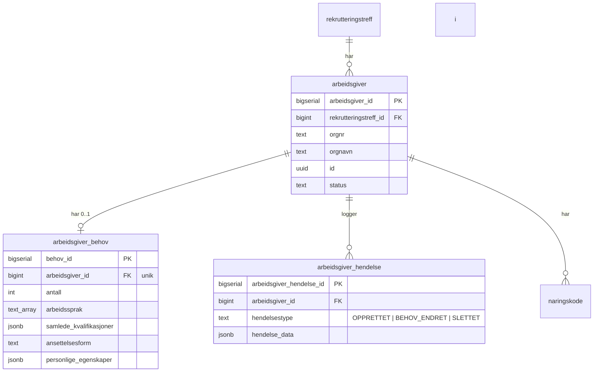
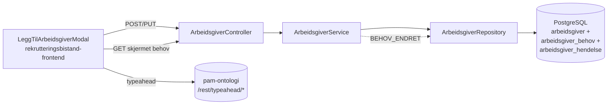
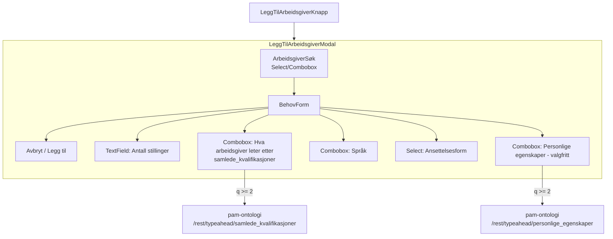

# Plan for Arbeidsgivers behov

Når en markedskontakt legger til en arbeidsgiver i et rekrutteringstreff, skal de også registrere arbeidsgiverens behov. Behovene er kun synlige for eiere av treffet og brukere med utviklerrollen.

## Design

Figma: [Legg til arbeidsgivere — node 13664-174484](https://www.figma.com/design/g0uypsepFJoFx3RRgtaw55/Team-ToI---Rekrutteringsbistand-og-Rekrutteringstreff?node-id=13664-174484&m=dev)

Designet hentes via Figma MCP-server (`mcp_com_figma_fig_get_design_context` / `mcp_com_figma_fig_get_metadata`) for å holde feltnavn, komponentvalg og rekkefølge synkronisert med implementasjonen.

### Feltkartlegging mot design

| Designetikett                     | DTO-felt                 | Aksel-komponent                       | Datakilde                                                          |
| --------------------------------- | ------------------------ | ------------------------------------- | ------------------------------------------------------------------ |
| Antall stillinger                 | `antall`                 | `TextField` (number) / `Select`       | —                                                                  |
| Hva arbeidsgiver leter etter      | `samledeKvalifikasjoner` | `Combobox` (multi) + `RemovableChips` | `GET /rest/typeahead/samlede_kvalifikasjoner?q=...` (pam-ontologi) |
| Språk                             | `arbeidssprak`           | `Combobox` (multi) + `RemovableChips` | Statisk språkliste (samme som `workLanguage`)                      |
| Ansettelsesform                   | `ansettelsesform`        | `Select`                              | Stillingens `engagementtype`-verdier                               |
| Personlige egenskaper (Valgfritt) | `personligeEgenskaper`   | `Combobox` (multi) + `RemovableChips` | `GET /rest/typeahead/personlige_egenskaper?q=...` (pam-ontologi)   |

`Hva arbeidsgiver leter etter` er ett kombinert felt på tvers av yrkestittel, kompetanse, autorisasjon, fagdokumentasjon og førerkort, drevet av `samlede_kvalifikasjoner` i pam-ontologi. Se [kombinert-typeahead-i-pam-ontologi.md](./kombinert-typeahead-i-pam-ontologi.md) for detaljer.

## Datamodell og felter

| Felt                     | Type                  | Obligatorisk | Beskrivelse                                                                                                                                                                           |
| ------------------------ | --------------------- | ------------ | ------------------------------------------------------------------------------------------------------------------------------------------------------------------------------------- |
| `samledeKvalifikasjoner` | Tagliste (typeahead)  | Ja           | Kombinert felt for yrkestittel, kompetanse, autorisasjon, fagdokumentasjon og førerkort. Elementene kommer fra `GET /rest/typeahead/samlede_kvalifikasjoner?q=...` og har `kategori`. |
| `arbeidssprak`           | Tagliste              | Ja           | Språkkrav. Samme verdier som `workLanguage` på stilling.                                                                                                                              |
| `antall`                 | Positivt heltall      | Ja           | Antall stillinger arbeidsgiver ønsker å fylle.                                                                                                                                        |
| `ansettelsesform`        | Enkeltvalg (nedtrekk) | Ja           | Samme verdirom som stillingens `engagementtype`.                                                                                                                                      |
| `personligeEgenskaper`   | Tagliste (typeahead)  | Nei          | Softskills fra `GET /rest/typeahead/personlige_egenskaper?q=...`.                                                                                                                     |

Alle taglister er låst til forhåndsdefinerte valg. Ingen av feltene tillater fritekst.

### Lagringsformat

- `samledeKvalifikasjoner` og `personligeEgenskaper` lagres som JSONB-arrays av `{label, kategori, konseptId?}` for å bevare kategori og unngå kollisjoner på like labels.
- `arbeidssprak` beholdes som `text[]` fordi verdirommet er lite og kontrollert.

## Kjernebeslutninger

| Tema             | Beslutning                                                                                                                                             | Implementasjonskonsekvens                                                                                                                     |
| ---------------- | ------------------------------------------------------------------------------------------------------------------------------------------------------ | --------------------------------------------------------------------------------------------------------------------------------------------- |
| Tilgang          | Kun eier og utvikler kan lese og oppdatere behov.                                                                                                      | Skjermet `GET .../arbeidsgiver/behov` og `PUT .../behov` er kun for eier og utvikler; andre roller får `403` og ser ikke behovsknapp.         |
| Ny opprettelse   | Arbeidsgiver legges til én og én via `LeggTilArbeidsgiverModal`, og arbeidsgiver + behov lagres atomisk.                                               | `POST .../arbeidsgiver` må ta arbeidsgiver og `behov` i samme request og avvise delvis lagring.                                               |
| Validering       | `samledeKvalifikasjoner`, `arbeidssprak`, `antall` og `ansettelsesform` er obligatoriske. `personligeEgenskaper` er valgfritt.                         | Samme regel håndheves i frontend og `ArbeidsgiverService`. Listefelter må ha minst ett element, `antall > 0`, `ansettelsesform` må være satt. |
| Oppdatering      | Behov lagres som full tilstand, ikke som patch. Å åpne redigering oppretter ikke behov; avbryt gjør ingen endring.                                     | `PUT .../behov` er en upsert med komplett payload.                                                                                            |
| Overgangsperiode | Eksisterende arbeidsgivere kan mangle behov i fase 1.                                                                                                  | Relasjonen beholdes som `0..1`, `GET .../arbeidsgiver/behov` kan returnere `behov: null`, og `PUT .../behov` må kunne opprette første behov.  |
| Reaktivering     | Ny innlegging av samme orgnr på samme treff reaktiverer en soft-slettet arbeidsgiver og beholder eksisterende behov.                                   | Samme `arbeidsgiver_id` gjenbrukes; behov nullstilles ikke.                                                                                   |
| Soft delete      | Behov beholdes ved soft delete, men skal ikke vises mens arbeidsgiver er slettet.                                                                      | Skjermede behovsvisninger filtrerer bort soft-slettede arbeidsgivere; ved reaktivering vises eksisterende behov igjen.                        |
| Arbeidsgiverdata | Orgnavn og orgnummer kan ikke endres etter opprettelse. Ved feil må arbeidsgiver slettes og legges inn på nytt. Næringskoder følger eksisterende flyt. | Redigeringsmodus låser arbeidsgiverfeltet; ingen egen endring av næringskoder i denne planen.                                                 |
| Publisering      | Treff kan bare publiseres når minst én aktiv arbeidsgiver har behov.                                                                                   | `useSjekklisteStatus` må baseres på arbeidsgivere med behov, ikke bare på antall arbeidsgivere.                                               |

## Hendelser

Eksisterende hendelsestyper `OPPRETTET` og `SLETTET` beholdes. Når behov opprettes eller oppdateres, opprettes `BEHOV_ENDRET`.

| Hendelsestype  | Trigger                      | `hendelse_data`               |
| -------------- | ---------------------------- | ----------------------------- |
| `OPPRETTET`    | Arbeidsgiver legges til      | `null`                        |
| `BEHOV_ENDRET` | Behov opprettes eller endres | JSON-snapshot av lagret behov |
| `SLETTET`      | Arbeidsgiver slettes         | `null`                        |

## Database



### Flyway-migrasjon (V4)

```sql
CREATE TABLE arbeidsgiver_behov (
    behov_id                 bigserial PRIMARY KEY,
    arbeidsgiver_id          bigint NOT NULL REFERENCES arbeidsgiver(arbeidsgiver_id),
    arbeidssprak             text[] NOT NULL DEFAULT '{}',
    antall                   int    NOT NULL,
    samlede_kvalifikasjoner  jsonb  NOT NULL DEFAULT '[]'::jsonb,
    ansettelsesform          text   NOT NULL,
    personlige_egenskaper    jsonb  NOT NULL DEFAULT '[]'::jsonb
);

CREATE UNIQUE INDEX idx_arbeidsgiver_behov_arbeidsgiver ON arbeidsgiver_behov(arbeidsgiver_id);
```

Behov ligger i egen tabell, men håndteres fortsatt som del av arbeidsgiverressursen i API-et. Splittingen gjør det mulig å skjerme behov fra roller uten tilgang og å videreutvikle arbeidsgiverkoblinger uten å trekke med behovsdomenet.

I første fase beholdes relasjonen som `0..1`. Applikasjonen håndhever derfor kravet om behov for nye eller redigerte arbeidsgivere, mens databasen fortsatt tolererer eldre rader uten behov.

## Backend-arkitektur



## API og backendplassering

```kotlin
data class BehovTagDto(
  val label: String,
  val kategori: String,
  val konseptId: Long? = null
)

data class ArbeidsgiverBehovDto(
  val samledeKvalifikasjoner: List<BehovTagDto>,
  val arbeidssprak: List<String>,
  val antall: Int,
  val ansettelsesform: String,
  val personligeEgenskaper: List<BehovTagDto> = emptyList()
)
```

| Endepunkt / ansvar                                                     | Beskrivelse                                                                                                                                            |
| ---------------------------------------------------------------------- | ------------------------------------------------------------------------------------------------------------------------------------------------------ |
| `POST /api/rekrutteringstreff/{id}/arbeidsgiver`                       | Oppretter arbeidsgiver + behov atomisk. Reaktiverer eksisterende soft-slettet arbeidsgiver ved samme orgnr på samme treff.                             |
| `GET /api/rekrutteringstreff/{id}/arbeidsgiver`                        | Forblir som i dag, uten behov i responsen.                                                                                                             |
| `GET /api/rekrutteringstreff/{id}/arbeidsgiver/behov`                  | Skjermet lesing for eier og utvikler. Returnerer `behov: null` for eldre arbeidsgivere uten registrert behov.                                          |
| `PUT /api/rekrutteringstreff/{id}/arbeidsgiver/{arbeidsgiverId}/behov` | Skjermet upsert for eier og utvikler av behov for eksisterende arbeidsgiver. Brukes både for første lagring i overgangsperioden og ordinær redigering. |

- Gjenbruk `ArbeidsgiverController`, `ArbeidsgiverService` og `ArbeidsgiverRepository`.
- `ArbeidsgiverService` eier validering, tilgangsregler, reaktivering og opprettelse av `BEHOV_ENDRET`.
- `ArbeidsgiverRepository` eier SQL, JSONB-mapping og upsert av `arbeidsgiver_behov`.

## Frontend



| Område      | Leveranse                                                                                                                                                      |
| ----------- | -------------------------------------------------------------------------------------------------------------------------------------------------------------- |
| Modal       | `LeggTilArbeidsgiverModal` brukes både ved opprettelse og redigering. Ved redigering er arbeidsgiverfeltet låst, og kun behovsfeltene er redigerbare.          |
| Felter      | Feltrekkefølge og komponentvalg følger tabellen over. Valgte tagger vises som `RemovableChips`.                                                                |
| Validering  | Samme regler som i kjernebeslutningene. Inline-feil vises per felt, og lagreknappen er deaktivert til skjemaet er gyldig.                                      |
| Typeahead   | `samledeKvalifikasjoner` og `personligeEgenskaper` bruker pam-ontologi med min. 2 tegn og uten fritekst. `samledeKvalifikasjoner` viser kategori i forslagene. |
| Synlighet   | Ikke-eier ser arbeidsgiver uten behovsknapp eller behovsvisning. Utvikler ser behov på samme måte som eier.                                                    |
| Publisering | `useSjekklisteStatus` må bruke skjermet behovsendepunkt og kreve minst én arbeidsgiver med behov.                                                              |

## UX-avklaringer

- `Hva arbeidsgiver leter etter` er ett kombinert felt, selv om designskissen antyder flere felt. Målet er å slippe at bruker må velge mellom overlappende begrepskategorier.
- Reaktivering skal vise tidligere lagret behov igjen uten ny registrering. Endring etter reaktivering skjer via ordinær redigering.
- Dette kolliderer ikke med arbeidsgivervalg i stillingsflyten (`OmVirksomheten`), fordi kontekst, datamodell og UI er forskjellige.

## Testmatrise

| Lag                     | Må dekke                                                                                                                                                                                                                                                                                                                |
| ----------------------- | ----------------------------------------------------------------------------------------------------------------------------------------------------------------------------------------------------------------------------------------------------------------------------------------------------------------------- |
| Backend komponenttest   | Atomisk opprettelse av arbeidsgiver + behov, valideringsfeil uten delvis lagring, `PUT .../behov` som upsert, `BEHOV_ENDRET` ved create/update, `403` for roller uten tilgang, `behov: null` for eldre arbeidsgiver uten behov, soft-slettet arbeidsgiver som ikke eksponerer behov, og reaktivering som bevarer behov. |
| Backend repositorietest | Lagring og henting av JSONB-strukturene, unik kobling på `arbeidsgiver_id`, oppdatering av eksisterende behov, og reaktivering på samme `arbeidsgiver_id` uten tap av behov.                                                                                                                                            |
| Backend servicetest     | Felles valideringsregler, reaktivering ved ny innlegging av samme orgnr, og korrekt opprettelse av `BEHOV_ENDRET`.                                                                                                                                                                                                      |
| Frontend Playwright     | Legg-til-flyt i modal, redigering av eksisterende eller manglende behov, validering av obligatoriske felter, skjult behov for ikke-eier, publiseringskrav basert på behov, og kombinert typeahead uten fritekst.                                                                                                        |
