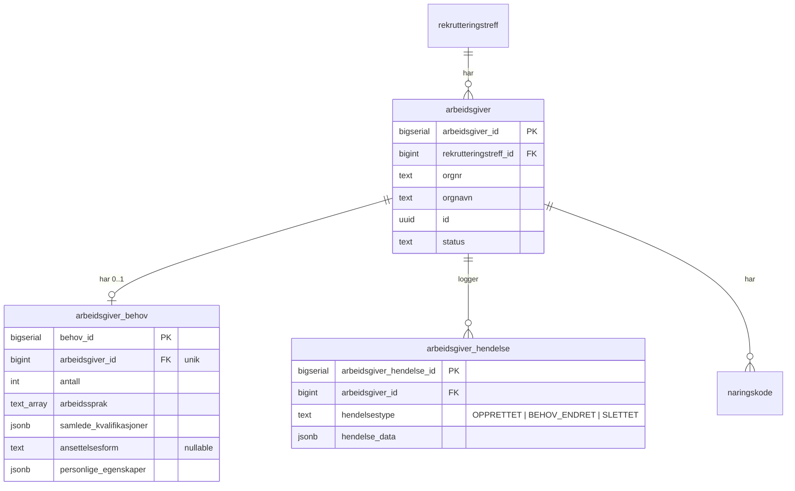
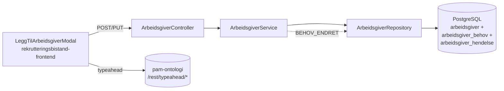

# Plan for Arbeidsgivers behov

Når en markedskontakt legger til en arbeidsgiver i et rekrutteringstreff, skal de også registrere arbeidsgiverens behov. Behovene er kun synlige for eiere av treffet og brukere med utviklerrollen.

## Design

Figma: [Legg til arbeidsgivere — node 13664-174484](https://www.figma.com/design/g0uypsepFJoFx3RRgtaw55/Team-ToI---Rekrutteringsbistand-og-Rekrutteringstreff?node-id=13664-174484&m=dev)

Designet hentes via Figma MCP-server (`mcp_com_figma_fig_get_design_context` / `mcp_com_figma_fig_get_metadata`) for å sikre at feltnavn, komponentvalg og rekkefølge holdes synkronisert med implementasjonen.

### Feltkartlegging mot design

| Designetikett                  | DTO-felt              | Aksel-komponent | Datakilde                                              |
| ------------------------------ | --------------------- | --------------- | ------------------------------------------------------ |
| Antall stillinger              | `antall`              | `TextField` (number) / `Select` | —                                          |
| Hva arbeidsgiver leter etter   | `samledeKvalifikasjoner` | `Combobox` (multi) + `RemovableChips` | `GET /rest/typeahead/samlede_kvalifikasjoner?q=...` (pam-ontologi) |
| Språk                          | `arbeidssprak`        | `Combobox` (multi) + `RemovableChips` | Statisk språkliste (samme som `workLanguage`) |
| Ansettelsesform (Valgfritt)    | `ansettelsesform`     | `Combobox` / `Select` | Stillingens `engagementtype`-verdier             |
| Personlige egenskaper (Valgfritt) | `personligeEgenskaper` | `Combobox` (multi) + `RemovableChips` | `GET /rest/typeahead/personlige_egenskaper?q=...` (pam-ontologi) |

«Hva arbeidsgiver leter etter» er ett kombinert felt på tvers av yrkestittel, kompetanse, autorisasjon, fagdokumentasjon og førerkort, drevet av `samlede_kvalifikasjoner` i pam-ontologi. Se [kombinert-typeahead-i-pam-ontologi.md](./kombinert-typeahead-i-pam-ontologi.md) for typeahead-detaljer.

## Felter

| Felt                   | Type                 | Obligatorisk | Beskrivelse                                                                                                                                                                                                                                          |
| ---------------------- | -------------------- | ------------ | ---------------------------------------------------------------------------------------------------------------------------------------------------------------------------------------------------------------------------------------------------- |
| samledeKvalifikasjoner | Tagliste (typeahead) | Ja           | Kombinert felt: yrkestittel, kompetanse, autorisasjon, fagdokumentasjon og førerkort. Drives av `GET /rest/typeahead/samlede_kvalifikasjoner?q=...` i `pam-ontologi` (min 2 tegn). Kun valg fra typeahead-forslag, ingen fritekst. Hvert element har `kategori`. |
| arbeidssprak           | Tagliste             | Ja           | Språk som kreves i stillingen. Samme verdier som `workLanguage` på stilling.                                                                                                                                                                         |
| antall                 | Positivt heltall     | Ja           | Antall stillinger arbeidsgiver ønsker å fylle.                                                                                                                                                                                                       |
| ansettelsesform        | Tagliste (nedtrekk)  | Nei          | Fast, Vikariat, Engasjement, Prosjekt, Sesong, osv. Samme verdier som `engagementtype` på stilling.                                                                                                                                                  |
| personligeEgenskaper   | Tagliste (typeahead) | Nei          | Personlige egenskaper (softskills). Drives av `GET /rest/typeahead/personlige_egenskaper?q=...` i pam-ontologi. Kun valg fra typeahead-forslag, ingen fritekst.                                                                                       |

### Lagringsformat for taglistene

`samledeKvalifikasjoner` og `personligeEgenskaper` kommer fra typeahead-APIer som leverer `{label, kategori, konseptId?}`. For å unngå at samme label i to kategorier (f.eks. «Tysk» som både `SPRAAK`/`KOMPETANSE`, eller en softskill med samme navn som en kompetanse) blir flertydig, lagres disse som **JSONB-arrays** med hele strukturen, ikke som `text[]` med kun label.

`arbeidssprak` beholdes som `text[]` (liten, kontrollert verdimengde).

## Hendelser

Eksisterende hendelsestyper `OPPRETTET` og `SLETTET` beholdes som i dag. Når **behov** endres (opprettes eller oppdateres), skal det opprettes en egen hendelsestype for behovsendring, ikke arbeidsgiverhendelse.

| Hendelsestype | Trigger                      | hendelse_data      |
| ------------- | ---------------------------- | ------------------ |
| OPPRETTET     | Arbeidsgiver legges til      | `null` (som i dag) |
| BEHOV_ENDRET  | Behov opprettes eller endres | TBD                |
| SLETTET       | Arbeidsgiver slettes         | `null` (som i dag) |

## Regler

- Kun eiere av treffet og utvikler ser behov. Andre roller ser arbeidsgiver + orgnummer som i dag, uten knapp for å åpne modal og uten annen behovsvisning.
- Bare eier kan legge til arbeidsgiver.
- Arbeidsgivere legges til **én og én** via `LeggTilArbeidsgiverModal`: søk opp arbeidsgiver i et felt → modalen fylles med behovsfeltene → fylles og lagres sammen. **Behov er obligatorisk for alle arbeidsgivere.** Dette gjelder både ved opprettelse av treff og etter publisering.
- Næringskoder følger eksisterende flyt og lagres som i dag ved opprettelse av arbeidsgiver.
- Obligatoriske felt i `ArbeidsgiverBehovDto` (`samledeKvalifikasjoner`, `arbeidssprak`, `antall`) må være utfylt ved lagring. `ansettelsesform` og `personligeEgenskaper` er valgfrie. Ved lagring sendes alle verdier, også de som ikke er endret — ingen patching.
- Listefeltene `arbeidssprak` og `samledeKvalifikasjoner` må inneholde minst ett element ved lagring av behov.
- Arbeidsgiver + behov lagres som en atomisk enhet via `LeggTilArbeidsgiverModal`. Arbeidsgiveren lagres IKKE uten behov ved bruk av modalen. Behov er obligatorisk input.
- Publisering krever minst én arbeidsgiver med behovsbeskrivelse. Sjekklisten (`useSjekklisteStatus`) må oppdateres: arbeidsgiver-punktet er oppfylt når minst én arbeidsgiver har registrert behovsbeskrivelse, ikke bare når det finnes arbeidsgivere.
- Behov kan endres i etterkant. Orgnavn og orgnummer kan ikke endres. Hvis arbeidsgivernavn eller organisasjonsnummer er feil, må arbeidsgiveren slettes og legges inn på nytt.
- Ved endring av arbeidsgiver: orgnavn og orgnummer er ikke redigerbare (vises som `disabled`/grået ut).
- Behov vises og redigeres i modal åpnet fra arbeidsgiverkortet, ikke direkte i kortet. Det er ikke egen visning, endrebehov-modalen åpnes i redigeringsmodus.
- Arbeidsgiver soft-slettes i dag. Behov er knyttet til arbeidsgivertabellen og trenger derfor ikke slettes ved soft delete, men skal heller ikke vises når arbeidsgiver er slettet.

## Database



### Flyway-migrasjon (V4)

```sql
CREATE TABLE arbeidsgiver_behov (
    behov_id                 bigserial PRIMARY KEY,
    arbeidsgiver_id          bigint NOT NULL REFERENCES arbeidsgiver(arbeidsgiver_id),
    arbeidssprak             text[] NOT NULL DEFAULT '{}',
    antall                   int    NOT NULL,
    samlede_kvalifikasjoner  jsonb  NOT NULL DEFAULT '[]'::jsonb,  -- array av {label, kategori, konseptId?}
    ansettelsesform          text,                                  -- nullable, valgfritt
    personlige_egenskaper    jsonb  NOT NULL DEFAULT '[]'::jsonb   -- array av {label, kategori, konseptId?}
);

CREATE UNIQUE INDEX idx_arbeidsgiver_behov_arbeidsgiver ON arbeidsgiver_behov(arbeidsgiver_id);
```

Behov ligger i egen tabell knyttet til arbeidsgivertabellen, men håndteres sammen med arbeidsgiverressursen i API-et. Begrunnelsen for splittingen er at arbeidsgiver senere kan knyttes til jobbsøker uten at behovene er relevante, og at behov skal skjules for roller uten tilgang. På sikt vurderes det om behov skal trekkes ut av rekrutteringstreff-api.

## Backend-arkitektur



## DTO

```kotlin
data class BehovTagDto(
  val label: String,
  val kategori: String,     // YRKESTITTEL, KOMPETANSE, AUTORISASJON, FAGDOKUMENTASJON, FORERKORT, SOFTSKILL
  val konseptId: Long? = null
)

data class ArbeidsgiverBehovDto(
  val samledeKvalifikasjoner: List<BehovTagDto>,                // min. 1
  val arbeidssprak: List<String>,                               // min. 1
  val antall: Int,                                              // > 0
  val ansettelsesform: String? = null,                          // valgfritt
  val personligeEgenskaper: List<BehovTagDto> = emptyList()     // valgfritt
)
```

Brukes i:

- Request-body for `PUT .../behov`
- Valgfritt felt `behov` i respons fra `GET .../arbeidsgiver?include=behov` (null hvis behov ikke er registrert)
- Obligatoriske felt valideres ved lagring. `samledeKvalifikasjoner` og `arbeidssprak` må ha minst ett element. `ansettelsesform` og `personligeEgenskaper` kan utelates eller være tom.

## Plassering i backend

- Gjenbruk `ArbeidsgiverController`, `ArbeidsgiverService` og utvid `ArbeidsgiverRepository`, siden behov er en del av arbeidsgiverressursen og naturlig hører hjemme i eksisterende arbeidsgiverflyt.
- Ny handler `leggTilArbeidsgiverMedBehovHandler()` som oppretter arbeidsgiver + behov i én atomisk operasjon. **Alle arbeidsgivere krever behov** — det er ikke tillatt å lagre arbeidsgiver uten behov. Behov er obligatorisk og må sendes i request.
- Denne handler brukes både ved opprettelse av treff (via `LeggTilArbeidsgiverModal`), etter publisering (via `LeggTilArbeidsgiverModal`), og i batch-operasjoner hvis behov er inkludert.
- Endringen skal ikke påvirke eksisterende håndtering av `næringskoder`; de følger fortsatt arbeidsgiveropprettelsen og trenger ikke egne endepunkter eller egen UI i denne planen.
- Behov leses via eksisterende arbeidsgiver-endepunkt med `include=behov`, ikke via eget `GET .../behov`.
- `GET .../arbeidsgiver` uten `include=behov` følger dagens tilgang og respons.
- `GET .../arbeidsgiver?include=behov` krever eier eller utvikler. Andre roller får `403` når de eksplisitt ber om behov.
- `PUT .../behov` oppretter behov hvis det ikke finnes, eller oppdaterer eksisterende. Implementeres i `ArbeidsgiverController`, med samme autorisasjonsmønster som dagens eierbeskyttede arbeidsgiver-endepunkter: eiere og utvikler har tilgang.

## Backend

- [ ] Flyway-migrasjon V4 (SQL over)
- [ ] `ArbeidsgiverBehov`-modell og utvidelser i `ArbeidsgiverRepository` (inkl. JSONB-mapping for `samlede_kvalifikasjoner` og `personlige_egenskaper`)
- [ ] Ny handler `leggTilArbeidsgiverMedBehovHandler()`: POST `/api/rekrutteringstreff/{id}/arbeidsgiver` som tar både arbeidsgiver og behov i request-body. Lagrer begge atomisk i én transaksjon.
- [ ] Behov er obligatorisk input — handler avviser request hvis obligatoriske behovsfelt mangler eller er ufullstendige.
- [ ] Utvid `GET /api/rekrutteringstreff/{id}/arbeidsgiver` med støtte for `include=behov`
- [ ] Nytt endepunkt: `PUT /api/rekrutteringstreff/{id}/arbeidsgiver/{arbeidsgiverId}/behov` (upsert — oppdaterer behov etter opprettelse)
- [ ] Tilgangskontroll: `leggTilArbeidsgiverMedBehovHandler` og `PUT .../behov` krever eier eller utvikler
- [ ] `BEHOV_ENDRET`-hendelse opprettes ved opprettelse og endring av behov (legges til som ny verdi i `ArbeidsgiverHendelsestype`-enum)

## Frontend

```mermaid
flowchart TB
    Knapp[LeggTilArbeidsgiverKnapp] --> Modal[LeggTilArbeidsgiverModal]
    Modal --> Søk[ArbeidsgiverSøk\nSelect/Combobox]
    Modal --> Form[BehovForm]
    Form --> AntallFelt[TextField: Antall stillinger]
    Form --> KvalFelt[Combobox: Hva arbeidsgiver leter etter\nsamlede_kvalifikasjoner]
    Form --> SpråkFelt[Combobox: Språk]
    Form --> AnsFelt[Combobox: Ansettelsesform - valgfritt]
    Form --> EgensFelt[Combobox: Personlige egenskaper - valgfritt]
    KvalFelt -->|q≥2| Onto[(pam-ontologi\n/samlede_kvalifikasjoner)]
    EgensFelt -->|q≥2| Onto
    Modal --> Knapper[Avbryt | Legg til]
```

- [ ] `LeggTilArbeidsgiverModal`: åpnes fra "Legg til arbeidsgiver"-knapp. Inneholder:
  - Søkefelt for arbeidsgiver (søk/velg fra kandidatsøk-API)
  - Behovsfeltene nedenfor (vises etter at arbeidsgiver er valgt)
  - Sender arbeidsgiver + behov sammen via én POST request som en atomisk operasjon
  - Samme design gjenbrukes både ved opprettelse og etter publisering
- [ ] Behovfeltene i modalen:
  - Hva arbeidsgiver leter etter (`samledeKvalifikasjoner`): `Combobox` med typeahead mot `GET /rest/typeahead/samlede_kvalifikasjoner?q=...` i pam-ontologi (min 2 tegn). Viser både label og kategori i forslag. Lagrer `{label, kategori, konseptId?}`. Ingen fritekst.
  - Språk (`arbeidssprak`): `Combobox` eller enum-select (eksisterende språkliste)
  - Antall stillinger (`antall`): tallfelt (positivt heltall)
  - Ansettelsesform: `Combobox`/`Select` med samme faste verdier som stillingens `engagementtype`. **Valgfritt.**
  - Personlige egenskaper (`personligeEgenskaper`): `Combobox` mot `GET /rest/typeahead/personlige_egenskaper?q=...` (eget endepunkt med samme søkemønster). **Valgfritt.** Ingen fritekst.
- [ ] Redigeringsknapp på arbeidsgiverkortet: åpner samme `LeggTilArbeidsgiverModal` for å redigere behov. Arbeidsgiverfeltet er disabled (søkefelt låst), kun behovsfeltene er redigerbare.
- [ ] Frontendvalidering i `LeggTilArbeidsgiverModal`: `arbeidssprak` og `samledeKvalifikasjoner` må ha minst ett element, `antall` må være positivt heltall. `ansettelsesform` og `personligeEgenskaper` valideres ikke som obligatoriske. Vis feilmeldinger inline under hvert felt. Lagre-knappen er `disabled` inntil skjemaet er gyldig.
- [ ] Modal viser tydelig hvilke felt som er obligatoriske og hvilke som er valgfrie (i tråd med designet: «(Valgfritt)» på de to siste).
- [ ] Oppdater `useSjekklisteStatus`: arbeidsgiver-punktet krever minst én arbeidsgiver med behovsbeskrivelse (ikke bare at det finnes arbeidsgivere). Frontend henter arbeidsgivere med `include=behov` for eiere.
- [ ] Valgte tagger kan fjernes med `RemovableChips`, etter samme mønster som andre multivalg i løsningen.
- [ ] Skjul behovknappen og behov for brukere som ikke eier treffet.

### UX-vurderinger

**Arbeidsgiver og behov i samme operasjon — behov er obligatorisk.** Modal åpnes fra "Legg til arbeidsgiver"-knapp. Vedkommende søker opp arbeidsgiver i et felt. Modalen viser så behovsfeltene for den valgte arbeidsgiveren. Alt fylles ut, valideres og sendes som en kombinert request. Backend lagrer begge atomisk. Arbeidsgiveren lagres IKKE uten behov. Redigering av behov gjøres senere via redigeringsknapp på arbeidsgiverkortet, og bruker da separate endepunkt.

**Kombinert «hva arbeidsgiver leter etter»-felt.** Designet skisserer i utgangspunktet to separate felter for yrkestittel og kompetanse, men vi slår disse sammen til ett. Kombinasjonen yrkestittel + kompetanse + fagbrev + førerkort + godkjenning dekkes av én typeahead (`samledeKvalifikasjoner`) med kategoriangivelse per rad, slik at brukeren slipper å velge «riktig» felt for et begrep som kan tolkes på flere måter. Se [kombinert-typeahead-i-pam-ontologi.md](./kombinert-typeahead-i-pam-ontologi.md).

**Forholdet til stilling:** `OmVirksomheten` i stilling bruker en inline `Combobox` for å velge én arbeidsgiver direkte i skjemaet, uten modal og uten behovskonsept. Rekrutteringstreff har flere arbeidsgivere med behov koblet til hver. Det er ingen komponentkonflikt — kontekstene er helt ulike (`/stilling/` vs `/rekrutteringstreff/`), og `VelgArbeidsgiver`-komponentene er allerede separate implementasjoner.

**Konsistent design gjenbrukt.** Samme modal brukes både ved opprettelse av treff og etter publisering. Samme operasjon: søk arbeidsgiver → fylles behov → lagrer. Brukere gjenkjenner mønsteret uansett hvor de legger til arbeidsgivere.

## Spec/Forslag til tester

### Backend komponenttester

- [ ] POST arbeidsgiver med behov oppretter både arbeidsgiver og behov atomisk
- [ ] POST arbeidsgiver uten behov eller med ufullstendige obligatoriske felt gir valideringsfeil — **behov er obligatorisk**
- [ ] POST arbeidsgiver med tom `arbeidssprak` eller `samledeKvalifikasjoner` gir valideringsfeil
- [ ] POST arbeidsgiver uten `ansettelsesform` eller `personligeEgenskaper` lykkes (valgfrie felt)
- [ ] `PUT .../behov` oppdaterer eksisterende behov
- [ ] `PUT .../behov` oppretter `BEHOV_ENDRET`-hendelse
- [ ] `GET .../arbeidsgiver?include=behov` returnerer lagrede verdier for eier, inkl. JSONB-strukturen for `samlede_kvalifikasjoner` og `personlige_egenskaper`
- [ ] `GET .../arbeidsgiver?include=behov` returnerer `behov: null` for arbeidsgiver uten registrerte behov (skulle ikke forekomme hvis behov er obligatorisk)
- [ ] Ikke-eier får `403` ved POST arbeidsgiver med behov
- [ ] Ikke-eier med arbeidsgiverrettet rolle får `403` på `GET .../arbeidsgiver?include=behov`
- [ ] Ikke-eier med arbeidsgiverrettet rolle får `403` på `PUT .../behov`
- [ ] Utvikler får tilgang til POST arbeidsgiver med behov og `PUT .../behov`
- [ ] Jobbsøkerrettet rolle får `403` på alle behov-operasjoner
- [ ] `GET .../arbeidsgiver` uten `include=behov` fungerer som i dag for roller som allerede har lesetilgang
- [ ] Soft-slettet arbeidsgiver eksponerer ikke behov i arbeidsgivervisningene

### Backend repositorietester

- [ ] `ArbeidsgiverRepository` lagrer og henter behov korrekt, inkl. JSONB-strukturen for `samlede_kvalifikasjoner` og `personlige_egenskaper`
- [ ] `ArbeidsgiverRepository` oppdaterer eksisterende behov korrekt
- [ ] Obligatoriske felt lagres uten `NULL`-verdier
- [ ] `arbeidsgiver_id` er unik i `arbeidsgiver_behov`

### Backend servicetester

- [ ] `ArbeidsgiverService` oppretter behov via upsert og oppretter `BEHOV_ENDRET`-hendelse
- [ ] `ArbeidsgiverService` oppdaterer eksisterende behov via upsert og oppretter `BEHOV_ENDRET`-hendelse
- [ ] `ArbeidsgiverService` avviser lagring når et obligatorisk felt i `behov` mangler
- [ ] `ArbeidsgiverService` avviser lagring når et obligatorisk listefelt i `behov` er tomt
- [ ] `ArbeidsgiverService` godtar lagring uten `ansettelsesform` og `personligeEgenskaper`

### Frontend Playwright

- [ ] Eier kan legge til arbeidsgiver ved å søke i modal → velge arbeidsgiver → fylles behovsfeltene → sender arbeidsgiver + behov som én request
- [ ] Legg-til-modal åpner når «Legg til arbeidsgiver»-knapp klikkes
- [ ] Søkefelt finner arbeidsgiver fra kandidatsøk-API
- [ ] Etter at arbeidsgiver er valgt, vises behovsfeltene i samme modal
- [ ] Eier kan ikke lagre hvis behovsfeltene `arbeidsspråk` eller `samledeKvalifikasjoner` er tomme
- [ ] Eier kan ikke lagre hvis `antall` ikke er positivt heltall
- [ ] Eier kan lagre uten `ansettelsesform` (valgfritt)
- [ ] Eier kan lagre uten `personligeEgenskaper` (valgfritt)
- [ ] Arbeidsgiver + behov sendes sammen og lagres atomisk (arbeidsgiverkortet vises hvis lagring lyktes)
- [ ] Hvis lagring feiler, vises feilmeldinger og arbeidsgiver lagres IKKE uten behov
- [ ] Eier kan åpne `LeggTilArbeidsgiverModal` fra redigeringsknapp på arbeidsgiverkortet (arbeidsgivervalg er låst, bare behov redigerbar)
- [ ] Modalen preloader eksisterende behov-verdier ved redigering
- [ ] Redigering av behov bruker separat `PUT` endepunkt (arbeidsgiver er allerede lagret)
- [ ] Publiseringsknappen er `disabled` når ingen arbeidsgiver har behovsbeskrivelse
- [ ] Publiseringsknappen aktiveres når minst én arbeidsgiver har behovsbeskrivelse (og øvrige krav er oppfylt)
- [ ] `LeggTilArbeidsgiverModal` brukes både for opprettelse (arbeidsgivervalg aktivt) og redigering (arbeidsgivervalg låst)
- [ ] Ikke-eier ser arbeidsgiver uten behovknapp og uten behovsvisning
- [ ] Utvikler ser behov på samme måte som eier
- [ ] Ansettelsesform viser samme verdier som stillingsfeltet
- [ ] Samlede kvalifikasjoner kan legges til via kombinert typeahead uten fritekst, og blandede kategorier (f.eks. et yrke + et fagbrev + et førerkort) lagres og vises riktig
- [ ] Personlige egenskaper kan legges til via egen typeahead uten fritekst
- [ ] Språk-felt fungerer som tagliste
