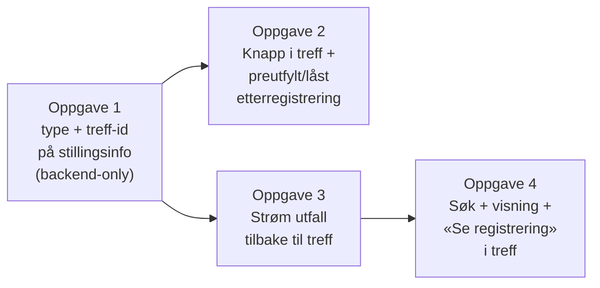

# Plan: «Fått jobben» via etterregistrering for rekrutteringstreff (alternativ 2B — v1)

Implementasjonsplan for det som er valgt i [vurdering-fatt-jobben-statistikk-rekrutteringstreff.md](./vurdering-fatt-jobben-statistikk-rekrutteringstreff.md), alternativ 2B: Når en jobbsøker har fått jobb via et rekrutteringstreff, går markedskontakt inn i dagens etterregistreringsflyt og merker registreringen som rekrutteringstreff. Stilling-/kandidat-domenet eier selve utfallet, mens `rekrutteringstreffId` følger med gjennom kjeden så vi får knyttet utfallet tilbake til treffet for vår egen statistikk og visning.

Det er ikke besluttet hva som blir riktig langsiktig løsning. 2B kan vise seg å dekke behovet godt nok permanent, eller etterregistrering kan på sikt utvikles til en egen modul som blir det naturlige hjemmet for «fått jobben». Et tredje alternativ er å la treff-domenet selv overta hele løpet — beskrevet i [fatt-jobben-rekrutteringstreff.md](./fatt-jobben-rekrutteringstreff.md) (alternativ 2A). 2A er per nå et åpent diskusjonsalternativ, ikke en plan vi har forpliktet oss til.

## Kjernebeslutninger

| Tema                                    | Beslutning v1                                                                                                                                                                       | Konsekvens                                                                                                                                       |
| --------------------------------------- | ----------------------------------------------------------------------------------------------------------------------------------------------------------------------------------- | ------------------------------------------------------------------------------------------------------------------------------------------------ |
| Hovedflyt                               | Gjenbruk dagens etterregistrering. En `FORMIDLING`-stilling opprettes som «bærer» (samme mønster som løp 1B i vurderingsdokumentet).                                                | Ingen endring i Avro mot `datavarehus-statistikk` i v1. Treff og workop er foreløpig ikke skillbare eksternt — håndteres internt.                |
| Type-valg på etterregistrering          | Stillingsinfo får et nytt felt `etterregistreringType` med verdiene `STILLING` (default), `REKRUTTERINGSTREFF`, `WORKOP`.                                                           | Frontend velger type i etterregistreringsskjemaet. `STILLING` beholder dagens oppførsel.                                                         |
| Kobling til treff                       | `stillingsinfo` får valgfritt `rekrutteringstreffId` (uuid). Settes når `etterregistreringType = REKRUTTERINGSTREFF`.                                                               | Brukes til å strømme utfall tilbake til riktig treff og vise «fått jobben» i jobbsøkerlisten.                                                    |
| Ett utfall per person per treff         | Maks én etterregistrering per (`rekrutteringstreffId`, `aktørId`). Krav: jobbsøkeren må ha `SVART_JA` og treffet må være `FULLFORT`.                                                | Knapp/lenke i treff-frontend skjules eller deaktiveres ellers. Backend håndhever på opprettelsestidspunktet.                                     |
| Angring                                 | Beholder dagens flyt: markedskontakt åpner etterregistreringen og sletter den der. Ingen ny modal i treff-frontend.                                                                 | Ingen ny semantikk i Avro. Slettingen propageres som en hendelse til treffet (se oppgave 3).                                                     |
| Janzz/stillingskategori, heltid         | Samles inn i etterregistreringsmodalen som i dag. Ingen ny videresending til datavarehus i v1 — dette er allerede dekket av eksisterende stillingsdata.                             | Spørsmålet om nye Avro-felt mot datavarehus er parkert til alt 2A (se [fatt-jobben-rekrutteringstreff.md](./fatt-jobben-rekrutteringstreff.md)). |
| Rekrutteringstreff-status «fått jobben» | «Fått jobben» blir den **siste** statusen på jobbsøkeren i treffet (overtrumfer `SVART_JA`). Ved fjerning faller jobbsøkeren tilbake til siste reelle hendelse (typisk `SVART_JA`). | Søk i treff-frontend skal også filtrere på status (ikke bare hendelsen) — `jobbsoker.status` må reflektere `FATT_JOBBEN`.                        |

## Oppgaveinndeling

Fire selvstendige leveranser som kan tas i rekkefølge.

### Oppgave 1 — Type + treff-id på `stillingsinfo` (backend-only)

**Hvor:** `rekrutteringsbistand-stilling-api`.

Minimal, ren backend-leveranse. Ingen frontend-endringer i denne oppgaven.

- Utvid `stillingsinfo` med to nye nullable felt:
  - `etterregistrering_type text` — verdier `STILLING` (default), `REKRUTTERINGSTREFF`, `WORKOP`.
  - `rekrutteringstreff_id uuid`.
- Flyway-migrasjon legger til kolonnene som `NULL`. Ingen backfill — eksisterende rader tolkes som `STILLING`.
- Validering i service-laget:
  - `rekrutteringstreff_id` må være satt hvis `etterregistrering_type = REKRUTTERINGSTREFF`, ellers skal den være `null`.
  - Ved opprettelse uten eksplisitt type defaultes feltet til `STILLING` (bakoverkompatibelt for eksisterende klienter).
- Eksponer begge feltene i `stillingsinfo`-API-et (les og skriv) slik at frontend og kandidat-flyten kan bruke dem i senere oppgaver.

**Akseptansekriterier:**

- Migrasjonen kjører grønt mot eksisterende data uten backfill.
- API-et godtar og returnerer `etterregistreringType` og `rekrutteringstreffId` på `stillingsinfo`.
- Validering avviser `REKRUTTERINGSTREFF` uten `rekrutteringstreffId` med `400`.
- Eksisterende klienter (som ikke sender de nye feltene) fungerer uendret.

### Oppgave 2 — Opprette etterregistrering fra treff

Knapp «Registrer fått jobben» vises på rader der jobbsøker er `SVART_JA` og treffet er `FULLFORT`. (Sjekken «ingen aktiv etterregistrering finnes allerede» tas i oppgave 4 — i v1 stoler vi på backend-håndheving og `409` ved innsending.)

**Ingen personidentifikator i URL.** Fnr hører ikke hjemme der (logger, historikk, referrer). `personTreffId` er intern i treff-domenet og skal ikke eksponeres mot etterregistrering. URL-en bærer kun `rekrutteringstreffId`.

To alternativer — velges ved oppgavestart:

#### Alt 2.1 — Innebygd dialog (foretrukket)

Ny `RegistrerFåttJobbenDialog`-komponent i treff-frontend wrapper `StillingsContextMedData` + `StillingAdmin` med preutfylt `stillingsData`:

- `formidlingKandidater: [{ fnr, navn }]` fra jobbsøker-konteksten (allerede tilgjengelig i treff-frontend).
- `stillingskategori = FORMIDLING`, `etterregistreringType = REKRUTTERINGSTREFF`, `rekrutteringstreffId`.
- Preutfylte defaults for heltid/deltid, stillingsprosent osv. — kan redigeres.
- Person-søk-steget skjules; bruker starter direkte på detaljer.

Fnr lever kun i React-state, aldri i URL eller storage.

Forutsetter at `StillingAdmin` kan rendres utenfor sin route, at skjemaet kan starte etter person-søk-steget, og at `onSuccess` kan overstyres til å lukke dialogen og refreshe treff-listen.

#### Alt 2.2 — `sessionStorage`-handoff til eksisterende side

Klikk skriver `{ fnr, navn, rekrutteringstreffId }` til `sessionStorage` under en kortvarig nøkkel og navigerer til `/etterregistrering/ny-etterregistrering?rekrutteringstreffId=…&kilde=rekrutteringstreff`. Etterregistreringssiden leser nøkkelen ved mount, preutfyller og låser person + setter type, og sletter nøkkelen umiddelbart. Mangler nøkkelen (refresh, direktelink): redirect tilbake til treffet.

Fnr i `sessionStorage` er lesbart fra all JS på samme origin (XSS-risiko). Mitiger med kort levetid, ingen logging, og verifisert CSP. Ingen ny risikoklasse — fnr behandles allerede i samme frontend.

**Akseptansekriterier (felles):**

- Knappen vises kun ved `SVART_JA` + treff `FULLFORT`.
- Skjemaet åpnes med person låst, treff låst, type `REKRUTTERINGSTREFF`, uten synlig fnr-søk.
- Innsending oppretter etterregistrering med `etterregistreringType = REKRUTTERINGSTREFF` og riktig `rekrutteringstreffId` på `stillingsinfo`.

### Oppgave 3 — Strøm etterregistreringsdata tilbake til treffet

**Hvor:** `rekrutteringsbistand-kandidat-api` (publisher), `rekrutteringstreff-api` (lytter), Kafka.

Når en etterregistrering med `etterregistrering_type ∈ { REKRUTTERINGSTREFF, WORKOP }` får utfall registrert/fjernet i `kandidat-api`, skal eventet strømmes til riktig treff.

- `kandidat-api` publiserer i dag `kandidat_v2.RegistrertFåttJobben` på Rapids. Utvid meldingen slik at `stillingsinfo`-feltet inkluderer `etterregistreringType` og `rekrutteringstreffId` når de finnes (krever at `stillingsinfo` allerede leses og legges på meldingen).
- Tilsvarende for fjerning: `kandidat-api` har `FjernetRegistreringFåttJobben` — utvid med samme felt.
- `rekrutteringstreff-api` får en ny lytter `EtterregistreringFåttJobbenLytter`:
  - Filtrerer på `stillingsinfo.etterregistreringType ∈ { REKRUTTERINGSTREFF, WORKOP }` og at `rekrutteringstreffId` finnes.
  - Slår opp `jobbsoker` i treffet via `(rekrutteringstreffId, aktørId)`.
  - Skriver hendelse `FATT_JOBBEN` (eller `FATT_JOBBEN_FJERNET` for fjerning) på `jobbsoker_hendelse` med `hendelse_data` som inneholder kilde (`etterregistreringType`), `stillingsId` (referanse tilbake), `tidspunkt` og `utførtAvNavIdent/NavKontor`.
  - Oppdaterer `jobbsoker.status` slik at status reflekterer `FATT_JOBBEN` som siste status. Ved fjerning rulles status tilbake til siste reelle hendelse (typisk `SVART_JA`).
- Workop-flyten: Anta at workop bruker samme `kandidat-api`-flyt. Hvis ikke, må workop-systemet enten publisere på samme Rapids-event eller eget event som lytteren også kan håndtere — avklares i oppgavestart.

**Akseptansekriterier:**

- Når en etterregistrering med treff-flagg får `FATT_JOBBEN` i `kandidat-api`, vises status `Fått jobben` på riktig jobbsøker i riktig treff i løpet av kort tid.
- Når etterregistreringen slettes i etterregistreringsflyten, går jobbsøkeren tilbake til forrige status (`SVART_JA`).
- Ingen registreringer for `etterregistrering_type = STILLING` påvirker treff-domenet.

### Oppgave 4 — Søk, visning og «se eksisterende» i treff-domenet

**Hvor:** `rekrutteringstreff-api` (søk/view + jobbsøker-respons), `rekrutteringsbistand-frontend` (treff-visning).

- Utvid `R__jobbsoker_sok_view.sql` med `fatt_jobben_tidspunkt` (utledet fra siste `FATT_JOBBEN`/`FATT_JOBBEN_FJERNET`-hendelse, slik som beskrevet i [fatt-jobben-rekrutteringstreff.md](./fatt-jobben-rekrutteringstreff.md) under «Søk og filtrering»). Legg også på `etterregistrering_stillings_id` slik at frontend kan lenke direkte til etterregistreringen.
- I jobbsøkerlisten i treffet: hvis `etterregistreringStillingsId` er satt, erstatt «Registrer fått jobben»-knappen (innført i oppgave 2) med lenken «Se registrering» som peker på `/etterregistrering/{stillingsId}`.
- `JobbsøkerSokRepository`: Nytt valgfritt filter `fattJobben: Boolean?` (samme semantikk som beskrevet i alt 2A-planen).
- Søke-/listeresponsen får felt:
  - `fåttJobbenTidspunkt: Instant?`
  - `etterregistreringStillingsId: String?`
  - `antallFåttJobben: { med: Int, uten: Int }`
- Frontend: Vis statusbadge «Fått jobben» på rader hvor `fåttJobbenTidspunkt` er satt, og legg til en lenke «Se/slett etterregistrering» som peker på `/etterregistrering/{stillingsId}`. Sletting skjer i etterregistreringsflyten — ikke i treff-frontend.
- Filterkomponent på siden av status-filteret («Med fått jobben» / «Uten fått jobben»), tri-state.

**Akseptansekriterier:**

- Søket i treffet returnerer riktige verdier for `fåttJobbenTidspunkt`, `etterregistreringStillingsId` og aggregatet.
- Filteret «Med fått jobben» / «Uten fått jobben» fungerer sammen med eksisterende status-filter.
- Klikk på «Se/slett etterregistrering» åpner riktig etterregistrering, hvor markedskontakt kan slette den. Sletting reflekteres i treffet via oppgave 3.

## Datakontrakt

Ingen endring i `kandidatutfall.avsc` mot `datavarehus-statistikk` i v1. Internt utvides Rapids-meldingene fra `kandidat-api` med `etterregistreringType` og `rekrutteringstreffId` i `stillingsinfo`-feltet (eksisterende JSON-objekt). Endringen er bakoverkompatibel — eksisterende lyttere ignorerer ukjente felt.

## Endringer per system

| System                   | Endring                                                                                                                                                                                                                                                                                                             |
| ------------------------ | ------------------------------------------------------------------------------------------------------------------------------------------------------------------------------------------------------------------------------------------------------------------------------------------------------------------- |
| `frontend`               | Knapp «Registrer fått jobben» i jobbsøkerlisten + deep-link til eksisterende etterregistreringsside med person og treff låst, type utledet fra query-paramene (oppgave 2). Statusbadge + filter + «Se registrering»-lenke i treff (oppgave 4).                                                                      |
| `stilling-api`           | `stillingsinfo` får `etterregistrering_type` og `rekrutteringstreff_id`. Validering. Eksponering i API.                                                                                                                                                                                                             |
| `kandidat-api`           | Propagere `etterregistreringType` og `rekrutteringstreffId` på Rapids-meldingene `RegistrertFåttJobben` og `FjernetRegistreringFåttJobben` (les fra `stillingsinfo`).                                                                                                                                               |
| `rekrutteringstreff-api` | Ny lytter `EtterregistreringFåttJobbenLytter` (oppgave 3). Nye hendelsestyper `FATT_JOBBEN` / `FATT_JOBBEN_FJERNET` på `jobbsoker_hendelse`. `jobbsoker.status` reflekterer `FATT_JOBBEN`. Utvidet søk/view (oppgave 4). API for å eksponere kvalifisering/eksisterende etterregistrering til frontend (oppgave 2). |
| `statistikk-api`         | Ingen endring i v1.                                                                                                                                                                                                                                                                                                 |
| `datavarehus-statistikk` | Ingen endring i v1.                                                                                                                                                                                                                                                                                                 |

## Rekkefølge og avhengigheter

Oppgave 1 må være på plass før 2 og 3. Oppgave 4 trenger 3 for å ha noe å vise.

## Åpne spørsmål

1. Hvor lagres `rekrutteringstreffId` mest naturlig — direkte på `stillingsinfo`-tabellen, eller i et eget «kilde»-objekt som også kan dekke workop?
2. Workop-flyten: bruker den samme `kandidat-api`-veien for utfall, eller eget event? Avgjør om oppgave 3-lytteren må håndtere flere event-typer.
3. Skal type-valget i etterregistreringsskjemaet være en del av URL-en (deep-link fra treff-knappen) eller et internt frontend-state?
4. Skal vi vise treff-konteksten («denne etterregistreringen tilhører rekrutteringstreff X») også inne i etterregistreringsvisningen, slik at den som sletter forstår effekten på treff-statistikken?
