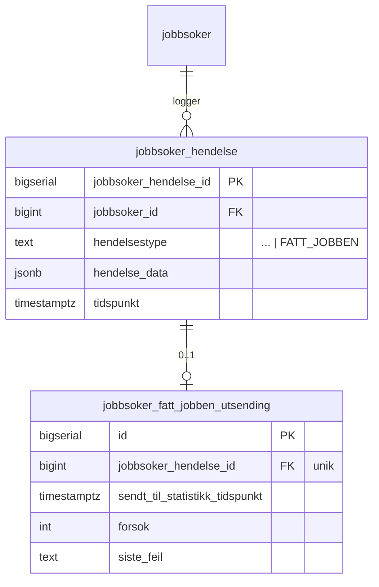

# Plan: Registrering av «fått jobben» i rekrutteringstreff (alternativ 2A)

Implementasjonsplan for løsningen som er valgt i [vurdering-fatt-jobben-statistikk-rekrutteringstreff.md](./vurdering-fatt-jobben-statistikk-rekrutteringstreff.md), alternativ 2A: markedskontakt registrerer «fått jobben» direkte fra jobbsøkerlisten i et rekrutteringstreff. `rekrutteringstreff-api` eier hele løpet og publiserer en Rapids-melding som dagens `statistikk-api` lytter på.

## Kjernebeslutninger

| Tema                         | Beslutning                                                                                                                                                          | Implementasjonskonsekvens                                                                                                                              |
| ---------------------------- | ------------------------------------------------------------------------------------------------------------------------------------------------------------------- | ------------------------------------------------------------------------------------------------------------------------------------------------------ |
| Kategori i Avro              | Gjenbruke `stillingskategori = FORMIDLING` i v1. Egen `REKRUTTERINGSTREFF`-verdi vurderes senere.                                                                  | Ingen endring hos `datavarehus-statistikk` ved utrulling. Treff er ikke skillbar fra etterregistrering eksternt før migrering.                         |
| Synlighet av treff internt   | `statistikk-api` skal kunne skille treff fra ordinær etterregistrering i sine egne tabeller og aggregater.                                                          | Ny kolonne `rekrutteringstreff_id` på `kandidatutfall`. Feltet propageres fra Rapids-meldingen og lagres ved siden av eksisterende felt.              |
| Kandidatliste/stilling       | Det opprettes ikke noen formidlingsstilling. `stillingsId` og `kandidatlisteId` på Avro fylles med syntetiske verdier utledet fra rekrutteringstreff og jobbsøker. | Stilling-api og kandidat-api berøres ikke i v1. `datavarehus-statistikk` får verdier som ikke finnes i stilling-api — dokumenteres som kjent avvik.   |
| Angring                      | Ikke støttet i v1.                                                                                                                                                  | Ingen `FATT_JOBBEN_FJERNET`-hendelse i denne iterasjonen. Datamodellen designes likevel slik at det kan legges til uten migrering av eksisterende data.|
| Idempotens                   | En jobbsøker kan ha maks én aktiv `FATT_JOBBEN`-hendelse per rekrutteringstreff.                                                                                    | Unik constraint i `rekrutteringstreff-api` + sjekk i service før hendelse skrives. Endepunktet returnerer `409` ved duplikat.                          |
| Utsending til statistikk     | Egen scheduler i `rekrutteringstreff-api` plukker uutsendte hendelser og publiserer på Rapids. Retries med eksponentiell backoff.                                  | Ny tabell `jobbsoker_fatt_jobben_utsending` og ny scheduler. Sender via eksisterende Rapids-tilkobling.                                               |

## Hendelser

`JobbsøkerHendelsestype` utvides med `FATT_JOBBEN`. Eksisterende hendelsestyper er uendret.

| Hendelsestype | Trigger                                                                       | `hendelse_data`                                                               |
| ------------- | ----------------------------------------------------------------------------- | ----------------------------------------------------------------------------- |
| `FATT_JOBBEN` | Markedskontakt bekrefter «Registrer fått jobben» fra jobbsøkerlisten i treffet | JSON-snapshot: `registrertAvNavIdent`, `registrertAvNavKontor`, `tidspunkt`, `arbeidsgiverOrgnr` |

## Database

### Endringer i `rekrutteringstreff-api`



#### Flyway-migrasjon (treff-api)

```sql
CREATE TABLE jobbsoker_fatt_jobben_utsending (
    id                              bigserial PRIMARY KEY,
    jobbsoker_hendelse_id           bigint      NOT NULL REFERENCES jobbsoker_hendelse(jobbsoker_hendelse_id),
    sendt_til_statistikk_tidspunkt  timestamptz,
    forsok                          int         NOT NULL DEFAULT 0,
    siste_feil                      text
);

CREATE UNIQUE INDEX idx_jobbsoker_fatt_jobben_utsending_hendelse
    ON jobbsoker_fatt_jobben_utsending(jobbsoker_hendelse_id);

CREATE INDEX idx_jobbsoker_fatt_jobben_utsending_usendt
    ON jobbsoker_fatt_jobben_utsending(sendt_til_statistikk_tidspunkt)
    WHERE sendt_til_statistikk_tidspunkt IS NULL;
```

### Endringer i `statistikk-api`

```sql
ALTER TABLE kandidatutfall ADD COLUMN rekrutteringstreff_id uuid;
CREATE INDEX idx_kandidatutfall_rekrutteringstreff ON kandidatutfall(rekrutteringstreff_id)
    WHERE rekrutteringstreff_id IS NOT NULL;
```

Feltet er `NULL` for alle eksisterende rader og for utfall som ikke kommer fra et treff. Det brukes kun internt — Avro-meldingen videre til `datavarehus-statistikk` påvirkes ikke.

## API i `rekrutteringstreff-api`

| Endepunkt                                                                                          | Beskrivelse                                                                                                                                |
| -------------------------------------------------------------------------------------------------- | ------------------------------------------------------------------------------------------------------------------------------------------ |
| `POST /api/rekrutteringstreff/{id}/jobbsoker/{personTreffId}/fatt-jobben`                          | Registrerer at jobbsøkeren har fått jobben. Krever rolle `ARBEIDSGIVER_RETTET` + eier/utvikler. Returnerer `201`. `409` ved duplikat.       |

Body (forslag):

```kotlin
data class FattJobbenInputDto(
    val arbeidsgiverOrgnr: String
)
```

`registrertAvNavIdent`/`registrertAvNavKontor` hentes fra token, `tidspunkt` settes server-side.

## Rapids-melding

Gjenbruker eksisterende `kandidat_v2.RegistrertFåttJobben`-event slik at `PresenterteOgFåttJobbenKandidaterLytter` ikke må endres mer enn nødvendig.

| Felt                       | Verdi for treff-utfall                                                          |
| -------------------------- | ------------------------------------------------------------------------------- |
| `@event_name`              | `kandidat_v2.RegistrertFåttJobben`                                              |
| `aktørId`                  | Jobbsøkerens aktør-ID                                                           |
| `organisasjonsnummer`      | `arbeidsgiverOrgnr` fra hendelsen                                               |
| `kandidatlisteId`          | Syntetisk: `rekrutteringstreffId`                                               |
| `stillingsId`              | Syntetisk: `rekrutteringstreffId` (samme verdi — vi har ingen ekte stilling)    |
| `tidspunkt`                | Hendelsens tidspunkt                                                            |
| `utførtAvNavIdent`         | `registrertAvNavIdent`                                                          |
| `utførtAvNavKontorKode`    | `registrertAvNavKontor`                                                         |
| `synligKandidat`           | `true`                                                                          |
| `stillingsinfo.stillingskategori` | `FORMIDLING`                                                             |
| `stillingsinfo.rekrutteringstreffId` | `rekrutteringstreffId` (nytt felt — leses av lytter)                  |

> Lytteren i `statistikk-api` må utvides til å lese `stillingsinfo.rekrutteringstreffId` og lagre det i den nye kolonnen. Dagens validering `erEntenKomplettStillingEllerIngenStilling` må enten lempes eller speilet ved at vi legger ved et minimalt `stilling`-objekt.

## Endringer per system

| System                 | Endring                                                                                                                                                              |
| ---------------------- | -------------------------------------------------------------------------------------------------------------------------------------------------------------------- |
| `frontend`             | Knapp + bekreftelsesmodal i jobbsøkerlisten. Visning av status «fått jobben» på personkortet. Kall til nytt endepunkt.                                                |
| `rekrutteringstreff-api` | Ny enum-verdi, nytt endepunkt, ny tabell, ny scheduler, ny Rapids-publisering.                                                                                       |
| `statistikk-api`       | Ny kolonne `rekrutteringstreff_id`, lytteren leser nytt felt, lagrer det. Eventuell justering av `erEntenKomplettStillingEllerIngenStilling`.                       |
| `stilling-api`         | Ingen endring i v1.                                                                                                                                                  |
| `kandidat-api`         | Ingen endring i v1.                                                                                                                                                  |
| `datavarehus-statistikk` | Ingen endring i v1.                                                                                                                                                |

## Spec — tester som må endres eller legges til

### `rekrutteringstreff-api`

| Test                                                              | Type             | Hva den skal verifisere                                                                                              |
| ----------------------------------------------------------------- | ---------------- | -------------------------------------------------------------------------------------------------------------------- |
| `JobbsøkerFattJobbenKomponenttest.skalRegistrereFattJobben`       | Komponenttest    | `POST /…/fatt-jobben` lagrer `FATT_JOBBEN`-hendelse med riktig `hendelse_data` og oppretter rad i utsendingstabellen. |
| `JobbsøkerFattJobbenKomponenttest.skalReturnere409VedDuplikat`    | Komponenttest    | Andre kall for samme jobbsøker i samme treff returnerer `409` og oppretter ikke ny hendelse.                          |
| `JobbsøkerFattJobbenKomponenttest.skalKreveEierEllerUtvikler`     | Komponenttest    | Andre roller får `403`.                                                                                              |
| `JobbsøkerFattJobbenKomponenttest.skalAvviseUkjentArbeidsgiverOrgnr` | Komponenttest | `arbeidsgiverOrgnr` må tilhøre treffet, ellers `400`.                                                                |
| `FattJobbenStatistikkSchedulerTest.skalSendeUutsendteHendelser`   | Komponenttest    | Scheduler plukker rader med `sendt_til_statistikk_tidspunkt IS NULL`, publiserer på Rapids, oppdaterer tidspunkt.     |
| `FattJobbenStatistikkSchedulerTest.skalIkkeResendeAlleredeSendt`  | Komponenttest    | Allerede sendte rader hoppes over.                                                                                   |
| `FattJobbenStatistikkSchedulerTest.skalLagreFeilOgØkeForsok`      | Enhetstest       | Ved feil i publisering lagres `siste_feil` og `forsok` økes; `sendt_til_statistikk_tidspunkt` forblir `NULL`.        |
| `JobbsøkerHendelsestypeTest`                                      | Enhetstest       | `FATT_JOBBEN` finnes i enumet og er med i serialisering.                                                             |

Eksisterende tester som må verifiseres mot ny enum-verdi:

- `JobbsøkerSokKomponenttest` — sortering/filter må håndtere ny hendelsestype uten å feile.
- `AktivitetskortRepositoryTest` — `FATT_JOBBEN` skal ikke trigge aktivitetskort-utsending.

### `statistikk-api`

| Test                                                                          | Type          | Hva den skal verifisere                                                                                                                       |
| ----------------------------------------------------------------------------- | ------------- | --------------------------------------------------------------------------------------------------------------------------------------------- |
| `PresenterteOgFåttJobbenKandidaterLytterTest.skalLagreRekrutteringstreffId`   | Komponenttest | Rapids-melding med `stillingsinfo.rekrutteringstreffId` lagrer verdien i ny kolonne.                                                          |
| `PresenterteOgFåttJobbenKandidaterLytterTest.skalAkseptereMeldingUtenStilling` | Komponenttest | Meldinger med syntetisk `stillingsId` og uten ekte `stilling` blir behandlet (krever justering av `erEntenKomplettStillingEllerIngenStilling`). |
| `KandidatutfallRepositoryTest.skalLagreOgLeseRekrutteringstreffId`            | Enhetstest    | Repo-mapping mot ny kolonne fungerer.                                                                                                          |
| `DatavarehusKafkaProducerTest`                                                 | Eksisterende  | Verifisere at `rekrutteringstreff_id` **ikke** lekker ut i `AvroKandidatutfall`.                                                              |

### `frontend`

| Test                                                  | Type        | Hva den skal verifisere                                                              |
| ----------------------------------------------------- | ----------- | ------------------------------------------------------------------------------------ |
| `RegistrerFattJobbenKnapp.test.tsx`                   | Enhet (RTL) | Knapp er kun synlig for eier/utvikler. Klikk åpner modal.                            |
| `RegistrerFattJobbenModal.test.tsx`                   | Enhet (RTL) | Bekreftelse trigger POST. Lukking uten bekreftelse gjør ingen kall.                  |
| `JobbsokerListe.fatt-jobben.spec.ts`                  | Playwright  | Hele flyten: åpne liste, velg person, bekreft, se status oppdatert.                  |
| MSW-mock for `POST /…/fatt-jobben` med `409` og `201` | Mock        | Brukes av begge testene over og av lokal utvikling.                                  |

## Åpne spørsmål

1. Skal `arbeidsgiverOrgnr` velges av markedskontakt i modalen, eller utledes hvis treffet kun har én arbeidsgiver?
2. Hvor lang retry-periode og maks antall forsøk skal scheduleren ha før den gir opp og varsler?
3. Skal frontend vise hvem og når på personkortet etter registrering, eller kun en statusbadge i v1?
4. Når vi senere åpner for `REKRUTTERINGSTREFF`-kategori i Avro: skal eksisterende `FORMIDLING`-rader migreres, eller kun nye?
