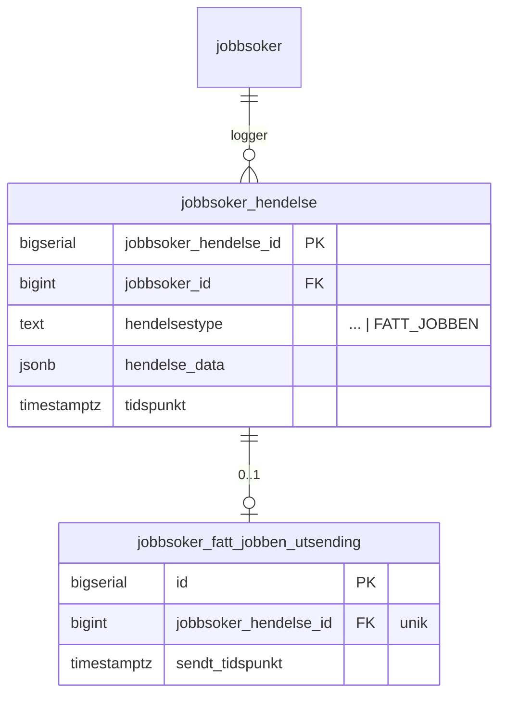

# Plan: Registrering av «fått jobben» i rekrutteringstreff (alternativ 2A)

Implementasjonsplan for løsningen som er valgt i [vurdering-fatt-jobben-statistikk-rekrutteringstreff.md](./vurdering-fatt-jobben-statistikk-rekrutteringstreff.md), alternativ 2A: markedskontakt registrerer «fått jobben» direkte fra jobbsøkerlisten i et rekrutteringstreff. `rekrutteringstreff-api` eier hele løpet og publiserer en Rapids-melding som dagens `statistikk-api` lytter på.

## Kjernebeslutninger

| Tema                       | Beslutning                                                                                                                                                         | Implementasjonskonsekvens                                                                                                                               |
| -------------------------- | ------------------------------------------------------------------------------------------------------------------------------------------------------------------ | ------------------------------------------------------------------------------------------------------------------------------------------------------- |
| Kategori i Avro            | Gjenbruke `stillingskategori = FORMIDLING` i v1. Egen `REKRUTTERINGSTREFF`-verdi vurderes senere.                                                                  | Ingen endring hos `datavarehus-statistikk` ved utrulling. Treff er ikke skillbar fra etterregistrering eksternt før migrering.                          |
| Synlighet av treff internt | `statistikk-api` skal kunne skille treff fra ordinær etterregistrering i sine egne tabeller og aggregater.                                                         | To alternativer — se «Endringer i `statistikk-api`» nedenfor. Ikke avgjort ennå.                                                                        |
| Kandidatliste/stilling     | Det opprettes ikke noen formidlingsstilling. `stillingsId` og `kandidatlisteId` er ikke med i den nye meldingen og settes ikke i `kandidatutfall` for treff-rader. | Stilling-api og kandidat-api berøres ikke i v1. Kolonner i `kandidatutfall` for `stillingsId`/`kandidatlisteId` er allerede nullable.                   |
| Angring                    | Ikke støttet i v1.                                                                                                                                                 | Ingen `FATT_JOBBEN_FJERNET`-hendelse i denne iterasjonen. Datamodellen designes likevel slik at det kan legges til uten migrering av eksisterende data. |
| Idempotens                 | En jobbsøker kan ha maks én aktiv `FATT_JOBBEN`-hendelse per rekrutteringstreff.                                                                                   | Unik constraint i `rekrutteringstreff-api` + sjekk i service før hendelse skrives. Endepunktet returnerer `409` ved duplikat.                           |
| Utsending til statistikk   | Egen scheduler i `rekrutteringstreff-api` plukker uutsendte hendelser og publiserer på Rapids. Retries med eksponentiell backoff.                                  | Ny tabell `jobbsoker_fatt_jobben_utsending` og ny scheduler. Sender via eksisterende Rapids-tilkobling.                                                 |

## Hendelser

`JobbsøkerHendelsestype` utvides med `FATT_JOBBEN`. Eksisterende hendelsestyper er uendret.

| Hendelsestype | Trigger                                                                        | `hendelse_data`                                                                                  |
| ------------- | ------------------------------------------------------------------------------ | ------------------------------------------------------------------------------------------------ |
| `FATT_JOBBEN` | Markedskontakt bekrefter «Registrer fått jobben» fra jobbsøkerlisten i treffet | JSON-snapshot: `registrertAvNavIdent`, `registrertAvNavKontor`, `tidspunkt`, `arbeidsgiverOrgnr` |

## Database

### Endringer i `rekrutteringstreff-api`



#### Flyway-migrasjon (treff-api)

Samme mønster som `aktivitetskort_polling`: én rad per hendelse, `sendt_tidspunkt NULL` betyr usendt. Rader som mangler i tabellen er ikke plukket opp ennå; rader med `sendt_tidspunkt IS NOT NULL` er ferdig sendt.

```sql
CREATE TABLE jobbsoker_fatt_jobben_utsending (
    id                    bigserial PRIMARY KEY,
    jobbsoker_hendelse_id bigint                   NOT NULL REFERENCES jobbsoker_hendelse(jobbsoker_hendelse_id),
    sendt_tidspunkt       timestamp with time zone,
    CONSTRAINT jobbsoker_fatt_jobben_utsending_hendelse_fk
        FOREIGN KEY (jobbsoker_hendelse_id) REFERENCES jobbsoker_hendelse(jobbsoker_hendelse_id)
);

CREATE UNIQUE INDEX idx_jobbsoker_fatt_jobben_utsending_hendelse
    ON jobbsoker_fatt_jobben_utsending(jobbsoker_hendelse_id);
```

### Endringer i `statistikk-api`

To alternativer. Begge bruker den samme `RekrutteringstreffFåttJobbenLytter` og endrer ikke eksisterende lyttere.

#### Alt A — Ny kolonne på `kandidatutfall`

```sql
ALTER TABLE kandidatutfall ADD COLUMN rekrutteringstreff_id uuid;
CREATE INDEX idx_kandidatutfall_rekrutteringstreff ON kandidatutfall(rekrutteringstreff_id)
    WHERE rekrutteringstreff_id IS NOT NULL;
```

Lytteren skriver én rad til `kandidatutfall` med `rekrutteringstreff_id` satt og `stilling_id`/`kandidatliste_id` som `NULL`. Eksisterende `DatavarehusKafkaProducer`-scheduler plukker raden opp uten endring og sender Avro videre til `datavarehus-statistikk`.

| Fordel                                              | Ulempe                                                                                           |
| --------------------------------------------------- | ------------------------------------------------------------------------------------------------ |
| Ingen endring i producer eller datavarehus-pipeline | Treff-rader bærer nullable-felt som er meningsløse for treff (`stilling_id`, `kandidatliste_id`) |
| Eksisterende repo-kode og tester dekker nesten alt  | Samler to ulike datakontekster i én tabell                                                       |
| Minst ny kode                                       | Partial index nødvendig for effektive treff-spesifikke spørringer                                |

#### Alt B — Dedikert tabell `rekrutteringstreff_utfall`

```sql
CREATE TABLE rekrutteringstreff_utfall (
    id                    bigserial PRIMARY KEY,
    rekrutteringstreff_id uuid        NOT NULL,
    aktor_id              text        NOT NULL,
    nav_ident             text        NOT NULL,
    nav_kontor            text        NOT NULL,
    organisasjonsnummer   text        NOT NULL,
    tidspunkt             timestamptz NOT NULL,
    UNIQUE (rekrutteringstreff_id, aktor_id)
);

CREATE INDEX idx_rekrutteringstreff_utfall_treff
    ON rekrutteringstreff_utfall(rekrutteringstreff_id);
```

Lytteren skriver kun til `rekrutteringstreff_utfall`. Siden det er nøyaktig én rad per jobbsøker per treff, reflekterer den unike constrainten `(rekrutteringstreff_id, aktor_id)` forretningsmeningen direkte. Uttrekk internt er trivielt: `SELECT * FROM rekrutteringstreff_utfall WHERE rekrutteringstreff_id = ?` — ingen partial index, ingen nullable-støy.

For at Avro fortsatt skal sendes til `datavarehus-statistikk` i v1 uten å endre den tjenesten, må én av to løsninger velges:

- **B1**: Lytteren skriver også én rad til `kandidatutfall` (med `NULL` for stilling-felt) slik at eksisterende producer plukker det opp — to skriv i én transaksjon.
- **B2**: Ny scheduler leser fra `rekrutteringstreff_utfall` og sender Avro separat, uavhengig av `DatavarehusKafkaProducer`.

| Fordel                                                        | Ulempe                                                            |
| ------------------------------------------------------------- | ----------------------------------------------------------------- |
| Ren modell — kun feltene som er relevante for treff           | Krever ekstra beslutning for datavarehus-pipelinen (B1 eller B2)  |
| Unik constraint på `(treff, aktor)` er naturlig og eksplisitt | Mer ny kode: nytt repo, ny scheduler (B2) eller dobbeltskriv (B1) |
| Enkel og rask intern spørring uten partial index              | Eksisterende `KandidatutfallRepositoryTest` dekker ikke ny tabell |

#### Sammenligning

|                                | Alt A                        | Alt B                                  |
| ------------------------------ | ---------------------------- | -------------------------------------- |
| Endring i datavarehus-pipeline | Ingen                        | B1: dobbeltskriv · B2: ny scheduler    |
| Intern spørring                | Partial index, nullable felt | Trivielt, ren tabell                   |
| Ny kode i statistikk-api       | Lite (1 kolonne + lytter)    | Mer (ny tabell + repo + ev. scheduler) |
| Modellryddighet                | Middels                      | God                                    |

**Ikke avgjort.** Alt A er enklest å shippe; Alt B er renere om vi forventer mer intern rapportering på tvers av treff.

## API i `rekrutteringstreff-api`

| Endepunkt                                                                 | Beskrivelse                                                                                                                                                                                                                              |
| ------------------------------------------------------------------------- | ---------------------------------------------------------------------------------------------------------------------------------------------------------------------------------------------------------------------------------------- |
| `POST /api/rekrutteringstreff/{id}/jobbsoker/{personTreffId}/fatt-jobben` | Registrerer at jobbsøkeren har fått jobben. Krever rolle `ARBEIDSGIVER_RETTET` + eier/utvikler. Returnerer `201`. `409` ved duplikat. `409` hvis treffet ikke er i `FULLFORT`-status. `409` hvis jobbsøkeren allerede har `FATT_JOBBEN`. |

Body (forslag):

```kotlin
data class FattJobbenInputDto(
    val arbeidsgiverOrgnr: String
)
```

`personTreffId` er i URL-stien. `aktørId` (og eventuelt fødselsnummer ved behov) slås opp server-side fra `personTreffId` — ingen personidentifikator i request body. `registrertAvNavIdent`/`registrertAvNavKontor` hentes fra token, `tidspunkt` settes server-side.

### Uediterbar status etter `FATT_JOBBEN`

Når `FATT_JOBBEN`-hendelsen er registrert, låses jobbsøkeren i treffet:

- Jobbsøkeren kan **ikke** slettes fra treffet.
- Ingen videre statushendelser kan registreres (verken fra frontend eller API).
- Scheduleren kan sende Rapids-meldingen på nytt ved feil, men endepunktet avviser et nytt `POST`-kall.

Service-laget sjekker om `FATT_JOBBEN` eksisterer for `personTreffId` i gjeldende treff før enhver muterende operasjon og returnerer `409` med forklarende `feil`-felt.

## Rapids-melding

Eget event `kandidat_v2.RekrutteringstreffFåttJobben` som kun `rekrutteringstreff-api` publiserer og `statistikk-api` lytter på. Ingen gjenbruk av eksisterende lytter — ingen syntetiske ID-er, ingen `stillingsinfo`-wrapper.

| Felt                    | Verdi                                                                     |
| ----------------------- | ------------------------------------------------------------------------- |
| `@event_name`           | `kandidat_v2.RekrutteringstreffFåttJobben`                                |
| `aktørId`               | Jobbsøkerens aktør-ID                                                     |
| `rekrutteringstreffId`  | Treffets UUID                                                             |
| `organisasjonsnummer`   | `arbeidsgiverOrgnr` fra hendelsen                                         |
| `tidspunkt`             | Hendelsens tidspunkt                                                      |
| `utførtAvNavIdent`      | `registrertAvNavIdent`                                                    |
| `utførtAvNavKontorKode` | `registrertAvNavKontor`                                                   |

`stillingskategori` er ikke med i meldingen. Lytteren vet at kilden alltid er et rekrutteringstreff og hardkoder `FORMIDLING` (eller `REKRUTTERINGSTREFF` når det evt. innføres) ved lagring.

Ny lytter `RekrutteringstreffFåttJobbenLytter` i `statistikk-api` leser disse feltene direkte og lagrer i `kandidatutfall` + den nye `rekrutteringstreff_id`-kolonnen. Ingen endring i eksisterende lyttere eller validering.

## Endringer per system

| System                   | Endring                                                                                                                                                                                                                           |
| ------------------------ | --------------------------------------------------------------------------------------------------------------------------------------------------------------------------------------------------------------------------------- |
| `frontend`               | Knapp + bekreftelsesmodal i jobbsøkerlisten. Visning av status «fått jobben» på personkortet. Kall til nytt endepunkt.                                                                                                            |
| `rekrutteringstreff-api` | Ny enum-verdi, nytt endepunkt, ny tabell, ny scheduler, ny Rapids-publisering.                                                                                                                                                    |
| `statistikk-api`         | Ny lytter `RekrutteringstreffFåttJobbenLytter`. **Alt A**: ny kolonne `rekrutteringstreff_id` på `kandidatutfall`. **Alt B**: dedikert tabell `rekrutteringstreff_utfall`. Eksisterende lyttere og validering er uendret uansett. |
| `stilling-api`           | Ingen endring i v1.                                                                                                                                                                                                               |
| `kandidat-api`           | Ingen endring i v1.                                                                                                                                                                                                               |
| `datavarehus-statistikk` | Ingen endring i v1.                                                                                                                                                                                                               |

## Spec — tester som må endres eller legges til

### `rekrutteringstreff-api`

| Test                                                                            | Type          | Hva den skal verifisere                                                                                               |
| ------------------------------------------------------------------------------- | ------------- | --------------------------------------------------------------------------------------------------------------------- |
| `JobbsøkerFattJobbenKomponenttest.skalRegistrereFattJobben`                     | Komponenttest | `POST /…/fatt-jobben` lagrer `FATT_JOBBEN`-hendelse med riktig `hendelse_data` og oppretter rad i utsendingstabellen. |
| `JobbsøkerFattJobbenKomponenttest.skalReturnere409VedDuplikat`                  | Komponenttest | Andre kall for samme jobbsøker i samme treff returnerer `409` og oppretter ikke ny hendelse.                          |
| `JobbsøkerFattJobbenKomponenttest.skalKreveEierEllerUtvikler`                   | Komponenttest | Andre roller får `403`.                                                                                               |
| `JobbsøkerFattJobbenKomponenttest.skalAvviseUkjentArbeidsgiverOrgnr`            | Komponenttest | `arbeidsgiverOrgnr` må tilhøre treffet, ellers `400`.                                                                 |
| `JobbsøkerFattJobbenKomponenttest.skalKreveTreffErFullfort`                     | Komponenttest | Endepunktet returnerer `409` hvis treffet ikke er i `FULLFORT`-status.                                                |
| `JobbsøkerFattJobbenKomponenttest.skalBlokkereSlettingAvJobbsokerMedFattJobben` | Komponenttest | `DELETE /…/jobbsoker/{personTreffId}` returnerer `409` hvis jobbsøkeren har `FATT_JOBBEN`. Ingen ny hendelse skrives. |
| `FattJobbenStatistikkSchedulerTest.skalSendeUutsendteHendelser`                 | Komponenttest | Scheduler plukker rader med `sendt_til_statistikk_tidspunkt IS NULL`, publiserer på Rapids, oppdaterer tidspunkt.     |
| `FattJobbenStatistikkSchedulerTest.skalIkkeResendeAlleredeSendt`                | Komponenttest | Allerede sendte rader hoppes over.                                                                                    |
| `FattJobbenStatistikkSchedulerTest.skalLagreFeilOgØkeForsok`                    | Enhetstest    | Ved feil i publisering lagres `siste_feil` og `forsok` økes; `sendt_til_statistikk_tidspunkt` forblir `NULL`.         |
| `JobbsøkerHendelsestypeTest`                                                    | Enhetstest    | `FATT_JOBBEN` finnes i enumet og er med i serialisering.                                                              |

Eksisterende tester som må verifiseres mot ny enum-verdi:

- `JobbsøkerSokKomponenttest` — sortering/filter må håndtere ny hendelsestype uten å feile.
- `AktivitetskortRepositoryTest` — `FATT_JOBBEN` skal ikke trigge aktivitetskort-utsending.

### `statistikk-api`

| Test | Type | Hva den skal verifisere |
| ---- | ---- | ----------------------- |

**Alt A:**

| Test                                                                           | Type          | Hva den skal verifisere                                                                                                         |
| ------------------------------------------------------------------------------ | ------------- | ------------------------------------------------------------------------------------------------------------------------------- |
| `RekrutteringstreffFåttJobbenLytterTest.skalLagreUtfallOgRekrutteringstreffId` | Komponenttest | Rapids-melding lagrer rad i `kandidatutfall` med riktig `rekrutteringstreff_id`, og `stilling_id`/`kandidatliste_id` er `NULL`. |
| `RekrutteringstreffFåttJobbenLytterTest.skalIgnorereMeldingUtenPåkrevdeFelt`   | Komponenttest | Meldinger som mangler obligatoriske felt ignoreres.                                                                             |
| `KandidatutfallRepositoryTest.skalLagreOgLeseRekrutteringstreffId`             | Enhetstest    | Repo-mapping mot ny kolonne fungerer.                                                                                           |
| `DatavarehusKafkaProducerTest`                                                 | Eksisterende  | Verifisere at `rekrutteringstreff_id` ikke lekker ut i `AvroKandidatutfall`.                                                    |

**Alt B:**

| Test                                                                                               | Type          | Hva den skal verifisere                                                                         |
| -------------------------------------------------------------------------------------------------- | ------------- | ----------------------------------------------------------------------------------------------- |
| `RekrutteringstreffFåttJobbenLytterTest.skalLagreIRekrutteringstreffUtfall`                        | Komponenttest | Rapids-melding lagrer rad i `rekrutteringstreff_utfall` med alle felt korrekt.                  |
| `RekrutteringstreffFåttJobbenLytterTest.skalHåndhevUnikConstraintPerTreffOgAktor`                  | Komponenttest | Duplikatmelding for samme `(rekrutteringstreff_id, aktor_id)` lagres ikke på nytt (idempotens). |
| `RekrutteringstreffFåttJobbenLytterTest.skalIgnorereMeldingUtenPåkrevdeFelt`                       | Komponenttest | Meldinger som mangler obligatoriske felt ignoreres.                                             |
| `RekrutteringstreffUtfallRepositoryTest.skalLagreOgHenteUtfall`                                    | Enhetstest    | Repo-mapping mot ny tabell fungerer.                                                            |
| _(Alt B1)_ `RekrutteringstreffFåttJobbenLytterTest.skalOgsåSkriveKandidatutfallForAvro`            | Komponenttest | Lytteren skriver atomisk til begge tabeller; `DatavarehusKafkaProducer` plukker opp raden.      |
| _(Alt B2)_ `RekrutteringstreffAvroSchedulerTest.skalSendeAvroForUutsendteRekrutteringstreffUtfall` | Komponenttest | Dedikert scheduler sender Avro for rader uten `sendt_tidspunkt`.                                |

### `frontend`

| Test                                                  | Type        | Hva den skal verifisere                                             |
| ----------------------------------------------------- | ----------- | ------------------------------------------------------------------- |
| `RegistrerFattJobbenKnapp.test.tsx`                   | Enhet (RTL) | Knapp er kun synlig for eier/utvikler. Klikk åpner modal.           |
| `RegistrerFattJobbenModal.test.tsx`                   | Enhet (RTL) | Bekreftelse trigger POST. Lukking uten bekreftelse gjør ingen kall. |
| `JobbsokerListe.fatt-jobben.spec.ts`                  | Playwright  | Hele flyten: åpne liste, velg person, bekreft, se status oppdatert. |
| MSW-mock for `POST /…/fatt-jobben` med `409` og `201` | Mock        | Brukes av begge testene over og av lokal utvikling.                 |

## Åpne spørsmål

1. Skal `arbeidsgiverOrgnr` velges av markedskontakt i modalen, eller utledes hvis treffet kun har én arbeidsgiver?
2. Hvor lang retry-periode og maks antall forsøk skal scheduleren ha før den gir opp og varsler?
3. Når vi senere åpner for `REKRUTTERINGSTREFF`-kategori i Avro: skal eksisterende `FORMIDLING`-rader migreres, eller kun nye?
