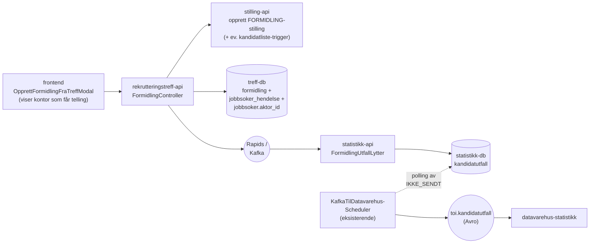

# Plan: Send formidlingsutfall fra rekrutteringstreff-api til statistikk-api

> **Status:** Skisse. Fokus på arkitektur, datakontrakt og lagring — ikke implementasjonsdetaljer eller tester. Henger sammen med [fatt-jobben-rekrutteringstreff.md](./fatt-jobben-rekrutteringstreff.md) (alt 2A) og [fatt-jobben-etterregistrering-rekrutteringstreff.md](./fatt-jobben-etterregistrering-rekrutteringstreff.md) (alt 2B), men forutsetter en tredje retning der `rekrutteringstreff-api` selv eier formidlingen via `FormidlingController`.

## Bakgrunn

En kollega bygger nå et eget endepunkt i `rekrutteringstreff-api` (`FormidlingController`) som:

1. Oppretter en stilling i `stilling-api` (etterregistrering, kategori `FORMIDLING`).
2. Lagrer `(rekrutteringstreffId, personId, arbeidsgiverId, nav_ident, nav_kontor, tidspunkt, …)` i en ny `formidling`-tabell i treff-databasen.
3. Skriver en `FATT_JOBB`-hendelse på jobbsøkeren i samme transaksjon.

Min del: ta utfallsdata fra denne nye tabellen og få det inn i `statistikk-api` slik at det havner i `kandidatutfall`-tabellen og videre på `toi.kandidatutfall` Avro-topic mot datavarehus.

## Beslutninger

| Tema                         | Valg                                                                                                                                                                                                                                                                            |
| ---------------------------- | ------------------------------------------------------------------------------------------------------------------------------------------------------------------------------------------------------------------------------------------------------------------------------- |
| Transport                    | **Rapids** fra `rekrutteringstreff-api` til `statistikk-api`. Ny lytter i statistikk-api.                                                                                                                                                                                       |
| Pollingtabell / utsendingskø | **Nei.** Eventet publiseres direkte når formidlingen lagres. Ingen separat scheduler eller utsendingstabell i treff-api.                                                                                                                                                        |
| Avro mot datavarehus         | **Behold eksisterende [`kandidatutfall.avsc`](../../../rekrutteringsbistand-statistikk-api/src/main/avro/kandidatutfall.avsc).** I v1 sender vi treff-utfall som `stillingskategori = FORMIDLING`. Ekstra kategori (f.eks. `REKRUTTERINGSTREFF`) kan komme i en senere versjon. |
| NavKontor på formidlingen    | Kontoret som får telling er kontoret som opprettet rekrutteringstreffet (`opprettetAvNavkontorEnhetId`) — altså kontoret som ble valgt da treffet ble opprettet.                                                                                                                |
| `navIdent`                   | Hentes fra token i `FormidlingController` — den som utfører handlingen. Lagres på formidlingsraden, sendes på Rapids.                                                                                                                                                           |
| `tidspunkt`                  | 1:1 med `tidspunkt`-kolonnen i `formidling`-tabellen i treff-api.                                                                                                                                                                                                               |
| `aktørId`                    | Må være lagret på jobbsøkeren i treff-api før eventet publiseres (se [Forutsetning: aktørId på jobbsøker](#forutsetning-aktørid-på-jobbsøker)).                                                                                                                                 |
| Utfallstype                  | Kun `FATT_JOBBEN` i v1. Eventet bærer `utfall` som string for å matche [`Utfall`-enumet](../../../rekrutteringsbistand-statistikk-api/src/no/nav/statistikkapi/kandidatutfall/Kandidatutfall.kt) i statistikk-api.                                                              |

## Datagrunnlag fra treff-api

| Felt                   | Kilde                                                  | Brukes av statistikk                                       |
| ---------------------- | ------------------------------------------------------ | ---------------------------------------------------------- |
| `formidlingId`         | `formidling.id`                                        | Idempotens-nøkkel på lytteren                              |
| `rekrutteringstreffId` | `formidling.rekrutteringstreff_id`                     | Intern dimensjon                                           |
| `aktørId`              | `jobbsoker.aktor_id` (slått opp fra `person_id`)       | `aktørId` i Avro                                           |
| `arbeidsgiverOrgnr`    | `formidling.arbeidsgiver_id` → orgnr                   | (ikke i Avro i v1)                                         |
| `stillingsId`          | Stilling opprettet i `stilling-api`                    | `stillingsId` i Avro                                       |
| `kandidatlisteId`      | Kandidatliste til formidlingsstillingen, om den finnes | `kandidatlisteId` i Avro (kan være tom — se åpne spørsmål) |
| `tidspunkt`            | `formidling.tidspunkt`                                 | `tidspunkt` i Avro                                         |
| `navIdent`             | Token i `FormidlingController`                         | `navIdent` i Avro                                          |
| `navKontor`            | Treffets `opprettetAvNavkontorEnhetId`                 | `navKontor` i Avro                                         |
| `utfall`               | Hardkodet `FATT_JOBBEN` i v1                           | `utfall` i Avro                                            |
| `stillingskategori`    | Hardkodet `FORMIDLING` i v1                            | `stillingskategori` i Avro                                 |

### Forutsetning: aktørId på jobbsøker

`statistikk-api` bruker `aktørId` som primær identifikator for personen i `kandidatutfall`. I dag inneholder `jobbsoker`-tabellen i treff-api ikke `aktørId`.

Krav for å kunne sende treff-utfall til statistikk:

- `jobbsoker`-tabellen får ny kolonne `aktor_id text`.
- Når en jobbsøker legges til i et treff, slås `aktørId` opp via PDL/aktørregister og lagres på raden.
- Lookup ved publiseringstidspunkt hadde også fungert, men det er enklere å lagre én gang og slippe nye PDL-kall ved hver formidling.

Backfill av eksisterende jobbsøkere håndteres som egen oppgave (lazy ved første utfall, eller batchjobb).

## Avro mot datavarehus

`AvroKandidatutfall` beholdes uendret i v1:

```json
[
  {
    "namespace": "no.nav.rekrutteringsbistand",
    "name": "AvroStillingskategori",
    "type": "enum",
    "symbols": ["STILLING", "FORMIDLING", "JOBBMESSE"]
  },
  {
    "namespace": "no.nav.rekrutteringsbistand",
    "type": "record",
    "name": "AvroKandidatutfall",
    "fields": [
      { "name": "aktørId", "type": "string" },
      { "name": "utfall", "type": "string" },
      { "name": "navIdent", "type": "string" },
      { "name": "navKontor", "type": "string" },
      { "name": "kandidatlisteId", "type": "string" },
      { "name": "stillingsId", "type": "string" },
      { "name": "tidspunkt", "type": "string" },
      { "name": "stillingskategori", "type": "AvroStillingskategori" }
    ]
  }
]
```

I v1 rapporterer vi treff-formidling som `stillingskategori = FORMIDLING`. Vi tar med dagens skjema til datavarehus og spesifiserer kun at de senere kan få en ekstra kategori (`REKRUTTERINGSTREFF`) hvis vi velger å skille dem eksternt.

### `utfall`-feltet (string)

Selv om `utfall` er `string` i Avro, har det i praksis tre lovlige verdier — bestemt av [`Utfall`-enumet](../../../rekrutteringsbistand-statistikk-api/src/no/nav/statistikkapi/kandidatutfall/Kandidatutfall.kt) i statistikk-api:

| Verdi             | Kilde i dag                                                                    | Brukes for treff-formidling? |
| ----------------- | ------------------------------------------------------------------------------ | ---------------------------- |
| `IKKE_PRESENTERT` | Reversering av `PRESENTERT` (kandidat-api)                                     | Nei                          |
| `PRESENTERT`      | `kandidat_v2.RegistrertDeltCv` (kandidat-api)                                  | Nei                          |
| `FATT_JOBBEN`     | `kandidat_v2.RegistrertFåttJobben` (kandidat-api), og **ny: treff-formidling** | **Ja**                       |

Treff-formidling sender alltid `FATT_JOBBEN` i v1.

## Arkitektur



### Stegvis

1. `FormidlingController` lagrer formidling med treffets opprettede kontor som `navKontor`, oppretter stilling i `stilling-api` og skriver `FATT_JOBB`-hendelse i samme transaksjon.
2. **Rett etter commit** publiseres `rekrutteringstreff.FormidlingRegistrert` på Rapids. Ingen pollingtabell.
3. `FormidlingUtfallLytter` i `statistikk-api` mottar eventet, bygger `OpprettKandidatutfall`, kaller eksisterende `LagreUtfallOgStilling`.
4. Eksisterende `KafkaTilDatavarehusScheduler` plukker `IKKE_SENDT`-rader fra `kandidatutfall` og publiserer Avro mot `toi.kandidatutfall`.

> Trade-off ved å droppe pollingtabell: Hvis Rapids er nede akkurat når `FormidlingController` committer, mister vi eventet for den formidlingen. Da må operatør kjøre manuell rekonstruksjon fra `formidling`-tabellen. Vurderes akseptabelt for v1: Rapids har høy oppetid, treff-formidling er lavfrekvent, og vi har full sporbarhet i `formidling`-tabellen.

## Lagring

### Treff-api

- Ny kolonne `jobbsoker.aktor_id text` (jf. [Forutsetning: aktørId på jobbsøker](#forutsetning-aktørid-på-jobbsøker)).
- `formidling`-tabellen (eies av kollega) må inneholde feltene listet i [Datagrunnlag fra treff-api](#datagrunnlag-fra-treff-api). Spesielt `nav_ident` (fra token), `nav_kontor` (fra treffets `opprettetAvNavkontorEnhetId`) og `tidspunkt`.
- **Ingen** `formidling_utsending`-tabell, **ingen** `FormidlingUtfallScheduler`.

### Statistikk-api

`kandidatutfall` brukes som den er. Ingen schemaendring i v1. Vi vurderer eventuelt en valgfri kolonne `rekrutteringstreff_id uuid` for intern sporbarhet, men `stillingsId` (formidlingsstillingen) er allerede unik per formidling og holder for v1.

## DTO-er

### Rapids-event (treff-api → statistikk-api)

```jsonc
{
  "@event_name": "rekrutteringstreff.FormidlingRegistrert",
  "formidlingId": "12345",
  "rekrutteringstreffId": "<uuid>",
  "aktørId": "...",
  "stillingsId": "<uuid>",
  "kandidatlisteId": "<uuid eller tom string — se åpne spørsmål>",
  "organisasjonsnummer": "...",
  "tidspunkt": "2026-05-13T10:00:00+02:00",
  "navIdent": "Z999999",
  "navKontor": "0314",
  "utfall": "FATT_JOBBEN",
  "stillingskategori": "FORMIDLING",
}
```

| Felt                   | Påkrevd | Kilde                                                          |
| ---------------------- | ------- | -------------------------------------------------------------- |
| `formidlingId`         | Ja      | `formidling.id` — idempotens på lytteren                       |
| `rekrutteringstreffId` | Ja      | `formidling.rekrutteringstreff_id`                             |
| `aktørId`              | Ja      | `jobbsoker.aktor_id`                                           |
| `stillingsId`          | Ja      | UUID for formidlingsstillingen                                 |
| `kandidatlisteId`      | Ja\*    | UUID for kandidatlisten — `*` se åpne spørsmål                 |
| `organisasjonsnummer`  | Ja      | Arbeidsgiver fra treffet                                       |
| `tidspunkt`            | Ja      | `formidling.tidspunkt` 1:1                                     |
| `navIdent`             | Ja      | Token i `FormidlingController` (markedskontaktens ident)       |
| `navKontor`            | Ja      | Kontoret som opprettet treffet (`opprettetAvNavkontorEnhetId`) |
| `utfall`               | Ja      | `FATT_JOBBEN` i v1                                             |
| `stillingskategori`    | Ja      | `FORMIDLING` i v1                                              |

> Vi bruker et **eget event-navn** (`rekrutteringstreff.FormidlingRegistrert`) i stedet for å gjenbruke `kandidat_v2.RegistrertFåttJobben`. Begrunnelse: vi slipper å bygge syntetisk `stilling`/`stillingsinfo`-wrapper for å passere `erEntenKomplettStillingEllerIngenStilling`-validering i eksisterende lytter, og vi gjør kilden eksplisitt for fremtidig debugging.

### Statistikk-api: intern modell

Ingen endringer i `OpprettKandidatutfall` eller `KandidatutfallRepository` i v1 — vi mapper fra Rapids-eventet til eksisterende felter og kaller `LagreUtfallOgStilling` som vanlig.

## Endringer per system

| System                   | Endring                                                                                                                                                                                                                             |
| ------------------------ | ----------------------------------------------------------------------------------------------------------------------------------------------------------------------------------------------------------------------------------- |
| `frontend`               | `OpprettFormidlingFraTreffModal` viser beskjed om hvilket kontor som får telling: kontoret som opprettet rekrutteringstreffet. Ingen `NavKontorVelger` for formidling.                                                              |
| `rekrutteringstreff-api` | Ny kolonne `jobbsoker.aktor_id` + oppslag mot PDL/aktørregister når jobbsøker legges til. `FormidlingController` publiserer `rekrutteringstreff.FormidlingRegistrert` på Rapids etter commit. Ingen pollingtabell, ingen scheduler. |
| `statistikk-api`         | Ny lytter `FormidlingUtfallLytter`. Bygger `OpprettKandidatutfall` og kaller eksisterende `LagreUtfallOgStilling`. Ingen schemaendring.                                                                                             |
| `stilling-api`           | Ingen.                                                                                                                                                                                                                              |
| `kandidat-api`           | Ingen i v1, gitt at vi får en kandidatliste opprettet via etterregistreringsmønsteret. Avklares (se åpne spørsmål).                                                                                                                 |
| `datavarehus-statistikk` | Ingen schemaendring i v1. Kun varsel om at en ny kategori (`REKRUTTERINGSTREFF`) kan komme i en senere versjon.                                                                                                                     |

## Åpne spørsmål

1. **Hva brukes `kandidatlisteId` til hos datavarehus, og kan den være tom?** Avhenger av svar:
   - Hvis tom string OK: vi slipper å opprette kandidatliste eksplisitt i `FormidlingController`.
   - Hvis krever ekte UUID: `FormidlingController` må trigge kandidatlisteopprettelse (samme måte som dagens etterregistreringsfullføring i frontend, via `firstPublished: true`) før Rapids-eventet publiseres. Se [`VeilederKandidatlisteController.skalOppretteKandidatliste`](../../../rekrutteringsbistand-kandidat-api/src/main/java/no/nav/arbeid/cv/kandidatlister/rest/kandidatliste/VeilederKandidatlisteController.java).
2. Hvordan håndteres angring/sletting av en formidling? Speiler vi `FjernetRegistreringFåttJobben`-mønsteret med en egen Rapids-event og `angret_tidspunkt`-kolonne? Avklar i neste iterasjon.
3. Når og hvordan koordinerer vi en eventuell senere `REKRUTTERINGSTREFF`-kategori med `sf-kandidatutfall`/datavarehus-konsumenten?
4. Backfill av `aktor_id` på eksisterende `jobbsoker`-rader — lazy ved første bruk, eller egen jobb?

## Prosjekter sjekket

- `rekrutteringstreff-backend/apps/rekrutteringstreff-api` — `JobbsøkerService`, `FormidlingController` (under arbeid), `jobbsoker`-tabellen.
- `rekrutteringsbistand-statistikk-api` — `PresenterteOgFåttJobbenKandidaterLytter`, `KandidatutfallRepository`, `LagreUtfallOgStilling`, `Utfall`-enum, `kandidatutfall.avsc`.
- `rekrutteringsbistand-stilling-api` — `StillingService.opprettStilling` og kall til `KandidatlisteKlient.sendStillingOppdatert`.
- `rekrutteringsbistand-kandidat-api` — `VeilederKandidatlisteController.opprettEllerOppdaterKandidatlisteBasertPåStilling` (kandidatliste opprettes kun når `publishedByAdmin` er satt).
- Eksisterende planer i `docs/9-planer/rekrutteringstreff-fått-jobben/` (alt 2A og 2B) som bakgrunn.
