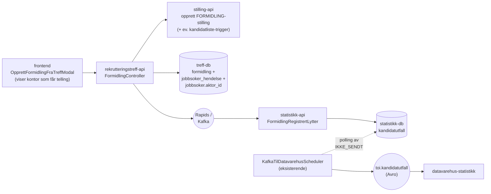
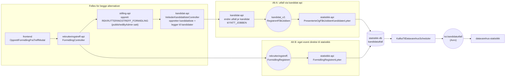

# Plan: Send formidlingsutfall fra rekrutteringstreff-api til statistikk-api

## Alternativer kort fortalt

Begge alternativer starter likt: `rekrutteringstreff-api` oppretter en formidlingsstilling og en kandidatliste, legger jobbsøkerne i kandidatlisten, og sørger for at formidlingen lagres i treff-databasen. Forskjellen er hvor `FATT_JOBBEN`-utfallet registreres og hvordan det ender i `kandidatutfall`.

| Alternativ                                         | Kort beskrivelse                                                                                                                                                                                                    | Hvor skjer fan-out ved flere jobbsøkere?                    | Viktigste konsekvens                                                                                                                         |
| -------------------------------------------------- | ------------------------------------------------------------------------------------------------------------------------------------------------------------------------------------------------------------------- | ----------------------------------------------------------- | -------------------------------------------------------------------------------------------------------------------------------------------- |
| **Alternativ A — utfall via `kandidat-api`**       | Treff-api/stilling-api ber `kandidat-api` legge kandidatene i listen og sette utfall `FATT_JOBBEN`. `kandidat-api` sender eksisterende `kandidat_v2.RegistrertFåttJobben`, som `statistikk-api` allerede lytter på. | I `kandidat-api`: ett fått-jobben-event per kandidat.       | Mest gjenbruk, målgruppedata for jobbsøker og reversering følger eksisterende flyt. Krever synkront kall og avklart auth mot `kandidat-api`. |
| **Alternativ B — eget event til `statistikk-api`** | Treff-api legger kandidatene i listen, men publiserer selv ett `rekrutteringstreff.FormidlingRegistrert` per jobbsøker. `statistikk-api` har egen lytter som mapper eventet til `kandidatutfall`.                   | I `rekrutteringstreff-api`: ett Rapids-event per jobbsøker. | Tydelig kilde og enklere kobling mot statistikk, men egen lytter/reversering må vedlikeholdes og målgruppedata må legges på eventet.         |

Resten av dokumentet bruker **alternativ A** og **alternativ B** i denne betydningen.

### Status

Plan med noen byggeklosser på plass. Faktisk kode i dag:

- **`statistikk-api`:** [`FormidlingRegistrertLytter`](../../../../rekrutteringsbistand-statistikk-api/src/no/nav/statistikkapi/kandidatutfall/FormidlingRegistrertLytter.kt) er implementert og registrert i [`application.kt`](../../../../rekrutteringsbistand-statistikk-api/src/no/nav/statistikkapi/application.kt). Lytteren krever feltene i `FormidlingRegistrert`-eventet, mapper til `OpprettKandidatutfall` med `synligKandidat = true` og `harHullICv/alder/innsatsbehov/hovedmål = null`, og kaller `LagreUtfallOgStilling`.
- **`stilling-api`:** `Stillingskategori.REKRUTTERINGSTREFF_FORMIDLING`, `rekrutteringstreffId` på `Stillingsinfo`/DTO-er og kolonnen `rekrutteringstreffid` (Flyway `V17__legg_til_rekrutteringstreffid.sql`) er **merget inn på main**. Eierskifte er blokkert for både `FORMIDLING` og `REKRUTTERINGSTREFF_FORMIDLING`.
- **`rekrutteringstreff-api`:** En skisse av `FormidlingPublisher` (med `FormidlingUtfall`-DTO) finnes som løsrevet draft på workspace-rot — den er **ikke** lagt inn i treff-api-prosjektet, ikke koblet til Rapids og ikke kalt fra noe sted. `FormidlingController` finnes ikke. Det som finnes i treff-api i dag er `JobbsøkerController` med `formidling/egne` og `formidling/alle`-endepunkter for å hente jobbsøkere klare for formidling, samt `JobbsøkerFormidlingRepository`. Selve registreringen av en formidling er ikke startet.
- **`formidling`-tabellen** i treff-db finnes ikke ennå — ingen Flyway-migrasjon. Alle referanser til kolonner i `formidling` i resten av dokumentet er planlagte felter, ikke eksisterende.

Dette dokumentet erstatter de tidligere planene `fatt-jobben-rekrutteringstreff.md` (alt 2A) og `fatt-jobben-etterregistrering-rekrutteringstreff.md` (alt 2B) som ligger arkivert. Det forutsetter en tredje retning der `rekrutteringstreff-api` selv eier formidlingen gjennom et nytt endepunkt (arbeidsnavn `FormidlingController`).

## Bakgrunn

Det er planlagt et eget endepunkt i `rekrutteringstreff-api` (arbeidsnavn `FormidlingController`) som skal:

1. Opprette en stilling i `stilling-api` (etterregistrering, kategori `REKRUTTERINGSTREFF_FORMIDLING`).
2. Lagre `(rekrutteringstreffId, personId, arbeidsgiverId, nav_ident, nav_kontor, tidspunkt, …)` i en ny `formidling`-tabell i treff-databasen.
3. Skrive en `FATT_JOBBEN`-hendelse på jobbsøkeren i samme transaksjon.

Ny del: ta utfallsdata fra denne nye tabellen og få det inn i `statistikk-api` slik at det havner i `kandidatutfall`-tabellen og videre på `toi.kandidatutfall` Avro-topic mot datavarehus.

## Beslutninger

| Tema                         | Valg                                                                                                                                                                                                                                                                                                                                        |
| ---------------------------- | ------------------------------------------------------------------------------------------------------------------------------------------------------------------------------------------------------------------------------------------------------------------------------------------------------------------------------------------- |
| Transport                    | **Rapids** fra `rekrutteringstreff-api` til `statistikk-api`. Implementasjonsstatus er beskrevet i [Status](#status).                                                                                                                                                                                                                       |
| Pollingtabell / utsendingskø | **Nei.** Eventet publiseres direkte når formidlingen lagres, via `FormidlingPublisher`. Ingen separat scheduler eller utsendingstabell i treff-api.                                                                                                                                                                                         |
| Avro mot datavarehus         | **Behold eksisterende [`kandidatutfall.avsc`](../../../../rekrutteringsbistand-statistikk-api/src/main/avro/kandidatutfall.avsc).** I v1 sender vi treff-utfall som `stillingskategori = FORMIDLING`. Ekstra kategori (f.eks. `REKRUTTERINGSTREFF`) kan komme i en senere versjon.                                                          |
| NavKontor på formidlingen    | Kontoret som får telling er kontoret som opprettet rekrutteringstreffet (`opprettetAvNavkontorEnhetId`) — altså kontoret som ble valgt da treffet ble opprettet.                                                                                                                                                                            |
| `navIdent`                   | Hentes fra token i `FormidlingController` — den som utfører handlingen. Lagres på formidlingsraden, sendes på Rapids.                                                                                                                                                                                                                       |
| `tidspunkt`                  | 1:1 med `tidspunkt`-kolonnen i `formidling`-tabellen i treff-api.                                                                                                                                                                                                                                                                           |
| `aktørId`                    | **Alt B:** må være lagret på jobbsøkeren i treff-api før eventet publiseres (se [Forutsetning: aktørId på jobbsøker](#forutsetning-aktørid-på-jobbsøker)). **Alt A:** ikke nødvendig i treff-api — `kandidat-api` slår opp `aktørId` selv ut fra kandidaten i listen og fyller det inn i `kandidat_v2.RegistrertFåttJobben`.                |
| Målgruppedata for jobbsøker  | Skal fylles i begge alternativer. Alternativ A gjenbruker `kandidat-api` sin eksisterende målgruppepayload (`inkludering`) på `kandidat_v2.RegistrertFåttJobben`. Alternativ B utvider `rekrutteringstreff.FormidlingRegistrert` med samme jobbsøkerdata. Frontend har i tillegg ett av/på-flagg for inkluderingssamarbeid på formidlingen. |
| Utfallstype                  | Kun `FATT_JOBBEN` i v1. Eventet bærer `utfall` som string for å matche [`Utfall`-enumet](../../../../rekrutteringsbistand-statistikk-api/src/no/nav/statistikkapi/kandidatutfall/Kandidatutfall.kt) i statistikk-api.                                                                                                                       |
| Reversering                  | Foretrukket retning er `IKKE_PRESENTERT` ved sletting/angring i begge alternativer, men vi må sjekke om `PRESENTERT` forventes i disse tilfellene.                                                                                                                                                                                          |

## Datagrunnlag fra treff-api

| Felt                                   | Kilde                                                            | Brukes av statistikk                                              |
| -------------------------------------- | ---------------------------------------------------------------- | ----------------------------------------------------------------- |
| `formidlingId`                         | `formidling.id`                                                  | Korrelasjon/logging. Ikke lagret i `kandidatutfall` per nå.       |
| `rekrutteringstreffId`                 | `formidling.rekrutteringstreff_id`                               | Intern dimensjon                                                  |
| `aktørId`                              | `jobbsoker.aktor_id` (slått opp fra `person_id`)                 | `aktørId` i Avro                                                  |
| `arbeidsgiverOrgnr`                    | `formidling.arbeidsgiver_id` → orgnr                             | (ikke i Avro i v1)                                                |
| `stillingsId`                          | Stilling opprettet i `stilling-api`                              | `stillingsId` i Avro                                              |
| `kandidatlisteId`                      | Kandidatliste til formidlingsstillingen                          | `kandidatlisteId` i Avro. Påkrevd av lytter og datavarehus.       |
| `tidspunkt`                            | `formidling.tidspunkt`                                           | `tidspunkt` i Avro                                                |
| `navIdent`                             | Token i `FormidlingController`                                   | `navIdent` i Avro                                                 |
| `navKontor`                            | Treffets `opprettetAvNavkontorEnhetId`                           | `navKontor` i Avro                                                |
| `synligKandidat`                       | Kandidaten finnes med CV-grunnlag i `kandidat-api` / kandidatsøk | `synlig_kandidat` i `kandidatutfall`                              |
| `harHullICv`                           | Kandidatsøk-api (`harHullICv`)                                   | `hull_i_cv` i `kandidatutfall`                                    |
| `alder`                                | Fødselsdato fra kandidatdata ved utfallstidspunkt                | `alder` i `kandidatutfall`                                        |
| `innsatsbehov`                         | CV (`innsatsgruppe`)                                             | `innsatsbehov` i `kandidatutfall`                                 |
| `hovedmål`                             | CV (`hovedmal`)                                                  | `hovedmaal` i `kandidatutfall`                                    |
| `arbeidsgiverHarInkluderingssamarbeid` | Av/på-flagget i formidlingsskjemaet                              | Markerer formidlingsstillingen, ikke kandidatutfall-raden direkte |
| `utfall`                               | Hardkodet `FATT_JOBBEN` i v1                                     | `utfall` i Avro                                                   |
| `stillingskategori`                    | Default `FORMIDLING` i `FormidlingPublisher`                     | Lagres i `stilling`-tabellen i statistikk-db og brukes i Avro     |

### Forutsetning: aktørId på jobbsøker

> **Gjelder kun alt B.** I alt A trenger vi ikke `aktørId` i treff-api — `kandidat-api` har allerede aktørId på kandidaten i kandidatlisten og fyller det inn på `kandidat_v2.RegistrertFåttJobben`-eventet selv. Treff-api sender bare fnr (eller eksisterende kandidatreferanse) til kandidat-api. Hvis vi velger alt A bortfaller hele dette kravet, inkludert kolonneendring og PDL-oppslag.

`statistikk-api` bruker `aktørId` som primær identifikator for personen i `kandidatutfall`. I dag inneholder `jobbsoker`-tabellen i treff-api ikke `aktørId`.

Krav for å kunne sende treff-utfall til statistikk via alt B:

- `jobbsoker`-tabellen får ny kolonne `aktor_id text`.
- Når en jobbsøker legges til i et treff, slås `aktørId` opp via PDL/aktørregister og lagres på raden.
- Lookup ved publiseringstidspunkt hadde også fungert, men det er enklere å lagre én gang og slippe nye PDL-kall ved hver formidling.

For eksisterende treff/jobbsøkere uten `aktørId` er foreløpig retning å deaktivere formidling der aktørId ikke finnes, i stedet for å backfille alle historiske rader. Dette må avklares før alt B skrus på for eldre treff.

## Plan for formidlingsflagg og målgruppedata

Målet er at formidlingsutfall fra rekrutteringstreff får samme målgruppedata for jobbsøker som vanlige kandidatlisteutfall: `synligKandidat`, `harHullICv`, `alder`, `innsatsbehov` og `hovedmål` lagres i `kandidatutfall`. Dagens Avro-skjema mot datavarehus har ikke egne felter for dette, men `statistikk-api` bruker feltene i egne spørringer, og de bør derfor fylles likt uansett hvilket alternativ vi velger.

Det er to forskjellige ting som lett blandes:

| Type data                   | Felt                                                                | Bruk                                                                                                                  |
| --------------------------- | ------------------------------------------------------------------- | --------------------------------------------------------------------------------------------------------------------- |
| Av/på-flagg på formidlingen | `arbeidsgiverHarInkluderingssamarbeid`                              | Markerer at arbeidsgiver har avtale om inkluderingssamarbeid. Dette er ett boolsk valg på formidlingen.               |
| Målgruppedata for jobbsøker | `synligKandidat`, `harHullICv`, `alder`, `innsatsbehov`, `hovedmål` | Lagres per kandidatutfall og brukes av statistikk. Disse er avledet av kandidat-/CV-grunnlag og tilhører jobbsøkeren. |

### Felles grep

1. `OpprettFormidlingSteg3` beholder av/på-valget «Arbeidsgiver har avtale om inkluderingssamarbeid». Verdien sendes videre når formidlingsstillingen opprettes. Planen behandler dette som ett boolsk flagg.
2. Når jobbsøkerne legges i kandidatlisten, må vi ha kandidatgrunnlag nok til å hente CV og hull-i-CV. Eksisterende `kandidat-api` gjør dette i normal kandidatlisteflyt via kandidatsøk-api (`hentCver` + `harHullICv`).
3. Målgruppedata lagres per jobbsøker/formidling. Ved flere jobbsøkere i samme registrering får hver jobbsøker egne verdier, selv om `stillingsId`, `kandidatlisteId`, `navIdent`, `navKontor` og `tidspunkt` er felles.

### Alternativ A

Alternativ A bør bruke eksisterende kandidat-api-mekanisme for synlige kandidater, ikke `formidlingeravusynligkandidat`-flyten. Usynlig-kandidat-flyten setter i dag `synligKandidat = false` og målgruppepayloaden (`inkludering`) til `null`, og passer derfor dårlig hvis datavarehus/statistikk skal få målgruppedata for jobbsøkeren.

Plan:

1. Kandidatene legges inn som vanlige kandidater i kandidatlisten, med kandidatnummer/aktørId slik at kandidat-api kan hente CV.
2. Når utfallet settes til `FATT_JOBBEN`, bruker kandidat-api samme logikk som `KandidatlisteService.endreUtfallManueltForKandidat`: henter CV fra kandidatsøk-api, beregner `harHullICv`, alder, innsatsbehov og hovedmål, og bygger `RegistrertFåttJobben` med målgruppepayloaden `inkludering`.
3. `PresenterteOgFåttJobbenKandidaterLytter` i statistikk-api leser allerede `inkludering.harHullICv`, `inkludering.alder`, `inkludering.innsatsbehov` og `inkludering.hovedmål`. Ingen endring trengs i statistikk-api for alt A.
4. Hvis vi lager et nytt batch-endepunkt i kandidat-api for rekrutteringstreff, må det eksplisitt gjenbruke samme hendelsesbygging som manuell utfallsendring, ikke lage en enklere hendelse uten målgruppedata.

### Alternativ B

Alternativ B må utvide det nye treff-eventet med de samme personfeltene, fordi statistikk-api ellers ikke har noe sted å hente dem fra.

Plan:

1. `rekrutteringstreff-api` henter målgruppedata samtidig som kandidatene legges i kandidatlisten. Foretrukket kilde er kandidat-api, siden kandidat-api allerede har integrasjon mot kandidatsøk-api og samme beregningslogikk som dagens kandidatlistehendelser.
2. `formidling`-tabellen i treff-api får kolonner for `synlig_kandidat`, `hull_i_cv`, `alder`, `innsatsbehov` og `hovedmaal`, eller et `malgruppe_data jsonb`-felt hvis vi vil holde formidlingstabellen smalere. Feltene lagres per jobbsøker.
3. `FormidlingUtfall` og `rekrutteringstreff.FormidlingRegistrert` utvides med `synligKandidat` og et `målgruppe`-objekt med `harHullICv`, `alder`, `innsatsbehov` og `hovedmål`.
4. `FormidlingRegistrertLytter` krever `synligKandidat`, er `interestedIn`/tolerant for `målgruppe.*`, og mapper feltene inn i `OpprettKandidatutfall` i stedet for å sette dem til `null`.
5. Ved manglende CV-grunnlag settes `synligKandidat = false` og `målgruppe = null`, samme semantikk som eksisterende kandidat-api-hendelser.

### Anbefaling for målgruppedata

Send av/på-flagget for inkluderingssamarbeid med formidlingsstillingen uansett alternativ, og send målgruppedata for jobbsøker i utfallshendelsen. For alt A skjer dette ved å bruke kandidat-api sin eksisterende hendelsesbygging. For alt B bør treff-api få målgruppedata fra kandidat-api og videreformidle dem på `rekrutteringstreff.FormidlingRegistrert`, heller enn å duplisere kandidatsøk-/hull-i-CV-logikk i treff-api.

## Avro mot datavarehus

`AvroKandidatutfall` beholdes uendret i v1:

```json
[
  {
    "namespace": "no.nav.rekrutteringsbistand",
    "name": "AvroStillingskategori",
    "type": "enum",
    "symbols": ["STILLING", "FORMIDLING", "JOBBMESSE"]
  },
  {
    "namespace": "no.nav.rekrutteringsbistand",
    "type": "record",
    "name": "AvroKandidatutfall",
    "fields": [
      { "name": "aktørId", "type": "string" },
      { "name": "utfall", "type": "string" },
      { "name": "navIdent", "type": "string" },
      { "name": "navKontor", "type": "string" },
      { "name": "kandidatlisteId", "type": "string" },
      { "name": "stillingsId", "type": "string" },
      { "name": "tidspunkt", "type": "string" },
      { "name": "stillingskategori", "type": "AvroStillingskategori" }
    ]
  }
]
```

I v1 rapporterer vi treff-formidling som `stillingskategori = FORMIDLING`. Vi tar med dagens skjema til datavarehus og spesifiserer kun at de senere kan få en ekstra kategori (`REKRUTTERINGSTREFF`) hvis vi velger å skille dem eksternt.

Merk: målgruppedataene (`synligKandidat`, `harHullICv`, `alder`, `innsatsbehov`, `hovedmål`) finnes i `kandidatutfall`-tabellen, men ikke i dagens Avro-skjema. Planen over sørger for at statistikk-api lagrer feltene likt for begge alternativer. Datavarehus trenger ikke disse direkte på `toi.kandidatutfall` i v1, så `kandidatutfall.avsc` utvides ikke for målgruppedata.

### `utfall`-feltet (string)

Selv om `utfall` er `string` i Avro, har det i praksis tre lovlige verdier — bestemt av [`Utfall`-enumet](../../../../rekrutteringsbistand-statistikk-api/src/no/nav/statistikkapi/kandidatutfall/Kandidatutfall.kt) i statistikk-api:

| Verdi             | Kilde i dag                                                                    | Brukes for treff-formidling? |
| ----------------- | ------------------------------------------------------------------------------ | ---------------------------- |
| `IKKE_PRESENTERT` | Reversering av `PRESENTERT` (kandidat-api)                                     | Foretrukket ved reversering  |
| `PRESENTERT`      | `kandidat_v2.RegistrertDeltCv` (kandidat-api)                                  | Må sjekkes for reversering   |
| `FATT_JOBBEN`     | `kandidat_v2.RegistrertFåttJobben` (kandidat-api), og **ny: treff-formidling** | **Ja**                       |

Treff-formidling sender alltid `FATT_JOBBEN` i v1.

## Arkitektur



### Stegvis

1. `FormidlingController` lagrer formidling med treffets opprettede kontor som `navKontor`, oppretter stilling i `stilling-api` og skriver `FATT_JOBBEN`-hendelse i samme transaksjon.
2. **Rett etter commit** publiseres `rekrutteringstreff.FormidlingRegistrert` på Rapids via `FormidlingPublisher`. Ingen pollingtabell.
3. `FormidlingRegistrertLytter` i `statistikk-api` mottar eventet, bygger `OpprettKandidatutfall` og kaller eksisterende `LagreUtfallOgStilling`.
4. Eksisterende `KafkaTilDatavarehusScheduler` plukker `IKKE_SENDT`-rader fra `kandidatutfall` og publiserer Avro mot `toi.kandidatutfall`.

> Trade-off ved å droppe pollingtabell: Hvis Rapids er nede akkurat når `FormidlingController` committer, mister vi eventet for den formidlingen. Da må operatør kjøre manuell rekonstruksjon fra `formidling`-tabellen. Vurderes akseptabelt for v1: Rapids har høy oppetid, treff-formidling er lavfrekvent, og vi har full sporbarhet i `formidling`-tabellen.

## Lagring

### Treff-api

- Ny kolonne `jobbsoker.aktor_id text` hvis vi velger alt B (jf. [Forutsetning: aktørId på jobbsøker](#forutsetning-aktørid-på-jobbsøker)).
- Ny `formidling`-tabell med feltene listet i [Datagrunnlag fra treff-api](#datagrunnlag-fra-treff-api). Spesielt `nav_ident` (fra token), `nav_kontor` (fra treffets `opprettetAvNavkontorEnhetId`) og `tidspunkt`.
- `FormidlingPublisher` skal publisere eventet med Kafka-nøkkel lik `formidlingId`.
- **Ingen** `formidling_utsending`-tabell, **ingen** `FormidlingUtfallScheduler`.

### Statistikk-api

`kandidatutfall` brukes som den er. Ingen schemaendring i v1. `FormidlingRegistrertLytter` bruker `LagreUtfallOgStilling`, som dedupliserer på eksisterende kandidatutfall-felter, ikke på `formidlingId`.

Vi legger ikke til `formidling_id` i statistikk-api i v1. `formidlingId` brukes som Kafka-nøkkel, logging og korrelasjon, mens eksisterende deduplisering på kandidatutfall-feltene holder for lagring.

## DTO-er

### Rapids-event (treff-api → statistikk-api)

```jsonc
{
  "@event_name": "rekrutteringstreff.FormidlingRegistrert",
  "formidlingId": "<uuid>",
  "rekrutteringstreffId": "<uuid>",
  "aktørId": "...",
  "stillingsId": "<uuid>",
  "kandidatlisteId": "<uuid>",
  "organisasjonsnummer": "...",
  "tidspunkt": "2026-05-13T10:00:00+02:00",
  "navIdent": "Z999999",
  "navKontor": "0314",
  "synligKandidat": true,
  "målgruppe": {
    "harHullICv": false,
    "alder": 34,
    "innsatsbehov": "STANDARD_INNSATS",
    "hovedmål": "SKAFFE_ARBEID",
  },
  "utfall": "FATT_JOBBEN",
  "stillingskategori": "FORMIDLING",
}
```

| Felt                     | Påkrevd | Kilde                                                                                                         |
| ------------------------ | ------- | ------------------------------------------------------------------------------------------------------------- |
| `formidlingId`           | Ja      | `formidling.id` — Kafka-nøkkel, logging og korrelasjon. Ikke brukt i `OpprettKandidatutfall` per nå.          |
| `rekrutteringstreffId`   | Ja      | `formidling.rekrutteringstreff_id`                                                                            |
| `aktørId`                | Ja      | `jobbsoker.aktor_id`                                                                                          |
| `stillingsId`            | Ja      | UUID for formidlingsstillingen                                                                                |
| `kandidatlisteId`        | Ja      | UUID for kandidatlisten                                                                                       |
| `organisasjonsnummer`    | Ja      | Arbeidsgiver fra treffet. Påkrevd og logges av lytter, men brukes ikke i `OpprettKandidatutfall`/Avro per nå. |
| `tidspunkt`              | Ja      | `formidling.tidspunkt` 1:1                                                                                    |
| `navIdent`               | Ja      | Token i `FormidlingController` (markedskontaktens ident)                                                      |
| `navKontor`              | Ja      | Kontoret som opprettet treffet (`opprettetAvNavkontorEnhetId`)                                                |
| `synligKandidat`         | Ja      | `true` når målgruppedata/CV finnes, `false` ellers                                                            |
| `målgruppe.harHullICv`   | Nei     | Hull-i-CV ved utfallstidspunktet                                                                              |
| `målgruppe.alder`        | Nei     | Alder ved utfallstidspunktet                                                                                  |
| `målgruppe.innsatsbehov` | Nei     | CV-ens innsatsgruppe                                                                                          |
| `målgruppe.hovedmål`     | Nei     | CV-ens hovedmål                                                                                               |
| `utfall`                 | Ja      | `FATT_JOBBEN` i v1                                                                                            |
| `stillingskategori`      | Ja      | Default `FORMIDLING` i publisher. Lytteren mapper med `Stillingskategori.fraNavn(...)` før lagring.           |

> Vi bruker et **eget event-navn** (`rekrutteringstreff.FormidlingRegistrert`) i stedet for å gjenbruke `kandidat_v2.RegistrertFåttJobben`. Begrunnelse: vi slipper å bygge syntetisk `stilling`/`stillingsinfo`-wrapper for å passere `erEntenKomplettStillingEllerIngenStilling`-validering i eksisterende lytter, og vi gjør kilden eksplisitt for fremtidig debugging.

### Statistikk-api: intern modell

Ingen endringer i `OpprettKandidatutfall` eller `KandidatutfallRepository` i v1 — vi mapper fra Rapids-eventet til eksisterende felter og kaller `LagreUtfallOgStilling` som vanlig.

Det som ligger i `FormidlingRegistrertLytter` nå:

- Krever alle feltene i Rapids-eventet: `formidlingId`, `rekrutteringstreffId`, `aktørId`, `stillingsId`, `kandidatlisteId`, `organisasjonsnummer`, `tidspunkt`, `navIdent`, `navKontor`, `utfall`, `stillingskategori`.
- Parser `tidspunkt` med `ZonedDateTime.parse(...)`, `utfall` med `Utfall.valueOf(...)` og `stillingskategori` med `Stillingskategori.fraNavn(...)`.
- Bygger `OpprettKandidatutfall` med `synligKandidat = true`, mens `harHullICv`, `alder`, `innsatsbehov` og `hovedmål` settes til `null`.
- Sender videre til `LagreUtfallOgStilling`, som også lagrer `stillingsId` + `stillingskategori` i statistikk-api sin `stilling`-tabell.
- Lytteren er registrert i `application.kt` etter `VisningKontaktinfoLytter`.

Deduplisering skjer i eksisterende `LagreUtfallOgStilling`/`KandidatutfallRepository`: samme `aktørId`, `kandidatlisteId`, `utfall`, `tidspunkt` og `navIdent` lagres ikke på nytt, og siste like utfall for samme kandidat/kandidatliste lagres heller ikke på nytt. `formidlingId` er altså ikke hard idempotensnøkkel i statistikk-api per nå.

Planlagt endring: `FormidlingRegistrertLytter` skal lese `synligKandidat` og `målgruppe.*` fra eventet, og sende verdiene videre til `OpprettKandidatutfall`. Dagens `null`-mapping er en midlertidig implementasjon.

## Endringer per system

| System                   | Endring                                                                                                                                                                                                                                                                                                                                                                                                                 |
| ------------------------ | ----------------------------------------------------------------------------------------------------------------------------------------------------------------------------------------------------------------------------------------------------------------------------------------------------------------------------------------------------------------------------------------------------------------------- |
| `frontend`               | `OpprettFormidlingFraTreffModal` viser beskjed om hvilket kontor som får telling: kontoret som opprettet rekrutteringstreffet. Ingen `NavKontorVelger` for formidling. `OpprettFormidlingSteg3` har allerede ett av/på-flagg for om arbeidsgiver har avtale om inkluderingssamarbeid.                                                                                                                                   |
| `rekrutteringstreff-api` | Nytt `FormidlingController`-endepunkt og ny `formidling`-tabell. Alt B: ny kolonne `jobbsoker.aktor_id` + oppslag mot PDL/aktørregister når jobbsøker legges til, og publisering av `rekrutteringstreff.FormidlingRegistrert` med `formidlingId` som Kafka-nøkkel. Event/DTO må utvides med `synligKandidat` og `målgruppe.*`. Ingen pollingtabell, ingen scheduler.                                                    |
| `statistikk-api`         | `FormidlingRegistrertLytter` (alt B) er implementert. Må endres fra `null`-mapping til å lese `synligKandidat` og `målgruppe.*`. Ingen schemaendring. Ikke nødvendig hvis vi velger alt A.                                                                                                                                                                                                                              |
| `stilling-api`           | `REKRUTTERINGSTREFF_FORMIDLING` og `rekrutteringstreffId` er allerede på main. Gjenstår: utvidet opprettelses-DTO som tar imot arbeidsgiver, jobbsøkerliste og av/på-flagget for inkluderingssamarbeid, og setter `publishedByAdmin` slik at kandidatlisten faktisk opprettes i kandidat-api.                                                                                                                           |
| `kandidat-api`           | Kandidatliste opprettes som i dag via `VeilederKandidatlisteController.skalOppretteKandidatliste` når stillingen har `publishedByAdmin`. Alt A: nytt eller utvidet endepunkt for å legge til kandidater og sette utfall `FATT_JOBBEN` via eksisterende hendelsesbygging med målgruppedata. Alt B: legg til kandidater i listen og returner/tilgjengeliggjør målgruppedata til treff-api, men ikke registrer utfall her. |
| `datavarehus-statistikk` | Ingen schemaendring i v1. Kun varsel om at en ny kategori (`REKRUTTERINGSTREFF`) kan komme i en senere versjon.                                                                                                                                                                                                                                                                                                         |

## Opprettelse av formidlingsstilling og kandidatliste

Datavarehus krever at de som har «fått jobben» ligger som kandidater i kandidatlisten til en stilling. Det betyr at `rekrutteringstreff-api` ikke kan nøye seg med å publisere et utfall — vi må først opprette en **formidlingsstilling** og en tilhørende **kandidatliste** med jobbsøkerne som har svart ja, og deretter sende utfall `FATT_JOBBEN` for hver av dem.

### Hva som allerede er på plass i `rekrutteringsbistand-stilling-api`

Følgende er **mergetinn på main** (Flyway `V17__legg_til_rekrutteringstreffid.sql`):

- Ny verdi i `Stillingskategori`-enumet: `REKRUTTERINGSTREFF_FORMIDLING` (i tillegg til eksisterende `FORMIDLING`).
- Nytt felt `rekrutteringstreffId: UUID?` på `Stillingsinfo`, `StillingsinfoDto` og `OpprettRekrutteringsbistandstillingDto`.
- Ny kolonne `rekrutteringstreffid` i `stillingsinfo`-tabellen, lest/skrevet av `StillingsinfoRepository`.
- Eierskifte er blokkert for både `FORMIDLING` og `REKRUTTERINGSTREFF_FORMIDLING` (`StillingsinfoService.overtaEierskapForEksternStillingOgKandidatliste` og `StillingService.kopierStilling`).
- Komponenttester som dokumenterer at `kategori = REKRUTTERINGSTREFF_FORMIDLING` skal lagres med `rekrutteringstreffId` satt, mens `kategori = FORMIDLING` ikke har det.

Det som **ikke** er løst:

- Ingen mottak av jobbsøkerliste / orgnr i samme kall — i dag følger `OpprettRekrutteringsbistandstillingDto` det vanlige flyten der frontend etterpå fyller inn arbeidsgiver, kandidater osv. via flere kall.
- Ingen automatisk opprettelse av kandidatliste i `kandidat-api` — det skjer bare når stillingen blir publisert «av admin» (`publishedByAdmin` ikke tom), via [`VeilederKandidatlisteController.skalOppretteKandidatliste`](../../../../rekrutteringsbistand-kandidat-api/src/main/java/no/nav/arbeid/cv/kandidatlister/rest/kandidatliste/VeilederKandidatlisteController.java).
- Ingen «legg til kandidater i listen»-flyt i samme operasjon.

### Foreslått flyt

1. **`rekrutteringstreff-api` → `stilling-api`**: nytt kall som oppretter en `REKRUTTERINGSTREFF_FORMIDLING`-stilling med:
   - Ferdig utfylt arbeidsgiver (orgnr + navn) — kommer fra valgt arbeidsgiver i treffet.
   - `rekrutteringstreffId` (slik branchen allerede legger opp til).
   - `publishedByAdmin` satt (et tidsstempel) slik at `kandidat-api` faktisk oppretter kandidatlisten via eksisterende mekanisme.
   - Liste over jobbsøkere som skal inn i kandidatlisten med utfall `FATT_JOBBEN` — minimum kandidatidentifikator (`fnr`/kandidatnr, og `aktørId` hvis vi velger alt B).
   - `arbeidsgiverHarInkluderingssamarbeid: Boolean` fra formidlingsskjemaet.

   Dette krever at `OpprettRekrutteringsbistandstillingDto` (eller et nytt søsken-DTO, f.eks. `OpprettRekrutteringstreffFormidlingDto`) i `stilling-api` utvides til å ta:
   - `arbeidsgiver: { orgnr, navn }`
   - `kandidater: List<{ aktørId?, fnr?, kandidatnr?, fornavn?, etternavn? }>`
   - `arbeidsgiverHarInkluderingssamarbeid: Boolean`
   - eventuelt `tidspunkt` for formidlingen (for sporbarhet — utfallets tidspunkt settes uansett av den som registrerer utfallet).

2. **`stilling-api` → `arbeidsplassen` + intern lagring**: oppretter stillingen som i dag (`StillingService.opprettStilling`), lagrer `Stillingsinfo` med kategori og `rekrutteringstreffId`, og setter `publishedByAdmin`.

3. **`stilling-api` → `kandidat-api`** (skjer i dag via `KandidatlisteKlient.sendStillingOppdatert`): siden `publishedByAdmin` er satt, oppretter `VeilederKandidatlisteController.opprettEllerOppdaterKandidatlisteBasertPåStilling` kandidatlisten. Synkron i dagens flyt.

4. **Legge til kandidater på listen med utfall `FATT_JOBBEN`**: dette er steget der vi har et reelt valg mellom to alternativer (se neste seksjon). I begge tilfellene må kandidatene legges i listen i `kandidat-api`. Spørsmålet er hvem som registrerer utfallet, og hvor det sendes fra.

### To alternativer for utfallsregistrering



> Den øverste kjeden (frontend → treff-api → stilling-api → kandidat-api for å opprette stilling og kandidatliste) er **felles** for begge alternativer. Forskjellen ligger i hvor utfallet `FATT_JOBBEN` oppstår og hvordan det havner i `kandidatutfall`.

#### Alternativ A — Utfall via veileders kandidatliste-kontroller i `kandidat-api`

`rekrutteringstreff-api` (eller `stilling-api` på vegne av treff-api) kaller eksisterende [`VeilederKandidatlisteController`](../../../../rekrutteringsbistand-kandidat-api/src/main/java/no/nav/arbeid/cv/kandidatlister/rest/kandidatliste/VeilederKandidatlisteController.java) for å:

1. Legge til kandidatene i listen.
2. Endre utfall til `FATT_JOBBEN` per kandidat — dette trigger eksisterende `kandidat_v2.RegistrertFåttJobben`-event som `statistikk-api` allerede lytter på via `PresenterteOgFåttJobbenKandidaterLytter`.

**Fordeler**

- **Ingen nye eventer eller lyttere.** Hele eksisterende flyten — inkludert `KandidatlistehendelseLytter`, `PresenterteOgFåttJobbenKandidaterLytter`, `ReverserPresenterteOgFåttJobbenKandidaterLytter`, og kobling til målgruppedata — gjenbrukes.
- **Reverseringer er gratis.** Sletting av en formidling kan gjøres ved å endre utfallet tilbake (`FjernetRegistreringFåttJobben`), som igjen håndteres av eksisterende lytter.
- **Datavarehus ser ingen forskjell.** Samme `aktørId`/`stillingsId`/`kandidatlisteId`-trippel som for vanlige fått-jobben-registreringer.
- **Målgruppedata for jobbsøker** (hull i CV, alder, innsatsbehov, hovedmål) blir riktig fylt ut gjennom eksisterende kandidat-api-logikk.

**Ulemper**

- **Server-til-server-kall fra `rekrutteringstreff-api` til `kandidat-api`.** Krever ny TokenX/Azure-klient, autentisering som veileder eller systembruker, og synkron koordinering på tvers av to APIer i én operasjon.
- **`kandidat-api` må kunne kalles uten en menneskelig veileder i konteksten.** I dag forutsetter `VeilederKandidatlisteController` en innlogget veileder (`navIdent` fra token); vi må enten gjenbruke markedskontaktens token (rekkevidde må dekke kandidat-api) eller åpne et nytt endepunkt som tar `navIdent` som parameter.
- **Tett kobling.** Treff-api blir avhengig av at både `stilling-api` og `kandidat-api` er oppe i selve formidlingsoperasjonen. Hvis kandidat-api feiler etter at stillingen er opprettet, har vi en stilling uten utfall som krever opprydning.
- **Skjuler kilden.** `kandidatutfall`-radene ser ut til å komme fra ordinær fått-jobben-registrering. For framtidig debugging og statistikk-segmentering må vi enten lese `stillingskategori = REKRUTTERINGSTREFF_FORMIDLING` på `stilling`-tabellen i statistikk-db, eller introdusere ny kategori senere uansett.

#### Alternativ B — Eget event direkte fra `rekrutteringstreff-api` til `statistikk-api`

Dette er flyten som er beskrevet i resten av dette dokumentet (`rekrutteringstreff.FormidlingRegistrert` → `FormidlingRegistrertLytter`). I tillegg må `rekrutteringstreff-api` selv legge kandidatene i kandidatlisten i `kandidat-api` (eller la stilling-api gjøre det), slik at datavarehusets krav om at kandidaten finnes i listen er oppfylt.

**Fordeler**

- **Eksplisitt kilde.** Eget event-navn gjør det lett å filtrere, debugge og senere legge på en egen `stillingskategori`-verdi.
- **Løsere kobling.** Treff-api trenger bare å publisere på Rapids; statistikk-api henter raden i sitt eget tempo. Hvis statistikk-api er nede, blir eventet liggende på topic.
- **Enklere autorisasjon mot statistikk-api.** Ingen synkrone server-til-server-kall mellom treff-api og kandidat-api/statistikk-api utover Rapids.
- **Kontroll over hvilke felter vi tar med.** Vi sender bare det som er relevant for kandidatutfall, ikke et stort `kandidat_v2`-event med stilling og stillingsinfo.

**Ulemper**

- **Målgruppedata må hentes og sendes eksplisitt.** Treff-api har dem ikke naturlig i domenet sitt, så alt B trenger et svar fra kandidat-api eller en egen oppslagstjeneste for CV/hull-i-CV før `FormidlingRegistrert` publiseres.
- **Reverseringer må implementeres separat.** Sletting av en formidling krever et eget event (`rekrutteringstreff.FormidlingFjernet`) og en egen lytter. Foretrukket retning er å sende `IKKE_PRESENTERT`, men vi må sjekke om datavarehus eller eksisterende kandidat-api-flyt forventer `PRESENTERT` i disse tilfellene.
- **Ny lytter å vedlikeholde** i statistikk-api, parallelt med eksisterende fått-jobben-lytter.
- **Vi må fortsatt opprette kandidatliste og legge til kandidater** i `kandidat-api`. Det vil si at vi ikke unngår koblingen mot kandidat-api fullstendig — den blir bare flyttet til et eget steg som ikke trigger utfallsregistrering.

### Flere jobbsøkere i én registrering — fan-out til datavarehus

En formidling kan inneholde flere jobbsøkere på én gang (alle markedskontakten registrerer som «fått jobben» mot samme stilling/kandidatliste). Datavarehus krever én Avro-rad per `(aktørId, stillingsId, kandidatlisteId, utfall, tidspunkt)`, så fan-out må skje et sted.

| Lag                            | Alt A — utfall via kandidat-api                                                                                                                                                 | Alt B — eget event direkte til statistikk                                                                                                                                                                          |
| ------------------------------ | ------------------------------------------------------------------------------------------------------------------------------------------------------------------------------- | ------------------------------------------------------------------------------------------------------------------------------------------------------------------------------------------------------------------ |
| `rekrutteringstreff-api`       | Ett kall til `kandidat-api` per jobbsøker (eller batch-endepunkt om det finnes), med samme `stillingsId`/`kandidatlisteId`. Treff-api gjør ingen Rapids-publisering for utfall. | `FormidlingController` publiserer **ett `rekrutteringstreff.FormidlingRegistrert`-event per jobbsøker**, alle med samme `stillingsId`/`kandidatlisteId` og hver sin `formidlingId` + `aktørId`. Ingen array-event. |
| `kandidat-api`                 | Emitterer ett `kandidat_v2.RegistrertFåttJobben` per kandidat som får utfall endret — eksisterende mekanisme.                                                                   | Ingen rolle i utfallsregistreringen (kun «legg kandidatene i listen»-kall).                                                                                                                                        |
| `statistikk-api`               | Eksisterende `PresenterteOgFåttJobbenKandidaterLytter` lagrer én `kandidatutfall`-rad per event. Fan-out skjer naturlig.                                                        | `FormidlingRegistrertLytter` lagrer én `kandidatutfall`-rad per event. Deduplisering skjer på eksisterende kandidatutfall-felter, ikke på `formidlingId`.                                                          |
| `KafkaTilDatavarehusScheduler` | Plukker hver `IKKE_SENDT`-rad og publiserer én Avro-melding på `toi.kandidatutfall`.                                                                                            | Samme — uendret.                                                                                                                                                                                                   |

**Hvorfor ett event per jobbsøker (alt B), ikke ett samlet med array?** Reversering og feilhåndtering blir per jobbsøker. Hvis lytteren feiler på én jobbsøker, blokkerer vi ikke de andre. `formidlingId` blir naturlig korrelasjonsnøkkel og Kafka-nøkkel, men skal ikke persisteres i statistikk-api i v1. Et array-event ville krevd partiell suksess-håndtering i lytter og delvis reversering ved angring.

**Konsekvens for `formidling`-tabellen i treff-db:** én rad per (jobbsøker, formidling) — altså om markedskontakten registrerer 3 personer i samme operasjon, får vi 3 rader med samme `stillingsId`/`kandidatlisteId`/`tidspunkt` men ulik `personId` og `formidlingId`. Dette gjelder begge alternativer; forskjellen er bare hva som skjer etter commit (kall til kandidat-api vs publisering på Rapids).

### Anbefaling for utfallsregistrering (utkast)

Foreløpig vurdering: **Alternativ B** er enklere å bygge i v1 og gir oss et tydelig event som kan utvides senere, men det binder oss til å vedlikeholde et parallelt sett med utfalls-eventer (registrering + reversering + eventuell statistikkfasit). **Alternativ A** gir mest gjenbruk og bruker kandidat-api sin eksisterende logikk for målgruppedata, men koster en ny synkron kobling fra treff-api mot kandidat-api.

Hvis vi vil ha minst mulig ny logikk for målgruppedata og enkel reversering, peker det på A. Hvis vi ønsker å holde treff-domenet selvstendig og sende et eksplisitt event, peker det på B — men da må målgruppedata inn i `FormidlingRegistrert`.

Endelig valg gjøres etter avklaring med kandidat-api-eier: auth-modell for systembruker mot `VeilederKandidatlisteController`, og om kandidat-api kan returnere eller publisere målgruppedata i samme operasjon som kandidatene legges i listen.

Se også [Anbefaling for målgruppedata](#anbefaling-for-målgruppedata) for hvordan personfeltene skal fylles uavhengig av valgt alternativ.

Endelig valg gjøres etter avklaring med kandidat-api-eier: auth-modell for systembruker mot `VeilederKandidatlisteController`, og om kandidat-api kan returnere eller publisere målgruppedata i samme operasjon som kandidatene legges i listen.

## Avklaringer og åpne spørsmål

1. **Kandidatliste må alltid opprettes.** Både alternativ A og alternativ B må opprette formidlingsstilling og kandidatliste før utfall registreres. Dette er ikke et valg mellom alternativene.
2. **Angring/sletting bør reversere til `IKKE_PRESENTERT`.** Foretrukket retning er `IKKE_PRESENTERT` for begge alternativer, også når `FATT_JOBBEN` fjernes.
3. **Reverseringsverdi må verifiseres.** Vi bør likevel sjekke om datavarehus eller eksisterende kandidat-api-flyt forventer `PRESENTERT` i noen av disse tilfellene før vi låser implementasjonen.
4. **`formidlingId` trenger ikke persisteres i statistikk-api.** Det holder som Kafka-nøkkel, logging og korrelasjon. Eksisterende deduplisering på `aktørId`/`kandidatlisteId`/`utfall`/`tidspunkt`/`navIdent` er nok i v1.
5. **`FormidlingRegistrert` bruker nested `målgruppe.*`.** Ikke flate felter.
6. **Ingen Avro-utvidelse for målgruppedata i v1.** Datavarehus trenger ikke målgruppedata direkte på `toi.kandidatutfall`; det holder at de lagres i `kandidatutfall` og brukes av statistikk-api.
7. **Åpent:** Når og hvordan koordinerer vi en eventuell senere `REKRUTTERINGSTREFF`-kategori med `sf-kandidatutfall`/datavarehus-konsumenten?
8. **Åpent:** Hva gjør vi med eksisterende treff/jobbsøkere uten `aktor_id` hvis vi velger alt B? Foreløpig retning er å deaktivere formidling for treff som ikke har nødvendig aktørId-grunnlag, heller enn å backfille historiske rader.

## Prosjekter sjekket

- `rekrutteringstreff-backend/apps/rekrutteringstreff-api` — `JobbsøkerService`, `JobbsøkerController` (har `formidling/egne` og `formidling/alle`-endepunkter for å hente jobbsøkere klare for formidling), `JobbsøkerFormidlingRepository`, `jobbsoker`-tabellen. `FormidlingController` og `formidling`-tabell finnes ikke ennå. `FormidlingPublisher`-skissen ligger som løsrevet draft på workspace-rot, ikke i prosjektet.
- `rekrutteringsbistand-statistikk-api` — `application.kt`, `FormidlingRegistrertLytter`, `PresenterteOgFåttJobbenKandidaterLytter`, `KandidatutfallRepository`, `LagreUtfallOgStilling`, `Utfall`-enum, `kandidatutfall.avsc`.
- `rekrutteringsbistand-stilling-api` — `StillingService.opprettStilling`, `StillingsinfoRepository`, kall til `KandidatlisteKlient.sendStillingOppdatert`. `REKRUTTERINGSTREFF_FORMIDLING`, `rekrutteringstreffId` og Flyway `V17` er på main.
- `rekrutteringsbistand-kandidat-api` — `VeilederKandidatlisteController.opprettEllerOppdaterKandidatlisteBasertPåStilling` (kandidatliste opprettes kun når `publishedByAdmin` er satt), `KandidatlisteService.endreUtfallManueltForKandidat`, `RegistrertFåttJobben`, `UsynligKandidatService`.
- Tidligere planer for fått jobben i rekrutteringstreff (alt 2A og 2B) er arkivert under `docs/9-planer/rekrutteringstreff-fått-jobben/old/` og brukes som bakgrunn.
