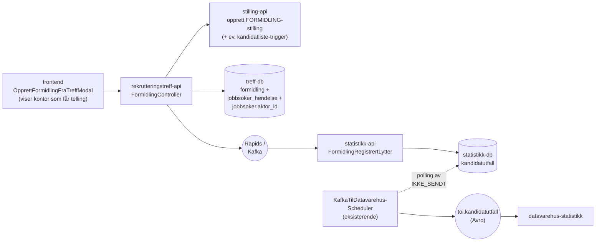
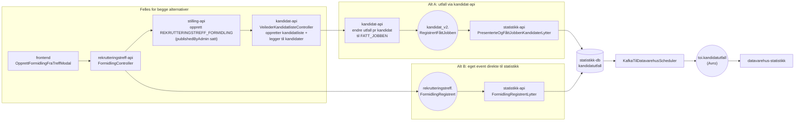

# Plan: Send formidlingsutfall fra rekrutteringstreff-api til statistikk-api

> **Status:** Plan + delvis kode. Alt B-sporet er påbegynt med [`FormidlingPublisher`](../../../apps/rekrutteringstreff-api/src/main/kotlin/no/nav/toi/jobbsoker/formidling/FormidlingPublisher.kt) i `rekrutteringstreff-api`, [`FormidlingRegistrertLytter`](../../../../rekrutteringsbistand-statistikk-api/src/no/nav/statistikkapi/kandidatutfall/FormidlingRegistrertLytter.kt) i `statistikk-api`, og registrering av lytteren i [`application.kt`](../../../../rekrutteringsbistand-statistikk-api/src/no/nav/statistikkapi/application.kt). Det som gjenstår i alt B er kallstedet i `FormidlingController`, kall til `stilling-api`/`kandidat-api`, lagring i treff-db, reversering og tester. Henger sammen med [fatt-jobben-rekrutteringstreff.md](./fatt-jobben-rekrutteringstreff.md) (alt 2A) og [fatt-jobben-etterregistrering-rekrutteringstreff.md](./fatt-jobben-etterregistrering-rekrutteringstreff.md) (alt 2B), men forutsetter en tredje retning der `rekrutteringstreff-api` selv eier formidlingen via `FormidlingController`.

## Bakgrunn

En kollega bygger nå et eget endepunkt i `rekrutteringstreff-api` (`FormidlingController`) som:

1. Oppretter en stilling i `stilling-api` (etterregistrering, kategori `FORMIDLING`).
2. Lagrer `(rekrutteringstreffId, personId, arbeidsgiverId, nav_ident, nav_kontor, tidspunkt, …)` i en ny `formidling`-tabell i treff-databasen.
3. Skriver en `FATT_JOBB`-hendelse på jobbsøkeren i samme transaksjon.

Min del: ta utfallsdata fra denne nye tabellen og få det inn i `statistikk-api` slik at det havner i `kandidatutfall`-tabellen og videre på `toi.kandidatutfall` Avro-topic mot datavarehus.

## Beslutninger

| Tema                         | Valg                                                                                                                                                                                                                                                                                                                         |
| ---------------------------- | ---------------------------------------------------------------------------------------------------------------------------------------------------------------------------------------------------------------------------------------------------------------------------------------------------------------------------- |
| Transport                    | **Rapids** fra `rekrutteringstreff-api` til `statistikk-api`. Alt B-lytteren er implementert og registrert i `statistikk-api`. Publisher finnes i treff-api, men kallstedet i `FormidlingController` gjenstår.                                                                                                               |
| Pollingtabell / utsendingskø | **Nei.** Eventet publiseres direkte når formidlingen lagres, via `FormidlingPublisher`. Ingen separat scheduler eller utsendingstabell i treff-api.                                                                                                                                                                           |
| Avro mot datavarehus         | **Behold eksisterende [`kandidatutfall.avsc`](../../../../rekrutteringsbistand-statistikk-api/src/main/avro/kandidatutfall.avsc).** I v1 sender vi treff-utfall som `stillingskategori = FORMIDLING`. Ekstra kategori (f.eks. `REKRUTTERINGSTREFF`) kan komme i en senere versjon.                                              |
| NavKontor på formidlingen    | Kontoret som får telling er kontoret som opprettet rekrutteringstreffet (`opprettetAvNavkontorEnhetId`) — altså kontoret som ble valgt da treffet ble opprettet.                                                                                                                                                             |
| `navIdent`                   | Hentes fra token i `FormidlingController` — den som utfører handlingen. Lagres på formidlingsraden, sendes på Rapids.                                                                                                                                                                                                        |
| `tidspunkt`                  | 1:1 med `tidspunkt`-kolonnen i `formidling`-tabellen i treff-api.                                                                                                                                                                                                                                                            |
| `aktørId`                    | **Alt B:** må være lagret på jobbsøkeren i treff-api før eventet publiseres (se [Forutsetning: aktørId på jobbsøker](#forutsetning-aktørid-på-jobbsøker)). **Alt A:** ikke nødvendig i treff-api — `kandidat-api` slår opp `aktørId` selv ut fra kandidaten i listen og fyller det inn i `kandidat_v2.RegistrertFåttJobben`. |
| Utfallstype                  | Kun `FATT_JOBBEN` i v1. Eventet bærer `utfall` som string for å matche [`Utfall`-enumet](../../../../rekrutteringsbistand-statistikk-api/src/no/nav/statistikkapi/kandidatutfall/Kandidatutfall.kt) i statistikk-api.                                                                                                           |

## Datagrunnlag fra treff-api

| Felt                   | Kilde                                                  | Brukes av statistikk                                       |
| ---------------------- | ------------------------------------------------------ | ---------------------------------------------------------- |
| `formidlingId`         | `formidling.id`                                        | Korrelasjon/logging. Ikke lagret i `kandidatutfall` per nå. |
| `rekrutteringstreffId` | `formidling.rekrutteringstreff_id`                     | Intern dimensjon                                           |
| `aktørId`              | `jobbsoker.aktor_id` (slått opp fra `person_id`)       | `aktørId` i Avro                                           |
| `arbeidsgiverOrgnr`    | `formidling.arbeidsgiver_id` → orgnr                   | (ikke i Avro i v1)                                         |
| `stillingsId`          | Stilling opprettet i `stilling-api`                    | `stillingsId` i Avro                                       |
| `kandidatlisteId`      | Kandidatliste til formidlingsstillingen                | `kandidatlisteId` i Avro. Påkrevd av lytter og datavarehus. |
| `tidspunkt`            | `formidling.tidspunkt`                                 | `tidspunkt` i Avro                                         |
| `navIdent`             | Token i `FormidlingController`                         | `navIdent` i Avro                                          |
| `navKontor`            | Treffets `opprettetAvNavkontorEnhetId`                 | `navKontor` i Avro                                         |
| `utfall`               | Hardkodet `FATT_JOBBEN` i v1                           | `utfall` i Avro                                            |
| `stillingskategori`    | Default `FORMIDLING` i `FormidlingPublisher`           | Lagres i `stilling`-tabellen i statistikk-db og brukes i Avro |

### Forutsetning: aktørId på jobbsøker

> **Gjelder kun alt B.** I alt A trenger vi ikke `aktørId` i treff-api — `kandidat-api` har allerede aktørId på kandidaten i kandidatlisten og fyller det inn på `kandidat_v2.RegistrertFåttJobben`-eventet selv. Treff-api sender bare fnr (eller eksisterende kandidatreferanse) til kandidat-api. Hvis vi velger alt A bortfaller hele dette kravet, inkludert kolonneendring og PDL-oppslag.

`statistikk-api` bruker `aktørId` som primær identifikator for personen i `kandidatutfall`. I dag inneholder `jobbsoker`-tabellen i treff-api ikke `aktørId`.

Krav for å kunne sende treff-utfall til statistikk via alt B:

- `jobbsoker`-tabellen får ny kolonne `aktor_id text`.
- Når en jobbsøker legges til i et treff, slås `aktørId` opp via PDL/aktørregister og lagres på raden.
- Lookup ved publiseringstidspunkt hadde også fungert, men det er enklere å lagre én gang og slippe nye PDL-kall ved hver formidling.

Backfill av eksisterende jobbsøkere håndteres som egen oppgave (lazy ved første utfall, eller batchjobb).

## Avro mot datavarehus

`AvroKandidatutfall` beholdes uendret i v1:

```json
[
  {
    "namespace": "no.nav.rekrutteringsbistand",
    "name": "AvroStillingskategori",
    "type": "enum",
    "symbols": ["STILLING", "FORMIDLING", "JOBBMESSE"]
  },
  {
    "namespace": "no.nav.rekrutteringsbistand",
    "type": "record",
    "name": "AvroKandidatutfall",
    "fields": [
      { "name": "aktørId", "type": "string" },
      { "name": "utfall", "type": "string" },
      { "name": "navIdent", "type": "string" },
      { "name": "navKontor", "type": "string" },
      { "name": "kandidatlisteId", "type": "string" },
      { "name": "stillingsId", "type": "string" },
      { "name": "tidspunkt", "type": "string" },
      { "name": "stillingskategori", "type": "AvroStillingskategori" }
    ]
  }
]
```

I v1 rapporterer vi treff-formidling som `stillingskategori = FORMIDLING`. Vi tar med dagens skjema til datavarehus og spesifiserer kun at de senere kan få en ekstra kategori (`REKRUTTERINGSTREFF`) hvis vi velger å skille dem eksternt.

### `utfall`-feltet (string)

Selv om `utfall` er `string` i Avro, har det i praksis tre lovlige verdier — bestemt av [`Utfall`-enumet](../../../../rekrutteringsbistand-statistikk-api/src/no/nav/statistikkapi/kandidatutfall/Kandidatutfall.kt) i statistikk-api:

| Verdi             | Kilde i dag                                                                    | Brukes for treff-formidling? |
| ----------------- | ------------------------------------------------------------------------------ | ---------------------------- |
| `IKKE_PRESENTERT` | Reversering av `PRESENTERT` (kandidat-api)                                     | Nei                          |
| `PRESENTERT`      | `kandidat_v2.RegistrertDeltCv` (kandidat-api)                                  | Nei                          |
| `FATT_JOBBEN`     | `kandidat_v2.RegistrertFåttJobben` (kandidat-api), og **ny: treff-formidling** | **Ja**                       |

Treff-formidling sender alltid `FATT_JOBBEN` i v1.

## Arkitektur



### Stegvis

1. `FormidlingController` lagrer formidling med treffets opprettede kontor som `navKontor`, oppretter stilling i `stilling-api` og skriver `FATT_JOBB`-hendelse i samme transaksjon.
2. **Rett etter commit** publiseres `rekrutteringstreff.FormidlingRegistrert` på Rapids via `FormidlingPublisher`. Ingen pollingtabell. Selve kallstedet fra `FormidlingController` gjenstår.
3. `FormidlingRegistrertLytter` i `statistikk-api` mottar eventet, bygger `OpprettKandidatutfall`, kaller eksisterende `LagreUtfallOgStilling` og er allerede registrert i `application.kt`.
4. Eksisterende `KafkaTilDatavarehusScheduler` plukker `IKKE_SENDT`-rader fra `kandidatutfall` og publiserer Avro mot `toi.kandidatutfall`.

> Trade-off ved å droppe pollingtabell: Hvis Rapids er nede akkurat når `FormidlingController` committer, mister vi eventet for den formidlingen. Da må operatør kjøre manuell rekonstruksjon fra `formidling`-tabellen. Vurderes akseptabelt for v1: Rapids har høy oppetid, treff-formidling er lavfrekvent, og vi har full sporbarhet i `formidling`-tabellen.

## Lagring

### Treff-api

- Ny kolonne `jobbsoker.aktor_id text` hvis vi velger alt B (jf. [Forutsetning: aktørId på jobbsøker](#forutsetning-aktørid-på-jobbsøker)).
- `formidling`-tabellen (eies av kollega) må inneholde feltene listet i [Datagrunnlag fra treff-api](#datagrunnlag-fra-treff-api). Spesielt `nav_ident` (fra token), `nav_kontor` (fra treffets `opprettetAvNavkontorEnhetId`) og `tidspunkt`.
- `FormidlingPublisher` finnes og publiserer eventet med Kafka-nøkkel lik `formidlingId`. Den er ikke koblet til `FormidlingController` ennå.
- **Ingen** `formidling_utsending`-tabell, **ingen** `FormidlingUtfallScheduler`.

### Statistikk-api

`kandidatutfall` brukes som den er. Ingen schemaendring i v1. `FormidlingRegistrertLytter` er koblet inn i `application.kt` sammen med de eksisterende lytterne. Den bruker `LagreUtfallOgStilling`, som dedupliserer på eksisterende kandidatutfall-felter, ikke på `formidlingId`.

Vi vurderer eventuelt en valgfri kolonne `rekrutteringstreff_id uuid` eller `formidling_id uuid` for intern sporbarhet/hard idempotens, men `stillingsId` (formidlingsstillingen) er allerede unik per formidling og holder trolig for v1 hvis eksisterende deduplisering er nok.

## DTO-er

### Rapids-event (treff-api → statistikk-api)

```jsonc
{
  "@event_name": "rekrutteringstreff.FormidlingRegistrert",
  "formidlingId": "<uuid>",
  "rekrutteringstreffId": "<uuid>",
  "aktørId": "...",
  "stillingsId": "<uuid>",
  "kandidatlisteId": "<uuid>",
  "organisasjonsnummer": "...",
  "tidspunkt": "2026-05-13T10:00:00+02:00",
  "navIdent": "Z999999",
  "navKontor": "0314",
  "utfall": "FATT_JOBBEN",
  "stillingskategori": "FORMIDLING",
}
```

| Felt                   | Påkrevd | Kilde                                                          |
| ---------------------- | ------- | -------------------------------------------------------------- |
| `formidlingId`         | Ja      | `formidling.id` — Kafka-nøkkel, logging og korrelasjon. Ikke brukt i `OpprettKandidatutfall` per nå. |
| `rekrutteringstreffId` | Ja      | `formidling.rekrutteringstreff_id`                             |
| `aktørId`              | Ja      | `jobbsoker.aktor_id`                                           |
| `stillingsId`          | Ja      | UUID for formidlingsstillingen                                 |
| `kandidatlisteId`      | Ja      | UUID for kandidatlisten                                        |
| `organisasjonsnummer`  | Ja      | Arbeidsgiver fra treffet. Påkrevd og logges av lytter, men brukes ikke i `OpprettKandidatutfall`/Avro per nå. |
| `tidspunkt`            | Ja      | `formidling.tidspunkt` 1:1                                     |
| `navIdent`             | Ja      | Token i `FormidlingController` (markedskontaktens ident)       |
| `navKontor`            | Ja      | Kontoret som opprettet treffet (`opprettetAvNavkontorEnhetId`) |
| `utfall`               | Ja      | `FATT_JOBBEN` i v1                                             |
| `stillingskategori`    | Ja      | Default `FORMIDLING` i publisher. Lytteren mapper med `Stillingskategori.fraNavn(...)` før lagring. |

> Vi bruker et **eget event-navn** (`rekrutteringstreff.FormidlingRegistrert`) i stedet for å gjenbruke `kandidat_v2.RegistrertFåttJobben`. Begrunnelse: vi slipper å bygge syntetisk `stilling`/`stillingsinfo`-wrapper for å passere `erEntenKomplettStillingEllerIngenStilling`-validering i eksisterende lytter, og vi gjør kilden eksplisitt for fremtidig debugging.

### Statistikk-api: intern modell

Ingen endringer i `OpprettKandidatutfall` eller `KandidatutfallRepository` i v1 — vi mapper fra Rapids-eventet til eksisterende felter og kaller `LagreUtfallOgStilling` som vanlig.

Det som ligger i `FormidlingRegistrertLytter` nå:

- Krever alle feltene i Rapids-eventet: `formidlingId`, `rekrutteringstreffId`, `aktørId`, `stillingsId`, `kandidatlisteId`, `organisasjonsnummer`, `tidspunkt`, `navIdent`, `navKontor`, `utfall`, `stillingskategori`.
- Parser `tidspunkt` med `ZonedDateTime.parse(...)`, `utfall` med `Utfall.valueOf(...)` og `stillingskategori` med `Stillingskategori.fraNavn(...)`.
- Bygger `OpprettKandidatutfall` med `synligKandidat = true`, mens `harHullICv`, `alder`, `innsatsbehov` og `hovedmål` settes til `null`.
- Sender videre til `LagreUtfallOgStilling`, som også lagrer `stillingsId` + `stillingskategori` i statistikk-api sin `stilling`-tabell.
- Lytteren er registrert i `application.kt` etter `VisningKontaktinfoLytter`.

Deduplisering skjer i eksisterende `LagreUtfallOgStilling`/`KandidatutfallRepository`: samme `aktørId`, `kandidatlisteId`, `utfall`, `tidspunkt` og `navIdent` lagres ikke på nytt, og siste like utfall for samme kandidat/kandidatliste lagres heller ikke på nytt. `formidlingId` er altså ikke hard idempotensnøkkel i statistikk-api per nå.

## Endringer per system

| System                   | Endring                                                                                                                                                                                                                                                                                                                                                    |
| ------------------------ | ---------------------------------------------------------------------------------------------------------------------------------------------------------------------------------------------------------------------------------------------------------------------------------------------------------------------------------------------------------- |
| `frontend`               | `OpprettFormidlingFraTreffModal` viser beskjed om hvilket kontor som får telling: kontoret som opprettet rekrutteringstreffet. Ingen `NavKontorVelger` for formidling.                                                                                                                                                                                     |
| `rekrutteringstreff-api` | Alt B: ny kolonne `jobbsoker.aktor_id` + oppslag mot PDL/aktørregister når jobbsøker legges til. `FormidlingPublisher` er implementert og publiserer `rekrutteringstreff.FormidlingRegistrert` med `formidlingId` som Kafka-nøkkel. `FormidlingController`-kallstedet gjenstår. Ingen pollingtabell, ingen scheduler.                                      |
| `statistikk-api`         | `FormidlingRegistrertLytter` (alt B) er implementert og registrert i `application.kt`. Bygger `OpprettKandidatutfall` og kaller eksisterende `LagreUtfallOgStilling`. Ingen schemaendring. Ikke nødvendig hvis vi velger alt A.                                                                                                                              |
| `stilling-api`           | Ny kategori `REKRUTTERINGSTREFF_FORMIDLING` + `rekrutteringstreffId` på `Stillingsinfo` (påbegynt i [`formidling_rekrutteringstreff`](../../../../rekrutteringsbistand-stilling-api)). I tillegg: utvidet opprettelses-DTO som tar imot arbeidsgiver og jobbsøkerliste, og setter `publishedByAdmin` slik at kandidatlisten faktisk opprettes i kandidat-api. |
| `kandidat-api`           | Kandidatliste opprettes som i dag via `VeilederKandidatlisteController.skalOppretteKandidatliste` når stillingen har `publishedByAdmin`. Alt A: nytt eller utvidet endepunkt for å legge til kandidater og sette utfall `FATT_JOBBEN` uten en menneskelig veileder i konteksten. Alt B: kun «legg til kandidater i listen», ingen utfallsregistrering her. |
| `datavarehus-statistikk` | Ingen schemaendring i v1. Kun varsel om at en ny kategori (`REKRUTTERINGSTREFF`) kan komme i en senere versjon.                                                                                                                                                                                                                                            |

## Opprettelse av formidlingsstilling og kandidatliste

Datavarehus krever at de som har «fått jobben» ligger som kandidater i kandidatlisten til en stilling. Det betyr at `rekrutteringstreff-api` ikke kan nøye seg med å publisere et utfall — vi må først opprette en **formidlingsstilling** og en tilhørende **kandidatliste** med jobbsøkerne som har svart ja, og deretter sende utfall `FATT_JOBBEN` for hver av dem.

### Hva som allerede er påbegynt i `rekrutteringsbistand-stilling-api`

Branch [`formidling_rekrutteringstreff`](../../../../rekrutteringsbistand-stilling-api) (commit `f2fcb9f`, «Legg til mulighet for å opprette formidling på rekrutteringstreff») introduserer:

- Ny verdi i `Stillingskategori`-enumet: `REKRUTTERINGSTREFF_FORMIDLING` (i tillegg til eksisterende `FORMIDLING`).
- Nytt felt `rekrutteringstreffId: UUID?` på `Stillingsinfo`, `StillingsinfoDto` og `OpprettRekrutteringsbistandstillingDto`.
- Ny kolonne `rekrutteringstreffid` i `stillingsinfo`-tabellen, lest/skrevet av `StillingsinfoRepository`.
- Eierskifte er blokkert for både `FORMIDLING` og `REKRUTTERINGSTREFF_FORMIDLING` (`StillingsinfoService.overtaEierskapForEksternStillingOgKandidatliste` og `StillingService.kopierStilling`).
- Komponenttester som dokumenterer at `kategori = REKRUTTERINGSTREFF_FORMIDLING` skal lagres med `rekrutteringstreffId` satt, mens `kategori = FORMIDLING` ikke har det.

Det branchen **ikke** løser:

- Ingen mottak av jobbsøkerliste / orgnr i samme kall — i dag følger `OpprettRekrutteringsbistandstillingDto` det vanlige flyten der frontend etterpå fyller inn arbeidsgiver, kandidater osv. via flere kall.
- Ingen automatisk opprettelse av kandidatliste i `kandidat-api` — det skjer bare når stillingen blir publisert «av admin» (`publishedByAdmin` ikke tom), via [`VeilederKandidatlisteController.skalOppretteKandidatliste`](../../../../rekrutteringsbistand-kandidat-api/src/main/java/no/nav/arbeid/cv/kandidatlister/rest/kandidatliste/VeilederKandidatlisteController.java).
- Ingen «legg til kandidater i listen»-flyt i samme operasjon.

### Foreslått flyt

1. **`rekrutteringstreff-api` → `stilling-api`**: nytt kall som oppretter en `REKRUTTERINGSTREFF_FORMIDLING`-stilling med:
   - Ferdig utfylt arbeidsgiver (orgnr + navn) — kommer fra valgt arbeidsgiver i treffet.
   - `rekrutteringstreffId` (slik branchen allerede legger opp til).
   - `publishedByAdmin` satt (et tidsstempel) slik at `kandidat-api` faktisk oppretter kandidatlisten via eksisterende mekanisme.
   - Liste over jobbsøkere som skal inn i kandidatlisten med utfall `FATT_JOBBEN` — minimum `aktørId` per jobbsøker.

   Dette krever at `OpprettRekrutteringsbistandstillingDto` (eller et nytt søsken-DTO, f.eks. `OpprettRekrutteringstreffFormidlingDto`) i `stilling-api` utvides til å ta:
   - `arbeidsgiver: { orgnr, navn }`
   - `kandidater: List<{ aktørId, fnr?, fornavn?, etternavn? }>`
   - eventuelt `tidspunkt` for formidlingen (for sporbarhet — utfallets tidspunkt settes uansett av den som registrerer utfallet).

2. **`stilling-api` → `arbeidsplassen` + intern lagring**: oppretter stillingen som i dag (`StillingService.opprettStilling`), lagrer `Stillingsinfo` med kategori og `rekrutteringstreffId`, og setter `publishedByAdmin`.

3. **`stilling-api` → `kandidat-api`** (skjer i dag via `KandidatlisteKlient.sendStillingOppdatert`): siden `publishedByAdmin` er satt, oppretter `VeilederKandidatlisteController.opprettEllerOppdaterKandidatlisteBasertPåStilling` kandidatlisten. Synkron i dagens flyt.

4. **Legge til kandidater på listen med utfall `FATT_JOBBEN`**: dette er steget der vi har et reelt valg mellom to alternativer (se neste seksjon). I begge tilfellene må kandidatene legges i listen i `kandidat-api`. Spørsmålet er hvem som registrerer utfallet, og hvor det sendes fra.

### To alternativer for utfallsregistrering



> Den øverste kjeden (frontend → treff-api → stilling-api → kandidat-api for å opprette stilling og kandidatliste) er **felles** for begge alternativer. Forskjellen ligger i hvor utfallet `FATT_JOBBEN` oppstår og hvordan det havner i `kandidatutfall`.

#### Alternativ A — Utfall via veileders kandidatliste-kontroller i `kandidat-api`

`rekrutteringstreff-api` (eller `stilling-api` på vegne av treff-api) kaller eksisterende [`VeilederKandidatlisteController`](../../../../rekrutteringsbistand-kandidat-api/src/main/java/no/nav/arbeid/cv/kandidatlister/rest/kandidatliste/VeilederKandidatlisteController.java) for å:

1. Legge til kandidatene i listen.
2. Endre utfall til `FATT_JOBBEN` per kandidat — dette trigger eksisterende `kandidat_v2.RegistrertFåttJobben`-event som `statistikk-api` allerede lytter på via `PresenterteOgFåttJobbenKandidaterLytter`.

**Fordeler**

- **Ingen nye eventer eller lyttere.** Hele eksisterende flyten — inkludert `KandidatlistehendelseLytter`, `PresenterteOgFåttJobbenKandidaterLytter`, `ReverserPresenterteOgFåttJobbenKandidaterLytter`, og kobling til `inkludering`-felter — gjenbrukes.
- **Reverseringer er gratis.** Sletting av en formidling kan gjøres ved å endre utfallet tilbake (`FjernetRegistreringFåttJobben`), som igjen håndteres av eksisterende lytter.
- **Datavarehus ser ingen forskjell.** Samme `aktørId`/`stillingsId`/`kandidatlisteId`-trippel som for vanlige fått-jobben-registreringer.
- **Inkluderingsfelter** (hull i CV, alder, innsatsbehov, hovedmål) blir riktig fylt ut — i dag er disse `null` i alternativ B, hvilket kan gi dårligere statistikk.

**Ulemper**

- **Server-til-server-kall fra `rekrutteringstreff-api` til `kandidat-api`.** Krever ny TokenX/Azure-klient, autentisering som veileder eller systembruker, og synkron koordinering på tvers av to APIer i én operasjon.
- **`kandidat-api` må kunne kalles uten en menneskelig veileder i konteksten.** I dag forutsetter `VeilederKandidatlisteController` en innlogget veileder (`navIdent` fra token); vi må enten gjenbruke markedskontaktens token (rekkevidde må dekke kandidat-api) eller åpne et nytt endepunkt som tar `navIdent` som parameter.
- **Tett kobling.** Treff-api blir avhengig av at både `stilling-api` og `kandidat-api` er oppe i selve formidlingsoperasjonen. Hvis kandidat-api feiler etter at stillingen er opprettet, har vi en stilling uten utfall som krever opprydning.
- **Skjuler kilden.** `kandidatutfall`-radene ser ut til å komme fra ordinær fått-jobben-registrering. For framtidig debugging og statistikk-segmentering må vi enten lese `stillingskategori = REKRUTTERINGSTREFF_FORMIDLING` på `stilling`-tabellen i statistikk-db, eller introdusere ny kategori senere uansett.

#### Alternativ B — Eget event direkte fra `rekrutteringstreff-api` til `statistikk-api`

Dette er flyten som er beskrevet i resten av dette dokumentet (`rekrutteringstreff.FormidlingRegistrert` → `FormidlingRegistrertLytter`). I tillegg må `rekrutteringstreff-api` selv legge kandidatene i kandidatlisten i `kandidat-api` (eller la stilling-api gjøre det), slik at datavarehusets krav om at kandidaten finnes i listen er oppfylt.

**Fordeler**

- **Eksplisitt kilde.** Eget event-navn gjør det lett å filtrere, debugge og senere legge på en egen `stillingskategori`-verdi.
- **Løsere kobling.** Treff-api trenger bare å publisere på Rapids; statistikk-api henter raden i sitt eget tempo. Hvis statistikk-api er nede, blir eventet liggende på topic.
- **Enklere autorisasjon mot statistikk-api.** Ingen synkrone server-til-server-kall mellom treff-api og kandidat-api/statistikk-api utover Rapids.
- **Kontroll over hvilke felter vi tar med.** Vi sender bare det som er relevant for kandidatutfall, ikke et stort `kandidat_v2`-event med stilling, stillingsinfo og inkludering.

**Ulemper**

- **Inkluderingsfeltene blir `null`.** Vi har ikke disse dataene tilgjengelig i treff-api og må enten hente dem (nytt kall mot kandidat-api / synlighet) eller akseptere at statistikken er mindre rik for treff-formidlinger.
- **Reverseringer må implementeres separat.** Sletting av en formidling krever et eget event (`rekrutteringstreff.FormidlingFjernet`) og en egen lytter, eventuelt med valg mellom å sende `IKKE_PRESENTERT` eller `PRESENTERT` — se [Spørsmål om reversering](#åpne-spørsmål).
- **Ny lytter å vedlikeholde** i statistikk-api, parallelt med eksisterende fått-jobben-lytter.
- **Vi må fortsatt opprette kandidatliste og legge til kandidater** i `kandidat-api`. Det vil si at vi ikke unngår koblingen mot kandidat-api fullstendig — den blir bare flyttet til et eget steg som ikke trigger utfallsregistrering.

### Flere jobbsøkere i én registrering — fan-out til datavarehus

En formidling kan inneholde flere jobbsøkere på én gang (alle markedskontakten registrerer som «fått jobben» mot samme stilling/kandidatliste). Datavarehus krever én Avro-rad per `(aktørId, stillingsId, kandidatlisteId, utfall, tidspunkt)`, så fan-out må skje et sted.

| Lag                            | Alt A — utfall via kandidat-api                                                                                                                                                 | Alt B — eget event direkte til statistikk                                                                                                                                                                          |
| ------------------------------ | ------------------------------------------------------------------------------------------------------------------------------------------------------------------------------- | ------------------------------------------------------------------------------------------------------------------------------------------------------------------------------------------------------------------ |
| `rekrutteringstreff-api`       | Ett kall til `kandidat-api` per jobbsøker (eller batch-endepunkt om det finnes), med samme `stillingsId`/`kandidatlisteId`. Treff-api gjør ingen Rapids-publisering for utfall. | `FormidlingController` publiserer **ett `rekrutteringstreff.FormidlingRegistrert`-event per jobbsøker**, alle med samme `stillingsId`/`kandidatlisteId` og hver sin `formidlingId` + `aktørId`. Ingen array-event. |
| `kandidat-api`                 | Emitterer ett `kandidat_v2.RegistrertFåttJobben` per kandidat som får utfall endret — eksisterende mekanisme.                                                                   | Ingen rolle i utfallsregistreringen (kun «legg kandidatene i listen»-kall).                                                                                                                                        |
| `statistikk-api`               | Eksisterende `PresenterteOgFåttJobbenKandidaterLytter` lagrer én `kandidatutfall`-rad per event. Fan-out skjer naturlig.                                                        | `FormidlingRegistrertLytter` lagrer én `kandidatutfall`-rad per event. Deduplisering skjer på eksisterende kandidatutfall-felter, ikke på `formidlingId`.                                                           |
| `KafkaTilDatavarehusScheduler` | Plukker hver `IKKE_SENDT`-rad og publiserer én Avro-melding på `toi.kandidatutfall`.                                                                                            | Samme — uendret.                                                                                                                                                                                                   |

**Hvorfor ett event per jobbsøker (alt B), ikke ett samlet med array?** Reversering og feilhåndtering blir per jobbsøker. Hvis lytteren feiler på én jobbsøker, blokkerer vi ikke de andre. `formidlingId` blir naturlig korrelasjonsnøkkel og Kafka-nøkkel, og kan senere bli hard idempotensnøkkel hvis vi velger å persistere den i statistikk-api. Et array-event ville krevd partiell suksess-håndtering i lytter og delvis reversering ved angring.

**Konsekvens for `formidling`-tabellen i treff-db:** én rad per (jobbsøker, formidling) — altså om markedskontakten registrerer 3 personer i samme operasjon, får vi 3 rader med samme `stillingsId`/`kandidatlisteId`/`tidspunkt` men ulik `personId` og `formidlingId`. Dette gjelder begge alternativer; forskjellen er bare hva som skjer etter commit (kall til kandidat-api vs publisering på Rapids).

### Anbefaling (utkast)

Foreløpig vurdering: **Alternativ B** er enklere å bygge i v1 og gir oss et tydelig event som kan utvides senere, men det binder oss til å vedlikeholde et parallelt sett med utfalls-eventer (registrering + reversering + eventuell statistikkfasit). **Alternativ A** gir mest gjenbruk og rikest statistikk, men koster en ny synkron kobling fra treff-api mot kandidat-api.

Hvis vi tror vi alltid kommer til å trenge inkluderingsfelter og enkel reversering, peker det på A. Hvis vi ønsker å holde treff-domenet selvstendig og sende et eksplisitt event, peker det på B.

Endelig valg gjøres etter avklaring med kandidat-api-eier (auth-modell for systembruker mot `VeilederKandidatlisteController`) og datavarehus (om de aksepterer treff-utfall uten inkluderingsfelter).

## Åpne spørsmål

1. **Når er `kandidatlisteId` garantert tilgjengelig?** Datavarehus krever at jobbsøkerne ligger i kandidatlisten til en stilling — derfor må vi opprette en formidlingsstilling og kandidatliste før utfall publiseres (se [Opprettelse av formidlingsstilling og kandidatliste](#opprettelse-av-formidlingsstilling-og-kandidatliste)). `kandidatlisteId` er obligatorisk UUID i `FormidlingRegistrertLytter`.
2. Hvordan håndteres angring/sletting av en formidling? Speiler vi `FjernetRegistreringFåttJobben`-mønsteret med en egen Rapids-event og `angret_tidspunkt`-kolonne? Avklar i neste iterasjon.
3. **Hvilken reverseringsverdi skal vi bruke for sletting av en formidling?** [`Utfall`-enumet](../../../../rekrutteringsbistand-statistikk-api/src/no/nav/statistikkapi/kandidatutfall/Kandidatutfall.kt) har `IKKE_PRESENTERT` og `PRESENTERT`. I dag brukes `IKKE_PRESENTERT` for å reversere `PRESENTERT`, og bruk for å reversere `FATT_JOBBEN` er ikke entydig avklart. Velger vi alt A skjer dette automatisk via `FjernetRegistreringFåttJobben`-flyten i kandidat-api. Velger vi alt B må vi selv bestemme verdien — vi følger den datavarehus foretrekker (sannsynligvis `PRESENTERT`, fordi kandidaten var presentert på listen før utfall ble satt).
4. Trenger statistikk-api å persistere `formidlingId` for hard idempotens og sporbarhet, eller holder eksisterende deduplisering på `aktørId`/`kandidatlisteId`/`utfall`/`tidspunkt`/`navIdent` i v1?
5. Når og hvordan koordinerer vi en eventuell senere `REKRUTTERINGSTREFF`-kategori med `sf-kandidatutfall`/datavarehus-konsumenten?
6. Backfill av `aktor_id` på eksisterende `jobbsoker`-rader hvis vi velger alt B — lazy ved første bruk, eller egen jobb?

## Prosjekter sjekket

- `rekrutteringstreff-backend/apps/rekrutteringstreff-api` — `JobbsøkerService`, `FormidlingController` (under arbeid), `FormidlingPublisher`, `jobbsoker`-tabellen.
- `rekrutteringsbistand-statistikk-api` — `application.kt`, `FormidlingRegistrertLytter`, `PresenterteOgFåttJobbenKandidaterLytter`, `KandidatutfallRepository`, `LagreUtfallOgStilling`, `Utfall`-enum, `kandidatutfall.avsc`.
- `rekrutteringsbistand-stilling-api` — `StillingService.opprettStilling` og kall til `KandidatlisteKlient.sendStillingOppdatert`.
- `rekrutteringsbistand-kandidat-api` — `VeilederKandidatlisteController.opprettEllerOppdaterKandidatlisteBasertPåStilling` (kandidatliste opprettes kun når `publishedByAdmin` er satt).
- Eksisterende planer i `docs/9-planer/rekrutteringstreff-fått-jobben/` (alt 2A og 2B) som bakgrunn.
