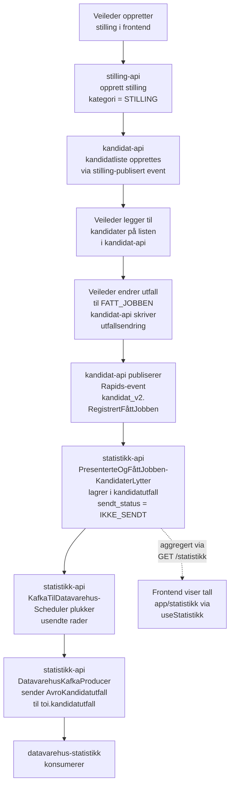
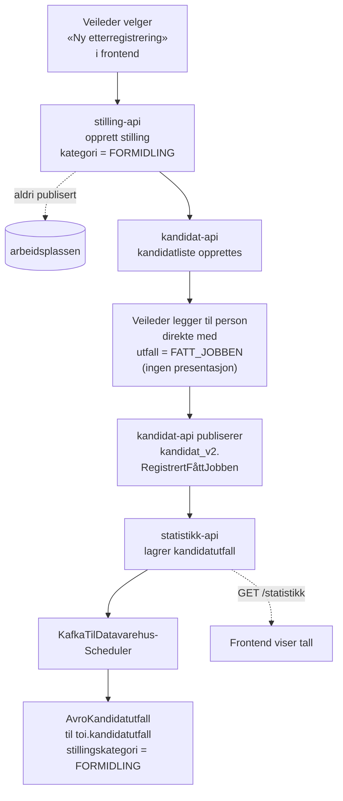
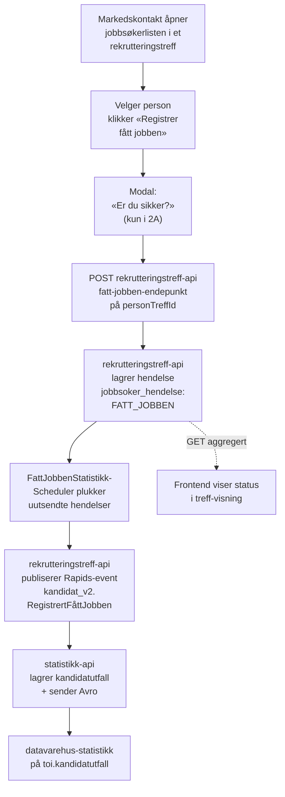
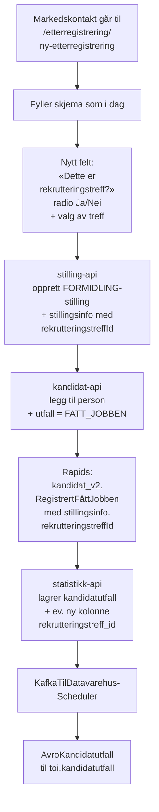

# Plan: «Fått jobben» fra rekrutteringstreff til statistikk

Beslutningsgrunnlag for hvordan vi skal registrere og rapportere _fått jobben_ for jobbsøkere som er rekruttert via et rekrutteringstreff, slik at det havner i samme statistikkgrunnlag som dagens kandidatutfall fra stilling og etterregistrering.

Dokumentet er delt i to:

1. **Dagens løsning** (to varianter — vanlig stilling og etterregistrering/formidling) som referanse.
2. **Forslag til fremtidig løsning** for rekrutteringstreff (to ekskluderende alternativer) som speiler dagens etterregistrering.

«Presentert» og «delt CV» er bevisst utelatt — vi følger kun veien for utfall **FATT_JOBBEN** fram til ekstern statistikk.

## Aktører og systemer

| Forkortelse              | System                                                                                                              |
| ------------------------ | ------------------------------------------------------------------------------------------------------------------- |
| `frontend`               | rekrutteringsbistand-frontend (Next.js)                                                                             |
| `stilling-api`           | rekrutteringsbistand-stilling-api (oppretter formidlings-/stillingsstilling + stillingsinfo)                        |
| `kandidat-api`           | rekrutteringsbistand-kandidat-api (kandidatliste + utfallsendring + Rapids-event)                                   |
| `statistikk-api`         | rekrutteringsbistand-statistikk-api (Rapids-lytter + lagring + Kafka-scheduler)                                     |
| `rekrutteringstreff-api` | rekrutteringstreff-backend / rekrutteringstreff-api (eier av treff og jobbsøkere)                                   |
| `datavarehus-statistikk` | Ekstern konsument av `toi.kandidatutfall` Kafka-topic (Avro). Konkret applikasjon ikke kartlagt i dette workspacet. |

## Felles datakontrakt: `AvroKandidatutfall`

Alle veier ender opp som én melding på `toi.kandidatutfall`. Dette er grensesnittet mot `datavarehus-statistikk`. Definisjonen ligger i [kandidatutfall.avsc](../../../rekrutteringsbistand-statistikk-api/src/main/avro/kandidatutfall.avsc).

| Felt                | Konseptuell betydning                                                   |
| ------------------- | ----------------------------------------------------------------------- |
| `aktørId`           | Jobbsøkers aktør-ID                                                     |
| `utfall`            | `PRESENTERT` \| `FATT_JOBBEN`                                           |
| `navIdent`          | Veileder/markedskontakt som registrerte                                 |
| `navKontor`         | Kontorkode for den som registrerte                                      |
| `kandidatlisteId`   | Identifiserer listen utfallet hører til (i dag knyttet til en stilling) |
| `stillingsId`       | Stillingens ID (i dag obligatorisk anker mot stilling-api)              |
| `tidspunkt`         | Når utfallet skjedde                                                    |
| `stillingskategori` | `STILLING` \| `FORMIDLING` \| `JOBBMESSE`                               |

> `datavarehus-statistikk` skiller i dag _kun_ på `stillingskategori`. Skal rekrutteringstreff fremstå som egen kategori, må enten `stillingskategori`-enumet utvides, eller vi må gjenbruke `FORMIDLING` og akseptere at treff og etterregistrering ikke kan skilles eksternt.

---

## Del 1 — Dagens løsning

### Løp 1A: Ordinær stilling som ender i «fått jobben»

#### Aktivitetsdiagram

#### Nøkkeldata underveis

| Steg                          | Bærende felt                                                                                                                                               |
| ----------------------------- | ---------------------------------------------------------------------------------------------------------------------------------------------------------- |
| Opprett stilling              | `stillingsId`, `stillingskategori = STILLING`                                                                                                              |
| Utfallsendring i kandidat-api | `aktørId`, `kandidatlisteId`, `stillingsId`, `nyttUtfall = FATT_JOBBEN`                                                                                    |
| Rapids-melding                | `@event_name = kandidat_v2.RegistrertFåttJobben` + `tidspunkt`, `utførtAvNavIdent`, `utførtAvNavKontorKode`, `synligKandidat`, `stilling`, `stillingsinfo` |
| Lagring i statistikk-api      | `kandidatutfall(utfall=FATT_JOBBEN, …, sendt_status=IKKE_SENDT)`                                                                                           |
| Kafka til datavarehus         | `AvroKandidatutfall` (se tabell over)                                                                                                                      |

### Løp 1B: Etterregistrering (formidlingsstilling)

Bruker samme kjede av systemer som 1A, men stillingen opprettes _etter_ at jobben er gitt, gjennom egen frontend-flyt (`/etterregistrering/ny-etterregistrering`), og ender som en `FORMIDLING`-stilling. Den publiseres aldri til arbeidsplassen, og brukes i praksis kun som «bærer» av `stillingsId` og `kandidatlisteId` slik at kontrakten mot statistikk-api kan gjenbrukes.

#### Aktivitetsdiagram (delta mot 1A markert)

#### Forskjeller fra 1A

| Aspekt                        | 1A Stilling                        | 1B Etterregistrering                  |
| ----------------------------- | ---------------------------------- | ------------------------------------- |
| Når stilling opprettes        | Før rekruttering                   | Etter at jobben er gitt               |
| `stillingskategori`           | `STILLING`                         | `FORMIDLING`                          |
| Publiseres til Arbeidsplassen | Ja                                 | Nei (blokkeres i stilling-api)        |
| Presenterte-utfall            | Ja                                 | Hoppes over                           |
| Eier kan endres               | Ja                                 | Nei (`403` på formidlingsstilling)    |
| Rapids-event-navn             | `kandidat_v2.RegistrertFåttJobben` | Likt                                  |
| Avro mot datavarehus          | Likt                               | Likt, kun `stillingskategori` skiller |

### Felles for 1A og 1B — avhengighet mot stilling-api

Statistikk-api krever i dag at meldingen inneholder `stillingsId` og at `stilling` + `stillingsinfo` finnes på Rapids-meldingen (`erEntenKomplettStillingEllerIngenStilling`). Det betyr at en hvilken som helst ny kilde til «fått jobben» enten må:

- bære med seg en gyldig `stillingsId` + tilhørende stillingsdata, eller
- få egne lyttere/endepunkter i statistikk-api.

Dette er den viktigste designkonsekvensen for rekrutteringstreff-løpet.

---

## Del 2 — Fremtidig løsning for rekrutteringstreff

Begge alternativene tar utgangspunkt i at en jobbsøker allerede er lagt til på et treff i `rekrutteringstreff-api` (`jobbsoker` + `jobbsoker_hendelse`-tabellene), og at markedskontakt skal kunne registrere at vedkommende har fått jobben.

Felles funksjonelle krav:

- Bekreftelsesmodal («Er du sikker på at du vil registrere fått jobben?») brukes kun i alternativ 2A — inne i rekrutteringstreff. I 2B og dagens etterregistrering brukes ingen modal; angring skjer ved å trykke en «fjern»-knapp på raden.
- **Angring er støttet i v1.** Markedskontakt kan fjerne en feilregistrert «fått jobben». Det lagres som en ny hendelse `FATT_JOBBEN_FJERNET` (event-sourcing — ingen sletting), og en korresponderende melding sendes til `statistikk-api`.
- Handlingen lagres som hendelse på jobbsøker (ny enum-verdi `JobbsokerHendelsestype.FATT_JOBBEN`, og `FATT_JOBBEN_FJERNET` for angring).
- Mot datavarehus gjenbrukes `AvroKandidatutfall`-kontrakten.

### Beslutning som er felles for begge alternativene

Uavhengig av hvilket alternativ vi velger, må vi bestemme **hvordan utfallet merkes for `datavarehus-statistikk`**. Dette er en egen, uavhengig beslutning som ikke påvirkes av valget mellom 2A og 2B:

| Kategori-valg                | `stillingskategori` på Avro                 | Krever endring hos `datavarehus-statistikk` | Konsekvens                                                |
| ---------------------------- | ------------------------------------------- | ------------------------------------------- | --------------------------------------------------------- |
| Gjenbruke `FORMIDLING`       | `FORMIDLING`                                | Nei                                         | Treff og etterregistrering kan ikke skilles eksternt      |
| Innføre `REKRUTTERINGSTREFF` | `REKRUTTERINGSTREFF` (ny verdi i Avro-enum) | Ja (Avro-utvidelse + konsumenttilpasning)   | Treff blir egen dimensjon i ekstern statistikk fra dag én |

### Alternativ 2A — Registrering inne i rekrutteringstreff

Markedskontakt registrerer «fått jobben» direkte fra jobbsøkerlisten i treffet. `rekrutteringstreff-api` eier hele løpet og sender selv på Rapids til `statistikk-api`. Ingen formidlingsstilling opprettes.

#### Aktivitetsdiagram

#### Datamodell-forslag (rekrutteringstreff-api)

| Endring                                                                                         | Hvor                               |
| ----------------------------------------------------------------------------------------------- | ---------------------------------- |
| `JobbsøkerHendelsestype.FATT_JOBBEN`                                                            | `typer.kt`                         |
| Ny tabell `jobbsoker_fatt_jobben_utsending`                                                     | migration i rekrutteringstreff-api |
| Felter: `id`, `jobbsoker_hendelse_id`, `sendt_til_statistikk_tidspunkt`, `forsøk`, `siste_feil` | for idempotens og retries          |

#### Hendelsesdata (`jobbsoker_hendelse.hendelse_data` JSONB)

| Felt                    | Beskrivelse                                   |
| ----------------------- | --------------------------------------------- |
| `registrertAvNavIdent`  | Markedskontaktens NAV-ident                   |
| `registrertAvNavKontor` | Kontorkode                                    |
| `tidspunkt`             | Når «fått jobben» ble registrert              |
| `arbeidsgiverOrgnr`     | Hvilken arbeidsgiver i treffet jobben gjelder |

Ved angring publiseres en separat hendelse `FATT_JOBBEN_FJERNET` med samme JSONB-felter (`registrertAvNavIdent` = den som angret, `tidspunkt` = angretidspunkt, `arbeidsgiverOrgnr` = samme som original). Lytteren i `statistikk-api` markerer raden som angret — se implementasjonsplan for detaljer.

### Alternativ 2B — Bruke dagens etterregistrering med treff-flagg

Markedskontakt går inn i dagens etterregistreringsflyt og krysser av at registreringen gjelder et rekrutteringstreff. En formidlingsstilling opprettes som «bærer» (akkurat som i 1B), og `rekrutteringstreffId` følger med gjennom hele kjeden.

#### Aktivitetsdiagram

#### Endringer som kreves

| System                 | Endring                                                                               |
| ---------------------- | ------------------------------------------------------------------------------------- |
| frontend               | Radioknapp + valg av treff i etterregistreringsskjemaet                               |
| stilling-api           | `stillingsinfo` får valgfritt `rekrutteringstreffId`                                  |
| kandidat-api           | Propagere `rekrutteringstreffId` (eller hele `stillingsinfo`-feltet) videre på Rapids |
| statistikk-api         | Eventuell ny kolonne `rekrutteringstreff_id` for intern oppdeling                     |
| rekrutteringstreff-api | Mottar tilbakekobling? (valgfritt — kan klare seg uten dersom statistikk er målet)    |

### Sammenligning av alternativene

| Tema                                 | 2A (registrering i treff)                                                     | 2B (etterregistrering med flagg)                                 |
| ------------------------------------ | ----------------------------------------------------------------------------- | ---------------------------------------------------------------- |
| Brukeropplevelse                     | Ett klikk i treffet, ingen kontekstskifte                                     | Krever bytte til etterregistreringsflyten                        |
| Eierskap                             | Treff-domenet eier hele løpet                                                 | Stilling-/kandidat-domenet beholder ansvaret                     |
| Nye konsepter for veileder           | Bekreftelsesmodal er ny, ellers samme                                         | Nytt felt i kjent skjema                                         |
| Kobling til kandidatliste/stilling   | Ingen — `stillingsId`/`kandidatlisteId` utelates fra meldingen                | Beholdes — ekte stilling og liste finnes                         |
| Endringsomfang i statistikk-api      | Lite (ny lytter eller utvidet)                                                | Lite (ny kolonne)                                                |
| Endringsomfang i kandidat-api        | Ingen                                                                         | Må videreformidle treff-ID                                       |
| Risiko for inkonsistens              | Lav — én skriver (`rekrutteringstreff-api`)                                   | Middels — fire systemer berøres for én registrering              |
| Avhengighet av at stilling opprettes | Ingen                                                                         | Beholdes (formidlingsstilling opprettes som «bærer»)             |
| Angre senere                         | Egen hendelse `FATT_JOBBEN_FJERNET` i `rekrutteringstreff-api` (støttet i v1) | Gjenbruker dagens `FjernetRegistreringFåttJobben` (støttet i v1) |
| Mulighet for fremtidig nyansering    | Stor — `rekrutteringstreff-api` eier datamodellen                             | Bundet til stillings-/kandidatmodellen                           |

### Anbefaling som diskusjonsutgangspunkt

Alternativ **2A** gir minst risiko for inkonsistens og holder treff-domenet samlet. Kombinert med kategori-valget _«gjenbruke FORMIDLING»_ kan vi rulle ut uten å vente på `datavarehus-statistikk`, og deretter migrere til `REKRUTTERINGSTREFF`-kategori senere uten å endre veileders flyt.

### Valg for v1: alternativ 2B (etterregistrering med treff-flagg)

Etter diskusjon er det flere åpne spørsmål mot `datavarehus-statistikk` som ikke kan lukkes raskt:

- Hvordan oversendes janzz-/stillingskategori i Avro når treffet ikke har en ekte stilling? Trolig nye felt i avromelding til datavarehus.
- «Fått jobben»-modalen må uansett samle inn `stillingskategori` + heltid/deltid. Disse må også sendes videre.
- Datavarehus sammenstiller utfall mot rapporter fra stillingssystemet (bl.a. for stillingskategori), og det tar tid å koordinere endringer hos dem.

Vi går derfor i v1 for **alternativ 2B**: Når noen får jobben via et rekrutteringstreff, registreres det som en ordinær etterregistrering i stilling-/kandidat-domenet, men med et nytt «type»-valg som markerer at det gjelder rekrutteringstreff (ev. workop), og med `rekrutteringstreffId` lagret på `stillingsinfo`. Detaljert plan: [fatt-jobben-etterregistrering-rekrutteringstreff.md](./fatt-jobben-etterregistrering-rekrutteringstreff.md).

**Alternativ 2A er fortsatt et åpent diskusjonsalternativ**, ikke en bestemt langsiktig plan ([fatt-jobben-rekrutteringstreff.md](./fatt-jobben-rekrutteringstreff.md)). Det er fullt mulig at 2B viser seg å være godt nok over tid, eller at etterregistrering på sikt blir en egen modul som er en bedre langsiktig hjem for «fått jobben» fra treff. Hvilken retning vi velger videre, avhenger blant annet av hva 2B faktisk dekker i praksis, hvordan datavarehus utvikler seg, og om vi får behov for å sende rikere data (alder, standardinnsats, arbeidsgiver i treffet) som i dag ikke fanges naturlig opp via stillingskjeden.

---

## Åpne spørsmål til møtet

1. Skal `datavarehus-statistikk` se rekrutteringstreff som egen `stillingskategori`, eller skal det rapporteres som `FORMIDLING`?
2. Hvor ligger ansvaret for «fått jobben hos hvilken arbeidsgiver» når et treff har flere arbeidsgivere?
3. Skal statistikk-api på sikt eksponere et eget aggregat for rekrutteringstreff til frontend, eller holder dagens samlede tall?

## Prosjekter som er sjekket for dette dokumentet

- `rekrutteringsbistand-stilling-api` — opprettelse av FORMIDLING og blokkering mot Arbeidsplassen.
- `rekrutteringsbistand-kandidat-api` — utfallsendring og Rapids-event `kandidat_v2.RegistrertFåttJobben`.
- `rekrutteringsbistand-statistikk-api` — `PresenterteOgFåttJobbenKandidaterLytter`, `KandidatutfallRepository`, `KafkaTilDataverehusScheduler`, `DatavarehusKafkaProducerImpl`, `kandidatutfall.avsc`.
- `rekrutteringsbistand-frontend` — `/etterregistrering`-flyt, `app/api/statistikk`.
- `rekrutteringstreff-backend/apps/rekrutteringstreff-api` — `JobbsøkerHendelsestype`, `jobbsoker_hendelse`-tabellen.

### Prosjekter som **ikke** er åpnet i workspace, men kan være nyttige

- Den konkrete `datavarehus-statistikk`-konsumenten av `toi.kandidatutfall` — for å verifisere hvor mye fleksibilitet vi har på `AvroKandidatutfall`-skjemaet og om en ny `stillingskategori`-verdi vil bryte konsumenten. **Si fra hvilket repo dette er, så kan jeg lese det inn.**
- Et eventuelt felles schema-repo (Avro/`schema-registry`) hvis `kandidatutfall.avsc` deles på tvers — ikke funnet i nåværende workspace.
