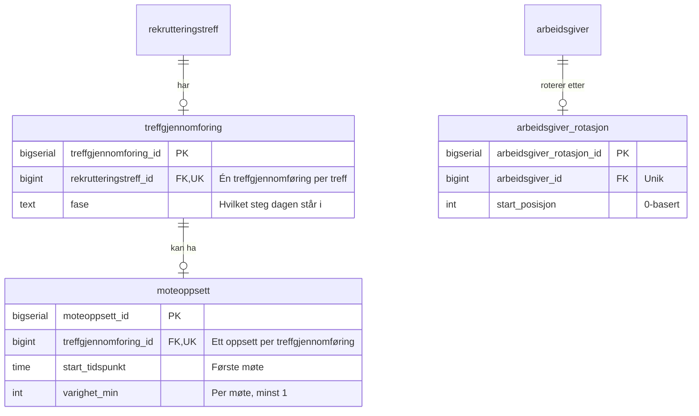
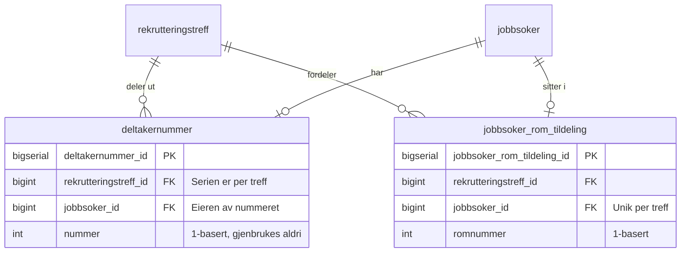
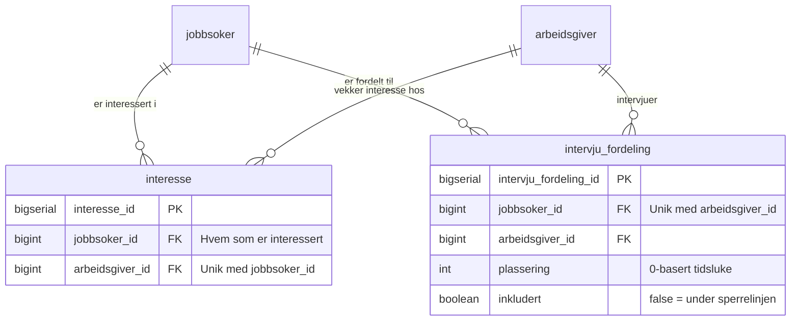
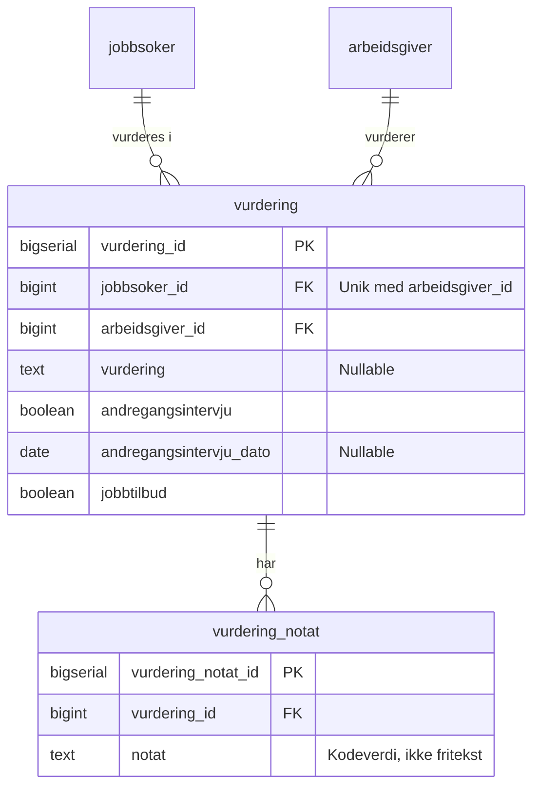

# Plan: Treffgjennomføring – oppmøte, rom og intervju

Forslag til flyt og elementer for de tre oppgavene i
[behov-og-prioriteringer.md](../../../../behov-og-prioriteringer.md) (kapittelet «Oppgaver
som må utredes og utvikles»):

1. **Registrere oppmøte** (behov nr. 6, oppgave 1)
2. **Fordele jobbsøkere i grupperom** (behov nr. 7, oppgave 2)
3. **Fordele jobbsøkere til arbeidsgivere for speedintervju** (behov nr. 8, oppgave 3)
4. **Følge opp resultatet per arbeidsgiver** (behov nr. 9, oppgave 4)

Dette er et **design-, flyt- og statusdokument**. Frontend er implementert i
`rekrutteringsbistand-frontend` med stateful MSW. Backend-delene er fortsatt en
kontraktskisse for `rekrutteringstreff-api`.

## Treffgjennomføring, og WorkOp som utvidelse

Alle rekrutteringstreff har en **treffgjennomføring**: dagen deltakerne faktisk møtes. Det
er treffgjennomføringen som er domenebegrepet i backend. **WorkOp** er ikke en egen
gjennomføring, men den samme treffgjennomføringen med tre steg til.

De tre ekstra stegene henger sammen: de forutsetter alle at deltakerne roterer
mellom arbeidsgivere i egne rom. Et vanlig treff har ingen runder å klokke, ingen
rom å fordele på og ingen rekkefølge å sette opp – derfor faller alle tre bort
samtidig, og det er dette ene skillet som avgjør hvilken variant man ser.

| Steg | Navn                   | Vanlig treff | WorkOp |
| ---- | ---------------------- | ------------ | ------ |
| 1    | Oppmøte                | ✅           | ✅     |
| 2    | Rom og rotasjon        | –            | ✅     |
| 3    | Interesse              | ✅           | ✅     |
| 4    | Intervjufordeling      | –            | ✅     |
| 5    | Registrering av status | ✅           | ✅     |
| 6    | Oppsummering           | ✅           | ✅     |

Stegnumrene er **stabile identiteter, ikke posisjoner**. Interesse er steg 3 i
begge variantene, selv om stegvelgeren tegner det som nummer to i et vanlig
treff. Da betyr `visSteg=3` det samme uansett hvem som åpner lenken, og et nytt
WorkOp-steg senere forskyver ikke adressene til de generelle stegene.

Backend skal ikke ha egne WorkOp-tabeller eller WorkOp-endepunkter. Forskjellen
er hvilke felter som fylles ut, ikke hvilken modell som brukes. Ordet «WorkOp»
hører hjemme i kategorien på treffet – ikke i tabellnavn, DTO-er eller
endepunkter.

---

## Beslutninger (avklart)

| Tema                   | Valg                                                                                                                                                                                                                                                                      |
| ---------------------- | ------------------------------------------------------------------------------------------------------------------------------------------------------------------------------------------------------------------------------------------------------------------------- |
| Omfang                 | **Alle treff** har en treffgjennomføring. WorkOp (`kategori === WORKOP`) er den samme treffgjennomføringen utvidet med møteoppsett, rom og intervjufordeling – de tre stegene som forutsetter rotasjon mellom rom.                                                        |
| Feature toggle         | Samme mønster som Formidlinger-fanen: `getMiljø() !== Miljø.ProdGcp` (vises i lokalt/dev/test, skjult i prod), gated i både `TabsNav.tsx` og `TabsPanels.tsx`. Kategorien styrer nå hvilke steg som vises, ikke om fanen finnes.                                          |
| Inngang                | To innganger: (a) **burgermeny** på jobbsøkerkortet for å registrere oppmøte, og (b) en egen **«Treffgjennomføring og oppfølging»-fane**. Fanen heter det samme for begge variantene.                                                                                     |
| Stegnavigasjon         | Aksel **Stepper** med seks steg for WorkOp og fire for et vanlig treff. Brukeren kan gå tilbake til steg der forutsetningene er oppfylt. Stegnummeret i URL-en er stegets identitet, ikke plassen i rekka.                                                                |
| Aksel-prinsipp         | Bruk Aksel layout-primitives (`VStack`, `HStack`, `HGrid`, `Box`) med spacing tokens. Nye lokale meldinger bruker `LocalAlert` der det passer.                                                                                                                            |
| Persistering           | Én komplett målkontrakt og stateful MSW-handlere dekker alle seks steg. Backend implementerer den samme kontrakten uten å endre frontendtypene.                                                                                                                           |
| Antall rom             | **Avledet: ett rom per arbeidsgiver.** Det er alltid nok rom tilgjengelig, så antallet oppgis ikke manuelt og vises ikke i skjemaet. Rotasjonslogikken håndterer fortsatt ubalanse, men den oppstår ikke i praksis.                                                       |
| Romfordeling           | **Automatisk** første gang via «Opprett møteplan». I steg 2 kan jobbsøkere flyttes manuelt med dra-og-slipp eller direkte romvalg. «Fordel på nytt» erstatter alle manuelle plasseringer med ny round-robin-fordeling etter bekreftelse.                                  |
| Oppmøte-omfang         | Første versjon dekker **kun selve WorkOp-dagen**. Formøte er utenfor omfanget.                                                                                                                                                                                            |
| Oppmøte-lagring        | **Erstattet:** oppmøte lå opprinnelig kun i hendelsene. Det ligger nå i kolonnen `jobbsoker.oppmote`, se [treffgjennomforing-domeneoppdeling.md](treffgjennomforing-domeneoppdeling.md). Egen `JobbsøkerStatus` er fortsatt utenfor omfanget fordi den også krever oppdatering av aktivitetsplanen.                                                                                                             |
| Hvem kan markeres møtt | **Alle** jobbsøkere på lista (ikke begrenset til svarstatus).                                                                                                                                                                                                             |
| Redigerbarhet          | Steg er redigerbare når forutsetningene finnes. Møteoppsettet kan endres også etter opprettelse – tidene styrer bare timeplanen, ikke hvem som sitter hvor – og romplasseringene kan endres i samme steg. Første versjon har ingen egen låse- eller gjenåpningsmekanisme. |
| Oppmøte etter oppsett  | Endret oppmøte skal ikke stille om alle rom i det skjulte. Eksisterende romplasseringer beholdes, ny deltaker legges i rommet med færrest personer, og fjerning berører bare den personen. Brukeren kan deretter flytte manuelt eller velge «Fordel på nytt».             |
| Møteoppsett            | **Starttidspunkt** og **varighet per møte** settes først i steg 2 (kun WorkOp). Standardverdier er `10:00` og `10`. Siste minutt av hvert møte brukes til forflytning, så det finnes ingen egen pause. Antall rom er avledet fra antall arbeidsgivere.                    |
| Rotasjonsplan          | Vises som sammendrag og full matrise i steg 2. To separate utskrifter: **én til arbeidsgiverne** (hvilket rom de skal til, per klokkeslett) og **én til jobbsøkerne** (hvem som kommer til rommet, per klokkeslett). Én mottaker per side.                                |
| Steg 3 (interesse)     | Registrer hvilke arbeidsgivere jobbsøkeren er **interessert i** å møte. Kun fremmøtte jobbsøkere inngår. Gjelder begge variantene.                                                                                                                                        |
| Steg 4 (fordeling)     | Arrangør lager intervjurekkefølge per arbeidsgiver. Jobbsøkere kan flyttes over og under sperrelinjen. Rekkefølgen lagres, men ikke konkrete tidspunkter. Kun WorkOp.                                                                                                     |
| Steg 5 (registrering)  | **Registrering av status** per jobbsøker × arbeidsgiver: oppsummering av interesse og intervju, vurdering (**Aktuell / Kanskje / Ikke aktuell**), **2. intervju**, **Jobbtilbud** og skrivebeskyttet **Formidlet** fra Formidlinger. Gjelder begge variantene.            |
| Steg 6 (oppsummering)  | **Oppsummering** av hele treffet: nøkkeltall for aktuelle kandidater, andregangsintervju, øvrige statuser og formidling, samt en tabell per arbeidsgiver. Hver kandidat telles én gang, med den mest positive vurderinga hen har fått. Gjelder begge variantene.          |
| Tilgang                | **Avklart:** samme eier-regel som resten av API-et. Eier eller utvikler har tilgang, kontortilgang alene gir ikke tilgang. Egen hovedansvarlig-modell er forkastet som unødvendig kompleksitet.                                                                           |

---

## Overordnet flyt

```text
  JOBBSØKER-FANE
      │
      │   Burgermeny på jobbsøkerkort: «Registrer oppmøte»
      │   Handlingsrad: «Marker som møtt (N)» og «Fjern oppmøte (N)»
      ▼
  TREFFGJENNOMFORING-FANE  —  Aksel Stepper
  ───────────────────────────────────────────────────
      │
      ▼
  ┌────────────────────┐
  │ Steg 1             │
  │ Oppmøte            │
  └────────────────────┘
      │                                    ╲
      ▼                                     ╲  vanlig treff
  ┌────────────────────┐  ⟵ kun WorkOp       ╲  hopper over
  │ Steg 2             │                      ╲ steg 2 og 4
  │ Rom og rotasjon    │                       ╲
  │                    │                        ╲
  │ Møteoppsett først, │                         ╲
  │ så romfordeling    │                          │
  │ («Opprett          │                          │
  │  møteplan» bytter  │                          │
  │  innhold i steget) │                          │
  └────────────────────┘                          │
      │   «Neste»                                 │
      ▼                                           ▼
  ┌────────────────────────────────────────────────┐
  │ Steg 3                                         │
  │ Interesse                                      │
  └────────────────────────────────────────────────┘
      │   «Neste»                                 │
      ▼                                           │
  ┌────────────────────┐  ⟵ kun WorkOp            │
  │ Steg 4             │                          │
  │ Intervjufordeling  │                          │
  └────────────────────┘                          │
      │   «Neste»                                 │
      ▼                                           ▼
  ┌────────────────────────────────────────────────┐
  │ Steg 5                                         │
  │ Registrering av status                         │
  └────────────────────────────────────────────────┘
      │   «Neste»
      ▼
  ┌────────────────────────────────────────────────┐
  │ Steg 6                                         │
  │ Oppsummering                                   │
  └────────────────────────────────────────────────┘

  Tilbake: via Stepper kan man når som helst gå til et fullført steg
```

Treffgjennomføring-fanen er en **Aksel Stepper**. Innholdet for det aktive steget rendres
under stegindikatoren. Fullførte steg kan besøkes på nytt (les/rediger), og et
lite sammendrag øverst («23 møtt · 5 rom · 5 arbeidsgivere») gir kontekst på
tvers av steg. Rom-tallet vises bare for WorkOp.

Stegene som lagrer fortløpende viser samme autolagringsstatus på en fast plass i
steghodet: **Lagret**, **Lagrer …** eller **Lagringsfeil**. Statusendringer skal
ikke skyve matriser, arbeidsgiverkort eller jobbsøkerrader. I steg 2 er Stepper
og lokale navigasjonsknapper ikke interaktive mens en romendring lagres, slik at
en lagringsfeil ikke kan skjules ved at komponenten navigeres bort.

> **Hvorfor Stepper?** Aksel anbefaler Stepper til å «navigere eller vise
> brukerens progresjon mellom steg», og komponenten er interaktiv slik at man kan
> hoppe tilbake til fullførte steg. `Process` er for statiske, ikke-styrbare forløp,
> og `Tabs`/`Accordion` er alternativer hvis vi heller vil vise alle steg samtidig.
> Stepper treffer best på «de forrige stegene må kunne ses». Vi beholder likevel
> **Neste/Tilbake-knapper** i tillegg (Stepper skal ikke være eneste navigasjon).

Stepper skal implementeres som knapp (`Stepper.Step as="button"`) i denne SPA-flyten,
med `aria-labelledby` på selve stepperen. Den vises horisontalt på brede flater og
vertikalt under `md`. Stegene skal bare inneholde stegtittel – interaktivt innhold
rendres under stepperen. Steg uten nødvendige data settes
`interactive={false}` til forutsetningene finnes.

## Gjennomgang mot Aksel/Nav best practice

Planen er i hovedsak i tråd med Aksel og dagens Rekbis-mønstre, men implementasjonen
bør styres av disse kravene:

| Område            | Vurdering                                                                                             | Krav i implementasjon                                                                                                                                                                             |
| ----------------- | ----------------------------------------------------------------------------------------------------- | ------------------------------------------------------------------------------------------------------------------------------------------------------------------------------------------------- |
| Stepper           | Riktig komponent når bruker kan navigere mellom steg.                                                 | Bruk `as="button"`, `aria-labelledby`, `completed` bare for reelt fullførte steg og `interactive={false}` for steg uten forutsetninger.                                                           |
| Layout            | Riktig å bruke Aksel primitives for layout.                                                           | Bruk `VStack`/`HStack`/`HGrid`/`Box` med `space-*` tokens for spacing og kolonner.                                                                                                                |
| Tabeller/matriser | `Table` er riktig for enkel tabulær data. `DataGrid` er fortsatt preview og bør ikke være førstevalg. | Bruk `Table` med `caption`, `HeaderCell scope="row"/"col"`, maks ett interaktivt element per celle og tydelig `aria-labelledby` for skjulte checkbox-labels.                                      |
| Lokale meldinger  | Nye lokale infomeldinger bør bruke dagens Aksel-komponenter.                                          | Bruk `LocalAlert` for lokale info-/warning-meldinger der kodebasen tillater det, og unngå å introdusere nye `Alert`-flater uten grunn.                                                            |
| Personvern        | Planen har riktig retning med fiktive mockdata.                                                       | Vis fødselsnummer kun der det trengs (forenklet jobbsøkerliste i steg 1) og logg det aldri. Ikke legg inn notatfelt i v1. Mockdata skal være åpenbart syntetisk (ingen realistiske fødselsnumre). |
| Tilgang           | Frontend-gating er nødvendig, men ikke tilstrekkelig.                                                 | Backend håndhever eierskap og rolle server-side. Kontortilgang alene er ikke nok. Frontend bruker det samme autoritative tilgangsresultatet.                                                      |

---

## Inngang og navigasjon

### 1. Burgermeny i Jobbsøker-fanen (registrere oppmøte)

Oppmøte registreres der man allerede jobber med deltakerne. Burgermenyen finnes
i dag i `JobbsokerKortValg.tsx` (Aksel `ActionMenu` med `MenuElipsisVerticalIcon`,
punktene «Endre svar» og «Slett»). Vi legger til:

- **«Registrer oppmøte»** / **«Fjern oppmøte»** (toggle) som et nytt
  `ActionMenyPunkt`.
- Punktet vises for treff der oppmøtefunksjonen er aktivert. I den lokale
  implementasjonen betyr det alle treff utenfor produksjon; eventuell
  finere feature-toggle innføres før produksjonsaktivering.
- Kortet får en synlig markør når personen er møtt (f.eks. en Aksel `Tag`
  «Møtt», på linje med `JobbsøkerStatusTag`).
- **«Marker som møtt (N)»** og **«Fjern oppmøte (N)»** i `JobbsøkerHandlingsrad`
  for å registrere oppmøte på mange samtidig, basert på avkrysningene i lista.
  Begge sender ett `PUT`-kall per person **sekvensielt** (samme endepunkt som
  burgermenyen) og tømmer valget når alle er registrert. Tellerne viser bare de
  valgte som faktisk endres, så «Marker som møtt» hopper over dem som allerede
  er møtt, og omvendt.
- Fjerning krever bekreftelse, siden den sletter interesser, intervjuplasser og
  vurderinger. Dialogen er den samme `FjernOppmøteBekreftelse` som brukes for
  én person, men får **summen** av registreringene for alle de valgte, slik at
  konsekvensen vises samlet før noe kjøres.
- Avkrysningsboksen i `JobbsøkerKort` var låst til `status === LAGT_TIL` (den
  var laget for invitasjonsflyten). På WorkOp-treff åpnes den for alle
  statuser, siden oppmøte er ortogonalt til svarstatus. «Inviter»-knappen
  påvirkes ikke, fordi den allerede filtrerer på `LAGT_TIL`.

Oppmøte er **ortogonalt** til invitasjonsstatusen (`LAGT_TIL → INVITERT →
SVART_JA …`) – en person kan være «møtt» uansett svarstatus. I første versjon
registreres oppmøte **kun som en hendelse** (ikke som en ny `JobbsøkerStatus`).
Egen jobbsøkerstatus er utenfor omfanget – se «Oppmøte lagret som hendelse».

### 2. Ny «Treffgjennomføring og oppfølging»-fane

Ny verdi i `RekrutteringstreffTabs` (i
[Rekrutteringstreff.tsx](../../../../rekrutteringsbistand-frontend/app/rekrutteringstreff/%5BrekrutteringstreffId%5D/_ui/Rekrutteringstreff.tsx)),
plassert etter `ARBEIDSGIVERE`:

```
OM_TREFFET | JOBBSØKERE | ARBEIDSGIVERE | TREFFGJENNOMFORING | (FORMIDLINGER) | HENDELSER
```

Synlighetsregelen gjelder fanen som helhet, mens **kategorien styrer stegene**,
ikke om fanen finnes:

```ts
const erProd = getMiljø() === Miljø.ProdGcp;
const visTreffgjennomføring = !erProd && harTilgang;
const erWorkOp =
  rekrutteringstreff.kategori === RekrutteringstreffKategori.WORKOP;
```

Regelen legges i både `TabsNav.tsx` (fane-knappen) og `TabsPanels.tsx`
(fane-panelet). Fanen heter **«Treffgjennomføring og oppfølging»** for begge variantene –
WorkOp er ikke et eget sted i grensesnittet, bare flere steg på samme sted.

Navnet nevner oppfølgingen fordi de to siste stegene ikke handler om selve
dagen: vurderinger, andregangsintervju og jobbtilbud registreres i dagene og
ukene etterpå. Het fanen bare «Treffgjennomføring», ville den sett ferdig ut når dagen var
over.

**URL-verdien er `treffgjennomforing`.** Fanenavn er tekst som kan endres, mens
URL-er er noe folk deler og bokmerker. Å bytte verdien ville brutt lenker uten
å gi noen noe igjen for det.

### 3. Aktivt steg i URL-en

Stegvelgeren holder tilstanden i URL-en, på samme måte som fanevalget
(`visFane`). Under et treff sitter flere veiledere på hver sin skjerm, og et
steg må kunne deles i en melding uten å beskrive veien dit. En utilsiktet
oppfriskning skal heller ikke kaste deg tilbake til start.

| Parameter | Verdier | Merknad                                                       |
| --------- | ------- | ------------------------------------------------------------- |
| `visSteg` | `1`–`6` | Utelates på steg 1 (`clearOnDefault`), så adressen holdes ren |

Verdien er stegets **identitet**, ikke posisjonen i stegvelgeren. Et vanlig treff
viser fire steg, men Interesse er fortsatt `visSteg=3`. Stegvelgeren nummererer
det som «2» visuelt, siden Aksel Stepper alltid teller fra 1 – det er en ren
visningsdetalj, og oversettelsen mellom identitet og posisjon skjer i
`Treffgjennomføring.tsx`.

Som resten av appen skriver den med nuqs' standard `history: 'replace'`.
Stegbytte lager altså ikke egne oppføringer i nettleserhistorikken – det
speiler fanebyttet, og gjør at tilbakeknappen fortsatt fører ut av treffet
framfor å vandre bakover gjennom stegene.

**Klemming av ugyldige steg.** Verdien kan komme fra en delt lenke, et bokmerke
eller et håndredigert adressefelt, og kan peke på et steg treffet ikke har
kommet til. Den kan også peke på et **WorkOp-steg i et vanlig treff**.
`nærmesteTilgjengeligeSteg` i
[treffgjennomføringSteg.ts](../../../../rekrutteringsbistand-frontend/app/rekrutteringstreff/%5BrekrutteringstreffId%5D/_ui/treffgjennomføring/treffgjennomføringSteg.ts)
går bakover til første steg som faktisk er tilgjengelig, framfor å vise en tom
side eller kaste brukeren helt til start. URL-en rettes deretter opp, slik at
adressen viser det man faktisk ser på. Ikke-numeriske verdier faller tilbake
til steg 1.

Tilgjengelighetsregelen (`erStegTilgjengelig`) bor samme sted og brukes både av
klemmingen og av `interactive`-flagget på stegvelgeren, så en lenke aldri kan
nå et steg man ikke kunne ha klikket seg til. Den tar også hensyn til varianten:
et WorkOp-steg er aldri tilgjengelig i et vanlig treff, uansett hva tilstanden
ellers sier.

Stegene som bygger på rom og fordeling må ha en egen inngang når de tre
WorkOp-stegene mangler. I et vanlig treff er det oppmøtet som åpner interesse,
og interessene som åpner registrering av status.

---

## Steg 1 – Oppmøte

**Mål:** Registrere hvem som møtte, og se hvem de skal møte.

Steget er felles for alle treff. På en WorkOp følges det av møteoppsettet, mens
et vanlig treff går rett videre til interesse.

**Elementer:**

- **Forenklet jobbsøkerliste** – kun **deltakernummer, fornavn, etternavn og
  fødselsnummer** (ikke full kort-stil). Lista sorteres fortløpende på
  deltakernummer, slik at den leses som kortbunken som er delt ut. Hver rad har
  en «Fjern oppmøte»-knapp (speiler burgermeny-handlingen). **Alle** jobbsøkere
  kan markeres som møtt, uavhengig av svarstatus.
- **Teller:** «X møtt av Y påmeldte».
- **Skrolleindikator** under oppmøtelista når det finnes flere rader enn de som
  vises, med tilsvarende tekst for skjermlesere.
- **Liste over arbeidsgivere** – deltakende arbeidsgivere (typisk 5), gjenbruker
  `ArbeidsgiverListeItem`. Teller «Z arbeidsgivere».
- Oppmøtelista har **ingen egen skrollboks**. Den vokser med innholdet, og hele
  siden skroller. En liste i en liste betyr to skrollposisjoner å holde styr på,
  og på en dag med tjue fremmøtte er det den ytre man vil ha.
- **Videre-knappen** står øverst i steget, ikke under listene. Den navngir det
  neste steget – «Gå til rom og rotasjon» på en WorkOp, «Gå til interesse»
  ellers. Den er deaktivert til minst én jobbsøker er registrert møtt og minst
  én arbeidsgiver finnes. Oppmøtet låses ikke.

- **Deltakernummer** tildeles når jobbsøkeren registreres møtt, starter på 1 og
  øker fortløpende. Nummeret svarer til det fysiske kortet som deles ut i døra,
  følger personen resten av dagen og gjenbrukes aldri av noen andre. Kortbunken
  er en **WorkOp-ting**: andre treff deler ikke ut numre, og da vises navnet
  alene. Se [Deltakernummer](#deltakernummer) for regelen backend skal
  implementere.

**Empty state:** Hvis ingen er markert som møtt: informasjon om at oppmøte
registreres via burgermenyen i Jobbsøker-fanen (med lenke/knapp tilbake dit).

---

## Steg 2 – Rom og rotasjon (kun WorkOp)

**Mål:** Sette rammene for møtene, fordele de fremmøtte på rom, og vise
arbeidsgivernes rotasjon mellom rommene.

Steget finnes bare på WorkOp. Det er rotasjonen mellom rom som trenger en
timeplan – et vanlig treff har ingen runder å klokke.

Møteoppsettet og romfordelingen er **ett steg, ikke to**. Tidene må settes før
det finnes rom å vise, så steget åpner med møteoppsettet og bytter innhold av
seg selv når møteplanen er opprettet. Brukeren blir stående på samme steg.
Grunnen er at et eget møteoppsettssteg bare hadde noe å vise én gang: etter
opprettelsen var det to felter man sjelden rører, og steget ble en dør man måtte
gjennom for å komme til det man faktisk skulle gjøre.

### Del 1 – Møteoppsett (før møteplanen finnes)

- **Starttidspunkt** (gjenbruk eksisterende `TimeInput` hvis den passer, ellers
  Aksel `TextField`), standard `10:00`.
- **Varighet per møte** i minutter (én runde / presentasjon), standard `10`.
  Siste minutt brukes til forflytning til neste rom.
- **Antall rom** vises ikke i skjemaet. Det er alltid ett rom per arbeidsgiver,
  så antallet trenger verken oppgis eller bekreftes. Se
  [Antall rom beregnes, ikke lagres](#antall-rom-beregnes-ikke-lagres).
- **«Opprett møteplan»** lagrer møteoppsettet, fordeler de fremmøtte automatisk
  og jevnt med round-robin, og genererer rotasjonsplanen. Ingen navigering –
  steget viser romfordelingen med én gang.
- Oppretting er deaktivert til minst én jobbsøker er registrert møtt og minst én
  arbeidsgiver finnes.

### Del 2 – Rom og rotasjon (når møteplanen finnes)

Tidene ligger øverst som én linje tekst, med **«Rediger møteoppsett»** ved
siden av. Feltene folder ut på samme sted, og lagring oppdaterer bare
timeplanen – romfordelingen beholdes som den er.

Redigeringen ligger bak et klikk, og ikke som permanent skjema, fordi tidene
styrer klokkeslettene på utskriftene arbeidsgiverne allerede har fått. Det skal
ikke kunne endres ved at man er uheldig med markøren.

**Inline, ikke modal.** Modalene i treffgjennomføringen er reservert for handlinger som er
vanskelige å angre – «Fordel på nytt» og fjerning av oppmøte med registreringer.
Å bruke modal også på en ufarlig tekstredigering ville tømt det signalet for
mening. Det følger dessuten mønsteret treffet ellers bruker for å redigere sine
egne felter (`RedigerPublisertButton`). Fokus flyttes til første felt når
feltene åpnes, og tilbake til knappen når de lukkes.

Romfordelingen opprettes automatisk ved «Opprett møteplan». Resten av steget er
en redigerbar arbeidsflate:

- En jobbsøker kan dras til et annet rom. Gyldige målrom markeres visuelt ved
  hover, og jobbsøkeren legges alltid sist i målrommet.
- Tastatur- og klikkfallback er en Aksel `ActionMenu` kalt **«Flytt til rom»**.
  Brukeren velger målrom direkte i stedet for å måtte klikke gjennom naborom eller
  skrive og validere et romnummer.
- Flytting lagres optimistisk via `PUT /treffgjennomforing/romfordeling`. Ved feil rulles
  plasseringen tilbake og en lokal feil vises.
- **«Fordel på nytt»** krever bekreftelse og erstatter alle manuelle plasseringer
  med en ny, full round-robin-fordeling. Interesser, intervjufordeling og vurderinger
  beholdes.

**Elementer:**

- **Rom vist som kolonner/kort** (Aksel `HGrid`/`Box`/`VStack`), hvert rom lister
  sine jobbsøkere og fungerer som droppsone.
- **Arbeidsgiver-rotasjon:** startposisjon per arbeidsgiver (standard: arbeidsgiver
  _i_ → posisjon _i_). Systemet genererer en **rotasjonsplan** med klokkeslett
  basert på møteoppsettet i samme steg.
- **Rotasjonsplan:** vises som et kort sammendrag i steget, med hele matrisen
  (klokkeslett per runde og rom) rett under. Matrisen er arrangørens oversikt og
  har ingen egen utskrift.
- **To utskrifter:** «Utskrift til arbeidsgivere» og «Utskrift til jobbsøkere»
  åpner hver sin Aksel `Modal` med **«Skriv ut»-knapp**.
- **Primærknapp «Neste»** → steg 3, i tillegg til sekundærhandlingen
  **«Fordel på nytt»**.

Ved endret oppmøte etter møteoppsett beholdes eksisterende romplasseringer. En ny
deltaker legges i rommet med færrest personer, og en fjernet deltaker tas bare ut
av sitt rom. Brukeren kan deretter flytte enkeltpersoner manuelt eller velge
«Fordel på nytt» hvis hele fordelingen skal beregnes på nytt.

### Rotasjonslogikk

La `R` = antall rom og `E` = antall arbeidsgivere. Rotasjonen skjer over
`P = maks(R, E)` posisjoner: posisjon `0 … R-1` er rommene, og eventuelle
posisjoner `R … E-1` er **venteplasser** (benk). Hver arbeidsgiver har en
`startPosisjon` (standard: arbeidsgiver på indeks `i` starter i posisjon `i`).

- Runde `t` (t = 0, 1, …, P-1): arbeidsgiverens posisjon = `(startPosisjon + t) mod P`.
  Er posisjonen et rom, presenterer arbeidsgiveren der; er den en venteplass,
  **venter** arbeidsgiveren den runden.
- Etter `P` runder har hver arbeidsgiver besøkt alle rom (møtt alle grupper).

Tre tilfeller:

- **`R = E`** (normalt): alle presenterer hver runde, ingen venter (`P = R = E`).
- **`R > E`** (flere rom enn arbeidsgivere): noen rom står tomme i enkelte
  runder (`P = R`).
- **`R < E`** (færre rom enn arbeidsgivere): de `E - R` overskytende
  arbeidsgiverne **venter** hver runde og roterer inn senere (`P = E`, dvs. flere
  runder).

**Klokkeslett per runde** beregnes fra møteoppsettet øverst i steget: runde 1 starter på
`starttidspunkt` og varer `varighet per møte`; neste runde starter når den
forrige slutter. Siste minutt av møtet brukes til forflytning.

### Rotasjonsmatrise og utskrifter

Rotasjonsmatrisen vises på skjermen i steg 2 som arrangørens oversikt. Eksempel
med start `10:00` og varighet `10 min`:

| Klokkeslett | Rom 1          | Rom 2          | Rom 3          | Rom 4          | Rom 5          |
| ----------- | -------------- | -------------- | -------------- | -------------- | -------------- |
| 10:00–10:10 | Arbeidsgiver A | Arbeidsgiver B | Arbeidsgiver C | Arbeidsgiver D | Arbeidsgiver E |
| 10:10–10:20 | Arbeidsgiver E | Arbeidsgiver A | Arbeidsgiver B | Arbeidsgiver C | Arbeidsgiver D |
| 10:20–10:30 | Arbeidsgiver D | Arbeidsgiver E | Arbeidsgiver A | Arbeidsgiver B | Arbeidsgiver C |
| …           | …              | …              | …              | …              | …              |

Er det færre rom enn arbeidsgivere, får matrisen en **«Venter»-kolonne** som
viser hvem som sitter over hver runde.

Matrisen deles i to utskrifter som deles ut på papir, med **én mottaker per
side**:

- **Utskrift til arbeidsgivere:** én seksjon per arbeidsgiver med klokkeslett
  og hvilket rom hen skal til. Arbeidsgiveren trenger ikke navnene på
  jobbsøkerne, så de tas ikke med.
- **Utskrift til jobbsøkere:** én seksjon per rom med jobbsøkerne som sitter
  der – én per linje, slik at lista er lett å lese på papir – og hvilken
  arbeidsgiver som kommer til hvilket klokkeslett.

Begge bruker `useUtskrift`, som legger stilene inline i utskrifta i stedet
for å vente på at kopierte `<link>`-stilark melder seg ferdig lastet.

> Kantcase: er `antallRom > antallArbeidsgivere` står noen rom tomme i enkelte
> runder. Er `antallRom < antallArbeidsgivere` **venter** de overskytende
> arbeidsgiverne den runden (benk) og roterer inn igjen senere – da blir det
> flere runder. Antall rom _er_ antall arbeidsgivere, så ingen av kantcasene kan
> oppstå. Grenene er vern mot feil, ikke funksjonalitet noen skal planlegge for.

For layout brukes `HGrid` med én kolonne per rom (`columns={antallRom}` eller
`repeat(auto-fit, minmax(14rem, 1fr))`). Rotasjonsplanen i modal bør ha `caption`,
rad-/kolonneoverskrifter og utskriftsstil som skjuler omkringliggende app-krom.

---

## Steg 3 – Interesse

**Mål:** Etter at alle har hørt alle arbeidsgiverne, registrerer arrangøren hvilke
arbeidsgivere hver jobbsøker er **interessert i** å møte.

Steget er felles for alle treff. Ordet «interesse» er valgt framfor «ønske om
speedintervju» nettopp fordi det skal bære begge variantene: på en WorkOp styrer
interessene intervjufordelingen i steg 4, mens de i et vanlig treff står på egne
bein som grunnlag for oppfølgingen i steg 5.

**Elementer:**

- **Matrise** (Aksel `Table`): rader = jobbsøkere, kolonner = arbeidsgivere,
  celle = `Checkbox` («interessert i å møte»). 25 × 5 = kompakt og effektivt.
- Tabellen skal ha `caption`, jobbsøker som `HeaderCell scope="row"` og arbeidsgiver
  som `HeaderCell scope="col"`. Checkbox-label kan skjules visuelt, men må knyttes
  til både rad og kolonne med `aria-labelledby` eller tilsvarende.
- Vis kun jobbsøkere som er registrert møtt – ingen filtrering/søk i v1.
- Per rad: teller hvor mange arbeidsgivere jobbsøkeren er interessert i.
- Matrisa har **faste kolonnebredder** (`table-fixed`), slik at avkryssingene
  står midtstilt rett under sin egen arbeidsgiver uansett navnelengde. Lange
  arbeidsgivernavn brytes over inntil to linjer, og alle kolonneoverskriftene
  bunnjusteres slik at «Jobbsøker» står rett over navnene uten luft imellom.
- Avkryssinger oppdateres optimistisk og legges i en serialisert lagringskø, slik
  at mange interesser kan registreres raskt uten at matrisen låses.
- **Neste** venter på og tømmer lagringskøen før neste steg åpnes. Ved
  lagringsfeil beholdes brukeren i steget, og bare den aktuelle avkryssingen
  tilbakestilles.
- **Primærknapp «Neste»** → steg 4 på en WorkOp, steg 5 ellers.

Dette tilsvarer at jobbsøkeren «gir beskjed til arrangør om hvilke arbeidsgivere
de er interessert i å gå på intervju med».

---

## Steg 4 – Intervjufordeling (kun WorkOp)

**Mål:** Arrangøren fordeler de faktiske speedintervjuene etter at interessene er
registrert. Dette er den andre halvdelen av behov nr. 8 og kan ikke utledes av
interessene alene.

**Elementer:**

- Ett `ExpansionCard` per arbeidsgiver med en ordnet liste over jobbsøkere, i
  et rutenett som fyller bredden med **så mange kolonner det er plass til**
  – som romkortene i steg 2. Kolonnetallet styres av en
  minstebredde per kort (`repeat(auto-fit, minmax(21rem, 1fr))`), ikke av faste
  brekkpunkter: radene her er bredere enn i steg 2 (dragehåndtak, plassnummer,
  navn, varseltrekant og to pilknapper), så faste brekkpunkter ga for smale
  kolonner. I praksis gir det 2 kolonner rundt 1280px, 3 på 1440px og 4 på
  1920px.
  Kortoverskriften viser antall med og ikke med. Første arbeidsgiver med interesser
  er åpen som standard; de andre er komprimerte til brukeren åpner dem.
  Kortene åpnes uavhengig av hverandre, også når de står på samme rad – et
  lukket kort strekkes ikke til høyden av et åpent nabokort.
- I hver rad ligger **pilknappene alltid til høyre**, på samme linje som navnet.
  Er navnet for langt for kortbredden, brytes navneteksten over flere linjer i
  stedet for at knappene skyves ned på en egen linje. Minstebredden på kortet
  (`21rem`) er valgt slik at vanlige navn får plass på én linje; å presse inn en
  kolonne til ville tvunget også korte navn til å brytes.
- Arrangøren endrer rekkefølgen med dra-og-slipp eller piler. Jobbsøkere under
  sperrelinjen, merket **«Ikke gjennomført speedintervju»**, er ikke med på
  speedintervjuet.
- **Plassen i rekkefølgen vises ikke som et eget tall.** Den er implisitt i
  rekkefølgen på lista. Navnet begynner allerede med deltakernummeret, og et
  plassnummer ved siden av ga to tall per rad som ble lest som samme slags
  nummer. Det gjelder også utskriften. Plasskonflikter omtaler fortsatt plassen
  i klartekst («Plass 3 også hos …»), der tallet er nødvendig for å forklare
  hva som kolliderer.
- Fordelingen skjer bare etter en **bevisst handling**, aldri ved navigering:
  første gang arrangøren går videre fra interessesteget, og når hun trykker
  **«Fordel på nytt»** (som krever bekreftelse, siden den overskriver manuelle
  flyttinger). Går hun fram og tilbake mellom stegene, står fordelingen urørt.
- Backend eier algoritmen. Frontend kaller `POST /intervjufordeling/fordel` og
  viser svaret; den regner ikke ut rekkefølger selv.
- Jobbsøkere som er flyttet under sperrelinjen blir værende der også etter
  «Fordel på nytt». Skal de bli med igjen, må de flyttes opp manuelt først.
- Hvis samme jobbsøker har samme plass hos flere arbeidsgivere, vises en
  varseltrekant med forklaring i tooltip.
- Jobbsøkerne over sperrelinjen er **nummerert** med plassen sin, både på
  skjermen og i utskrifta, slik at rekkefølgen er tydelig.
- **«Vis utskrift»** åpner en Aksel `Modal` for alle arbeidsgivere som har minst
  ett planlagt intervju. Hver arbeidsgiver vises med den ordnede listen over
  inkluderte jobbsøkere, og **hver arbeidsgiver skrives ut på sin egen side**.
  Arbeidsgivere uten intervju og jobbsøkere under sperrelinjen tas ikke med.
- **Primærknapp «Neste»** → steg 5.

Fordelingen lagres som inkluderte og ekskluderte `personTreffId`-lister i
rekkefølge per arbeidsgiver. Konkret intervjutidspunkt er utenfor omfanget.

---

## Steg 5 – Registrering av status

**Mål:** Samle resultatet fra de tidligere stegene og registrere videre
oppfølging per jobbsøker × arbeidsgiver. Steget skal gi arrangøren en praktisk
arbeidsflate etter speedintervjuet, uten å duplisere Formidlinger som
sannhetskilde for hvem som har fått jobb.

**Layout og innhold:**

- Ett Aksel `ExpansionCard` per arbeidsgiver, også når arbeidsgiveren ikke har
  relevante jobbsøkere. **Alle kort med jobbsøkere er åpne som standard**; tomme
  kort er lukket og viser arbeidsgiver og antall jobbsøkere i en kompakt
  overskrift. Åpne tomme kort viser en kort tomtilstand.
- Hver jobbsøkerrad viser relevante oppsummeringstagger: **innsatsbehov**,
  **Interessert i å møte**, **Satt opp til intervju** og eventuelt **Formidlet**.
- **Innsatsbehov** er ren visning av jobbsøkerens gjeldende § 14 a-vurdering, og
  gjenbruker etikettene fra `alleInnsatsgrupper` i kandidatsøket. Det står først
  i taggrekka fordi det er egenskapen ved personen, ikke noe som skjedde på
  treffgjennomføringen. Feltet hentes fra jobbsøkertabellen via
  `POST /jobbsoker/sok` som `innsatsgruppe`, og lagres **ikke** i
  treffgjennomføringen. Steg 5 er dermed avhengig av at jobbsøkersøket svarer
  med feltet for treffets deltakere. Koder frontend ikke kjenner igjen vises
  ikke i det hele tatt, slik at en ny verdi fra backend ikke havner rå på
  skjermen.
- Arrangøren kan velge **Ingen vurdering / Aktuell / Kanskje / Ikke aktuell** og
  registrere de uavhengige statusene **2. intervju** og **Jobbtilbud**. Valget
  bruker Aksel `Select`.
- **Notater** er observasjoner fra møtet, valgt fra en fast liste og vist som
  etiketter. De er bevisst **uavhengige av vurderinga**: det som kom fram i
  samtalen er like sant enten paret ender som aktuelt eller ikke, og arrangøren
  skal kunne skrive det ned med en gang – før vurderinga er tatt. Notatene blir
  derfor stående når vurderinga endres.
- Et par kan ha **flere notater samtidig**, og de vises gruppert på **hvem som
  har sagt det** («Arbeidsgiveren» / «Jobbsøkeren»), med hver sin farge.
  Gruppering framfor å gjenta parten i hver etikett holder radene korte, slik at
  flere notater får plass i kortet. Parten ligger i verdien (prefiks `AG_` /
  `JS_`), så part og notat kan ikke komme i utakt. Én kilde til sannhet:
  `_ui/treffgjennomføring/notatvalg.ts`.
- Notatene velges i en `Popover` med én `CheckboxGroup` per part. Flervalg i en
  popover framfor et nedtrekk, fordi lista er lang og man ofte velger flere.
- **Dato for 2. intervju** vises bare når 2. intervju er huket av. Avkryssinga
  gjør altså feltet **tilgjengelig**, men åpner ikke kalenderen. Å åpne
  kalenderen er en egen handling, ved siden av å skrive datoen rett inn i
  feltet. Sprettet kalenderen opp automatisk, måtte den lukkes igjen i alle
  tilfellene der datoen ennå ikke er avtalt – og det er nettopp det vanlige rett
  etter at avtalen er gjort. Datoen er **valgfri**: avtalen kan stå uten at
  partene har landet en dag. Den kan endres og fjernes i ettertid uten at
  avkryssinga røres, men fjernes automatisk når avkryssinga fjernes, slik at den
  ikke blir liggende igjen som en usynlig rest.
- Både datofeltet og notatene ligger på **egne linjer** under kontrollraden.
  Det er et bevisst layoutvalg: legges datofeltet inn i samme rad som
  avkryssingene, flytter «Jobbtilbud» seg nedover i det øyeblikket man huker av
  «2. intervju», og man risikerer å klikke feil.

> **Må avklares med fag:** selve notatlista i `notatvalg.ts` er et forslag fra
> utviklingssida, ikke et fagvalidert vokabular. Ordlyden og utvalget bør
> gjennomgås før dette settes i produksjon, siden verdiene blir en enum i basen
> og senere endringer krever migrering.

- Lenken **«Vis formidling»** vises på samme kontrollinje etter 2. intervju og
  Jobbtilbud når paret finnes i Formidlinger.
- Endringer lagres automatisk per jobbsøker–arbeidsgiver-par. UI-et oppdateres
  optimistisk og ruller tilbake med lokal feilmelding hvis lagringen feiler.

En rad vises når minst ett av disse kriteriene er oppfylt:

1. Jobbsøkeren har registrert interesse for arbeidsgiveren.
2. Jobbsøkeren er inkludert i arbeidsgiverens intervjufordeling.
3. Paret har en lagret vurdering, 2. intervju eller jobbtilbud.
4. En aktiv Formidling viser at jobbsøkeren har fått jobb hos arbeidsgiveren.

Lagrede vurderinger og oppfølgingsstatuser beholdes når interesse eller
intervjufordeling senere fjernes. Raden forsvinner først når paret ikke lenger
oppfyller noen av kriteriene. Arbeidsgiverkortet beholdes.

### Skrivebeskyttet «Formidlet»

- «Formidlet» skrives og endres **kun i Formidlinger**. Feltet finnes ikke i
  `TreffgjennomføringDTO`, `VurderingDTO` eller WorkOp-mutasjoner.
- Frontend speiler aktive, ikke-sperrede formidlingsrader ved å koble
  `personTreffId` og `arbeidsgiverTreffId` i minnet. Det matches aldri på navn
  eller fødselsnummer, og fødselsnummer legges ikke i URL eller logger.
- Flere jobbsøkere kan være registrert i samme formidling og dele
  `stillingId`. Koblingen må derfor aldri anta 1:1 mellom et WorkOp-par og en
  formidling.
- Lenken «Vis formidling» åpner Formidlinger-fanen filtrert på
  arbeidsgiver via query-parameteren `formidlingArbeidsgivere`. Den lenker ikke
  direkte til jobbsøkeren.
- Formidlinger lastes separat. Ved feil er «Formidlet» **ukjent**, ikke
  «nei», og de redigerbare WorkOp-statusene virker fortsatt.

Fritekst/notat, yrkesønske, ledighetsmåneder, ytelse og økonomiberegninger fra
Excel er utenfor dette steget.

---

## Steg 6 – Oppsummering

**Mål:** Gi arrangøren et samlet bilde av resultatet for hele treffet etter at
statusene er registrert. Steget er skrivebeskyttet og har ingen utskrift.

**Elementer:**

- **Nøkkeltall** som kort: aktuelle kandidater, til andre intervju, kanskje,
  ikke aktuelle, ikke vurdert, formidlet, møtt av påmeldte og antall
  speedintervjuer.
- **Tabell per arbeidsgiver** med antall vurderte, aktuelle, andre intervju og
  formidlede. Tabellen har faste kolonnebredder, og tallene er midtstilt under
  sin egen overskrift.

Hver kandidat telles **én gang** i nøkkeltallene, med den mest positive
vurderinga hen har fått på tvers av arbeidsgivere (Aktuell > Kanskje > Ikke
aktuell > ikke vurdert). Tabellen per arbeidsgiver teller derimot rader, siden
samme kandidat kan være vurdert hos flere.

---

## Datamodell

### Frontend-typer (mock + framtidig API-form)

Treffgjennomføringskontrakten er definert som Zod-skjemaer i
[useTreffgjennomføring.ts](../../../../rekrutteringsbistand-frontend/app/api/rekrutteringstreff/%5B...slug%5D/treffgjennomføring/useTreffgjennomføring.ts),
og oppmøtesammendraget i jobbsøkersøket er definert i
[useJobbsøkerSøk.ts](../../../../rekrutteringsbistand-frontend/app/api/rekrutteringstreff/%5B...slug%5D/jobbsøkere/useJobbsøkerSøk.ts).
Disse skjemaene er **fasiten** – ikke dette dokumentet. Feltene er beskrevet som tabell
under [DTO-er](#dto-er), i den formen backend skal svare med. Typene i frontend
speiler dem 1:1, med `string` der backend har `UUID`.

«Formidlet» er med vilje ikke del av treffgjennomføringskontrakten. Den avledes
skrivebeskyttet fra Formidlinger.

#### Oppmøte i `JobbsøkerSøkTreffDTO`

Jobbsøkerkort og massehandlinger leser oppmøte fra den eksisterende, paginerte
jobbsøkerresponsen. De skal ikke abonnere på hele treffgjennomføringsaggregatet.
Hver søkerad utvides additivt med:

```json
{
  "oppmøte": {
    "møtt": true,
    "registreringerSomSlettes": {
      "interesser": 2,
      "intervjuplasser": 1,
      "vurderinger": 0
    }
  }
}
```

`oppmøte` er valgfritt i frontend mens backend rulles ut. Manglende felt betyr
«backend støtter ikke denne lesemodellen», ikke `møtt: false`; frontend skjuler
da oppmøtehandlingene. Når backendendringen er rullet ut, skal feltet alltid
finnes på søkeradene. API-feltet kan beholdes selv om visningen senere
feature-toggles bort.

Etter en vellykket oppmøtemutasjon revaliderer frontend jobbsøkersøket, slik at
`møtt` og `registreringerSomSlettes` alltid kommer fra backend. Frontend
konstruerer ikke tellingene selv. Treffgjennomføringsfanen fortsetter å lese hele
aggregatet fra sitt eget endepunkt.

### MSW-mock (dynamisk for demo)

Legg en `treffgjennomføringStore = new Map<string, TreffgjennomføringDTO>()` i
[mswState.ts](../../../../rekrutteringsbistand-frontend/app/api/rekrutteringstreff/mswState.ts)
(samme mønster som `arbeidsgiverStore`/`innleggStore`). Handlerne bygger svar fra
samme store som leses, slik at oppmøte → romfordeling → interesse → fordeling →
vurdering henger sammen gjennom en demo. Kontrakten og handlerne inkluderer alle
faser og samlinger. Seed for `id === 'workop'` bruker tydelig oppdiktede
navn/identer – ingen realistiske fødselsnumre.

Mocken implementerer også `POST /intervjufordeling/fordel`, men med en **bevisst
forenklet** algoritme: bare regel 1 og 2, uten «beste av to». Knappen «Fordel på
nytt» gjør dermed noe ekte lokalt og i tester, mens finjusteringene bare finnes i
backend der de kan måles ordentlig. Mocken er ikke fasit for
fordelingskvaliteten, og frontendtester skal ikke måle den.

### Backend-kontrakt

Frontend er bygd ferdig mot MSW-mocken, og kontrakten i
[useTreffgjennomføring.ts](../../../../rekrutteringsbistand-frontend/app/api/rekrutteringstreff/%5B...slug%5D/treffgjennomføring/useTreffgjennomføring.ts)
er fasiten. Backend skal treffe den uendret, slik at frontend kun trenger å skru
av mocken.

#### Prinsipper

- Samme lagdeling som resten av API-et: Controller → Service → Repository.
  `formidling/`-pakken er referansemønsteret.
- Ren SQL med JDBC, ingen ORM. All databasetilgang går gjennom service, som eier
  transaksjonen.
- Hele treffgjennomføringen leses og skrives som ett aggregat. Alle skriveoperasjoner
  returnerer hele treffgjennomføringen, slik frontend allerede forventer.

#### Navngiving

Backend kaller dette **treffgjennomføring**, ikke WorkOp. Pakke, tabeller, endepunkter,
DTO-er og hendelsestyper bruker gjennomgående `treffgjennomforing`/«treffgjennomføring».

Skillet er bevisst. «WorkOp» er navnet på arrangementsformen og på fanen
arrangøren ser, og det navnet kan endre seg uten at noe i basen endrer seg.
Selve saksforholdet backend modellerer er en treffgjennomføring: folk møter opp, fordeles
på rom, snakker med arbeidsgivere og får en vurdering. Den modellen er ikke
avhengig av at arrangementet heter WorkOp, og kan senere brukes av andre
treffkategorier uten at navnet lyver.

«WorkOp» beholdes bare der det faktisk er navnet på noe som finnes:
`RekrutteringstreffKategori.WORKOP`, som allerede er en enum-verdi, og fanen i
frontend. I backend-tekst under betyr «treffet» et treff av denne kategorien.

#### Ny pakke

`no.nav.toi.treffgjennomføring` med `Treffgjennomføring.kt` (domenemodell), `TreffgjennomføringController.kt`,
`TreffgjennomføringService.kt`, `TreffgjennomføringRepository.kt` og `dto/TreffgjennomføringDto.kt`.

#### DTO-er

Speiler frontend-typene 1:1. **`TreffgjennomføringDto` er svaret på samtlige endepunkter** —
også skriveoperasjonene, som alltid returnerer hele treffgjennomføringen.

**`TreffgjennomføringDto`** – hele aggregatet:

| Felt                      | Type                     | Merknad                                     |
| ------------------------- | ------------------------ | ------------------------------------------- |
| `rekrutteringstreffId`    | UUID                     |                                             |
| `fase`                    | enum                     | Se under                                    |
| `antallRom`               | heltall                  | Beregnet ved lesing, ikke lagret. Se under  |
| `starttidspunkt`          | tekst                    | `HH:mm`, 24-timers                          |
| `varighetPerMøteMinutter` | heltall                  | Minst 1                                     |
| `oppmøte`                 | liste av `personTreffId` | Hvem som er registrert møtt                 |
| `deltakernummer`          | liste                    | Nummeret på det fysiske kortet, se under    |
| `rom`                     | liste                    | Romnummer med ordnet jobbsøkerliste         |
| `arbeidsgiverRekkefølge`  | liste                    | Startposisjon i rotasjonen per arbeidsgiver |
| `interesser`              | liste av par             | Hvem som vil snakke med hvem                |
| `intervjufordelinger`     | liste per arbeidsgiver   | Inkluderte og ekskluderte                   |
| `vurderinger`             | liste per par            | Resultatet av møtet                         |

**Underelementene:**

| DTO                                | Felt                                                                                                                         | Merknad                                                                                               |
| ---------------------------------- | ---------------------------------------------------------------------------------------------------------------------------- | ----------------------------------------------------------------------------------------------------- |
| `DeltakernummerDto`                | `personTreffId`, `nummer`                                                                                                    | 1-basert, gjenbrukes aldri                                                                            |
| `RomDto`                           | `romnummer`, `jobbsøkere`                                                                                                    | Romnummer er 1-basert                                                                                 |
| `ArbeidsgiverRotasjonDto`          | `arbeidsgiverTreffId`, `startPosisjon`                                                                                       | 0-basert; er den ≥ antall rom, står arbeidsgiveren på venteplass                                      |
| `InteresseDto`                     | `personTreffId`, `arbeidsgiverTreffId`                                                                                       | Rent par, ingen tilleggsdata                                                                          |
| `ArbeidsgiverIntervjufordelingDto` | `arbeidsgiverTreffId`, `inkludertePersonTreffIder`, `ekskludertePersonTreffIder`                                             | **Rekkefølgen i den inkluderte lista er plassnummeret.** Den er data, ikke presentasjon               |
| `VurderingDto`                     | `personTreffId`, `arbeidsgiverTreffId`, `vurdering`, `notater`, `andregangsintervju`, `andregangsintervjuDato`, `jobbtilbud` | `vurdering` er nullbar (`AKTUELL`/`KANSKJE`/`IKKE_AKTUELL`), `andregangsintervjuDato` er nullbar dato |

**Enums:**

`TreffgjennomføringFase` sier hvor langt treffgjennomføringen er kommet, og navngir det **siste steget
brukeren har nådd**:

| Verdi       | Steg | Settes når                                  |
| ----------- | ---- | ------------------------------------------- |
| `OPPMØTE`   | 1    | Utgangspunktet for en ny treffgjennomføring |
| `ROM`       | 2    | Møteplanen er opprettet                     |
| `INTERESSE` | 3    | Første interesse er registrert              |
| `FORDELING` | 4    | Intervjufordelingen er lagret               |
| `VURDERING` | 5    | Første vurdering er registrert              |

Fasen går bare framover: et angret oppmøte eller en slettet vurdering skal ikke
lukke steg brukeren allerede har vært innom. Oppsummeringen (steg 6) er ikke en
fase – der registreres ingenting, den leser bare det som allerede finnes.

Det finnes **ingen egen `OPPSETT`-fase**. Den ville betydd «noen er møtt, men
møteplanen er ikke laget», og siden møteoppsettet og romfordelingen er samme
steg beskriver `OPPMØTE` allerede den tilstanden. Om steg 2 er åpent avgjøres av
om noen er registrert møtt, ikke av en fase. En fase som aldri skiller to
tilstander er en verdi man må huske uten å få noe igjen for det.

Et vanlig treff hopper over `ROM` og `FORDELING`. Fasene er felles for begge
variantene, slik at én treffgjennomføring ikke trenger to tilstandsmaskiner.

`Vurderingsvalg` med `AKTUELL`, `KANSKJE`, `IKKE_AKTUELL`.

**Toleranseregler frontend allerede følger, og som backend bør kjenne til:**

- Frontend behandler en **ukjent vurderingsverdi** som «ingen vurdering» framfor
  å feile. Den gamle `KLADD`-verdien er tatt bort og skal ikke innføres.
- `notater` valideres bevisst **ikke** mot en enum i frontend-skjemaet. Legger
  backend til et nytt notat, vises det som ukjent verdi framfor å velte hele
  treffgjennomføringen. Backend eier lista og bør validere den.
- `deltakernummer` er valgfritt i frontend-skjemaet. En treffgjennomføring uten lista
  åpnes fortsatt, og navnene vises da uten nummer.
- Backend bør avvise `andregangsintervjuDato` når `andregangsintervju` er
  `false`. Frontend rydder allerede, så dette er et vern mot andre klienter.

En vurderingsrad regnes som **tom** først når verken vurdering, notater, 2.
intervju, dato eller jobbtilbud er satt. Tomme rader slettes. Regelen ligger
ett sted i frontend (`harRegistrertNoe`) fordi den brukes både til å avgjøre om
raden vises, om den lagres og om den slettes — kommer de i utakt, forsvinner
registreringer uten spor. Backend bør ha samme regel ett sted.

#### Endepunkter

Fanen heter **«Treffgjennomføring og oppfølging»**, og navnet svarer til to deler: steg
1–4 er selve treffgjennomføringen, steg 5–6 er oppfølgingen etterpå. Endepunktene er
gruppert etter det samme skillet, slik at stien sier hvilken del av arbeidet et
kall hører til.

**Jobbsøkerlisten leses separat.** Det eksisterende søket utvides additivt:

| Metode | Sti                                                   | Funksjon                                                                                         |
| ------ | ----------------------------------------------------- | ------------------------------------------------------------------------------------------------ |
| POST   | `/api/rekrutteringstreff/{id}/jobbsoker/sok`          | Returnerer paginert søkeresultat med `oppmøte` og `registreringerSomSlettes` på hver returnert rad. |

**Lesing er felles.** Hele aggregatet hentes med ett kall:

| Metode | Sti                                                             | Funksjon                                                         |
| ------ | --------------------------------------------------------------- | ---------------------------------------------------------------- |
| GET    | `/api/rekrutteringstreff/{id}/treffgjennomforing-og-oppfolging` | Hent alt. Rent lesende — tomt aggregat hvis ingenting er lagret. |

Oppfølgingen kunne ikke fått sitt eget lesekall uten å bli dyrere og skjørere:
kortene i steg 5 og 6 bygger på interessene fra steg 3 og intervjufordelingen
fra steg 4. To lesekall ville betydd to spørringer mot de samme radene, og et
vindu der de to svarene er uenige om hvem som møtte hvem.

**Skriving er delt**, fordi et skrivekall alltid tilhører nøyaktig én del.
Alle returnerer hele aggregatet:

| Metode | Sti                                            | Funksjon                                                                                                                                                          |
| ------ | ---------------------------------------------- | ----------------------------------------------------------------------------------------------------------------------------------------------------------------- |
| PUT    | `/treffgjennomforing/oppmote`                  | Registrer eller angre oppmøte for én jobbsøker. Fjerning med registreringer krever `bekreftSlettRegistreringer`.                                                  |
| PUT    | `/treffgjennomforing/moteoppsett`              | Sett tider. Første gang: opprett full round-robin-fordeling + rotasjon, fase = ROM. Senere: oppdater tidene uten å regenerere. Kun WorkOp.                        |
| PUT    | `/treffgjennomforing/romfordeling`             | Erstatt komplett romfordeling etter manuell flytting eller «Fordel på nytt». Kun WorkOp.                                                                          |
| PUT    | `/treffgjennomforing/interesse`                | Sett eller fjern ett interessepar, idempotent. Ny interesse legges bakerst blant de inkluderte i intervjufordelingen; trukket interesse fjernes fra begge lister. |
| PUT    | `/treffgjennomforing/intervjufordeling`        | Lagre rekkefølge over og under sperrelinjen for én arbeidsgiver. Brukes ved manuell dra-og-slipp. Kun WorkOp.                                                     |
| POST   | `/treffgjennomforing/intervjufordeling/fordel` | Fordel intervjuene på nytt. Tom body — alt som trengs er lagret. Erstatter hele fordelingen i én transaksjon. Kun WorkOp.                                         |
| PUT    | `/oppfolging/vurderinger`                      | Sett eller fjern vurdering og oppfølging for ett par.                                                                                                             |

Oppfølgingsdelen har foreløpig bare ett skriveendepunkt. Grupperinga er likevel
verdt det: den gjør det tydelig i loggene og i koden hva som skjer på selve
treffgjennomføringen og hva som skjer i etterarbeidet, og neste oppfølgingsendepunkt har en
selvsagt plass.

**Request-bodyer**, som speiler `mutations.ts` i frontend:

| Endepunkt                                           | Body                                           | Felt                                                                     |
| --------------------------------------------------- | ---------------------------------------------- | ------------------------------------------------------------------------ |
| `PUT /treffgjennomforing/oppmote`                   | eget objekt                                    | `personTreffId`, `møtt`, `bekreftSlettRegistreringer` (standard `false`) |
| `PUT /treffgjennomforing/moteoppsett`               | eget objekt                                    | `starttidspunkt` (`HH:mm`), `varighetPerMøteMinutter` (minst 1)          |
| `PUT /treffgjennomforing/romfordeling`              | **`[RomDto]` direkte**                         | Ikke innpakket                                                           |
| `PUT /treffgjennomforing/interesse`                 | eget objekt                                    | `personTreffId`, `arbeidsgiverTreffId`, `interessert`                    |
| `PUT /treffgjennomforing/intervjufordeling`         | **`ArbeidsgiverIntervjufordelingDto` direkte** | Ikke innpakket                                                           |
| `POST /treffgjennomforing/intervjufordeling/fordel` | tom                                            | Alt som trengs er allerede lagret                                        |
| `PUT /oppfolging/vurderinger`                       | **`VurderingDto` direkte**                     | Ikke innpakket                                                           |

Regelen er enkel: har endepunktet flere selvstendige felt, får det et eget
objekt. Er nyttelasten én DTO eller én liste, sendes den på rotnivå framfor å
pakkes inn i en nøkkel som ikke sier noe mer enn stien allerede gjør.

**Romfordelingen sendes komplett, inkludert tomme rom.** Frontend fyller ut
lista til `antallRom` rom før den sender, slik at et rom uten jobbsøkere er et
uttrykt valg og ikke et hull backend må gjette seg til. Backend skal derfor
avvise en romfordeling som ikke inneholder nøyaktig `antallRom` rom med unike
numre `1..antallRom`, og der hver fremmøtt jobbsøker forekommer nøyaktig én
gang.

#### Fordelingsalgoritmen (backend)

Frontend eide denne en periode, men den er flyttet hit fordi den er ren
forretningslogikk, leser hele treffgjennomføringen og må skrives atomisk. `POST
/intervjufordeling/fordel` og førstegangsopprettelsen skal kalle **samme**
servicefunksjon — det skal ikke finnes to kodeveier.

**Domenet:** posisjonen i den inkluderte lista er en _tidsluke_. Alle
arbeidsgivere kjører intervju 1 samtidig, så intervju 2. Står samme person på
samme plass hos to arbeidsgivere, kan hun ikke være begge steder — det er en
**plasskonflikt**.

Algoritmen er bevisst _ikke_ en fullstendig løser. Den fjerner de fleste
konfliktene; resten vises som varseltrekant i frontend og rettes manuelt.

To regler:

1. **Arbeidsgivere med færrest personer fordeles først.** De har minst å gå på,
   så de får velge mens det ennå er ledige tidsluker.
2. **Hver person får den ledige plassen nærmest den hun står på nå**, blant
   plassene hun ikke allerede er opptatt i hos en annen arbeidsgiver.

I tillegg kjøres fordelingen **to ganger** med ulik kørekkefølge innenfor hver
arbeidsgiver — én gang i listerekkefølge, én gang med de mest etterspurte først
(flest arbeidsgivere som vil intervjue henne). Den av de to som gir færrest
plasskonflikter beholdes; ved uavgjort vinner listerekkefølgen. Ingen av
strategiene vinner alltid, og å kjøre begge er billigere enn å gjette.

Målt på 3000 tilfeldige treff ga dette 27 % færre konflikter enn regel 1 og 2
alene, og andelen helt konfliktfrie fordelinger gikk fra 43 % til 64 %.

**Invarianter:**

- Ekskluderte forblir ekskluderte. Bare rekkefølgen på de inkluderte regnes ut.
- Interesser som ennå ikke er plassert regnes som inkluderte.
- Personer det ikke lenger er registrert interesse for faller ut av begge lister.

Algoritmen er ren og bør ligge i en egen fil uten databasetilgang, testet med
vanlige enhetstester — ikke Testcontainers.

**Plasskonflikter beregnes ikke av backend.** Frontend må uansett regne dem på
nytt ved hver dra-og-slipp for å oppdatere varselet uten rundtur, og to
implementasjoner ville drifte fra hverandre.

#### Validering

Invarianter backend må håndheve, ikke bare stole på fra frontend:

- Person og arbeidsgiver tilhører samme treff.
- En jobbsøker forekommer bare én gang i `inkludertePersonTreffIder`, én gang i
  `ekskludertePersonTreffIder`, og aldri i begge hos samme arbeidsgiver.
- `starttidspunkt` er `HH:mm` i 24-timers format og `varighetPerMøteMinutter`
  minst 1.
- `PUT /romfordeling` tar alle rom med ordnede `personTreffId`-lister. Romnumre
  er unike innenfor 1–9, og hver fremmøtt jobbsøker finnes nøyaktig én gang uten
  ukjente personer.
- `PUT /moteoppsett` er en vanlig oppdatering, ikke en engangsoperasjon.
  Møtetidene kan endres når som helst uten `409`. Tidene styrer bare timeplanen,
  ikke hvem som sitter hvor, så en endring skal **ikke** regenerere romfordeling,
  interesser, intervjufordeling eller vurderinger. Første kall — når det ennå ikke
  finnes rom — oppretter round-robin-fordelingen og rotasjonen og setter fase
  `ROM`. Senere kall oppdaterer bare de tre tidsfeltene.
  Antall rom sendes ikke inn — det beregnes av backend, se
  [Antall rom beregnes, ikke lagres](#antall-rom-beregnes-ikke-lagres).
- Bare fremmøtte kan få interesser og intervjufordeling. En vurdering kan bestå
  etter at interesse og intervjufordeling fjernes. En vurderingsrad der vurdering er `null`
  og begge boolean-feltene er `false`, slettes.
- Fjerning av oppmøte når det finnes interesser, intervjufordeling eller vurderinger
  krever eksplisitt bekreftelse; data må aldri bli hengende igjen inkonsistent.
  Se [Bekreftet kaskadesletting](#bekreftet-kaskadesletting).

#### Bekreftet kaskadesletting

`PUT /treffgjennomforing/oppmote` tar feltet `bekreftSlettRegistreringer: Boolean = false`.
Når oppmøte fjernes for en person som har interesser, intervjufordeling eller
vurderinger, og feltet er `false`, svarer backend `409 Conflict` uten å endre
noe:

```json
{
  "feil": "Jobbsøkeren har registreringer som slettes hvis oppmøtet fjernes.",
  "hint": "Bekreft med bekreftSlettRegistreringer=true.",
  "registreringer": { "interesser": 2, "intervjuplasser": 1, "vurderinger": 1 }
}
```

Frontend bruker tallene i `registreringer` til å beskrive konsekvensen i
bekreftelsesdialogen, og sender deretter samme kall med
`bekreftSlettRegistreringer: true`. Da slettes oppmøtet og de avhengige radene i
én transaksjon. MSW-mocken i frontend implementerer allerede nøyaktig denne
oppførselen og er referansen for backend.

#### Samtidighet

Ingen global versjonskolonne og ingen optimistisk låsing. Treffgjennomføringen skrives
gjennom små, atomiske delressurs-PUT-er (`/moteoppsett`, `/oppmote`,
`/romfordeling`, `/interesse`, `/intervjufordeling`, `/vurderinger`), der hver PUT
er transaksjonell for sin egen del og siste skriving vinner. Matriseendringer
lagres per par (`personTreffId`, `arbeidsgiverTreffId`) i stedet for å
overskrive hele samlingen, slik at to arrangører som jobber i hver sin del av
skjermbildet ikke overskriver hverandre.

Dette er et bevisst valg: treffgjennomføringen redigeres av et lite antall kjente personer
i samme rom, og kostnaden ved versjonskonflikt-UI er større enn gevinsten.
Skulle reelle konflikter vise seg i bruk, kan optimistisk låsing legges til
senere per delressurs uten å endre lesekontrakten.

#### Ingen sideeffekt ved lesing

`GET /treffgjennomforing-og-oppfolging` er rent lesende. Finnes det ingen lagret treffgjennomføring, returneres
et tomt aggregat med `200`: fase `OPPMØTE`, standardtider og tomme lister — det
opprettes ingen rad. Lagret tilstand oppstår først ved første PUT. Dette gjør at
det å åpne fanen aldri skriver til databasen, og at en leser uten skrivehensikt
ikke kan «låse inn» et møteoppsett.

Frontend har ingen egen «ikke startet»-fase; `OPPMØTE` med tom `oppmøte`-liste
_er_ tomtilstanden. Standardverdiene backend returnerer for et tomt aggregat
skal speile `lagTreffgjennomføringStartdata` i frontendmocken: `antallRom` = antall
arbeidsgivere på treffet (minst 1), `starttidspunkt` `"10:00"`,
`varighetPerMøteMinutter` 10.

#### Tilgang

Samme regel som resten av API-et, ingen egen mekanisme for treffgjennomføringen:
`verifiserAutorisasjon(ARBEIDSGIVER_RETTET)` +
`eierService.erEierEllerUtvikler(...)`, ellers 403.

Formidlingsendepunktenes kontortilgang gjenbrukes **ikke** – for treffgjennomføringen er
eierskap eneste vei inn. Det er en innstramming, ikke en oppmykning.

**Formidlinger knyttet til treffet leses av begge eierne.** Steg 5 viser en
skrivebeskyttet «Formidlet»-tagg, og den er verdiløs hvis bare den ene eieren
ser den. Lesetilgangen til treffets formidlinger følger derfor eier-regelen for
treffet, ikke eierskapet til den enkelte formidlinga. Skriving skjer fortsatt
kun i Formidlinger-fanen, med formidlingenes egne regler.

At treff av kategorien `WORKOP` ikke skal vises i søket håndteres som en egen
oppgave.

#### Koblingsnøkler

`personTreffId` og `arbeidsgiverTreffId` brukes gjennomgående. Repository mapper
disse til interne `jobbsoker_id` og `arbeidsgiver_id`; interne database-ID-er
skal ikke lekke ut i DTO-ene. Fødselsnummer og organisasjonsnummer er kun
visningsdata og skal aldri brukes til å koble sammen data — heller ikke i
frontend.

Konsekvens for eksisterende kode: `FormidlingDto` utvides additivt med
`personTreffId` og `arbeidsgiverTreffId`. Begge finnes allerede som
fremmednøkler på `formidling`-tabellen, og lista joiner allerede både `jobbsoker`
og `arbeidsgiver`. Det er derfor to nye kolonner i eksisterende select, uten
migrasjon og uten å fjerne noe. Frontend er allerede lagt om til de nye feltene.

#### Database

Én ny migrasjon, `V14__treffgjennomforing.sql`, med ni tabeller:

| Tabell                    | Innhold                                                                                                                         | Variant |
| ------------------------- | ------------------------------------------------------------------------------------------------------------------------------- | ------- |
| `treffgjennomforing`      | 1:1 med treff: `rekrutteringstreff_id` (unik FK) og `fase`. Ingenting annet                                                     | Begge   |
| `moteoppsett`             | 1:1 med treffgjennomføring: `start_tidspunkt`, `varighet_min`                                                                   | WorkOp  |
| `deltakernummer`          | `rekrutteringstreff_id`, `jobbsoker_id`, `nummer` — unik på (treff, nummer) og (treff, jobbsoker)                               | WorkOp  |
| `jobbsoker_rom_tildeling` | `rekrutteringstreff_id`, `jobbsoker_id`, `romnummer`                                                                            | WorkOp  |
| `arbeidsgiver_rotasjon`   | `arbeidsgiver_id`, `start_posisjon`                                                                                             | WorkOp  |
| `interesse`               | `jobbsoker_id`, `arbeidsgiver_id`                                                                                               | Begge   |
| `intervju_fordeling`      | `jobbsoker_id`, `arbeidsgiver_id`, plassering og om jobbsøkeren er inkludert                                                    | WorkOp  |
| `vurdering`               | `jobbsoker_id`, `arbeidsgiver_id`, nullable `vurdering`, `andregangsintervju`, nullable `andregangsintervju_dato`, `jobbtilbud` | Begge   |
| `vurdering_notat`         | `vurdering_id`, `notat` — én rad per notat, siden et par kan ha flere                                                           | Begge   |

Rekkefølge lagres eksplisitt som et heltall — den skal ikke utledes av
innsettingsrekkefølge. Migrasjonen er rene `CREATE TABLE` uten endringer på
eksisterende tabeller.

**Ingen tabell heter «workop».** Kolonnen «Variant» sier bare hvilke tabeller
en vanlig treffgjennomføring lar stå tomme; skjemaet er det samme. Det er ønsket: en
vanlig treffgjennomføring som senere skal få rom, trenger ingen migrasjon, bare rader.

**Navnene er generelle med vilje.** `interesse`, `vurdering` og
`intervju_fordeling` het tidligere `speedintervju_*`. Speedintervjuet er
WorkOp-formatets måte å møtes på, mens interessen og vurderingen er selve
saksforholdet — en jobbsøker kan være vurdert som aktuell etter en helt vanlig
samtale. Hadde tabellnavnet sagt «speedintervju», ville et vanlig treff lagret
vurderingene sine i en tabell som lyver om hvor de kom fra.

**`jobbsoker_rom_tildeling` er prefikset som `arbeidsgiver_rotasjon`.** De to
er to sider av samme romoppsett: hvem som sitter hvor, og hvem som går hvor.
Prefikset gjør slektskapet lesbart i en alfabetisk tabelliste.

##### Entity Relationship Diagram

Samme form som
[2-arkitektur/database.md](../../2-arkitektur/database.md#entity-relationship-diagram),
som skal oppdateres med disse tabellene når migrasjonen er skrevet.

Modellen er delt i fire diagrammer. Ett samlet diagram blir rundt dobbelt så
bredt som det er høyt igjen, og må zoomes for å leses — mermaid legger alle
tabeller med samme forelder side om side, og ni nye tabeller gir da én lang
rad. Oppdelingen følger treffgjennomføringens egne steg, så hvert diagram svarer på ett
spørsmål og får plass på skjermen. Tabelloversikten over viser helheten.

`rekrutteringstreff`, `jobbsoker` og `arbeidsgiver` er eksisterende tabeller og
vises uten felter. Bare de ni under `V14` er nye.

**1. Rammen rundt dagen** — treffgjennomføringen selv, tidene og hvor arbeidsgiverne starter



**2. Hvor jobbsøkeren er** — kortnummeret og rommet (steg 1–3)



**3. Hvem som møter hvem** — interesse og fordeling (steg 3 og 4)



**4. Hva som kom ut av møtet** — vurdering og notater (steg 5)



Verdiene bak de korte beskrivelsene står i tabellen over: `fase` er
`OPPMØTE`/`ROM`/`INTERESSE`/`FORDELING`/`VURDERING`, `vurdering` er
`AKTUELL`/`KANSKJE`/`IKKE_AKTUELL` eller `NULL`, og `notat` er kodeverdier med
`AG_`-prefiks for arbeidsgiverens notater og `JS_` for jobbsøkerens.

Treffgjennomføringen skriver også til `jobbsoker_hendelse`, `arbeidsgiver_hendelse` og
`rekrutteringstreff_hendelse`. De får ingen nye kolonner, bare nye
hendelsestyper, og er derfor holdt utenfor diagrammene — se
[Hendelser på treffgjennomføringen](#hendelser-på-treffgjennomføringen).

Noen valg diagrammet ikke viser av seg selv:

- **`treffgjennomforing` har egen `treffgjennomforing_id`, ikke treffets ID som primærnøkkel.** Alle
  ti tabellene som finnes fra før bruker `bigserial <navn>_id` som PK, og ingen
  av dem gjenbruker en fremmednøkkel. Å bryte mønsteret her ville spart én
  kolonne og kostet gjenkjennelighet i all repository-kode. 1:1-kravet
  håndheves i stedet med `UNIQUE` på `rekrutteringstreff_id`, som sier det
  samme like tydelig.
- **Ingen av de nye tabellene har en `uuid id`.** I basen fra før har den
  kolonnen bare tabeller som eksponeres utenfra og må kunne adresseres i et
  API. Treffgjennomføringens tabeller nås alltid gjennom treffet, jobbsøkeren eller
  arbeidsgiveren, som allerede har sin egen UUID.
- **Antall rom er ingen kolonne.** Det er alltid antall arbeidsgivere på
  treffet, minst 1, og utledes ved lesing — se under.
- **`moteoppsett` er skilt ut fra `treffgjennomforing`.** Treffgjennomføringen selv er bare
  koblingsnøkkelen og fasen — det er alt en vanlig treffgjennomføring trenger. Tidene
  hører til WorkOp-formatets rotasjon, og et treff som aldri kjører rotasjon
  skal ikke ha rader med `10:00` og `10` liggende som om noen hadde bestemt
  det. Fraværet av en `moteoppsett`-rad betyr «ingen møteplan», og det er en
  mer ærlig tilstand enn standardverdier ingen har valgt.
- **`jobbsoker_rom_tildeling` og `deltakernummer` peker på treffet i tillegg til
  jobbsøkeren**, selv om jobbsøkeren allerede tilhører ett treff. Det gjør
  unikhetskravene mulige å uttrykke direkte: ett rom per person per treff, og én
  nummerserie per treff. Uten kolonnen måtte «nummer 3 finnes bare én gang på
  dette treffet» håndheves med en join i en partiell indeks eller i
  applikasjonskoden — begge deler er svakere vern enn en `UNIQUE`.
- **`deltakernummer` har ikke noe tildelingstidspunkt.** Kolonnen ville vært en
  parallell, taus hendelseslogg ved siden av `jobbsoker_hendelse`. Nummeret
  deles ut i samme operasjon som oppmøtet registreres, og det tidspunktet står
  allerede på hendelsen — sammen med hvem som gjorde det, som en kolonne på
  nummeret uansett ikke ville fanget.
- **`arbeidsgiver_rotasjon` peker ikke på treffet**, fordi arbeidsgiveren alt er
  knyttet til nøyaktig ett treff og det ikke finnes noe unikhetskrav på tvers.
- **`vurdering_notat` er en egen tabell**, ikke en tekstkolonne eller array,
  fordi et par kan ha flere notater og de skal kunne telles og filtreres.
- **`plassering` er en tidsluke, ikke pynt.** Tallet bestemmer når i rotasjonen
  møtet skjer, og to jobbsøkere med samme plassering hos samme arbeidsgiver er
  en reell dobbeltbooking — ikke bare en rar sortering.
- **Oppmøte har ingen tabell her.** Det utledes av hendelser, se
  [Oppmøte lagret som hendelse](#oppmøte-lagret-som-hendelse).

**Rollback:** Flyway ruller ikke tilbake automatisk. Fordi migrasjonen kun
oppretter nye tabeller, er den likevel trygg i praksis: eksisterende
funksjonalitet er upåvirket om treffgjennomføringen må skrus av, og fanen gates i
frontend.
Skal tabellene faktisk fjernes, kreves en ny migrasjon med `DROP TABLE` — data
i dem går da tapt. Det er akseptabelt i v1 siden treffgjennomføringsdata er
gjennomføringsstøtte, ikke vedtaksgrunnlag, men det gjør migrasjonen
rød sone: den skal leses nøye av utvikler før den kjøres i produksjon.

Oppmøte får **ingen** ny kolonne, se [Oppmøte lagret som hendelse](#oppmøte-lagret-som-hendelse).

##### Antall rom beregnes, ikke lagres

`antallRom` er med i `TreffgjennomføringDto`, men har **ingen kolonne**. Backend regner det
ut ved lesing som `max(antall arbeidsgivere på treffet, 1)` — samme uttrykk som
frontend bruker i dag.

Grunnen er at en lagret kolonne ville vært et frosset øyeblikksbilde av noe som
kan endre seg. Legges en arbeidsgiver til etter at møteoppsettet er lagret, ville
`antall_rom` pekt på gårsdagens virkelighet, og basen ville hatt to svar på
samme spørsmål. Planen krever allerede at rom og rotasjon utledes av
arbeidsgiverne som faktisk er på treffet på lesetidspunktet; en lagret kolonne
ville motsagt det kravet.

Verdt å vite for den som implementerer:

- **`antallRom` er allerede ute av requesten.** `PUT /moteoppsett` tar bare de
  to tidsfeltene; `Møteoppsett.tsx` sender ikke lenger noe romtall. Backend
  skal svare med det utregnede tallet, og en klient som likevel sender feltet
  skal ignoreres — antall rom er ikke en klientavgjørelse.
- **Venteplass-logikken blir død kode i normaltilfellet.**
  `beregnRotasjonsplan` håndterer `antallRom < antallArbeidsgivere` ved å sette
  overskytende arbeidsgivere på benken. Når antall rom alltid _er_ antall
  arbeidsgivere, kan ikke den grenen nås. Den er verdt å beholde som vern, men
  ingen skal tro at den brukes.
- **Romfordelingen må tåle at tallet endrer seg.** Kommer en arbeidsgiver til,
  går antall rom fra 5 til 6, og rom 6 er tomt til noen fordeles dit. Det er
  synlig i UI-et og kan rettes, i motsetning til en arbeidsgiver som i stillhet
  havner på venteplass.

Skal antall rom senere kunne settes uavhengig — fordi lokalet har fire rom og
ikke fem — er det en reell funksjonsendring, ikke en opprydding. Da legges
kolonnen til som _nullable overstyring_, der `NULL` betyr «følg
arbeidsgiverne». Å innføre den nå, uten UI som kan sette den, ville vært en
kolonne uten avsender.

##### Deltakernummer

`deltakernummer` er en egen tabell og ikke en kolonne på oppmøtehendelsen. Det er
nettopp separasjonen som gir persistensen: nummeret skal overleve at oppmøtet
fjernes og settes på nytt.

Nummeret tildeles i **samme transaksjon** som oppmøtet registreres, etter denne
regelen:

- **Bare på WorkOp.** Tildelinga gjøres når treffet har `kategori = WORKOP`.
  Regelen henger på kategorien, ikke på treffets id eller navn, og andre treff
  får ingen rader i tabellen. Kortbunken finnes ikke der, og da skal skjermbildet
  heller ikke late som.
- **Neste nummer er høyeste brukte pluss én**, talt innenfor treffet — ikke
  antall rader.
- **Aldri gjenbruk.** Fjernes oppmøtet, blir raden i `deltakernummer` stående,
  og neste person i døra får et nytt nummer. Hull i rekka er derfor forventet og
  riktig: nummeret står på et fysisk kort som allerede er delt ut, og samme
  kortnummer skal aldri peke på to personer i løpet av dagen.
- **Gjenbruk til samme person.** Finnes personen allerede i tabellen, skal
  innsettingen ikke gjøre noe. En som registreres møtt på nytt får dermed
  tilbake sitt opprinnelige nummer.
- **Unik på (treff, nummer)** i databasen, ikke bare i koden. To samtidige
  oppmøteregistreringer kan ellers lese samme `MAX` og dele ut samme kortnummer.
  Ved konflikt skal kallet prøves på nytt framfor å feile mot brukeren.
- Tabellen tåler at `nummer` ikke finnes for en jobbsøker. Frontend viser da bare
  navnet, slik at treffgjennomføringer fra før nummereringen fantes fortsatt kan åpnes.

Nummeret kobler skjermbildet til de **fysiske kortene** som deles ut i døra.
Under speedintervjuene noterer arbeidsgiverne nummeret framfor navnet, og
utskriftene bruker det samme nummeret. Derfor vises det sammen med navnet i alle
stegene, på formen `3. Fornavn Etternavn`, og lista i steg 1 sorteres
fortløpende på det slik at den leses som kortbunken.

Deltakernummeret er det **eneste** tallet som vises ved navnet. Plassen i
intervjurekkefølgen i steg 4 er implisitt i rekkefølgen på lista, nettopp for at
to tall ved siden av hverandre ikke skal forveksles.

#### Hendelser på treffgjennomføringen

Treffgjennomføringen skriver til de **tre eksisterende hendelsestabellene** —
`jobbsoker_hendelse`, `arbeidsgiver_hendelse` og `rekrutteringstreff_hendelse`.
Ingen ny hendelsestabell. Det gir historikken ett sted å bo, og Hendelser-fanen
viser treffgjennomføringen sammen med resten av treffets historikk uten ny kode for
sammenstilling.

##### Hva som blir en hendelse, og hva som ikke blir det

Utgangspunktet er enkelt: **hver operasjon mot databasen som et menneske har
utløst med vilje, blir en hendelse.** Krysser noen av for at en jobbsøker er
interessert i en arbeidsgiver, er det en avgjørelse et menneske har tatt, og
den skal kunne leses i ettertid.

En tidligere versjon av planen skilte mellom «milepæler» og «løpende
redigering», og lot vurderinger, interesser og romflyttinger bare finnes som
current state. Det skillet er forlatt. Det var et redaksjonelt skjønn — noen
måtte bestemme hva som var viktig nok — og skjønnet ville uunngåelig gjort at
akkurat den registreringen noen senere lurte på, var den som ikke ble lagret.
Alle registreringene på treffgjennomføringen er noen sin arbeidsdag, og alle kan komme til
å måtte forklares.

Det som **ikke** blir hendelse er alt et menneske ikke har bestemt:

| Blir hendelse                                       | Blir ikke hendelse                                                       |
| --------------------------------------------------- | ------------------------------------------------------------------------ |
| En bruker klikket, krysset av, dro eller valgte noe | Autolagring som skriver samme verdi på nytt                              |
| Verdien i basen endret seg som følge av det         | Kall der ingenting faktisk endret seg                                    |
| Systemet gjorde noe fordi brukeren ba om det        | Kaskader systemet utleder selv, som rader slettet med et fjernet oppmøte |
| Angring av noe som var registrert                   | Rene oppslag og lesing                                                   |

**«Med vilje» er ikke det samme som «med et eget klikk».** Autolagring teller,
så lenge verdien endret seg fordi brukeren gjorde noe. Det er handlingen som
teller, ikke hvilken knapp som utløste lagringen.

**Støyen håndteres i lesingen, ikke i skrivingen.** Hendelser-fanen filtrerer
allerede på hendelsestype. Skulle treffgjennomføringshendelsene vise seg å dominere
tidslinja, er svaret å gruppere eller kollapse dem i visningen — ikke å la være
å skrive dem. En hendelse vi ikke skrev, kan ingen visning hente fram igjen.

##### Regler som gjelder alle treffgjennomføringshendelser

- **Bare ved reell endring.** Autolagring sender ofte samme verdi på nytt.
  Hendelsen skrives kun når verdien faktisk skifter fra den lagrede. Uten denne
  regelen faller hele støyargumentet over ende.
- **Samme transaksjon som current state.** Hendelsen og raden den beskriver
  skrives sammen, slik at historikken aldri kan komme i utakt med tilstanden.
- **Aktøren er den som klikket.** `opprettet_av_aktortype` er
  `MARKEDSKONTAKT_ELLER_VEILEDER` og `aktøridentifikasjon` er Nav-identen — også
  når det registreres på vegne av en arbeidsgiver. Det er arrangøren som har
  ført det i systemet, og hendelsen skal si hvem det var. Hvem _avgjørelsen_
  kom fra ligger i saken, ikke i aktørfeltet.
- **Ingen personopplysninger i `hendelse_data`.** Ingen fødselsnumre, ingen
  navn, ingen fritekst. Bare ID-er og enkle verdier.
- **Angring er en egen hendelsestype**, ikke en sletting. Det følger
  `FÅTT_JOBB`/`ANGRE_FÅTT_JOBB`-mønsteret som allerede finnes, og gjør at
  historikken viser at noe ble registrert og så trukket tilbake.
- **Nye typer må legges til i frontend-konstantene** (etikett + relevant-sett)
  før de vises i Hendelser-fanen. Skjer ikke det, blir hendelsen skrevet, men
  usynlig.

##### Jobbsøkerhendelser

Nye verdier i `JobbsøkerHendelsestype`:

| Type                              | Når                             | `hendelse_data`                                                                       |
| --------------------------------- | ------------------------------- | ------------------------------------------------------------------------------------- |
| `MØTT_OPP`                        | Oppmøte registreres             | `deltakernummer` – nummeret på kortet personen fikk                                   |
| `ANGRE_MØTT_OPP`                  | Oppmøte fjernes                 | Antall registreringer som ble slettet: `interesser`, `intervjuplasser`, `vurderinger` |
| `PLASSERT_I_ROM`                  | Rommet settes eller endres      | `romnummer`, `forrigeRomnummer` (`null` første gang). Kun WorkOp                      |
| `INTERESSE_REGISTRERT`            | Interesse krysses av            | `arbeidsgiverTreffId`                                                                 |
| `ANGRE_INTERESSE_REGISTRERT`      | Krysset fjernes                 | `arbeidsgiverTreffId`                                                                 |
| `SATT_OPP_TIL_INTERVJU`           | Flyttet over sperrelinjen       | `arbeidsgiverTreffId`. Kun WorkOp                                                     |
| `ANGRE_SATT_OPP_TIL_INTERVJU`     | Flyttet under sperrelinjen      | `arbeidsgiverTreffId`. Kun WorkOp                                                     |
| `VURDERT`                         | Vurderingen settes eller endres | `arbeidsgiverTreffId`, `vurdering`, `forrigeVurdering` (begge kan være `null`)        |
| `NOTAT_LAGT_TIL`                  | Et notat krysses av             | `arbeidsgiverTreffId`, `notat` (kodeverdi)                                            |
| `NOTAT_FJERNET`                   | Et notat fjernes                | `arbeidsgiverTreffId`, `notat` (kodeverdi)                                            |
| `ANDREGANGSINTERVJU_AVTALT`       | 2. intervju krysses av          | `arbeidsgiverTreffId`, `dato` (kan være `null`)                                       |
| `ANGRE_ANDREGANGSINTERVJU_AVTALT` | Krysset fjernes                 | `arbeidsgiverTreffId`                                                                 |
| `JOBBTILBUD_GITT`                 | Jobbtilbud krysses av           | `arbeidsgiverTreffId`                                                                 |
| `ANGRE_JOBBTILBUD_GITT`           | Krysset fjernes                 | `arbeidsgiverTreffId`                                                                 |

Fire presiseringer:

- **`VURDERT` erstatter forrige verdi, den legger ikke til en ny.** Derfor har
  den både `vurdering` og `forrigeVurdering` — uten den siste kan ikke
  tidslinja fortelle at noen gikk fra «Aktuell» til «Ikke aktuell», som er den
  endringen noen faktisk vil spørre om. Å fjerne vurderinga gir `vurdering:
null`, ikke en egen angrehendelse; det finnes ingen «forrige tilstand» å
  gjenopprette, bare en ny verdi.
- **Notater får én hendelse per notat**, ikke én per lagring av hele lista.
  Notatene er avkryssingsbokser, og «la til AG_IKKE_MØTT» er den handlingen
  brukeren utførte. En hendelse med hele lista ville tvunget leseren til å
  sammenligne to lister for å se hva som skjedde.
- **Datoen for 2. intervju gir ingen egen hendelse.** Den kan settes, endres og
  fjernes lenge etter at avtalen ble gjort, og hver endring ville blitt en ny
  rad om det som er samme avtale. Datoen slik den var da avtalen ble inngått
  ligger i `hendelse_data`; gjeldende dato leses fra vurderingsraden.
- **`JOBBTILBUD_GITT` er ikke det samme som `FÅTT_JOBB`.** Et jobbtilbud er
  registrert på treffgjennomføringen; `FÅTT_JOBB` kommer fra Formidlinger og er
  sannhetskilden for at noen faktisk har fått jobb. De skal ikke slås sammen,
  og det ene skal ikke utløse det andre.

**Kaskader gir ingen hendelser.** Fjernes et oppmøte, slettes interesser,
intervjuplasser og vurderinger for personen — uten en hendelse per slettet rad.
Brukeren utførte én handling, og `ANGRE_MØTT_OPP` bærer tellingen av hva som
forsvant. Dette er den eneste unntaket fra hovedregelen, og det følger av den:
kaskaden er systemets slutning, ikke brukerens avgjørelse.

##### Arbeidsgiverhendelser

Nye verdier i `ArbeidsgiverHendelsestype`:

| Type                              | Når                             | `hendelse_data`                                                     |
| --------------------------------- | ------------------------------- | ------------------------------------------------------------------- |
| `INTERESSE_REGISTRERT`            | Interesse krysses av            | `personTreffId`                                                     |
| `ANGRE_INTERESSE_REGISTRERT`      | Krysset fjernes                 | `personTreffId`                                                     |
| `SATT_OPP_TIL_INTERVJU`           | Flyttet over sperrelinjen       | `personTreffId`. Kun WorkOp                                         |
| `ANGRE_SATT_OPP_TIL_INTERVJU`     | Flyttet under sperrelinjen      | `personTreffId`. Kun WorkOp                                         |
| `VURDERT`                         | Vurderingen settes eller endres | `personTreffId`, `vurdering`, `forrigeVurdering`                    |
| `NOTAT_LAGT_TIL`                  | Et notat krysses av             | `personTreffId`, `notat`                                            |
| `NOTAT_FJERNET`                   | Et notat fjernes                | `personTreffId`, `notat`                                            |
| `ANDREGANGSINTERVJU_AVTALT`       | 2. intervju krysses av          | `personTreffId`, `dato` (kan være `null`)                           |
| `ANGRE_ANDREGANGSINTERVJU_AVTALT` | Krysset fjernes                 | `personTreffId`                                                     |
| `JOBBTILBUD_GITT`                 | Jobbtilbud krysses av           | `personTreffId`                                                     |
| `ANGRE_JOBBTILBUD_GITT`           | Krysset fjernes                 | `personTreffId`                                                     |
| `ROTASJON_TILDELT`                | Møteplanen opprettes            | `startPosisjon` – hvor arbeidsgiveren begynner i runden. Kun WorkOp |

Registreringene i steg 3, 4 og 5 gjelder et **par**, og skrives derfor begge
steder: én rad på jobbsøkeren og én på arbeidsgiveren, i samme transaksjon. Det er bevisst
duplisering. Alternativet – å lagre bare på jobbsøkeren med arbeidsgiveren i
`hendelse_data` – ville gjort «hva skjedde med denne arbeidsgiveren på
treffgjennomføringen?» til et spørsmål som må besvares ved å lete gjennom alle
jobbsøkerhendelser og grave i JSON. Begge parter har en reell historikk, og
begge skal kunne lese sin egen uten å kjenne den andres.

Prisen er at de to radene kan komme i utakt hvis bare den ene skrives. Derfor må
de skrives i samme transaksjon, og det bør finnes en test på at begge finnes
etter én registrering.

##### Rekrutteringstreffhendelser

Nye verdier i `RekrutteringstreffHendelsestype`, om treffgjennomføringen som helhet:

| Type                                           | Når                                                  | `hendelse_data`                                                             |
| ---------------------------------------------- | ---------------------------------------------------- | --------------------------------------------------------------------------- |
| `TREFFGJENNOMFØRING_OPPRETTET`                 | Første gang møteoppsettet lagres – møteplanen finnes | `antallRom`, `starttidspunkt`, `varighetPerMøteMinutter`, `antallFremmøtte` |
| `TREFFGJENNOMFØRING_OPPSETT_ENDRET`            | Tidene endres senere                                 | Nye verdier for tidsfeltene                                                 |
| `TREFFGJENNOMFØRING_ROMFORDELING_ENDRET`       | «Fordel på nytt» kjøres for rom                      | `antallRom`, `antallJobbsøkere`                                             |
| `TREFFGJENNOMFØRING_INTERVJUFORDELING_FORDELT` | «Fordel på nytt» kjøres for intervjuer               | `antallArbeidsgivere`, `antallPlasseringer`                                 |

Alle fire er WorkOp-spesifikke – en vanlig treffgjennomføring har verken møteoppsett, rom
eller intervjufordeling, og skriver derfor ingen av dem.

Hvorfor de ligger på treffet og ikke på personene:

- `TREFFGJENNOMFØRING_OPPRETTET` er overgangen fra planlegging til gjennomføring, og skjer
  én gang.
- `TREFFGJENNOMFØRING_OPPSETT_ENDRET` endrer timeplanen for alle på treffet, ikke for én
  person.
- De to fordelingshendelsene **overskriver manuelle plasseringer** i én
  operasjon. De krever allerede bekreftelse i UI-et, og er nettopp de
  handlingene noen vil spørre «hvem gjorde dette, og når?» om.

**Manuell flytting av én person mellom rom gir `PLASSERT_I_ROM` på
jobbsøkeren**, ikke en treffhendelse. Da vet vi hvem som ble flyttet. En samlet
«Fordel på nytt» gir derimot bare treffhendelsen: å skrive én rad per person
for en operasjon brukeren opplever som ett klikk, ville gitt 25 rader om det
samme.

##### Oppmøte lagret som hendelse

Oppmøte skiller seg fra resten: det har **ingen current state-tabell i det hele
tatt**, og tilstanden utledes av hendelsene. Tre alternativer ble vurdert:

| Alternativ                 | Lagring                                                                                | Kommentar                                                                 |
| -------------------------- | -------------------------------------------------------------------------------------- | ------------------------------------------------------------------------- |
| **A – Kun hendelse**       | `MØTT_OPP` / `ANGRE_MØTT_OPP` i `jobbsoker_hendelse`; «har møtt» utledes av hendelsene | **Valgt for v1** – enkelt, ingen skjemaendring                            |
| B – Kun current-state      | Boolean `mott_opp` på `jobbsoker`                                                      | Ingen historikk; forkastet                                                |
| C – Egen `JobbsøkerStatus` | Ny verdi i jobbsøker-livssyklusen                                                      | Utenfor omfanget; forutsetter at oppmøte også oppdaterer aktivitetsplanen |

**Valg for v1 – alternativ A (kun hendelse):**

- Vi skriver `MØTT_OPP` / `ANGRE_MØTT_OPP` til `jobbsoker_hendelse`. **Ingen ny
  kolonne.**
- «Har møtt» **utledes** av hendelsene: den siste av `MØTT_OPP` /
  `ANGRE_MØTT_OPP` bestemmer tilstanden. Treffgjennomføring-lista, «Møtt»-taggen og telleren
  «X møtt av Y» bygger på denne tilstanden. Jobbsøkersøket eksponerer den samme
  avledede tilstanden per søkerad.
- Ved like tidspunkt brukes `jobbsoker_hendelse_id` som deterministisk
  tie-breaker; sorter på tidspunkt synkende og hendelses-ID synkende. Uten den
  er tilstanden udefinert ved to registreringer i samme millisekund, og «har
  møtt» kunne svart ulikt fra kall til kall.
- Regelen om at hendelser bare skrives ved **reell endring** gjelder også her:
  å registrere oppmøte for en som allerede er møtt gir ingen ny rad.

##### Berikelse av jobbsøkersøket

Backend skal først filtrere, sortere og paginere jobbsøkersøket. Deretter
berikes bare `personTreffId`-ene på den returnerte siden:

- `møtt` hentes fra siste `MØTT_OPP`/`ANGRE_MØTT_OPP` per person.
- `interesser`, `intervjuplasser` og `vurderinger` telles samlet fra
  `interesse`, `intervju_fordeling` og `vurdering`.
- Berikelsen gjøres med batchspørringer eller én samlet spørring, aldri én
  spørring per søkerad.

Løsningen skal ytelsestestes med realistiske treff, inkludert 10 000
jobbsøkere, og dokumentere med `EXPLAIN (ANALYZE, BUFFERS)` at arbeidet følger
sidestørrelsen og ikke totalt antall treff. Indekser bestemmes ut fra denne
målingen; det skal ikke legges til spekulative indekser.

**Hvorfor ikke egen status:** En statusendring må også oppdatere aktivitetsplanen
og aktivitetskortet. Hendelsene er derfor eneste sannhetskilde for oppmøte i denne
leveransen og unngår en ufullstendig statusmodell.

#### Kjente gap som må lukkes i backend

Disse finnes i mocken i dag og må håndteres ordentlig når backend tar over:

1. **Stale møteoppsett.** Mocken fryser antall rom og arbeidsgiverrekkefølge ved
   første lagring. Legges en arbeidsgiver til etterpå, får den aldri rom eller
   plass i rotasjonen; fjernes en, blir den stående. Backend må utlede rom og
   rotasjon fra arbeidsgiverne som faktisk er på treffet på lesetidspunktet.
   For antall rom er dette løst i skjemaet ved at kolonnen ikke finnes, se
   [Antall rom beregnes, ikke lagres](#antall-rom-beregnes-ikke-lagres).
   Rotasjonen er ikke løst: `arbeidsgiver_rotasjon` lagrer `start_posisjon` per
   arbeidsgiver, og en ny arbeidsgiver har ingen rad. Backend må gi den en
   posisjon ved lesing framfor å utelate den.
2. **Endret arbeidsgiverliste etter fordeling.** Fjernes en arbeidsgiver etter at
   interesser og intervjufordeling er registrert, må backend rydde radene som peker
   på den — ikke la dem bli hengende som foreldreløse referanser. Mocken gjør
   ikke dette i dag.

#### Observability

- Teller for antall registrerte oppmøter per treff.
- Teller for lagringsfeil per endepunkt, slik at vi ser om autolagringen i
  frontend feiler systematisk.
- Varighet og feilrate for jobbsøkersøket etter oppmøteberikelsen, uten
  personidentifikatorer som metrikklabler.
- Ingen fødselsnumre i logger. Logg `personTreffId` og treff-id.

#### Testing

Komponenttester med Testcontainers, som ellers i API-et. Prioriter:

- Tilgang: eier får 200, ikke-eier får 403, kontortilgang alene gir 403.
- Oppmøte: registrer, angre, registrer igjen — utledet tilstand er riktig.
- Jobbsøkersøk: søkeradene har riktig `møtt` og tellinger fra `interesse`,
  `intervju_fordeling` og `vurdering`.
- Paginering før berikelse: repository-/komponenttest viser at bare personene
  på den returnerte siden inngår i oppmøte- og tellingsspørringene.
- Ytelse: et realistisk treff med opptil 10 000 jobbsøkere holder avtalt
  responstid, uten N+1-spørringer.
- Kaskadesletting: fjerning av oppmøte med registreringer gir 409 uten bekreftelse
  og uten sideeffekt, og sletter alt i én transaksjon med bekreftelse.
- Aggregatet: hver PUT returnerer hele treffgjennomføringen med de andre delene intakt.
- Fordeling: enhetstester på algoritmen (ekskluderte bevares, ingen mister
  plass, interesser uten plassering blir inkludert), og én komponenttest på at
  `POST /fordel` erstatter hele fordelingen i én transaksjon.
- Lesing uten sideeffekt: `GET /treffgjennomforing-og-oppfolging` på et treff uten lagret treffgjennomføring gir
  tomt aggregat, og et påfølgende GET viser fortsatt ingen lagret rad.
- Endret møteoppsett: tider kan endres etter opprettelse uten at romfordeling,
  interesser eller vurderinger går tapt.
- Stale-tilfellet: arbeidsgiver lagt til etter at møteoppsettet ble lagret.
- Hendelser: en parregistrering skriver til **begge** hendelsestabellene i
  samme transaksjon, angring gir egen rad framfor sletting, og gjentatt lagring
  av samme verdi gir **ingen** ny rad. Den siste er den viktigste — uten den
  gjør autolagringen tidslinja ubrukelig.
- Kaskadesletting gir kun `ANGRE_MØTT_OPP`, ikke én hendelse per slettet
  registrering.
- Generell treffgjennomføring: et treff uten `WORKOP`-kategori kan registrere oppmøte,
  interesse og vurdering uten at det finnes møteoppsett, rom eller
  intervjufordeling — og `PUT /moteoppsett` på et slikt treff avvises.

#### Rekkefølge

1. Behold frontend bakoverkompatibel: `oppmøte` er valgfritt og handlingene
   skjules når feltet mangler.
2. `V14__treffgjennomforing.sql` og repository for lesing.
3. Oppmøtehendelsene, inkludert `bekreftSlettRegistreringer` og 409-svaret.
4. Utvid `POST /jobbsoker/sok` med page-first oppmøteberikelse, komponenttester
   og ytelsestest.
5. `GET /treffgjennomforing-og-oppfolging` med tilgangssjekk. Frontend kan da lese ekte data.
6. `FormidlingDto`-utvidelsen — uavhengig av resten, kan tas først.
7. Resten av PUT-endepunktene, ett steg om gangen. Hendelsene for hvert steg følger med sitt eget endepunkt.
8. `POST /intervjufordeling/fordel` med fordelingsalgoritmen. Frontend kaller
   den allerede, og mocken har en forenklet variant som kan slås av her.
9. Skru av MSW i frontend, ett endepunkt om gangen etter hvert som backend er klar.
10. **Produksjonsaktivering** — se under. Dette er et eget, bevisst steg og skjer
   ikke automatisk når backend er ferdig.

#### Produksjonsaktivering

Fanen er gated på `getMiljø() !== Miljø.ProdGcp` i både `TabsNav.tsx` og
`TabsPanels.tsx` gjennom `useTreffgjennomføringFane`. Fram til aktivering kjører treffgjennomføringen
bare lokalt, i dev og i test.

Rekkefølge for å skru på i produksjon:

1. Alle backend-endepunkter er i drift i dev og test, og MSW er skrudd av for dem.
2. `POST /jobbsoker/sok` leverer oppmøte og tellinger, og søkeytelsen er
   verifisert mot realistisk volum.
3. Verifisert i test med et ekte WorkOp-treff: oppmøte, romfordeling,
   interesse, fordeling, status og utskrift fungerer ende-til-ende. Og med et
   vanlig treff: den generelle treffgjennomføringen viser fire steg og lagrer riktig.
4. `V14__treffgjennomforing.sql` er kjørt i produksjon, og tabellene er tomme.
5. Miljøsjekken fjernes fra `useTreffgjennomføringFane`, slik at gatingen bare består av
   eier-/utviklerrollen. Vurder å slippe WorkOp og den generelle treffgjennomføringen løs
   hver for seg — de har ulik risiko og ulikt antall brukere.
6. Observability-tellerne følges i første reelle gjennomføring.

Punkt 5 er en egen, liten PR. Å holde den atskilt gjør det mulig å skru av
igjen ved å reversere én linje.

#### Rød sone

Skrives av utvikler selv, ikke generert:

- Tilgangssjekken i `TreffgjennomføringController` — sikkerhetskritisk.
- `V14__treffgjennomforing.sql` — irreversibel i produksjon.

## Kobling til Excel master

| Excel                                                       | Treffgjennomføring-steg                   |
| ----------------------------------------------------------- | ----------------------------------------- |
| Oppmøte (finnes ikke som egen kolonne i dagens ark)         | Steg 1 – Oppmøte                          |
| Grupperom/gruppeinndeling (håndteres manuelt i dag)         | Steg 2 (møteoppsett + rotasjon)           |
| «Bedrift 1–6» – hvilke bedrifter kandidaten ønsker          | Steg 3 – Interesse                        |
| Faktisk fordeling og rekkefølge til speedintervju           | Steg 4 – Intervjufordeling                |
| «Aktuell / Kanskje / Ikke aktuell» (Master + «Bedrift 1–6») | Steg 5 – Registrering av status           |
| «2. intervju hos» og «Jobbtilbud fra»                       | Steg 5 – Registrering av status           |
| «Fått jobben»                                               | Skrivebeskyttet speil fra Formidlinger    |
| Samlede tall for treffet                                    | Steg 6 – Oppsummering                     |
| Yrkesønske, ledighetsmåneder, ytelse og økonomi             | Utenfor scope – statistikk (behov nr. 13) |

---

## Kobling til behov-og-prioriteringer

| Behov                             | Oppgave | Dekkes av                                              |
| --------------------------------- | ------- | ------------------------------------------------------ |
| Nr. 6 – Registrere oppmøte        | 1       | Steg 1 + burgermeny + samlehandlinger i handlingsraden |
| Nr. 7 – 5 grupper/grupperom       | 2       | Steg 2 (møteoppsett, auto-fordeling, rom og rotasjon)  |
| Nr. 8 – Fordele til speedintervju | 3       | Steg 3 (interesse) + steg 4 (intervjufordeling)        |
| Nr. 9 – Statusoversikt            | —       | Steg 5 – arbeidsgiverspesifikk status og oppfølging    |

---

## Gjenbruk av eksisterende mønstre

- **Faner/toggle:** `RekrutteringstreffTabs`, `Fanepanel`, `getMiljø()`-gating,
  og en felles `useTreffgjennomføringFane`-hook som håndterer 403 fra `/treffgjennomforing-og-oppfolging`.
- **Lister/kort:** `ListeKort`, `JobbsøkerKort`-stil, `ArbeidsgiverListeItem`,
  `JobbsøkerStatusTag` (for «Møtt»-tag).
- **Burgermeny:** `ActionMenu` + `ActionMenyPunkt` i `JobbsokerKortValg.tsx`.
- **Data/lasting:** `SWRLaster`, `useRekrutteringstreffContext`, SWR + MSW-mock
  med in-memory store.
- **Aksel:** `Stepper`, `Table`, `TextField`, `CheckboxGroup`, `ToggleGroup`/
  `RadioGroup`, `Box`/`HStack`/`VStack`/`HGrid`, `Tag`, `Button`, `LocalAlert`.
- **Testing:** `tests/rekrutteringstreff/`, `gotoApp`/`ventTilKlar`, `storageState`
  per rolle, og MSW node-server via `instrumentation.ts` + `mocks/server.ts`.

### Lange navn

Navn som ikke får plass avkortes med ellipse i stedet for å brytes, og hele
navnet vises da i en tooltip. Felleskomponenten `components/AvkortetTekst.tsx`
gjør dette, og brukes på skjermvisninger av person- og arbeidsgivernavn i alle
stegene.

Avveiningen er bevisst: stabil radhøyde og layout er viktigere enn å alltid vise
hele navnet. Brytes navnet, skyves dragehåndtak, plassnummer og pilknapper ut av
stilling, og det rammer _alle_ rader – ikke bare den med det lange navnet.

To unntak:

- **Utskrift** avkorter aldri. Papir har ingen hover, så hele navnet må stå.
- **Kolonneoverskriftene i interessematrisen** brytes fortsatt over to linjer.
  Avkorting krever at navnet står på én linje, og med fem arbeidsgivere ville
  tabellen da blitt bredere enn skjermen. Der er det bredden, ikke radhøyden,
  som er knapp.

Tooltipen vises **bare** når teksten faktisk er kuttet, så man slipper en boble
som gjentar det man allerede kan lese. Det krever at bredden måles i nettleseren,
og komponenten måler både etter layout, ved endret størrelse og når nettfonten er
lastet.

Avkorting forutsetter at hele kjeden av foreldre får lov til å krympe. Aksels
`ExpansionCard` har en indre innpakning med `min-width: auto` som nekter å bli
smalere enn innholdet sitt. I steg 3 gjorde det at radene rant ut av kortet og
pilknappene ble klippet bort i smale kolonner, uten at de forsvant fra DOM-en.
Kortet i steg 3 overstyrer derfor `min-width` på den innpakningen.

---

## Gjennomføringsrekkefølge (frontend først)

Fase A–D3 er **implementert i frontend** mot MSW. Fase E gjenstår.

1. **Fase A0 – Komplett kontrakt og mock-grunnmur:** etabler `TreffgjennomføringDTO` med
   alle fasene, rom, rotasjon, interesser, intervjufordelinger og vurderinger.
   Opprett stateful MSW-handlere for alle mutasjoner, syntetisk WorkOp-seed og
   testede hjelpefunksjoner for stabil romfordeling og rotasjon.
2. **Fase A1 – Navigasjon og steg 1–2:** opprett fane, tilgangsgating og Stepper
   med alle seks steg. Legg til oppmøte fra jobbsøkerkortet, oppmøteliste og
   arbeidsgiverliste i steg 1, møteoppsett og «Opprett møteplan» i steg 2.
3. **Fase B – Steg 2 (Rom og rotasjon):** vis auto-fordelte rom, manuell
   flytting med dra-og-slipp og direkte romvalg, eksplisitt full omfordeling,
   rotasjonsmatrise med klokkeslett på skjermen og to utskrifter (arbeidsgivere
   og jobbsøkere).
4. **Fase C – Steg 3 og 4:** bygg interessematrise og intervjufordeling på den
   etablerte kontrakten.
5. **Fase D – Steg 5 og 6:** arbeidsgiverkort med oppsummering,
   Aktuell/Kanskje/Ikke aktuell, vurderingsnotater, 2. intervju, Jobbtilbud og
   skrivebeskyttet Formidling-speil. Stateful MSW dekker lagring per par. Steg 6
   summerer resultatet for hele treffet.
6. **Fase D2 – Generell treffgjennomføring:** skill WorkOp-stegene fra de felles stegene,
   slik at et vanlig treff får steg 1, 3, 5 og 6 med generelt språk. Ingen ny
   kontrakt – samme DTO, færre utfylte lister.
7. **Fase D3 – Sammenslåing og navngiving:** slå møteoppsettet sammen med rom og
   rotasjon til ett steg, fjern `OPPSETT`-fasen, døp fanen til «Treffgjennomføring og
   oppfølging» og del skriveendepunktene i `/treffgjennomforing/*` og `/oppfolging/*`.
8. **Fase E – Backend:** implementer samme kontrakt med Flyway-migrasjon,
   controller/service/repository og hendelser. Bytt datakilden fra MSW til API
   uten å endre komponentenes DTO-er eller flyt. `POST /jobbsoker/sok` skal
   returnere både `innsatsgruppe` og det sidevis berikede `oppmøte`-feltet.
   Førstnevnte brukes i steg 5; sistnevnte brukes av jobbsøkerkort og
   massehandlinger.

Hver fase avsluttes med Playwright-verifisering: bekreft tilstandene manuelt med
playwright-mcp, og dekk dem med nye tester i `tests/rekrutteringstreff/`.

---

## Validering og testing

Målet er å sikre at frontend vises i **riktige tilstander** gjennom hele flyten –
ikke å teste selve mock-laget.

### Verktøy under utvikling

- **playwright-mcp:** kjør en ekte nettleser mot dev-serveren og klikk gjennom
  flyten (oppmøte → «Opprett møteplan» → rom/rotasjon → interesse → fordeling →
  vurdering) for å bekrefte at riktige tilstander vises. Bruk den til å utforske UI-et og finne
  stabile role-baserte selektorer før tester skrives.
- **next-devtools-mcp (valgfritt):** inspiser Next.js (App Router-ruter, server-/
  klientkomponenter, konsoll-/byggefeil) når noe ikke rendres som forventet.

### MSW med state (ikke stub-svar)

- `treffgjennomføringStore` (se «MSW-mock») **muteres** av PUT-handlerne og leses av
  GET-handleren, slik at oppmøte → romfordeling → interesse → fordeling → vurdering henger sammen
  som ekte tilstandsoverganger.
- Testene skal drive flyten via UI-et og verifisere at tilstanden **utvikler seg
  riktig** (f.eks. at «Møtt»-tag dukker opp etter registrering, at rom fylles etter
  «Opprett møteplan»). Ikke skriv tester som bare sjekker at et endepunkt returnerer
  en fast verdi.
- Node-MSW startes i test-modus via `instrumentation.ts`
  (`NEXT_PUBLIC_PLAYWRIGHT_TEST_MODE=true`) + `mocks/server.ts`. Legg
  WorkOp-handlerne i `mocks/handlers.ts` og seed `id === 'workop'` med syntetiske
  data.

### Nye Playwright-tester

Plasseres i `tests/rekrutteringstreff/` (f.eks. `workop-gjennomforing.spec.ts`),
samme mønster som eksisterende tester: `storageState` for rolle
(arbeidsgiverrettet), `gotoApp(page, …)`, `ventTilKlar` og role-baserte selektorer
(`getByRole`). Fokuser på **tilstandene som vises**:

- **Fane-synlighet:** «Treffgjennomføring og oppfølging»-fanen vises for eier eller utvikler i ikke-prod
  – skjult ellers. En 403 fra `/treffgjennomforing-og-oppfolging` skjuler både fane og panel.
- **Stepper:** seks steg vises på et WorkOp-treff og fire ellers; fullførte steg er klikkbare, og steg uten
  forutsetninger er ikke-interaktive. Fra `xl` står stegnavnene på én linje.
  Aksel lar ellers hvert stegnavn krympe til sitt lengste ord, og det overstyres
  med Tailwind-klasser på `Stepper` i `Treffgjennomføring.tsx` – ikke i
  `globals.css`, slik at overstyringen står der den gjelder. Under `xl` brytes
  navnene som før.
- **Steg 1 – oppmøte:** empty state når ingen er møtt; «Møtt»-tag og telleren
  «X av Y» oppdateres når oppmøte registreres fra burgermenyen. Egen test for
  «Marker som møtt (N)»: kryss av to jobbsøkere i jobbsøkerfanen, registrer, og
  sjekk at begge får «Møtt»-tag, at valget tømmes, og at telleren i steg 1 øker.
  Tilsvarende for «Fjern oppmøte (N)»: bekreftelsesdialogen skal navngi antallet
  og summere tellingene fra søkeradene; listen skal miste «Møtt»-taggen først
  etter at fjerningen er bekreftet. Test også at manglende `oppmøte` i en
  overgangsrespons skjuler enkelt- og massehandlingene i stedet for å vise alle
  som «ikke møtt».
- **Møteplan og rom:** «Opprett møteplan» fyller rommene, og «Gå til
  romfordeling» navigerer uten lagring. Test dra-og-slipp, direkte romvalg,
  innsetting sist, rollback ved lagringsfeil og full «Fordel på nytt» med
  bekreftelse. Rotasjonsplan-modalen viser klokkeslett, og «Skriv ut» finnes.
- **Steg 3 – interesse:** matrisen viser kun fremmøtte jobbsøkere, og avkryssing
  oppdaterer telleren per rad. Egen test for avkorting: et langt navn skal ha
  samme høyde som et kort, være kuttet, og vise hele navnet i tooltip ved hover –
  mens et navn som får plass ikke skal gi noen tooltip.
- **Steg 4 – intervjufordeling:** rekkefølgen kan endres med dra-og-slipp og
  piler, jobbsøkere kan flyttes over/under sperrelinjen, og plasskonflikter
  varsles. Den samlede utskriftsvisningen bevarer rekkefølgen og utelater
  arbeidsgivere uten planlagte intervju og jobbsøkere under sperrelinjen.
- **Steg 5 – registrering av status:** kortene viser unionen av interesser,
  intervjufordeling, lagrede statuser og Formidlinger. Test lagring/nullstilling,
  utholdenhet etter fjernet interesse/fordeling, at alle ikke-tomme kort åpnes som
  standard, tomme arbeidsgiverkort, skrivebeskyttet «Formidlet»,
  «Vis formidling»-lenken, flere kandidater i samme formidling, filtrert
  navigasjon og lokal feiltilstand for begge datakildene.
- **Steg 6 – oppsummering:** nøkkeltallene teller hver kandidat én gang med
  beste vurdering, og tabellen per arbeidsgiver teller rader.
- **Deltakernummer** (`workop-deltakernummer.spec.ts`): nummeret tildeles ved
  oppmøteregistrering og fortsetter der forrige slapp; det beholdes når oppmøtet
  fjernes og gis tilbake til samme person ved ny registrering, mens neste person
  i køen får et nytt nummer; det vises sammen med navnet i alle stegene; og
  radene i steg 4 viser ett tall, ikke deltakernummer og plassnummer ved siden
  av hverandre. Testene er verifisert ved å sabotere hver regel i tur og se at
  riktig test feiler.
- **Innsatsbehov** vises i steg 5 for jobbsøkere med kjent innsatsgruppe, og
  vises ikke i det hele tatt for jobbsøkere uten.
- **Generell treffgjennomføring** (`treffgjennomforing-generell.spec.ts`): et treff uten
  WorkOp-kategori viser fire steg med generelt språk, ingen møteoppsett-,
  rom- eller fordelingssteg, ingen deltakernummer, og `visSteg` til et
  WorkOp-steg lander på nærmeste tilgjengelige steg i stedet for å vise noe som
  ikke finnes. Også disse er sabotasjeverifisert.

Unngå assertions som bare speiler mock-data; verifiser at UI-et står i forventet
tilstand etter reelle brukerhandlinger.

---

## Avgrensninger for første versjon

- Møteoppsettet kan justeres etter opprettelse, men en endring av tidene
  fordeler ikke rommene på nytt. Antall rom følger antall arbeidsgivere og
  settes ikke manuelt.
- Romfordelingen opprettes automatisk, kan endres manuelt og kan erstattes med en
  eksplisitt full round-robin-fordeling.
- Utskrift viser deltakernummer, navn, rom og arbeidsgiver, men aldri
  fødselsnummer.
- Deltakernummer deles ut per rekrutteringstreff og gjenbrukes aldri innenfor
  samme treff. Hull i rekka etter fjernet oppmøte er forventet.
- Intervjufordelingen tar utgangspunkt i registrerte interesser og lagrer rekkefølge
  over og under sperrelinjen, men ikke tidspunkt.
- Fjerning av oppmøte etter at interesser, intervjufordeling eller vurderinger finnes,
  krever bekreftelse og rydder avhengige data atomisk.
- «2. intervju» og «Jobbtilbud» registreres på treffgjennomføringen. «Formidlet»
  registreres bare i Formidlinger og speiles skrivebeskyttet. Økonomidata
  inngår ikke.
- **Den generelle treffgjennomføringen har ingen egen datamodell.** Den bruker samme
  aggregat og samme endepunkter som WorkOp, og lar WorkOp-tabellene stå tomme.
  Skulle et vanlig treff senere trenge rom, er det rader som mangler, ikke
  skjema.
- Egen `JobbsøkerStatus` for oppmøte krever en separat beslutning sammen med
  oppdatering av aktivitetsplan og aktivitetskort.
- **Desktop-only.** Fanen er laget for arrangørens PC i møtelokalet. Matrisen,
  romfordelingen og utskriftsvisningen forutsetter bred skjerm og scroller
  horisontalt på smale vinduer. Egen mobiltilpasning er bevisst utelatt —
  det finnes ingen mobilklient for arrangørflaten.
- **Ingen optimistisk låsing.** Delressurs-PUT-ene er atomiske og siste skriving
  vinner. Se [Samtidighet](#samtidighet).
- **Maks 100 jobbsøkere vises.** `useJobbsøkere` henter én side à 100, og
  backend håndhever `antallPerSide` i intervallet 1–100. Har treffet flere enn
  100 jobbsøkere, faller de bakerste ut av lista WorkOp regner navn og status
  ut fra. Dette gjelder også utenfor WorkOp — for eksempel duplikatsjekken i
  «Finn kandidater» — og er derfor en eksisterende begrensning i frontend, ikke
  noe WorkOp innfører. Fikses separat, enten ved at frontend paginerer eller ved
  at backend tilbyr et «hent alle»-endepunkt. WorkOp-treff med speedintervju i
  maks 9 rom ligger i praksis godt under grensen. Dette endrer ikke kravet til
  `POST /jobbsoker/sok`: det søket er paginert og skal berike bare den
  returnerte siden også når treffet totalt har 10 000 jobbsøkere.

## Åpne spørsmål

- Hva gjør vi hvis møtene er gjennomført og noen endrer fordelingen på nytt?
  Diskuter **grad av låsing** av verdier i treffgjennomføringsfanen.
- **Utskrift:** har romvertene egen notasjon for print, f.eks. bare initialer på
  jobbsøkere?
- ~~Er dagens eier-/kontorregel streng nok for WorkOp?~~ **Avklart:** ja, vi
  bruker eier-regelen uten egen hovedansvarlig-modell.
- ~~Hvilket backendendepunkt skal gi begge WorkOp-eierne komplett, autorisert
  lesetilgang til relevante Formidlinger?~~ **Avklart:** begge eierne av treffet
  skal ha lesetilgang til formidlingene som hører til treffet. Tilgangen følger
  eier-regelen for treffet, ikke eierskapet til den enkelte formidlinga, slik at
  den som står i rommet ser det samme som den som satte opp treffet.
- ~~Hvilke autoritative domenenøkler skal erstatte fødselsnummer +
  organisasjonsnummer?~~ **Avklart:** `personTreffId` og `arbeidsgiverTreffId`.
- Når bør «møtt opp» løftes fra hendelse til egen `JobbsøkerStatus` – i takt med
  at oppmøte også oppdaterer aktivitetsplanen/aktivitetskortet?
- ~~Hvor mye av treffgjennomføringen bør bli hendelser?~~ **Avklart:** alt et menneske
  registrerer med vilje. Det forrige svaret — bare milepælene «2. intervju
  avtalt» og «jobbtilbud gitt» — er forlatt fordi skillet mellom milepæl og
  arbeidsdokument var et skjønn ingen kunne treffe riktig på forhånd.
- ~~Skal par-milepælene logges på jobbsøkeren, arbeidsgiveren eller begge?~~
  **Avklart:** begge, i samme transaksjon.
- ~~Bør interesser (steg 3) bli hendelser?~~ **Avklart:** ja, som alt annet et
  menneske registrerer.
- Blir tidslinja for tett når hver avkryssing gir en rad? Et treff med 25
  jobbsøkere og 5 arbeidsgivere kan gi over hundre hendelser på én dag. Vi
  skriver dem uansett, men Hendelser-fanen kan trenge gruppering per steg eller
  per person før den er lesbar. Bør avklares før fase E er ferdig, ikke etter.
- Tåler Hendelser-fanens filtrering at samme registrering finnes både på
  jobbsøkeren og arbeidsgiveren? En treffnivå-visning som slår sammen begge
  tabellene vil ellers vise hver registrering to ganger.
- Skal den generelle treffgjennomføringen være synlig for alle treff, eller bare for treff
  som faktisk skal ha en treffgjennomføring? I dag vises fanen for alle treff utenom prod.
  Alternativet er et eksplisitt valg på treffet, som er mer arbeid, men gjør at
  fanen ikke står tom på treff der den aldri skal brukes.
- Trenger den generelle treffgjennomføringen fasene i det hele tatt? Den bruker bare
  `OPPMØTE`, `INTERESSE` og `VURDERING`, og kunne klart seg med å utlede
  tilstanden av dataene. Vi beholder felles faser nå fordi to tilstandsmaskiner
  er dyrere enn tre ubrukte enum-verdier, men det er verdt å se på igjen.
